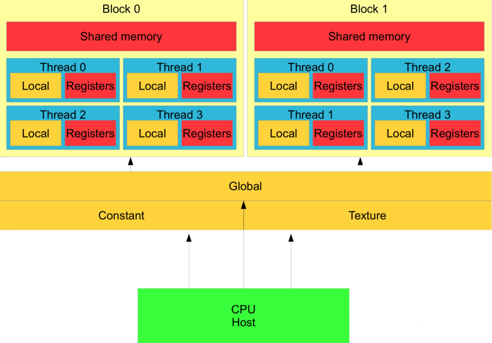
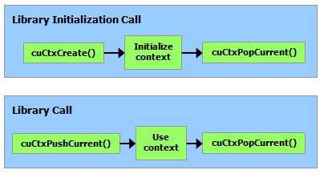

# CUDA

# 1. Introduction


# 2. Programming Model

## 2.1. Kernels

CUDA是通过名为**CUDA kernel**的函数，拓展C++。


## 2.2. Thread Hierarchy

整个总体的层次关系是：

Thread --> Block --> Cluster --> Grid


Thread Hierarchy涉及到一个变量`threadIdx`，可以是一个**一维到三维**向量，用以形成一个一维到三维的Block。同时还有一个`blockDim`变量用于获取Block的维度。

一个Block中的Thread的个数是有限的，取决于GPU中的SM中有多少个CUDA Core（也叫做Stream processor）。

同理，Block Hierarchy涉及到一个变量`blockIdx`，可以是一个**一维到三维**向量，用以形成一个一维到三维的Grid。同时还有一个`gridDim`变量用于获取Grid的维度。


而每个Block中的Thread个数，每个Grid中的Block个数，是在kernel函数中的`<<<numBlocks, threadsPerBlock>>>`语义中，以`int`或者`dim3`的类型标明。

关于**dim3**

```
dim3 is a special CUDA datatype with 3 components .x, .y, .z each initialized to 1
```


Block被调度的方式可以是由Programmer来控制的，同时受限于SM的数量（每一个Block交给一个SM执行，这在后面的[硬件实现](#Hardware Implement)中会提到）


`__syncthreads()`用于设置同步点，用以同步一个block内的所有thread，充当一个barrier的作用。

### 2.2.1. Thread Block Clusters

这个可能不太常用，需要看手册。


## 2.3. Memory Hierarchy

Memory Hierarchy的总体结构关系为：

Local Memory --> Shared Memory --> Global Memory

除此之外，还有另外两个read-only memory spaces，可以被所有的Thread访问到，**constant and texture memory spaces**。


**global，constant以及texture memory space**





**device memory**与**global memory**的区别：

- device memory是真实的物理内存(DRAM)，而global memory是一个logical space


## 2.4 Heterogeneous Programming

CUDA采用的是**异构**的编程模型。

分为**host**与**device**，二者各有各的**DRAM/Memory Space**。


Unified Memory提供了一种**managed memory**，能够将host memory与device memory连接起来，能够被CPU和GPU共同访问。

## 2.5 Asynchronous SIMT Programming Model

一个异步的操作由Thread发起，仿佛是有另一个Thread在执行（实际上并没有）。

```
不严谨地说，就像是一个thread里面搞了一个子线程sub-thread，在一定范围内可以不按顺序执行任务。
这样的异步操作都是归属在创建它们的CUDA thread之下的，这个asynchronous thread只是为了方便我们理解提出来的概念，因为异步执行看起来像是有另外一个thread；但是实际上并没有创建新的线程
```

```
In a well formed program one or more CUDA threads synchronize with the asynchronous operation. 
An asynchronous operation uses a synchronization object to synchronize the completion of the operation. 
```

这里涉及到CUDA中的一些概念

**Synchronization object**：`cuda::barrier`或`cuda::pipeline`

**Thread scopes**：

| Thread Scope                              | Description                                                  |
| ----------------------------------------- | ------------------------------------------------------------ |
| `cuda::thread_scope::thread_scope_thread` | Only the CUDA thread which initiated asynchronous operations synchronizes. |
| `cuda::thread_scope::thread_scope_block`  | All or any CUDA threads within the same thread block as the initiating thread synchronizes. |
| `cuda::thread_scope::thread_scope_device` | All or any CUDA threads in the same GPU device as the initiating thread synchronizes. |
| `cuda::thread_scope::thread_scope_system` | All or any CUDA or CPU threads in the same system as the initiating thread synchronizes. |

## 2.6 Compute Capability

Compute Capacity，也叫做**SM version**。

```
This version number identifies the features supported by the GPU hardware and is used by applications at runtime to determine which hardware features and/or instructions are available on the present GPU.
```

版本号的格式如下**X.Y**，X为主版本号，Y为次版本号。

compute capability与SM version的转换：

```
if your compute capability is 6.1 us sm_61 and compute_61.
SM stands for "streaming multiprocessor". The arguments are set in this confusing looking way because they are used as arguments for nvcc where the compute_XX sets the architecture for a virtual (intermediate) code representation and sm_XX sets the architecture for the real representation. Unless you have a good reason, you should set both of these to the same thing.
```


主版本号X代表core architecture，相同则core architecture相同。

- 9 for devices based on the *NVIDIA Hopper GPU* architecture
- 8 for devices based on the *NVIDIA Ampere GPU* architecture
- 7 for devices based on the *Volta* architecture
- 6 for devices based on the *Pascal* architecture
- 5 for devices based on the *Maxwell* architecture
- 3 for devices based on the *Kepler* architecture
- 2 for devices based on the *Fermi* architecture
- 1 for devices based on the *Tesla* architecture

次版本号Y则代表相同core architecture上的更新，有可能会引入新的特性等，Turing architecture(Compute Capability 7.5)就是在Volta architecture的基础上更新的架构。

在[这里](https://developer.nvidia.com/cuda-gpus)有各种型号硬件的Compute Capability，可以参考。


**Compute Capability与CUDA version不是同一个概念**：

```
The compute capability version of a particular GPU should not be confused with the CUDA version (for example, CUDA 7.5, CUDA 8, CUDA 9), which is the version of the CUDA software platform. The CUDA platform is used by application developers to create applications that run on many generations of GPU architectures, including future GPU architectures yet to be invented. While new versions of the CUDA platform often add native support for a new GPU architecture by supporting the compute capability version of that architecture, new versions of the CUDA platform typically also include software features that are independent of hardware generation.
```

# 3. Programming Interface

CUDA C++是对C++的一个拓展，包括**a minimal set of extensions to the C++ language and a runtime library**。

必须用`nvcc`编译。

CUDA Runtime API与CUDA Driver API，[这里](../模型部署笔记/NVIDIA背后的技术.md#1.4-runtime-library)有更详细的解释，实际上就是一组API。


这里涉及到两个CUDA的底层概念**CUDA contexts**和**CUDA modules**

**CUDA contexts**：

**CUDA modules**：


## 3.1. Compilation with NVCC

关于`nvcc`的详细细节，参考[NVIDIA CUDA Compiler Driver 12.4 documentation](https://docs.nvidia.com/cuda/cuda-compiler-driver-nvcc/)

CUDA有自己的指令集架构ISP，**PTX**与**SASS**。

CUDA kernel可以用PTX编写，但是更多的是用C++之类的高级语言。

关于PTX的介绍以及详细的讨论，参考：

- wiki的介绍[Parallel Thread Execution](https://en.wikipedia.org/wiki/Parallel_Thread_Execution)
- NVIDIA官方documentation[1. Introduction — PTX ISA 8.4 documentation - NVIDIA Docs](https://docs.nvidia.com/cuda/parallel-thread-execution/index.html)


不论是C++还是PTX，最后都需要通过**nvcc**编译成binary code。

**nvcc**实际上也是一个compiler driver，nvcc会调用许多其它的工具，比如`gcc`，`cicc`，`ptxas`，`fatbinary`等。


### 3.1.1. Compilation Workflow


#### 3.1.1.1. Offline Compilation

CUDA的源代码中既包含了host code，也包含了device code。

`NVCC`的基本工作流：

1. 分离源码中的host code与device code
2. 将device code编译成assembly form(PTX code)以及binary form(cubin object)
3. 修改host code，将`<<<...>>>`替换成CUDA Runtime function calls，用以从PTX code和cubin object中加载和启动编译好了的kernel（从这里可以看出，**kernel被编译后是存放在PTX code和cubin object之中的，host code调用时，需要PTX code和cubin object中加载并且执行编译好的kernel**）。
4. 修改host code之后，输出的是C++代码，可以通过C++编译器被编译成object code；或者直接由`nvcc`来调用C++的编译器，直接输出object code。


对于CUDA Application，使用CUDA kernel有以下两种方式：

- 链接到编译好了的host code（这是最常见的情况）
- 使用CUDA driver API直接加载并且执行PTX code或者cubin object


#### 3.1.1.2. Just-in-Time Compilation

```
Any PTX code loaded by an application at runtime is compiled further to binary code by the device driver. This is called just-in-time compilation.
```

这种JIT的编译方式，仅仅生成PTX code，把PTX code到binary code编译的任务交给device dirver进行。这种方式：

-  Just-in-time compilation increases application load time, but allows the application to benefit from any new compiler improvements coming with each new device driver.
- It is also the only way for applications to run on devices that did not exist at the time the application was compiled


### 3.1.2. Binary Compatibility

Binary code(cubin)是与架构有关的。`nvcc`通过`-code`选项指定目标架构，比如`-code=sm_80`，代表生成的binary code的目标架构是compute capability 8.0。

```
Binary compatibility is guaranteed from one minor revision to the next one, but not from one minor revision to the previous one or across major revisions. In other words, a cubin object generated for compute capability X.y will only execute on devices of compute capability X.z where z≥y.
```

即对于binary code，其在次版本号中是向后兼容的，但是不能够做到跨主版本号兼容。主板本号相同的情况下，低版本的binary code可以在相同或者更高次版本号的compute capability上运行。


同时还有以下的注意点：

```
Binary compatibility is supported only for the desktop. It is not supported for Tegra. Also, the binary compatibility between desktop and Tegra is not supported.
```

**NVIDIA Tegra**与desktop型号之间的binary code是不兼容的。

**Tegra**是NVIDIA的SoC系列，其内部集成[ARM architecture](https://en.wikipedia.org/wiki/ARM_architecture) [central processing unit](https://en.wikipedia.org/wiki/Central_processing_unit) (CPU), [graphics processing unit](https://en.wikipedia.org/wiki/Graphics_processing_unit) (GPU), [northbridge](https://en.wikipedia.org/wiki/Northbridge_(computing)), [southbridge](https://en.wikipedia.org/wiki/Southbridge_(computing)), and [memory controller](https://en.wikipedia.org/wiki/Memory_controller)。


### 3.1.3. PTX Compatibility

通过`-arch`选项指定compute capability，这个选项作用于将C++代码编译为PTX code的过程中，比如`-arch=compute_50`，表面生成的PTX code的目标架构是compute capability 5.0。

低compute capability版本生成的PTX code，可以被编译成相同或者高版本compute capability的binary code，只不过无法充分利用高版本的硬件特性，性能上有损失。

NVIDIA官方举的一个例子

```
For example, a binary targeting devices of compute capability 7.0 (Volta) compiled from PTX generated for compute capability 6.0 (Pascal) will not make use of Tensor Core instructions, since these were not available on Pascal. As a result, the final binary may perform worse than would be possible if the binary were generated using the latest version of PTX.
```


### 3.1.4. Application Compatibility

为了能够在某一compute capability的设备上运行，application必须加载满足PTX Compatibility以及Binary Compatibility的PTX code或者binary code。

```
In particular, to be able to execute code on future architectures with higher compute capability (for which no binary code can be generated yet), an application must load PTX code that will be just-in-time compiled for these devices.
```


`nvcc`中有`-arch -code -gencode`三个选项与之相关。

```shell
nvcc x.cu
        -gencode arch=compute_50,code=sm_50
        -gencode arch=compute_60,code=sm_60
        -gencode arch=compute_70,code=\"compute_70,sm_70\"
```


关于这几个选项以及上面的三种Compatibility，在`nvcc`中有更多详细的内容

```shell
nvcc --help
```

不论是`-arch`还是`-code`，其后跟的选项都是Compute capability。二者的区别如下。

`-arch`参数指定的是一个virtual architecture，而类似于`compute_*`这样的参数就是代表着一个virtual architecture

`-code`参数指定的是一个real architecture，而类似于`sm_*`这样的参数就是代表着一个real architecture	

`-arch`参数<=`-code`参数

```
--gpu-architecture <arch>                       (-arch)                         
        Specify the name of the class of NVIDIA 'virtual' GPU architecture for which
        the CUDA input files must be compiled.
        With the exception as described for the shorthand below, the architecture
        specified with this option must be a 'virtual' architecture (such as compute_50).
        Normally, this option alone does not trigger assembly of the generated PTX
        for a 'real' architecture (that is the role of nvcc option '--gpu-code',
        see below); rather, its purpose is to control preprocessing and compilation
        of the input to PTX.
        For convenience, in case of simple nvcc compilations, the following shorthand
        is supported.  If no value for option '--gpu-code' is specified, then the
        value of this option defaults to the value of '--gpu-architecture'.  In this
        situation, as only exception to the description above, the value specified
        for '--gpu-architecture' may be a 'real' architecture (such as a sm_50),
        in which case nvcc uses the specified 'real' architecture and its closest
        'virtual' architecture as effective architecture values.  For example, 'nvcc
        --gpu-architecture=sm_50' is equivalent to 'nvcc --gpu-architecture=compute_50
        --gpu-code=sm_50,compute_50'.
        -arch=all         build for all supported architectures (sm_*), and add PTX
        for the highest major architecture to the generated code.
        -arch=all-major   build for just supported major versions (sm_*0), plus the
        earliest supported, and add PTX for the highest major architecture to the
        generated code.
        -arch=native      build for all architectures (sm_*) on the current system
        Note: -arch=native, -arch=all, -arch=all-major cannot be used with the -code
        option, but can be used with -gencode options.
        Allowed values for this option:  'all','all-major','compute_50','compute_52',
        'compute_53','compute_60','compute_61','compute_62','compute_70','compute_72',
        'compute_75','compute_80','compute_86','compute_87','compute_89','compute_90',
        'compute_90a','lto_50','lto_52','lto_53','lto_60','lto_61','lto_62','lto_70',
        'lto_72','lto_75','lto_80','lto_86','lto_87','lto_89','lto_90','lto_90a',
        'native','sm_50','sm_52','sm_53','sm_60','sm_61','sm_62','sm_70','sm_72',
        'sm_75','sm_80','sm_86','sm_87','sm_89','sm_90','sm_90a'.

--gpu-code <code>,...                           (-code)                         
        Specify the name of the NVIDIA GPU to assemble and optimize PTX for.
        nvcc embeds a compiled code image in the resulting executable for each specified
        <code> architecture, which is a true binary load image for each 'real' architecture
        (such as sm_50), and PTX code for the 'virtual' architecture (such as compute_50).
        During runtime, such embedded PTX code is dynamically compiled by the CUDA
        runtime system if no binary load image is found for the 'current' GPU.
        Architectures specified for options '--gpu-architecture' and '--gpu-code'
        may be 'virtual' as well as 'real', but the <code> architectures must be
        compatible with the <arch> architecture.  When the '--gpu-code' option is
        used, the value for the '--gpu-architecture' option must be a 'virtual' PTX
        architecture.
        For instance, '--gpu-architecture=compute_60' is not compatible with '--gpu-code=sm_52',
        because the earlier compilation stages will assume the availability of 'compute_60'
        features that are not present on 'sm_52'.
        Allowed values for this option:  'compute_50','compute_52','compute_53',
        'compute_60','compute_61','compute_62','compute_70','compute_72','compute_75',
        'compute_80','compute_86','compute_87','compute_89','compute_90','compute_90a',
        'lto_50','lto_52','lto_53','lto_60','lto_61','lto_62','lto_70','lto_72',
        'lto_75','lto_80','lto_86','lto_87','lto_89','lto_90','lto_90a','sm_50',
        'sm_52','sm_53','sm_60','sm_61','sm_62','sm_70','sm_72','sm_75','sm_80',
        'sm_86','sm_87','sm_89','sm_90','sm_90a'.

--generate-code <specification>,...             (-gencode)                      
        This option provides a generalization of the '--gpu-architecture=<arch> --gpu-code=<code>,
        ...' option combination for specifying nvcc behavior with respect to code
        generation.  Where use of the previous options generates code for different
        'real' architectures with the PTX for the same 'virtual' architecture, option
        '--generate-code' allows multiple PTX generations for different 'virtual'
        architectures.  In fact, '--gpu-architecture=<arch> --gpu-code=<code>,
        ...' is equivalent to '--generate-code arch=<arch>,code=<code>,...'.
        '--generate-code' options may be repeated for different virtual architectures.
        Allowed keywords for this option:  'arch','code'.
```


**但是为什么`nvcc`允许`-arch`与`-code`不同，一般来说二者应该是要完全相同的?**


但是很多情况下我们采用`nvcc`编译时，有的时候并没有指定`-arch`和`-code`这两个选项，这个时候，`nvcc`会选择一个默认值

```
sm_52 is used as the default value; PTX is generated for compute_52 then assembled and optimized for sm_52.
```


### 3.1.5. C++ Compatibility

对于host code，所有的C++特性都能够支持；而对于device code，只有一部分C++特性被支持。

### 3.1.6. 64-Bit Compatibility

只有host code被编译成64-bit，device code才可以被编译为64-bit。


## 3.2. CUDA Runtime

CUDA Runtime API的实现位于`cudart`中。

- Linux：**libcudart.a**和**libcudart.so**
- Windows：**cudart.lib**和**cudart.dll**


**所有的entry points都是以`cuda`为前缀。**

### 3.2.1. Initialization

`cudaInitDevice()`和`cudaSetDevice()` 用以初始化设备的**runtime**和**primary context**。


runtime会为每一个device创建一个**CUDA context**，看这里[CUDA context](#17.1.-Context)


### 3.2.2. Device Memory

Runtime提供了一些操纵device memory的函数，同时device memory有两种组织形式：

- **linear memory**
- **CUDA arrays** 用于texture fetching


**Linear memory**是在**Unified address space**中分配的空间，这个空间的大小同时受到CPU与GPU的限制。

|                                          | x86_64 (AMD64) | POWER (ppc64le) | ARM64       |
| ---------------------------------------- | -------------- | --------------- | ----------- |
| up to compute capability 5.3 (Maxwell)   | 40bit          | 40bit           | 40bit       |
| compute capability 6.0 (Pascal) or newer | up to 47bit    | up to 49bit     | up to 48bit |

`cudaMalloc()`，`cudaFree()`和`cudaMemcpy()`用于管理Linear memory。

除此之外，`cudaMallocPitch()`和`cudaMalloc3D()`，用于给2D和3D array分配内存，采用这两种分配方式，内存是对齐的，因此访问更快。相应的两个copy API `cudaMemcpy2D()`and `cudaMemcpy3D()`

```
When accessing 2D arrays in CUDA, memory transactions are much faster if each row is properly aligned.
CUDA provides the cudaMallocPitch function to “pad” 2D matrix rows with extra bytes so to achieve the desired alignment.
```

`cudaMallocPitch()`原型如下：

```
__host__ cudaError_t cudaMallocPitch ( void** devPtr, size_t* pitch, size_t width, size_t height )

devPtr
- Pointer to allocated pitched device memory
pitch
- Pitch for allocation
width
- Requested pitched allocation width (in bytes)
height
- Requested pitched allocation height

Allocates at least width (in bytes) * height bytes of linear memory on the device and returns in *devPtr a pointer to the allocated memory. The function may pad the allocation to ensure that corresponding pointers in any given row will continue to meet the alignment requirements for coalescing as the address is updated from row to row. The pitch returned in *pitch by cudaMallocPitch() is the width in bytes of the allocation. The intended usage of pitch is as a separate parameter of the allocation, used to compute addresses within the 2D array. Given the row and column of an array element of type T, the address is computed as:
‎    T* pElement = (T*)((char*)BaseAddress + Row * pitch) + Column;

```


`cudaMalloc3D()`函数原型如下：

```

```


### 3.2.3. Device Memory L2 Access Management

**persisting data access**与**streaming data access**

#### 3.2.3.1. L2 cache Set-Aside for Persisting Accesses

#### 3.2.3.2. L2 Policy for Persisting Accesses

# 17. Driver API

## 17.1. Context

CUDA context类似于一个CPU process。

```
A CUDA context is analogous to a CPU process. All resources and actions performed within the driver API are encapsulated inside a CUDA context, and the system automatically cleans up these resources when the context is destroyed.
```

每一个context都有自己的address space，因此不同的contexts有不同的`CUdeviceptr`，指向不同的address space。




# PTX与cuBIN


## CUDA steam与event


## Pinned memory

