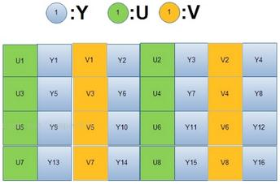
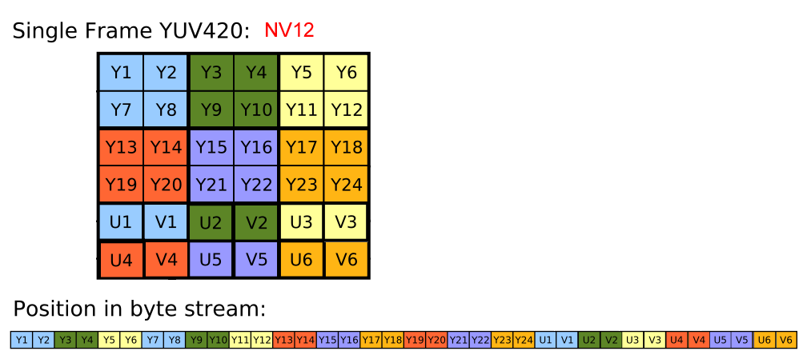
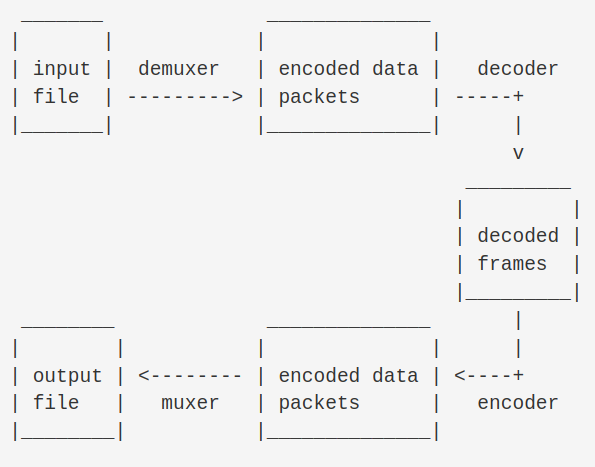

# FFmpeg

FFmpeg作者，传奇程序员Fabrice Bellard，他的[主页](https://bellard.org/)。


# 1. 色彩模式(Color Model)、图像像素格式(Pixel Format)与存储格式

在使用FFmpeg之前，了解一些常用的像素格式以及其如何存储时有必要的。

## 1.1 YUV

之前在[空间冗余](#2.1.1.2-空间冗余)这一部分讲到了人眼对于亮度的信息更加敏感。因此可以采用**色度采样**的方式压缩图片。YUV格式正是利用了这一点。

YUV三个字母中，**Y**代表亮度(Luminance或Luma)，**U**和**V**则代表色度(Chrominance或Chroma)。

之前提到过YCbCr，其与YUV有着密切的关系

```
医学研究证明，人的肉眼对视频的Y分量更敏感，因此在通过对色度分量进行subsampling来减少色度分量后，肉眼将察觉不到图像质量的变化。如果只有Y信号分量，而没有U、V分量，那么这样表示的图像就是黑白灰度图像。彩色电视采用YUV空间正是为了用亮度信号Y解决彩色电视机与黑白电视机的兼容问题，使黑白电视机也能接收彩色电视信号。

YCbCr是在世界数字组织视频标准研制过程中，作为ITU-R BT.601建议的一部分，其实是YUV经过缩放和偏移的翻版。

1.YUV是模拟信号，其色彩模型源于RGB模型，即亮度与色度分离，适合图像算法的处理，常应用于在模拟广播电视中，其中 Y∈[0,1]，U,V∈[-0.5,0.5]。

2.YCbCr是数字信号，其色彩模型源于YUV模型，它是YUV压缩和偏移后的版本（所谓偏移就是从[-0.5,0.5]偏移到[0,1]，因此计算时候会加128），在数字视频领域应用广泛，是计算机中应用最多的格式，包括JPEG，MPEG，H.264/5，AVS等都采用YCbCr格式，我们通常广义上讲的YUV，严格来说，应该就是YCbCr。
```

因此后文YUV与YCbCr都代指一个概念。

而YCbCr可以进一步划分：

- TV range：Y、Cb、Cr的范围都是[16, 240]，广播电视采用的数字标准
- Full range：Y、Cb、Cr的范围都是[0, 255]，PC采用的标准

```
TV range要量化到16-235，主要是由于YUV最终在模拟域传输，因此为了防止数模转换时引起过冲现象，于是将数字域限定在16-235。至于为什么选择16和235，可自行了解Gibbs Phenomenon吉布斯现象。
```


YUV的**存储格式**分为两种：

- planar格式：先连续存储所有像素点的 Y 分量，然后存储 U 分量，最后是 V 分量。
- packed格式：每个像素点的 Y、U、V 分量是连续交替存储的。
- SemiPlanar格式：先连续存储所有像素点的Y，再连续交错U和V。


YUV的色度采样([Chroma Subsampling](https://cs.pynote.net/ag/image/202204032/#chroma-subsampling))也有多种格式：

- 4:4:4
- 4:2:2
- 4:1:1
- 4:2:0
- 4:4:0


存储格式和采样格式一组合，就有了多种YUV格式，以FFmpeg中的YUV格式为例，最后一个子母为**P**代表planar格式存储：

- planar格式
  - YUV 4:4:4
    - AV_PIX_FMT_YUV444P
    - ......
  - YUV 4:4:0
    - AV_PIX_FMT_YUV440P
    - AV_PIX_FMT_YUVJ440P
  - YUV 4:2:2
  - YUV 4:2:0
  - YUV 4:1:1

- packed格式
  - ......

FFmpeg中，YUV与YUVJ的格式上是完全相同的，只不过颜色空间不同，YUV采用的是[16, 255]的TV range；YUVJ采用的是[0, 255]的full range(JPEG转换公式，所以有一个**J**)。

```
libjpeg-turbo提供的转yuv的接口，得到的效果，与YUVJXXXP相同
```


按照三种存储格式：

- packed

  - UYVY422

    

    YUYV422与YVYU422同理

  - YUV420

    

- planar

  - YUV422P

    

  - YUV420P(也叫I420)

    

    YVU420P，也叫YV12，12表示12 bit per pixel

- semiplanr

  - YUV422SP

    

  - YUV420SP(也叫NV12)

    

    YVU420SP，也叫NV21。


不同存储格式对于读取速度也有影响，planar格式需要3个for循环，而semiplanar格式只需要2个for循环，在后一个for循环中，可以同时读取Cb和Cr的数据。

## 1.2 RGB

最为直观的color model就是RGB。

```
现在的计算机显示器，颜色的显示都是RGB模式，而视频编解码使用的大多都是YCbCr信号（YCbCr提供了最初的数据压缩，主流的420采样模式，直接就砍掉了一半的视频数据）。
```


# 2. FFmpeg工作机制

## 2.1 转码




## 2.2 Filtering


## 2.3 Stream copy


## 2.4 Loopback decoders


Stream selection


## 2.5 FFmpeg命令

### 2.5.1 基本命令

基本命令结构

```
ffmpeg [global_options] {[input_file_options] -i input_url} ... {[output_file_options] output_url} ...
```

对于FFmpeg，输入和输出可以有任意多个，其输入可以是多种类型(regular files, pipes, network streams, grabbing devices, etc.)。

每个输入和输出中，都可以包含任意多的流stream，这些流可以是video/audio/subtitle/attachment/data。不同输入中的不同流在命令中通过`input_index:stream_index`来标识，比如`2:3`就是第三个输入的第四个流。


FFmpeg命令中的input_file_options/output_file_options都是作用在紧随其后的url的，因此顺序非常重要，必须先写好input然后再写output。


### 2.5.2 Stream Specifiers

由于一些选项(比如bitrate和codec等)是作用在输入输出中的每一个stream的，因此存在一个Stream Specifier。

Stream Specifier附加在选项之后，用冒号分隔，比如对于codec选项，`-codec:a:1 ac3`，`-codec`是选项，而`:a:1`就是相应的Stream Specifier。

Stream Specifiers的格式：

- **stream_index**

- **stream_type[:additional_stream_specifier]**

  'v'和'V'代表video，'a'代表audio，'s'代表subtitle，'d'代表data，'t'代表attachments。**stream_index**可以作为**additional_stream_specifier**进一步

- ......

剩下的参考官方文档。


### 2.5.3 Main options

ffmpeg的选项有很多，这里挑一些比较重要的。

`-codec/-c` 选项，使用格式如下：

**-c[:stream_specifier] codec (*input/output,per-stream*)**

**-codec[:stream_specifier] codec (*input/output,per-stream*)**

当它出现在output file之前，用以指定output file中的流的编码器；当它出现在input file之前，用以指定input file中的流的解码器。其中**codec**是encoder/decoder的名字，也可以是一个特殊的值**copy**，用以表明不对流做任何处理。

`-pix_fmt`选项，


## 2.6 FFmpeg API

FFmpeg在3.3版本以及以后有了很大的改动，废弃了很多函数。因此这里我们采用3.3版本之前的FFmpeg API。

在介绍[多媒体技术](../MultiMedia/MultiMedia.md)的时候，我们介绍了Container，Stream，Frame/Packet以及Codec等概念，这些都是与多媒体格式存储与播放相关的重要概念。

而在FFmpeg中，就有相应的数据结构对应这些概念。


首先先来看如何利用FFmpeg API完成视频编码解码的一个基本流程


主要涉及到下面几个类

**AVFormatContext**

**AVStream**

**AVCodecContext**

**AVCodec**

**AVPacket**

**AVFrame**

**AVFilter**


# 3. FFmpeg源码解读


## 3.1
