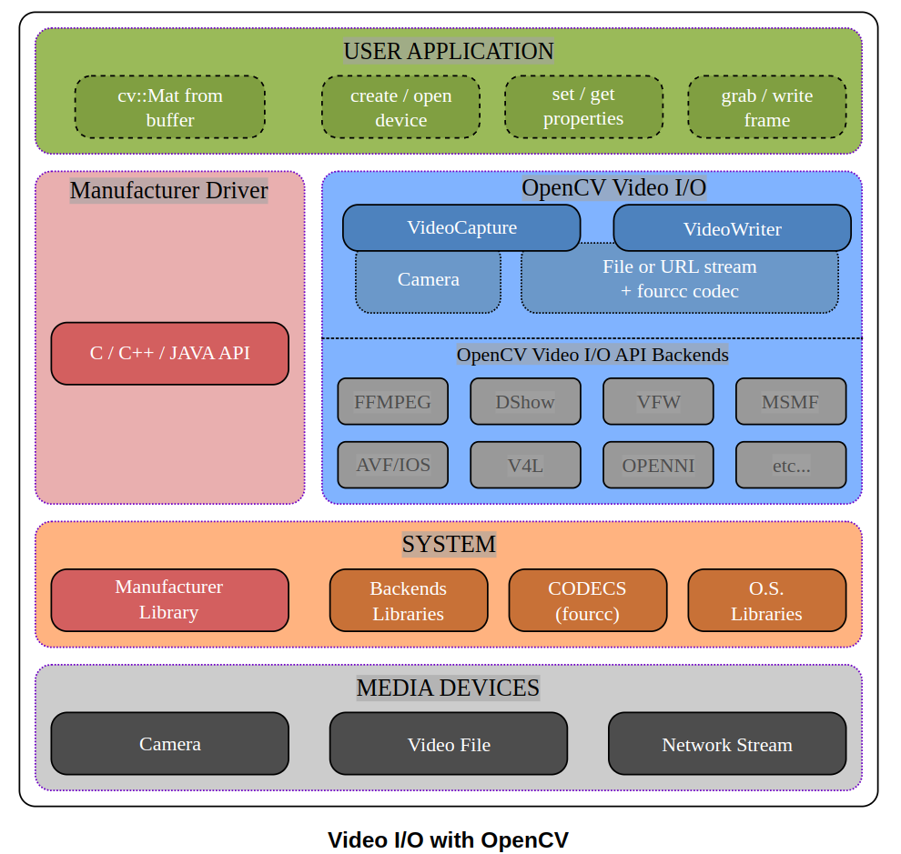

# OpenCV


# 1. 一些常见问题


## 1.1 #include C++ header files in opencv

源自于stackoverflow上的提问[#include C++ header files in opencv](https://stackoverflow.com/questions/19177456/include-c-header-files-in-opencv)

如果想要引入OpenCV的头文件，有多种选择

```c++
#include <opencv2/opencv.hpp>
```

或者

```c++
#include <opencv2/imgproc/imgproc.hpp>
#include <opencv2/objdetect/objdetect.hpp>
#include <opencv2/highgui/highgui.hpp>
```

但是这两种方式还是有区别的，一种是**global includes**一种是**small includes**：

- 当采用global includes时，实际上的`opencv.hpp`还会include许许多多其其它的头文件，但是实际上并不是所有的头文件都会被用上，反而会导致编译时间的延长
- 而采用small includes则是更加精确按需include，更快的编译


## 1.2 OpenCV与Eigen


## 1.3 交叉编译OpenCV

更多关于交叉编辑的，看[这里](./cmake与makefile.md#1.4-交叉编译)

### 1.3.1 交叉编译OpenCV的过程总结

交叉编译OpenCV通过CMake + Unix Makefiles完成，可以通过CLI或者GUI两种方式来完成。

**CLI方式**：


### 1.3.2 


编译OpenCV库时的下载问题。

## 1.4 OpenCV Video I/O

```
The OpenCV Video I/O module is a set of classes and functions to read and write video or images sequence.
```

OpenCV Video I/O模块提供了[cv::VideoCapture](https://docs.opencv.org/4.9.0/d8/dfe/classcv_1_1VideoCapture.html)与[cv::VideoWriter](https://docs.opencv.org/4.9.0/dd/d9e/classcv_1_1VideoWriter.html)作为2-layer interface(二层接口，可以理解为前端)，而不同的video I/O APIs则充当后端。



后端的video I/O APIs有许多，有可以分为两类：

- **interfaces to proprietary drivers or to external library**
  - **OpenNI2 for Kinect**
  - **Intel Perceptual Computing SDK**
  - **GStreamer**
  - **XIMEA Camera API**
  - **......**
- **interfaces to the video I/O library provided by the operating system**
  - **Direct Show (DSHOW)**
  - **Microsoft Media Foundation (MSMF)**
  - **Video 4 Linux (V4L)**
  - ......

如果同时有多个backend可供选择，OpenCV会选择第一个可用的后端，但也可以根据需要选择后端。

```c++
//declare a capture object
cv::VideoCapture cap(0, cv::CAP_MSMF);
//or specify the apiPreference with open
cap.open(0, cv::CAP_MSMF);
```

不同的backend后端采用不同的方式支持的property(即[cv::VideoCaptureProperties](https://docs.opencv.org/4.9.0/d4/d15/group__videoio__flags__base.html#gaeb8dd9c89c10a5c63c139bf7c4f5704d))，并且不同的后端支持的property也不尽相同，可能会**存在有的backend不支持某些属性的情况**。


对于不同backend的支持，则需要在编译OpenCV时通过CMake的选项指明需要启用哪一些backend。

videoio backend还可以分为built-in backends和plugins which will be loaded at runtime这两类。

```cmake
-DWITH_GSTREAMER=ON
```

To enable built-in videoio backends:

1. Enable corresponding CMake option, e.g. `-DWITH_GSTREAMER=ON`
2. Rebuild OpenCV

To enable dynamically-loaded videoio backend (currently supported: GStreamer and FFmpeg on Linux, MediaSDK on Linux and Windows):

1. Enable backend and add it to the list of plugins: `-DWITH_GSTREAMER=ON -DVIDEOIO_PLUGIN_LIST=gstreamer` CMake options
2. Rebuild OpenCV
3. Check that `libopencv_videoio_gstreamer.so` library exists in the `lib` directory


rtsp、rtmp、hls


# 2. OpenCV Mat详解

OpenCV的Mat的这几个属性：

- **data** 是一个uchar类型的指针
- **dim** 维度数(**注意不是通道数**)，3x3矩阵dim为2, 3x3x3矩阵dim为3
- **size** 各个维度的大小，注意该维度与channel无关，channel实际上是存储的元素属性，而不是容器的属性


# 3. OpenCV DNN

