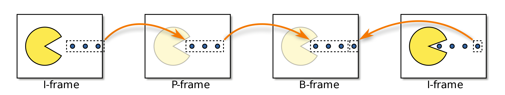

# OpenCV


# 1. 一些常见问题


## 1.1 #include C++ header files in opencv

源自于stackoverflow上的提问[#include C++ header files in opencv](https://stackoverflow.com/questions/19177456/include-c-header-files-in-opencv)

如果想要引入OpenCV的头文件，有多种选择

```c++
#include <opencv2/opencv.hpp>
```

或者

```c++
#include <opencv2/imgproc/imgproc.hpp>
#include <opencv2/objdetect/objdetect.hpp>
#include <opencv2/highgui/highgui.hpp>
```

但是这两种方式还是有区别的，一种是**global includes**一种是**small includes**：

- 当采用global includes时，实际上的`opencv.hpp`还会include许许多多其其它的头文件，但是实际上并不是所有的头文件都会被用上，反而会导致编译时间的延长
- 而采用small includes则是更加精确按需include，更快的编译


## 1.2 OpenCV与Eigen


## 1.3 交叉编译OpenCV

更多关于交叉编辑的，看[这里](./cmake与makefile.md#1.4-交叉编译)

### 1.3.1 交叉编译OpenCV的过程总结

交叉编译OpenCV通过CMake + Unix Makefiles完成，可以通过CLI或者GUI两种方式来完成。

**CLI方式**：


### 1.3.2 

## 1.4 OpenCV Video I/O

```
The OpenCV Video I/O module is a set of classes and functions to read and write video or images sequence.
```

OpenCV Video I/O模块提供了[cv::VideoCapture](https://docs.opencv.org/4.9.0/d8/dfe/classcv_1_1VideoCapture.html)与[cv::VideoWriter](https://docs.opencv.org/4.9.0/dd/d9e/classcv_1_1VideoWriter.html)作为2-layer interface(二层接口，可以理解为前端)，而不同的video I/O APIs则充当后端。


后端的video I/O APIs有许多，有可以分为两类：

- **interfaces to proprietary drivers or to external library**
  - **OpenNI2 for Kinect**
  - **Intel Perceptual Computing SDK**
  - **GStreamer**
  - **XIMEA Camera API**
  - **......**
- **interfaces to the video I/O library provided by the operating system**
  - **Direct Show (DSHOW)**
  - **Microsoft Media Foundation (MSMF)**
  - **Video 4 Linux (V4L)**
  - ......

如果同时有多个backend可供选择，OpenCV会选择第一个可用的后端，但也可以根据需要选择后端。

```c++
//declare a capture object
cv::VideoCapture cap(0, cv::CAP_MSMF);
//or specify the apiPreference with open
cap.open(0, cv::CAP_MSMF);
```

不同的backend后端采用不同的方式支持的property(即[cv::VideoCaptureProperties](https://docs.opencv.org/4.9.0/d4/d15/group__videoio__flags__base.html#gaeb8dd9c89c10a5c63c139bf7c4f5704d))，并且不同的后端支持的property也不尽相同，可能会**存在有的backend不支持某些属性的情况**。


对于不同backend的支持，则需要在编译OpenCV时通过CMake的选项指明需要启用哪一些backend。

videoio backend还可以分为built-in backends和plugins which will be loaded at runtime这两类。

```cmake
-DWITH_GSTREAMER=ON
```

To enable built-in videoio backends:

1. Enable corresponding CMake option, e.g. `-DWITH_GSTREAMER=ON`
2. Rebuild OpenCV

To enable dynamically-loaded videoio backend (currently supported: GStreamer and FFmpeg on Linux, MediaSDK on Linux and Windows):

1. Enable backend and add it to the list of plugins: `-DWITH_GSTREAMER=ON -DVIDEOIO_PLUGIN_LIST=gstreamer` CMake options
2. Rebuild OpenCV
3. Check that `libopencv_videoio_gstreamer.so` library exists in the `lib` directory


rtsp、rtmp、hls


# 2. Multimedia

## 2.1 一些基础知识

### 2.1.1 Video

#### 2.1.1.1 Video的一些基本属性与概念

Video的一些基本属性：

- **颜色深度**
- **分辨率**
- **DAR(Display Aspect Ratio)**
- **PAR(Pixel Aspect Ratio)**
- **SAR(Sample Aspect Ratio)**
- **FPS**
- **比特率(码率)** 播放一段视频每秒所需的数据量，比特率 = 宽 * 高 * 颜色深度 * 帧率。比特率又可以分为CBR(恒定比特率)与VBR(可变比特率)。这里又涉及到**逐行扫描**与**隔行扫描**技术。
- 饱和度


**隔行扫描**与**逐行扫描**


视频必须进行压缩，否则一个视频所需要的存储空间是非常大的。

```
比如对一个720p的一小时视频，其所需要的存储空间1280 x 720 x 24 x 30 x 3600 = 278GB
```

压缩视频，需要消除其中的冗余：**时间上的冗余与空间上的冗余**


#### 2.1.1.2 空间冗余

这一部分涉及到[色彩模型，色彩空间与色域](../图形学/图形学.md#色品图与色域)

**一个基本事实：人眼对于亮度信息比对于颜色信息要更为敏感**，因此可以通过压缩颜色信息，提高亮度信息实现压缩。

这一点图形学中人眼的构造中有讲到，看[这里](../图形学/GAMES101/GAMES101.md)


**YCbCr**(除了YCbCr之外，许多色彩模型也是同样将亮度与颜色分离)颜色模型将亮度与色度分离，**Y**表示亮度，**Cb**蓝色分量，**Cr**红色分量。


**色度抽样Chroma subsampling**技术，**色度抽样**是一种编码图像时，使**色度分辨率低于亮度**的技术。


色度抽样通过三部分的比率表示**a​\:x\:y**：

- `a` 是水平采样参考 (通常是 4)，
- `x` 是第一行的色度样本数（相对于 a 的水平分辨率），
- `y` 是第二行的色度样本数。

**4:4:4**表明没有子采样

#### 2.1.1.3 时间冗余(帧间预测)

视频中的帧类型可以分为三类：

- **I帧** 关键帧`I‑frames are the least compressible but don't require other video frames to decode`
- **P帧** 预测帧`P‑frames can use data from previous frames to decompress and are more compressible than I‑frames`
- **B帧** 双向预测`B‑frames can use both previous and forward frames for data reference to get the highest amount of data compression`

不同类型的帧带来的代价与视频质量也不同：I帧>P帧>B帧。



I-frame是一个完整的图像，比如JPG或者BMP图像。

P-frame只存储相对于前一帧的**改变量**。

B-frame只存储当前帧和前一帧和后一帧的差别。


在一个视频流中，I、B、P三种类型的帧如何组织起来，构成一个完整的视频，叫做[**Group of pictures(GOP)**](https://en.wikipedia.org/wiki/Group_of_pictures)


除了用残差，还可以通过运动补偿(**Motion compensation**)来进一步压缩。在讲运动补偿之前，首先需要明确视频中有两种顺序，一种是**播放顺序**，另一种是**编码解码顺序**。


因此两张相邻的帧，可以是编码顺序上相邻，也可以是播放顺序上相邻。


#### 2.1.1.4 视频编解码器发展与Container format

最早的数字视频编码标准是H.120

随后是H.261、H.263、H.264/AVC、H.265/HEVC


**royalty有版税**，**royalty-free无版税**


编解码又分为**软解**和**硬解**：

- **软解** 使用运行在CPU之上的软件编解码
- **硬解** 使用特定的加速卡进行编解码，比如N卡的**NVDEC**与**NVENC**

软解和硬解各有优缺点：

- 软解的优势在于CPU由于是做通用计算，因此可以做到全解码，支持各种各样的格式，只需要安装对应格式的编解码器就可以。但是缺点在与占用CPU资源，效率较低。
- 硬解的优势在与专用芯片，效率高，速度快。但是缺点在与有时无法做到全解码，对于不同的格式，需要硬件上有相应支持才可以，兼容性比不过软解。


#### 2.1.1.5 编解码器的机制

图片分区

预测

转换


## 2.2 GStreamer

wiki官方对于GStreamer的介绍

```
GStreamer is a pipeline-based multimedia framework that links together a wide variety of media processing systems to complete complex workflows.
```


GStreamer整体的架构


GStreamer通过将许多processing elements连成一条pipeline，每一个processing element由一个plug-in提供。


## 2.3 FFmpeg

FFmpeg作者，传奇程序员Fabrice Bellard，他的[主页](https://bellard.org/)。


# 3. OpenCV Mat详解

OpenCV的Mat的这几个属性：

- **data** 是一个uchar类型的指针
- **dim** 维度数(**注意不是通道数**)，3x3矩阵dim为2, 3x3x3矩阵dim为3
- **size** 各个维度的大小，注意该维度与channel无关，channel实际上是存储的元素属性，而不是容器的属性


# 4. OpenCV DNN

