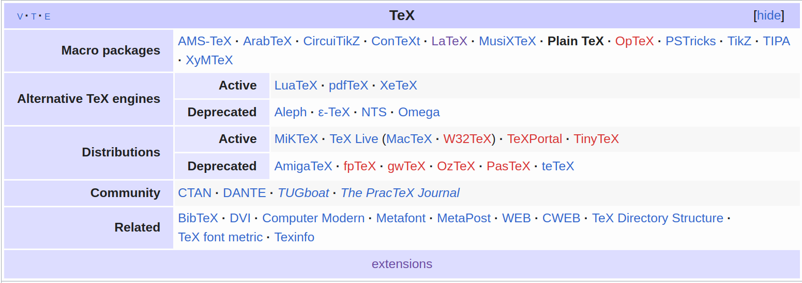

# LaTex


# 1. LaTeX基本概念

参考：

- [TeX 引擎、格式、发行版之介绍 | 始终 (liam.page)](https://liam.page/2018/11/26/introduction-to-TeX-engine-format-and-distribution/)
- 

LaTeX is not a stand-alone typesetting program in itself, but document preparation software that runs on top of [Donald E. Knuth](https://en.wikipedia.org/wiki/Donald_Knuth)'s [TeX typesetting system](https://en.wikipedia.org/wiki/TeX). TeX distributions usually bundle together all the parts needed for a working TeX system and they generally add to this both configuration and maintenance utilities. Nowadays LaTeX, and many of the packages built on it, form an important component of any major TeX distribution.


## 1.1 LaTeX与TeX

LaTeX是建立在TeX之上的。TeX是一种排版程序，同时也是一种程序语言。而LaTeX是建立在TeX之上的


## 1.2 TeX引擎

TeX作为一种编程语言，和其它的编程语言一样是需要编译器的，而TeX的编译器就叫做TeX引擎。

TeX引擎有多种选择：

1. Knuth TeX
2. e-TeX
3. pdfTeX
4. LuaTeX
5. XeTeX
6. pTeX
7. upTeX
8. e-upTeX
9. pTeX-ng


## 1.3 格式

TeX是一个宏语言，用户可以自己编写宏然后发布成一个**格式(format)**，或者称之为一个宏包(macro package)。

TeX之上有许多格式：

1. plain TeX
2. LaTeX 而LaTeX2e是LaTeX目前的版本。
3. ConTeXt


当在利用某一个格式写作时，首先需要告诉TeX引擎需要载入什么格式。因为格式使用得太频繁了，所以人们倾向于把格式和引擎打包在一起。这样，就不用每次都告诉 TeX 引擎这件事情了。

将LaTeX与上面提到的TeX引擎打包在一块，就有了一下组合：

- e-TeX -> LaTeX
- pdfTeX -> pdfLaTeX
- LuaTeX -> LuaLaTeX
- XeTeX -> XeLaTeX
- pTeX -> pLaTeX
- upTeX -> upLaTeX
- e-upTeX -> e-upLaTeX
- pTeX-ng -> pLaTeX-ng




在使用LaTeX时，命令是引擎、格式、输出模式排列组合的结果：

- latex命令 pdftex 引擎 + latex2e 格式 + dvi 输出模式
- pdftex命令 pdftex 引擎 + plain tex 格式 + dvi 输出模式
- pdflatex命令 pdftex 引擎 + latex2e 格式 + pdf 输出模式


下面是一段来自[xelatex、pdftex、latex 有什么编译上的差别吗？](https://wenda.latexstudio.net/q-1509.html)的回答

```
大多数使用场景，用的都是 latex2e 格式 + pdf 输出模式的组合，差异在于使用的引擎。西文排版，pdftex 功能足够了，所以它用得多一些；中文排版，只有应用 xetex 或 luatex 的独有功能后才更完善，所以有使用 xetex 或 luatex 引擎的需求。另有少数投稿平台，还在使用 pdftex 的 dvi 模式。 如果使用的功能仅限于两个引擎的重合部分，那么用哪个都可以。如果用到了仅某个引擎提供的功能，那么只能用那个引擎。用户通常不直接使用 primitive，而是使用基于 primitive 封装的宏包，所以这种「只能用」的信息往往由宏包文档提供。例如，`xeCJK` 宏包因为使用了仅 xetex 引擎的 char class 功能，所以只支持 `xetex` 引擎。`pdfrender` 因为使用了仅 pdftex（和 luatex）支持的多个色彩栈（color stack）功能，所以只支持 pdftex（和 luatex）引擎。
```


## 1.4 发行版

用户自己编写宏之后，可以将其发布成宏包(style package)或者文档类(document class)。因此如果对某些特定功能有需求，可以去网络上查找相应的宏包或者文档类。

而TeX发行版(distribution)，就是上面的TeX引擎，格式和宏包以及驱动、辅助工具的集合。当我们想使用TeX时，真正需要安装的是TeX发行版。


TeX发行版有许多：

- TeX Live
- macTeX
- CTeX
- MiKTeX
- TeXstudio


## 1.5 BibTeX

