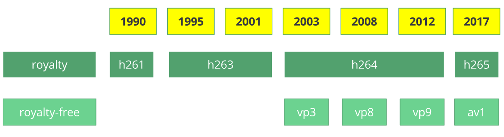

# MultiMeida

多媒体相关技术

# 1. 一些基础知识

## 1.1 Video

### 1.1.1 Video的一些基本属性与概念

Video的一些基本属性：

- **颜色深度**
- **分辨率**
- **DAR(Display Aspect Ratio)**
- **PAR(Pixel Aspect Ratio)**
- **SAR(Sample Aspect Ratio)**
- **FPS**
- **比特率(码率)** 播放一段视频每秒所需的数据量，比特率 = 宽 * 高 * 颜色深度 * 帧率。比特率又可以分为CBR(恒定比特率)与VBR(可变比特率)。这里又涉及到**逐行扫描**与**隔行扫描**技术。
- 饱和度


**隔行扫描**与**逐行扫描**


视频必须进行压缩，否则一个视频所需要的存储空间是非常大的。

```
比如对一个720p的一小时视频，其所需要的存储空间1280 x 720 x 24 x 30 x 3600 = 278GB
```

压缩视频，需要消除其中的冗余：**时间上的冗余与空间上的冗余**


### 1.1.2 空间冗余

这一部分涉及到[色彩模型，色彩空间与色域](../图形学/图形学.md#色品图与色域)

**一个基本事实：人眼对于亮度信息比对于颜色信息要更为敏感**，因此可以通过压缩颜色信息，提高亮度信息实现压缩。

这一点图形学中人眼的构造中有讲到，看[这里](../图形学/GAMES101/GAMES101.md)


**YCbCr**(除了YCbCr之外，许多色彩模型也是同样将亮度与颜色分离)颜色模型将亮度与色度分离，**Y**表示亮度，**Cb**蓝色分量，**Cr**红色分量。


**色度抽样Chroma subsampling**技术，**色度抽样**是一种编码图像时，使**色度分辨率低于亮度**的技术。


色度抽样通过三部分的比率表示**a​\:x\:y**：

- `a` 是水平采样参考 (通常是 4)，
- `x` 是第一行的色度样本数（相对于 a 的水平分辨率），
- `y` 是第二行的色度样本数。

**4:4:4**表明没有子采样

### 1.1.3 时间冗余(帧间预测)

视频中的帧类型可以分为三类：

- **I帧** 关键帧`I‑frames are the least compressible but don't require other video frames to decode`
- **P帧** 预测帧`P‑frames can use data from previous frames to decompress and are more compressible than I‑frames`
- **B帧** 双向预测`B‑frames can use both previous and forward frames for data reference to get the highest amount of data compression`

不同类型的帧带来的代价与视频质量也不同：I帧>P帧>B帧。


I-frame是一个完整的图像，比如JPG或者BMP图像。

P-frame只存储相对于前一帧的**改变量**。

B-frame只存储当前帧和前一帧和后一帧的差别。


在一个视频流中，I、B、P三种类型的帧如何组织起来，构成一个完整的视频，叫做[**Group of pictures(GOP)**](https://en.wikipedia.org/wiki/Group_of_pictures)


除了用残差，还可以通过运动补偿(**Motion compensation**)来进一步压缩。在讲运动补偿之前，首先需要明确视频中有两种顺序，一种是**播放顺序**，另一种是**编码解码顺序**。


因此两张相邻的帧，可以是编码顺序上相邻，也可以是播放顺序上相邻。


### 1.1.4 视频编解码器发展与Container format

最早的数字视频编码标准是H.120

随后是H.261、H.263、H.264/AVC、H.265/HEVC



**royalty有版税**，**royalty-free无版税**


编解码又分为**软解**和**硬解**：

- **软解** 使用运行在CPU之上的软件编解码
- **硬解** 使用特定的加速卡进行编解码，比如N卡的**NVDEC**与**NVENC**

软解和硬解各有优缺点：

- 软解的优势在于CPU由于是做通用计算，因此可以做到全解码，支持各种各样的格式，只需要安装对应格式的编解码器就可以。但是缺点在与占用CPU资源，效率较低。
- 硬解的优势在与专用芯片，效率高，速度快。但是缺点在与有时无法做到全解码，对于不同的格式，需要硬件上有相应支持才可以，兼容性比不过软解。


### 1.1.5 编解码器的机制

图片分区

预测

转换


## 1.2 Camera

### 1.2.1 Bayer Pattern与RAW格式

这一方面在[计算摄影学](../图形学/计算摄影学.md)中都包含，参考那里的对应章节。


### 1.2.2 Webcam

当今的webcam基本上都是基于USB，在这种相机上，无法得到原始的RGB格式(RAW格式)，下面是来自Reddit这篇帖子[How should I get raw image data from a webcam in Linux without using a library?](https://www.reddit.com/r/C_Programming/comments/y7d8xe/how_should_i_get_raw_image_data_from_a_webcam_in/)的一个回答

```
You definitely should read this article in full:

https://en.wikipedia.org/wiki/USB_video_device_class

Any modern webcam you get is going to be USB based and that raw image data will be unavailable. The devices have hardware encoders inside them that will encode the data (either a single image, or streaming video) and send that compressed data over the USB. Even if you access that "raw data" you will need to decode it using something like FFmpeg.
```

webcam都内置一个硬件编码器，对于其捕获到的输入进行编码，然后将编码后的图片或者流通过USB传输到电脑。

因此，当采用OpenCV读取摄像头输入时，一般采用的`VideoCapture`类下的`read`方法，读取到的frame都是解码后的OpenCV BGR图像。


## 1.3 Audio


## 1.4 Container Format

wiki官方对于Container Format的定义

```
A container format (informally, sometimes called a wrapper) or metafile is a file format that allows multiple data streams to be embedded into a single file, usually along with metadata for identifying and further detailing those streams.
```

wikipedia这里的定义比较宽泛，诸如archive file等都属于contrainer formats。在这一部分，我们专注于multimedia contrainer format，也就是数字视频/音频等多媒体容器格式。


# 2. GStreamer

wiki官方对于GStreamer的介绍

```
GStreamer is a pipeline-based multimedia framework that links together a wide variety of media processing systems to complete complex workflows.
```


GStreamer整体的架构


GStreamer通过将许多processing elements连成一条pipeline，每一个processing element由一个plug-in提供。


# 3. 流媒体网络协议

流媒体协议栈如下所示


RTSP协议(Real-Time Streaming Protocol)承载在RTP与RTCP之上，三者的关系：视频数据由RTP协议传输，视频质量由RTCP控制，视频的控制由RTSP提供。


RTMP协议
