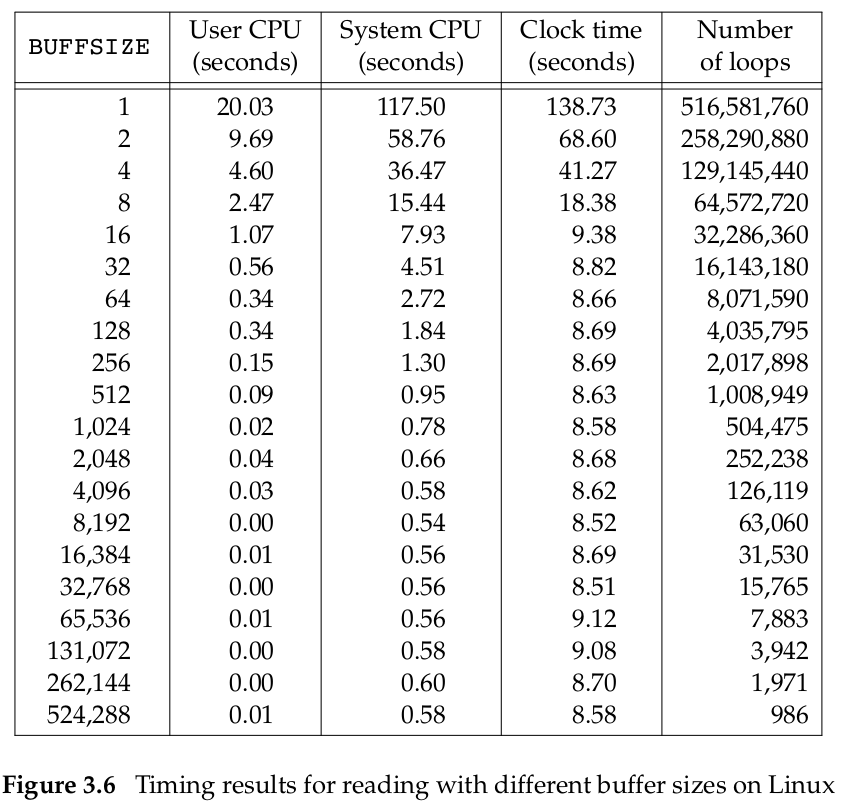

# OS


# 1. 调度Schedler

CPU bound(也叫计算密集型)，这种程序CPU越快，程序也会越快，瓶颈在于CPU

I/O bound(也叫I/O密集型)，这种程序I/O越快，程序也会越快，瓶颈在与I/O系统

与之对应的还有

CPU Burst

I/O Burst


# 2. I/O

在了解I/O之前，首先先得了解*nix下的文件。

在*nix下，I/O操作可以通过System call或者标准库来实现：

1. 通过System call实现主要通过open, read, write, lseek, and close这五个系统调用，这种方式进行的I/O叫做unbuffered I/O，并且通过file discriptor来访问打开的文件
2. 通过标准库实现I/O主要通过fopen等标准库函数实现，这种方式的I/O可以是带buffer也可以不带，一切通过**FILE**对象访问打开的文件

*nix下，通过file discriptor来指向打开的文件，file discriptor是一个整数。这个整数是在打开文件时OS分配的。有三个保留的file discriptor:

1. 0(STDIN_FILENO)，表示标准输入
2. 1(STDOUT_FILENO)，表示标准输出
3. 2(STDERR_FILENO)，表示标准错误

这三个文件是在OS创建进程时自动打开的，因此后续打开的文件的file discriptor都是>=3。


`read`与`write`两个系统调用，使用时候都需要传入需要读/写的字节个数，而每一次调用`read`和`write`系统调用时读/写的字节数会影响到I/O的效率

```c
#include <stdio.h>
#include <unistd.h>
#include <stdlib.h>
#define BUFFSIZE 4096
int main(void)
{
    int n;
    char buf[BUFFSIZE];
    while ((n = read(STDIN_FILENO, buf, BUFFSIZE)) > 0)
        if (write(STDOUT_FILENO, buf, n) != n)
            fprintf(stderr, "write error");
    if (n < 0)
        fprintf(stderr, "read error");
    exit(0);
}
```

以上面的程序为例，当BUFFSIZE设置为4096时，此时的I/O效率是最高的。



这与文件系统的块block的大小有关，Linux下ext4文件系统的block大小就是4096字节，所以buffer大小设置为4096是最佳的。


**why?**


为了描述打开的文件，*nix有三种数据结构：

1. File discriptor table，这个数据结构每一个进程都有一个，这个表中每一个entry包含两项：

   - The file descriptor flags
   - A pointer to a file table entry

   每一个entry对应一个file discriptor。file discriptor就是File discriptor table中的index。

2. Open file table，这个数据结构是所有进程共享的，每一个entry包括：

   - The file status flags for the file
   - The current file offset
   - A pointer to the v-node(unix，linux下叫i-node) table entry for the file

3. 每一个打开的文件/设备都有一个v-node(unix)/i-node(linux)数据结构，包含这个文件本身的一些信息，每一个v-node/i-node都对应着一个文件


通过上面的示意图表明了三种table之间的关系。

每当通过`open`系统调用打开同一个文件时，都会在相应的进程的file discriptor table中增加一项，同时在open file table中也新增一项。


*nix kernel中，会有一个buffer cache/page cache，大多数磁盘的I/O操作都会用到这个buffer cache。当写文件时，kernel会将数据先放在buffer中，等待合适时机放入一个输出队列中等待写入磁盘，这叫做**delayed write**。

如果该缓冲没被写满的话，内核就不会把它放入到输出队列中。当这个缓冲区被写满或者内核想重用这个缓冲区时，才会将其排到输出队列中。等它到达等待队列首部时才会进行实际的IO操作。

这个buffer叫做**OS Cache**。**OS Cache**与**delayed write**能够降低磁盘的读写次数，提高I/O的速度。


这个buffer cache位于文件系统与块设备(block device)之间，和CPU cache的原理一样：

1. 当kernel尝试从磁盘读取时，首先会尝试在buffer cache中查看有无要读取的数据
1. 如果buffer cache中没有要读取的数据，那么kernel会从disk读取数据，然后缓存在buffer cache中
1. 当kernel尝试向磁盘写时，也会将这些数据缓存，后续如果要读这些数据直接从buffer cache中读


由于这个buffer的存在，如何保证buffer中的内容与磁盘中的内容一致就成了问题。*nix下有3个系统调用与之相关：`sync`, `fsync`, and `fdatasync`


Linux下的I/O模型有五种

## 2.1 阻塞I/O

阻塞I/O

## 2.2 非阻塞I/O


## 2.3 I/O多路复用


## 2.4 信号驱动I/O


## 2.5 异步I/O


## 2.6 Zero-copy

当我们想读取磁盘上的文件，并且将其通过网络发送时，最直接的方式是先将文件读入内存中的buffer中，然后再将buffer写入到socket。但事实上这个过程效率非常低，需要进行4次copy(两次CPU copy，两次DMA copy)，并且需要需要4次内核态与用户态的切换。


但实际上中间两次内核态与用户态的切换以及中间两次copy是没有必要的，浪费了CPU cycles以及内存带宽。

因此Zero-copy就是为了节省CPU cycles以及Memory bandwidth的一种操作。

通过Zero-copy操作，内核能够直接将数据传输给socket，而不用经过用户态。

## 2.7 Copy-on-write

Copy-on-write(COW)，也叫做implicit sharing，shadowing。

COW在`fork()`系统调用，以及C++的`string`等地方使用到，非常经典的例子是`fork()`系统调用。


## 2.8 DMA


## 2.9 IOMMU

 **input–output memory management unit** (**IOMMU**)是一种MMU，用于将DMA-capable I/O bus连接到主存上。和传统的MMU不同，传统的MMU负责将CPU看到的虚拟地址转化为实际的物理地址。而IOMMU则是将设备看到的虚拟地址转化为实际的物理地址。


IOMMU的一个十分重要的应用场景是在虚拟化技术上。

AMD的[VIRTUALIZING IO THROUGH THE IO MEMORY MANAGEMENT UNIT (IOMMU)](https://pages.cs.wisc.edu/~basu/isca_iommu_tutorial/IOMMU_TUTORIAL_ASPLOS_2016.pdf)对IOMMU以及虚拟化有更加详细的介绍。


## 2.10 Linux Storage Stack


