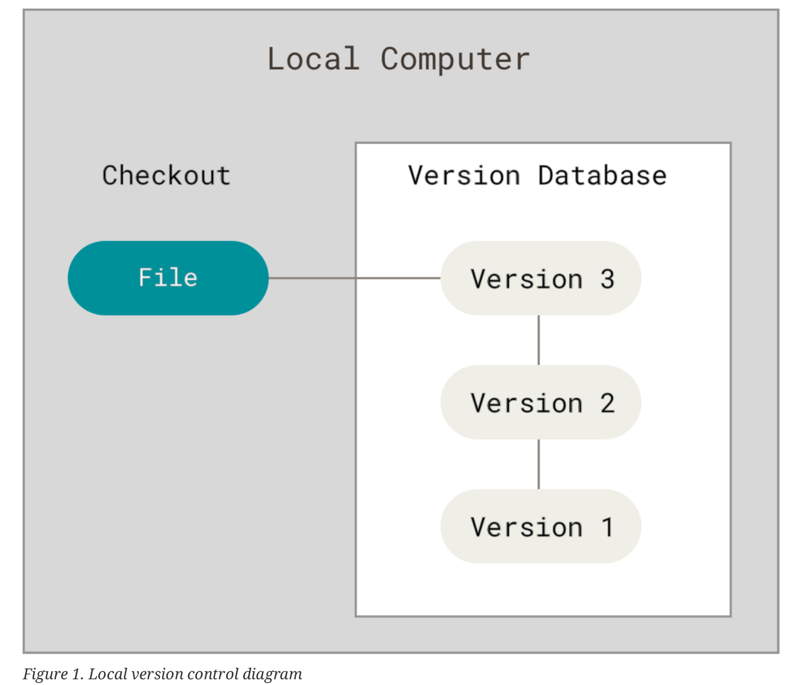
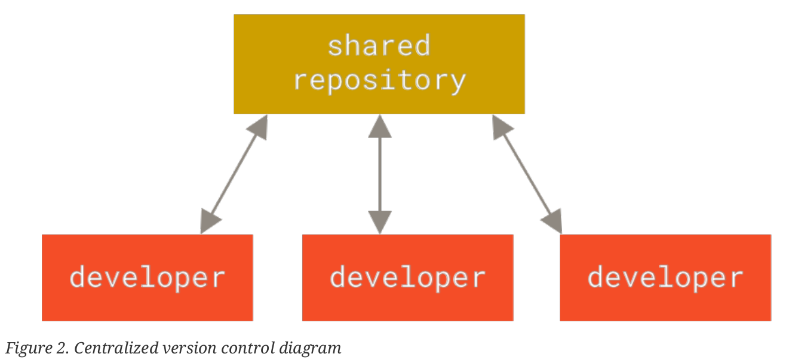
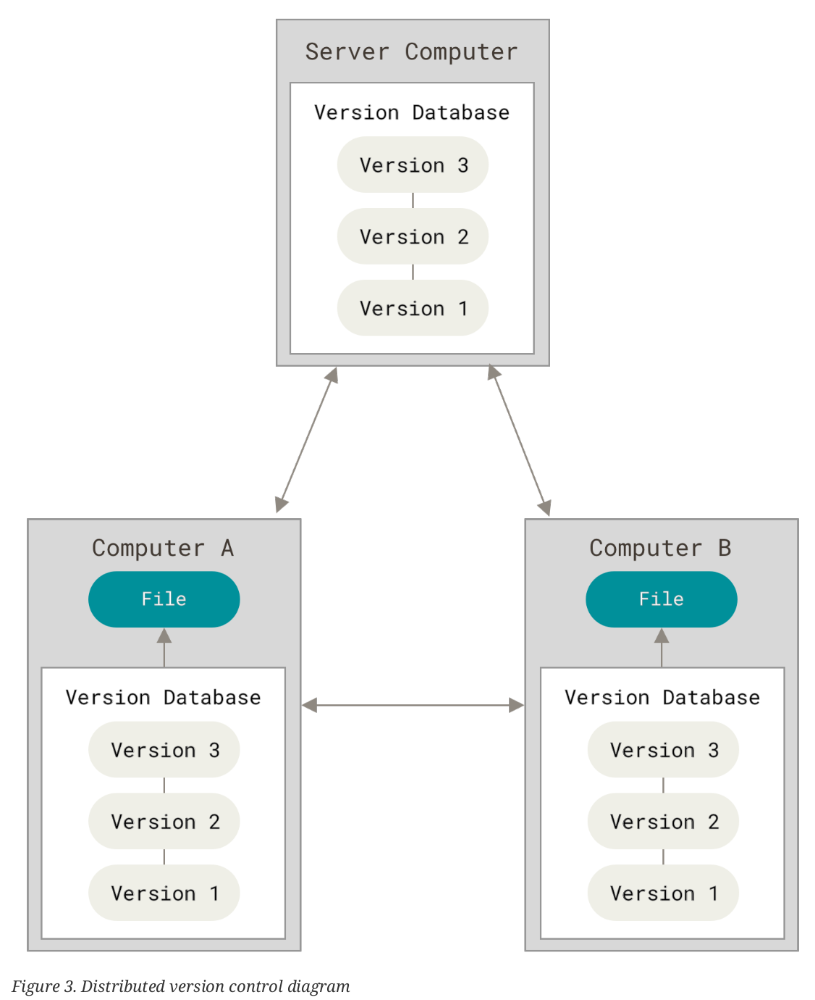
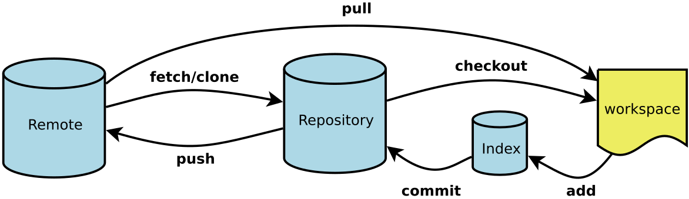
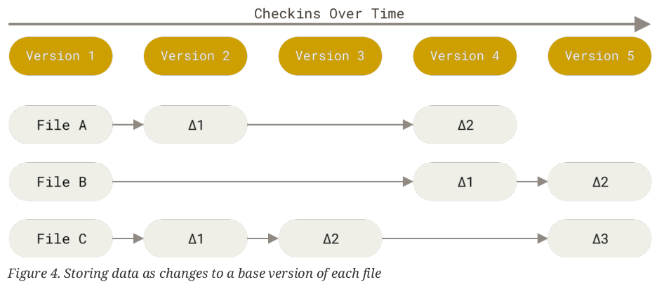
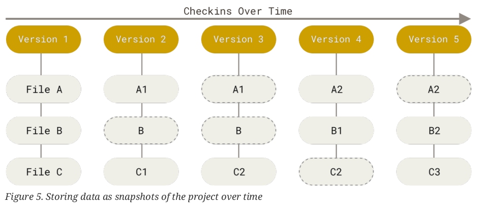
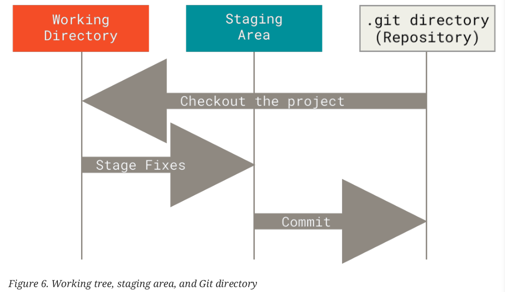
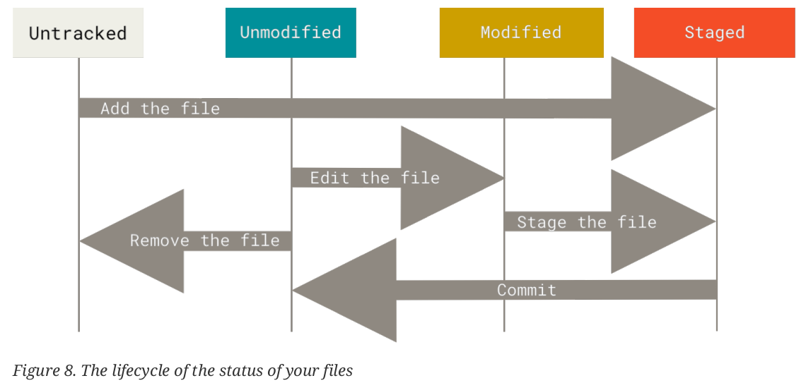

# Version Control


# 1. Version Control System

有三种类型的Version Control System(VCS)

## 1.1 Local Version Control Systems

GNU RCS属于这种类型的VCS。




## 1.2 Centralized Version Control Systems

CVS，Subversion(Apache Subversion)和Perforce都属于这种类型。



## 1.3 Distributed Version Control Systems

Git，Mercurial和Darcs属于这种类型。




# 2. Git


## 2.1 A Short History of Git

参考：

- [git的前世，和BitKeeper](https://juejin.cn/post/7130545347767566367)

Git的出现与Linux内核是分不开的。

最早Linux采用的其实是和unix一样的邮件互发patches与archived files的方式来共享更改(1991–2002)。

而从2002开始，Linux kernel开始采用一种DVCS，叫做BitKeeper。但是与Linux的开源相反，BitKeeper是一个商业软件，但是BitKeeper允许Linux社区可以免费使用。

但是在2005年，因为种种原因，BitKeeper收回了对开源社区的免费授权，促使Linux社区开发自己的VCS，git就由此诞生。至于更多详细而细节的内容，可以参考上面的文章。


## 2.2 Basic Knowledge




相比于其它VCS比如CVS，Subversion以及Perforce，git以一种完全不同的方式存储历史数据。

### 2.2.1 Snapshots, Not Differences

CVS，Subversion以及Perforce采用的是delta-based version control，即记录的是文件的改动。



而git记录的，是文件系统的一个快照(snapshot)。

```
With Git, every time you commit, or save the state of your project, Git basically takes a picture of what all your files look like at that moment and stores a reference to that snapshot. To be efficient, if files have not changed, Git doesn’t store the file again, just a link to the previous identical file it has already stored. This makes Git more like a mini filesystem with some incredibly powerful tools built on top of it, rather than simply a VCS.
```

在git的眼中，这些历史数据就被串成了stream of snapshots。

因此从某种程度上来说，Git就像是一个小型的文件系统。



所以git的版本控制机制就是通过快照(snapshot) + 链接(link)

### 2.2.2 Nearly Every Operation Is Local

git会把整个项目的历史记录完整地存储在本地磁盘上，所以绝大多数操作都不需要网络通信。

### 2.2.3 Git Has Integrity

git会通过SHA-1的hash来对保存的内容(也就是上面提到的snapshot)进行checksum，并且通过这个checksum来访问对应的内容。这个SHA-1是通过文件内容或者文件目录结构算出来的。


### 2.2.4 Git Generally Only Adds Data

git中的几乎所有操作都只会向Git的database中添加数据(和docker构建image的时候挺像)。这就意味着git中的很多操作都是可以撤销的。


### 2.2.5 The Three States

git中，文件有三种状态：modified，staged，committed

这三种状态就分别对应着一个git项目中的三个部分：the working tree，the staging area(也叫做**Index**)，the Git directory



```
The working tree is a single checkout of one version of the project. These files are pulled out of the
compressed database in the Git directory and placed on disk for you to use or modify.
The staging area is a file, generally contained in your Git directory, that stores information about
what will go into your next commit. Its technical name in Git parlance is the “index”, but the phrase
“staging area” works just as well.
The Git directory is where Git stores the metadata and object database for your project. This is the
most important part of Git, and it is what is copied when you clone a repository from another
computer.
```


### 2.2.6 Git config

git有许多环境变量可以配置，这些配置信息会被存储在三个地方：

1. `[path]/etc/gitconfig `系统级别的配置文件，这是`--system`选项作用的位置
2. `~/.gitconfig`或者`~/.config/git/config` 用户级别的配置文件，这是`--global`选项作用的位置
3. 项目文件夹下`.git`目录下的`config` 这是`--local`选项作用的位置，也是默认的选项

按照优先级[3] > [2] > [1]，优先级高的选项会覆盖优先级低的选项。

```
git config --list --show-origin
```

用以显示上述三个层级的git配置选项。

```
git config --list
```

也是一样的作用。

但是也可以通过

```
git config <key>
git config --show-origin <key>
```

来显示指定key的配置。

### 2.2.7 

git中，文件有几种状态：

- tracked
  - unmodified
  - modified
  - staged
- untracked





### 2.2. Ignoring Files


## 1.2 git workflow

git clone会创建一个.git目录，然后将repository中的数据都拉到.git目录中，然后从中checkout出一个最新版本的working copy。所以git clone实际上是copy .git这个目录。

而working tree中的内容是git clone命令从.git目录下checkout出来的。


## git branch


## git的四类存储对象：blob，tree，commit和tag


# 3. Github

本文写于2024-8-14，下午1点50分。

之所以写这一章节，是因为在这之前，对于github的认知程度非常浅，但随着不断学习Git以及接触FOSS，逐渐认识到Github有许多更加强大以及方便的功能。

## 3.1 


# 2. SVN


# 3. CVS


# 4.