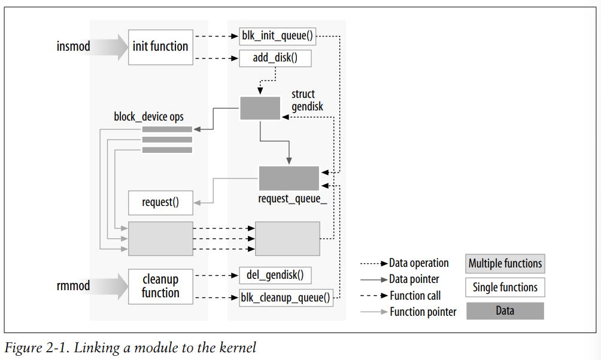

# Chapter 2 Building and Running Modules

## 1、Setting Up Test System

### 1.1 内核的选择

版本2.6.x（稳定版）

1. Vendor kernels：发行版内核，heavily patched，并且这些patches可能会更改kernel与device之间的API
2. mainline kernels：standard kernel

### 1.2 构建内核

构建内核modules的要求： **a configured and built kernel tree**（过去的内核版本只需要有一些header files即可构建modules）。

2.6版本的modules需要在kernel source tree找到相应的object files才能被链接。

## 2、The Hello World Module

```c
#include <linux/init.h>
#include <linux/module.h>
MODULE_LICENSE("Dual BSD/GPL");
static int hello_init(void)
{
 printk(KERN_ALERT "Hello, world\n");
 return 0;
}
static void hello_exit(void)
{
 printk(KERN_ALERT "Goodbye, cruel world\n");
}
module_init(hello_init);
module_exit(hello_exit);
```

`printk`函数定义在Linux kernel内部，并且可以被modules使用（`insmod`会将modules链接到kernel，因此能够访问kernel中的一些symbols）。

`KERN_ALERT`设置优先级

**但能够加载上述模块的关键是需要有一个正确配置以及构造的kernel tree**

## 3、Kernel Modules Versus Applications

1. kernel modules类似于event-driven programming：kernel modules的initialization function仅用于注册（register）modules告诉内核modules在哪，有什么功能。而exit function仅在module被unload时调用。
2. modules的exit函数需要释放一切init函数占用的资源。
3. module只与kernel链接，因此只能够调用kernel提供的函数。并且由于不与其他library链接，module的源代码中不能include usual header files。
4. 与内核相关的在kernel source tree中的header files中被声明。
5. kernel fault与application fault。kernel fault后果更加严重。




## 4、User Space and Kernel Space

modules运行在kernel space中而application运行在user space中。

application发起系统调用或者硬件中断时会陷入到内核态。

而**modules的任务就是实现系统调用或者处理中断**。

## 5、Concurrency in the Kernel

kernel programming的过程中需要处理并发。

多个进程可能会同时使用driver


