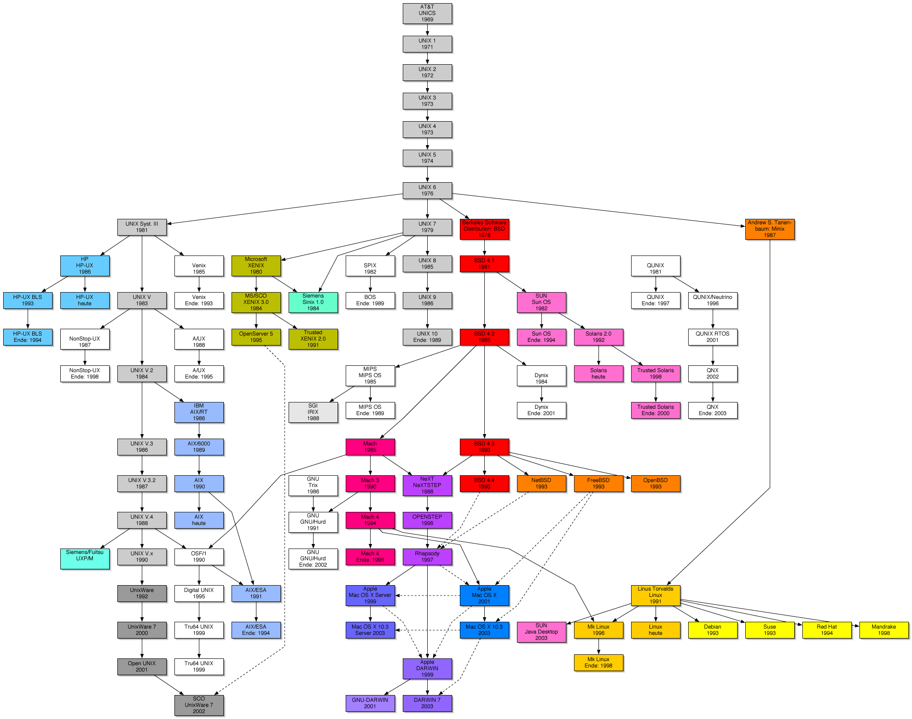
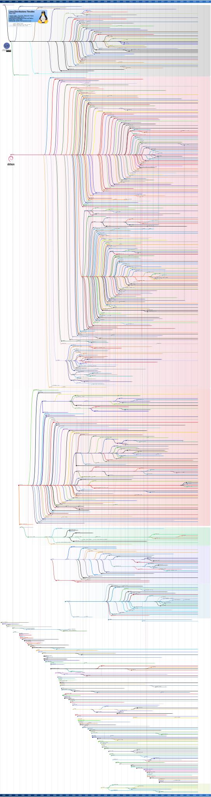
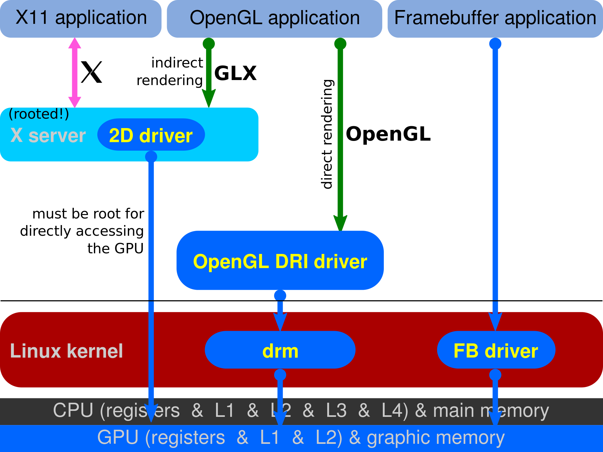

# Arch


## 1、在Arch上安装Linux驱动

### 1.1 如何查看Arch上的驱动版本

查看Linux上显卡的驱动版本有很多种方法：

- `lspci | grep VGA`

  `lspci`命令能够列出所有PCI设备，通过`-v -vv -vvv`选项，输出的信息会越来越详细

  ```
  00:00.0 Host bridge: Intel Corporation 12th Gen Core Processor Host Bridge/DRAM Registers (rev 02)
  00:01.0 PCI bridge: Intel Corporation 12th Gen Core Processor PCI Express x16 Controller #1 (rev 02)
  00:04.0 Signal processing controller: Intel Corporation Alder Lake Innovation Platform Framework Processor Participant (rev 02)
  00:06.0 PCI bridge: Intel Corporation 12th Gen Core Processor PCI Express x4 Controller #0 (rev 02)
  00:06.2 PCI bridge: Intel Corporation 12th Gen Core Processor PCI Express x4 Controller #2 (rev 02)
  00:07.0 PCI bridge: Intel Corporation Alder Lake-P Thunderbolt 4 PCI Express Root Port #0 (rev 02)
  00:0a.0 Signal processing controller: Intel Corporation Platform Monitoring Technology (rev 01)
  00:0d.0 USB controller: Intel Corporation Alder Lake-P Thunderbolt 4 USB Controller (rev 02)
  00:0d.2 USB controller: Intel Corporation Alder Lake-P Thunderbolt 4 NHI #0 (rev 02)
  00:14.0 USB controller: Intel Corporation Alder Lake PCH USB 3.2 xHCI Host Controller (rev 01)
  00:14.2 RAM memory: Intel Corporation Alder Lake PCH Shared SRAM (rev 01)
  00:14.3 Network controller: Intel Corporation Alder Lake-P PCH CNVi WiFi (rev 01)
  00:15.0 Serial bus controller: Intel Corporation Alder Lake PCH Serial IO I2C Controller #0 (rev 01)
  00:15.1 Serial bus controller: Intel Corporation Alder Lake PCH Serial IO I2C Controller #1 (rev 01)
  00:16.0 Communication controller: Intel Corporation Alder Lake PCH HECI Controller (rev 01)
  00:1d.0 PCI bridge: Intel Corporation Alder Lake PCI Express Root Port #9 (rev 01)
  00:1d.1 PCI bridge: Intel Corporation Alder Lake PCI Express x1 Root Port #10 (rev 01)
  00:1f.0 ISA bridge: Intel Corporation Alder Lake PCH eSPI Controller (rev 01)
  00:1f.3 Audio device: Intel Corporation Alder Lake PCH-P High Definition Audio Controller (rev 01)
  00:1f.4 SMBus: Intel Corporation Alder Lake PCH-P SMBus Host Controller (rev 01)
  00:1f.5 Serial bus controller: Intel Corporation Alder Lake-P PCH SPI Controller (rev 01)
  01:00.0 VGA compatible controller: NVIDIA Corporation GA106M [GeForce RTX 3060 Mobile / Max-Q] (rev a1)
  01:00.1 Audio device: NVIDIA Corporation GA106 High Definition Audio Controller (rev a1)
  02:00.0 Non-Volatile memory controller: Samsung Electronics Co Ltd NVMe SSD Controller PM9A1/PM9A3/980PRO
  03:00.0 Non-Volatile memory controller: Micron Technology Inc 3400 NVMe SSD [Hendrix]
  31:00.0 Ethernet controller: Realtek Semiconductor Co., Ltd. RTL8111/8168/8211/8411 PCI Express Gigabit Ethernet Controller (rev 15)
  ```

- `nvidia-smi`

- `glxinfo`

- 直接通过包管理器`pacman`查询安装的版本


## 2、在Arch上安装VirtualBox


# Configuration Files


# Linux Graphic Stack

参考：

- [A brief introduction to the Linux graphics stack](https://blogs.igalia.com/itoral/2014/07/29/a-brief-introduction-to-the-linux-graphics-stack/)
- da


在早期，X Server是唯一能够具备访问graphics hardware的进程，X更加详细的介绍，看这里[X Window System](#1.-X)。这种设计不需要考虑同步不同clients对于硬件的访问，能够简化graphics stack。

Clients通过**Xlib(Xlib实现了X11 protocol)**，发送rendering commands(over X11 protocol)，X Server接受这些rendering command，并且翻译成hardware commands。

翻译命令的过程是交给driver完成的：driver接收硬件无关的rendering commands，然后翻译成目标硬件上的hardware commands。


由于只有X Server能够与graphics hardware通信，因此驱动厂商只需要专门为X Server编写相应的驱动即可，因此驱动就集成在了X Server内部，作为一个**module**。

这种情况下的驱动位于userspace中，叫做DDX driver，主要用于支持一些2D操作。


```
In my Ubuntu system, for example, the DDX driver for my Intel GPU comes via the xserver-xorg-video-intel package and there are similar packages for other GPU vendors.
```


而3D Graphics，一般通过OpenGL实现，人们希望能够利用硬件(GPU)加速的OpenGL库(**libGL.so**)。但是由于X Server的存在，libGL.so无法直接与graphics hardware通信，但是有需要利用到graphics hardware做加速。解决方案就是**Indirect Rendering**。

```
the solution was to provide an implementation of OpenGL that would send OpenGL commands to the X server through an extension of the X11 protocol and let the X server translate these into actual hardware commands as it had been doing for 2D commands before.
```

即将OpenGL的指令封装在X11 protocol中交给graphics hardware。


但是上面的Indirect Rendering的方式，对于一些intensive 3D application是不够高效的，需要一种能够直接渲染的方式。


**Direct Rendering Infrastructure(DRI)**

DRI的架构中，核心是**Direct Rendering Manager(DRM)**，用于处理hardware locking，access synchronization，video memory等等。同时drm也提供了一组API给userspace用于传输指令和数据，使得在userspace能够访问到graphics hardware。



DRM的这些功能与具体的GPU硬件有关，因此不同的GPU有着不同的DRM driver。

```
In my Ubuntu system the DRM module for my Intel GPU is provided via the libdrm-intel1:amd64 package.
```


有了DRM/DRI之后，就需要在DRI/DRM infrastructure之上实现OpenGL的标准，即能够发挥出DRI/DRM的性能，同时满足X server的要求。

**Mesa**

关于Mesa的更多细节，看[这里](#Mesa)

Mesa实现了OpenGL的标准，提供了`libGL.so`，使得OpenGL能够直接访问graphics hardware。

尽管Mesa实现了与graphics hardware的直接通信，但是渲染的结果还是需要绘制在X Server分配的一个window中。

因此需要一种机制来同步这两个方面：

- X Server控制windows
- Mesa在windows上绘制（即输出）

OpenGL应用与X Server之间的同步通过Mesa的**GLX**实现，GLX基于DRI，通过DRI与X Server交互实现同步。


之前提到过，DRM/DRI还会向userspace提供一些API。由于userspace与graphics hardware通信时，需要在graphics hardware的显存上分配空间，这部分的操作就交给DRM driver提供给userspace的这些API来完成。Mesa中会用到这些API（同时也不难发现Mesa是工作在userspace中的）。

```
DRM is also required whenever we need to allocate and manage video memory in Mesa, so things like creating textures, uploading data to textures, allocating color, depth or stencil buffers, etc all require to use the DRM APIs for the target hardware.
```


上面是对Linux Graphics Stack发展的一个简单介绍，下面是对于各个概念的具体介绍。


## 1. X

关于X，wiki链接[X Window System](https://en.wikipedia.org/wiki/X_Window_System)。

X Window System，也叫做X11或者X，wiki官方的介绍

```
The X Window System (X11, or simply X) is a windowing system for bitmap displays, common on Unix-like operating systems.
X is an architecture-independent system for remote graphical user interfaces and input device capabilities. Each person using a networked terminal has the ability to interact with the display with any type of user input device.
```

X是一个[windowing system](https://en.wikipedia.org/wiki/Windowing_system)，并且和OpenGL类似，只是一种规范/标准/协议，具体实现方式根据不同的个体实现也会不同。[X.Org Server](https://en.wikipedia.org/wiki/X.Org_Server)是X Window System的一种实现。


下面这种情况说明了X的remote特性，即**X server可以通过网络管理远端的X client**。


**X nesting技术**

```
An X client itself may emulate an X server by providing display services to other clients. This is known as "X nesting". Open-source clients such as Xnest and Xephyr support such X nesting.
```


**X Terminal**


### User Interface

对于X11来说，其面向的应用是`window managers, GUI widget toolkits and desktop environments, or application-specific graphical user interfaces`。

```
X primarily defines protocol and graphics primitives – it deliberately contains no specification for application user-interface design, such as button, menu, or window title-bar styles
```

User-interface的设计不是由X来定义，而是交给application来定义，因此X interface的形式是多样的，这也是为什么有多种Desktop Environment以及不同的Window Manager。

这里需要区分几个概念：

- **Desktop Environment(DE)**，看[这里](#4.-Desktop-Environment)
- **Window Manager**，看[这里](#5.-Window-Manager)
- **Compositor**，看[这里](#6.-Compositor)


## 2. Mesa


## 3. Wayland

arch wiki中的介绍

```
Window managers are unique to Xorg. The equivalent of window managers on Wayland are called compositors because they also act as compositing window managers
```

同X一样，Wayland也是一种协议，Wayland的提出是为了替代X Window System。

Wayland的实现是通过C library。


Wayland中的Window Manager称为**[Wayland compositor](https://en.wikipedia.org/wiki/Wayland_(protocol)#Wayland_compositors)**，而其中一种实现叫做 **[Weston](https://en.wikipedia.org/wiki/Wayland_(protocol)#Weston)**。


### Software Architecture


## 4. Desktop Environment

wiki官方的介绍

```
In computing, a desktop environment (DE) is an implementation of the desktop metaphor made of a bundle of programs running on top of a computer operating system that share a common graphical user interface (GUI), sometimes described as a graphical shell.
A desktop environment typically consists of icons, windows, toolbars, folders, wallpapers and desktop widgets (see Elements of graphical user interfaces and WIMP). 
```

DE也叫做**Graphical Shell**。


对于X Window System上的DE来说，DE更加灵活与多样，能够更加User的需求定制化。

```
In this context, a desktop environment typically consists of several separate components, including a window manager (such as Mutter or KWin), a file manager (such as Files or Dolphin), a set of graphical themes, together with toolkits (such as GTK+ and Qt) and libraries for managing the desktop. All these individual modules can be exchanged and independently configured to suit users, but most desktop environments provide a default configuration that works with minimal user setup.
```

因此从上面的角度来说，**Window Manager是Desktop Environment中的一个component。**

一些Desktop Environments：

- **Windows Shell**
- **KDE**
- **GNOME**
- **CDE**


## 5. Window Manager

wiki官方的介绍

```
A window manager is system software that controls the placement and appearance of windows within a windowing system in a graphical user interface. Most window managers are designed to help provide a desktop environment. They work in conjunction with the underlying graphical system that provides required functionality—support for graphics hardware, pointing devices, and a keyboard—and are often written and created using a widget toolkit.
```

window manager的一些基本功能

```
Elements usually associated with window managers allow the user to open, close, minimize, maximize, move, resize, and keep track of running windows, including window decorators. 
They determine the border, title bar, size, and ability to resize windows, and often provide other functionality such as reserved areas for sticking dockapps like Window Maker, or the ability to tab windows like Fluxbox. Some window managers are even bundled with simple utilities like menus to start programs or to configure the window manager itself.
```


arch wiki中的介绍，**从arch wiki中可以注意到，Window Manager可以脱离于DE独立使用。**

```
A window manager (WM) is system software that controls the placement and appearance of windows within a windowing system in a graphical user interface (GUI). It can be part of a desktop environment (DE) or be used standalone.
```


**从上面的角度来说，WM和underlying graphical system(即X Window System)是同等的地位，相互协作来为用户提供一个Desktop Environment。**


**X window managers**

```
Few window managers are designed with a clear distinction between the windowing system and the window manager.
```

但是对于X Window System下的Window Manager，Window Manager与WInwget https://developer.download.nvidia.com/compute/cuda/12.4.1/local_installers/cuda_12.4.1_550.54.15_linux.rundowing System之间是有明显界限的。并且由于Window Manager的模块化设计，因此Window Manager可以被自由替换组合。


**Microsoft Windows**


**ChromeOS**


### Types

Window Manager有许多类型：

- **Compositing  window managers(Compositor)**
- **Stacking window managers**
- **Tiling window manager**
- **Dynamic window manager**


## 6. Compositor


## 7. Widget Toolkit

wiki官方的介绍，参考这里[Widget toolkit](https://en.wikipedia.org/wiki/Widget_toolkit)

```
A widget toolkit, widget library, GUI toolkit, or UX library is a library or a collection of libraries containing a set of graphical control elements (called widgets) used to construct the graphical user interface (GUI) of programs.
```

即Widget Toolkit是用来创建GUI的库，根据[Window Manager](#5.-Window-Manager)中的说法，WM也是由Widget Toolkit编写的。

Widget Toolkit包含有专属的Rendering Engine

```
Most widget toolkits additionally include their own rendering engine. This engine can be specific to a certain operating system or windowing system or contain back-ends to interface with multiple ones and also with rendering APIs such as OpenGL, OpenVG, or EGL. 
```

有两种主流的Widget Toolkit：

- **GTK**
- **Qt**


## 8. KMS


## 9. Display Manager

wiki官方对Display Manager的介绍

```
In the X Window System, an X display manager is a graphical login manager which starts a login session on an X server from the same or another computer.
```


这里涉及到**graphical.target**


## 9. 总结

从上面的介绍，总体来看，各个component之间的层次关系


# Terminal，Shell与Console


对于早期的大型机mainframe，都是通过终端设备与mainframe交互。

早期使用**TTY(Teletypewriter)**作为终端设备，后续**电子显示终端**逐渐取代**打印终端(TTY)**。


80字符长度的规范：

最早来源于打孔纸片，最大80列，后来被应用在TTY以及电子显示终端，后续又被应用到了一些编程规范上。

而Personal Computer的普及，就不再需要终端设备，Personal Computer终端，但又需要与一些不支持GUI的命令行工具交互，因此需要**一个模拟传统终端行为的程序**，也就是**终端模拟器**。


终端成为内核的一个模块，但是TTY driver还是保留。

整个Terminal的发展历史：


然后是**shell**，shell就是一个与OS交互的程序，有许多种实现：

- **命令行Shell：**
  - **cmd**
  - **powershell**
  - **sh**
  - **bash**
- **图形Shell：**
  - **explorer.exe(Windows)**
  - **Gnome shell**
  - **Plasma shell**
  - **Xfce**


shell**一般**都是运行在Terminal之中的，但也可以脱离Terminal运行：shell只需要从stdin读取数据然后从stdout/stderr输出，stdout可以不是terminal。

比如

```
docker run -i bash bash
```

##### 是一个无terminal的shell。


一些桌面环境下的Terminal，这里指的是用户态的Terminal：

- **GNOME Terminal**
- **Alacritty**
- **st(simple terminal)** 
- **conhost.exe(Windows)**


terminal运行在DE中的一个图形化界面，提供输入和输出结果的显示。


Terminal既可以运行在用户态以及内核态：

- 用户态的Terminal **终端窗口(伪终端PTY)**，建立在图形界面的之上
- 内核态的Terminal **虚拟控制台(Virtual Console)**，独立于图形界面，直接由内核控制


**Console**控制台，用于对电脑进行一些底层操作，但是现在与terminal区别越来越模糊。


**伪终端PTY** 

`tty`命令，可以看到`/dev`目录下有一个`pts`文件夹，下面有`0，1`等文件，还有一个`ptmx`

`echo`将输入重定向到`/dev/pts`下的文件等价于在相应的伪终端输出


伪终端与TTY驱动进行交互，以GNOME Terminal为例：

1. 在尝试代开GNOME Terminal时，GNOME Terminal会先打开`/dev/ptmx`字符设备文件
2. 打开`/dev/ptmx`字符设备文件后，会在/dev/pts目录下获得一个`PTY master`的文件描述符(`ptmx`)，并在`/dev/pts`目录下创建`PTY slave`设备(也就是**pts**)
3. GNOME Terminal持有PTY master的文件描述符`/dev/pts/ptmx`，将GUI绘制到显示器上
4. GNOME Terminal fork出一个bash的子进程，bash持有PTY slave的设备描述符`/dev/pts/0`，之后bash就是从pts接受输入然后输出返回到pts（所以说打开GNOME terminal时，是先看到Terminal的GUI，然后才会显示shell的prompt）
5. GNOME Terminal监听键盘事件，将来自键盘的输入发送到PTY master
6. PTY master将输入发送到TTY driver中的**line discipline**
7. line discipline接受字符的同时，也写回给PTY master(**回显**)
8. Terminal读取来自PTY master的数据，绘制到显示器上，实现**回显**
9. 输入内容会保存在line discipline中进行缓冲，输入回车TTY driver将缓冲中的输入复制到PTY slave中
10. bash从pts中读取输入，执行相应的命令（bash的stdin，stdout与stderr都是PTY slave）
11. 执行的输出被打印到标准输出pts
12. tty驱动再将输出复制到PTY master，terminal绘制到屏幕上


ssh工作流程：

1. 服务器端的Terminal其实就是ssh server，ssh server持有PTY master
2. ssh server再fork出bash子进程，bash再持有pts
3. 禁用客户端的Line discipline的规则（即不会对特殊字符，比如回车做出处理），让ssh client将所有输入原封不动将输入发送给ssh server
4. ssh server从TCP连接接受到的数据，写入PTY master
5. server端的Line discipline没有禁用`echo`规则，TTY driver
6. 输入回车，由于client端禁用了Line discipline的规则，所以不会处理回车，而服务端接受到回车之后的操作和上面伪终端和TTY交互的步骤相同


**虚拟终端序列(Virtual Terminal Sequence)**

terminal负责将shell 输出结果渲染，以及接受输入。

VT100与Gnome Terminal规范


# Nvidia in Linux


## 1. Linux下安装CUDA等一系列工具

### 1.1 版本与兼容性问题

首先需要考虑的是CUDA版本的选择问题，可以参照下面的这张表

| Hardware Generation     | Compute Capability | CTK Support    | Latest Forward Comaptibility Package Support | Driver                            |                           |
| ----------------------- | ------------------ | -------------- | -------------------------------------------- | --------------------------------- | ------------------------- |
|                         |                    |                |                                              | Current Minimum Driver in Support | Maximum Driver Supported* |
| Hopper                  | 9.x                | 11.8 - current | current                                      | 450.36.06+                        | latest                    |
| NVIDIA Ampere GPU Arch. | 8.x                | 11.0 - current |                                              | 450.36.06+                        | latest                    |
| Turing                  | 7.5                | 10.0 - current |                                              | 450.36.06+                        | latest                    |
| Volta                   | 7.x                | 9.0 - current  |                                              | 450.36.06+                        | latest                    |
| Pascal                  | 6.x                | 8.0 - current  |                                              | 450.36.06+                        | latest                    |
| Maxwell                 | 5.x                | 6.5 - current  |                                              | 450.36.06+                        | latest                    |


这里的兼容性需要从三个方向考虑：

- **CUDA Toolkit Version**
- **Driver Version**
- **Compute Capability**

更多可以参考[这里](../模型部署笔记/NVIDIA背后的技术.md#1.6-CUDA-Compatibility)

### 1.2 安装方式

考虑完版本选择的问题，就要考虑安装方式，对于Ubuntu下的安装，NVIDIA官方给出了三种方式：

- **deb(local)**
- **deb(network)**
- **runfile(local)**


# Package Manager

WIndows下的Package Manager [scoop](https://scoop.sh/)


# Environment Variable


# Callback Function


# curl


# wget


# Build Automation

首先是**software build**，wiki官方的介绍是

```
In software development, a build is the process of converting source code files into standalone software artifact(s) that can be run on a computer, or the result of doing so.[1]The associated processes including: compiling computer source code into binary code, packaging binary code, and running automated tests.
```

因此我们常说的build其实就主要是编译与安装过程。


常用的build automation工具主要分为以下几类：

- **Make-based**
- **Make-incompatible**
- **Build script generation**
- **Continuous integration**
- **Configuration management**
- **Package managers**


## 1. Make-based

这一类其实就是**make**。


## 2. Make-incompatible

这一类与上面的**make**系是相对的另一类，最主要的有：

- **Ninja**
- **Qt Build System**
- **Apache Maven**


## 3. Build script generation

这一类并不是像前面两类一样，直接构建，而是帮助产生能够供上面两类build tool使用的文件(比如make的Makefile)：

- **CMake**
- **GNU Build System**
- **qmake**

## 4. Continuous integration

## 5. Configuration management

- **NixOS**


# SVN与GIT


# Swap


# ZFS


# *nix下各种C/C++库的总结

- **libc** 过去Linux使用的C标准库，后续被glibc替代
- **glibc** GNU实现的C标准库，现在是标配
- **libstdc++** GCC的C++标准库，与GCC捆绑(原因在于libstdc++并不与内核打交道，对于系统级别的事件，libstdc++首先是会与glibc交互，才能和内核通信，因此glibc更加基础是与底层OS捆绑的，而libstdc++更加高层与编译器捆绑)
- **libc++** LLVM重写的C++标准库
- **libsupc++** 包含与exception handling以及Run-Time Type Information(RTTI)有关的函数

上面都只是在*nix下的情况，对于Windows上的C/C++标准库，情况会更加复杂。


**C++ standard library除了包含自生外，还会包含exception handling与Run-Time Type Information (RTTI)**


# repo

repo是google用Python编写的一个基于git的工具。


# *nix下用户与权限


# Linux /shm


# hook技术


# Linux下头文件与库管理

## 1. 相关环境变量

Linux下的头文件与库文件的查找路径涉及到如下几个环境变量：

- **LD_LIBRARY_PATH**
- **LIBRARY_PATH**
- **C_INCLUDE_PATH**
- **CPLUS_INCLUDE_PATH**
- **CPATH**
- **PATH**


stackoverflow上对于**LIBRARY_PATH**与**LD_LIBRARY_PATH**这两个环境变量的讨论[LD_LIBRARY_PATH vs LIBRARY_PATH](https://stackoverflow.com/questions/4250624/ld-library-path-vs-library-path)

**LIBRARY_PATH**与**LD_LIBRARY_PATH**这两个环境变量的作用很相似，但是是在一个程序的不同阶段使用到。

**LIBRARY_PATH**是在编译时，**编译器与链接器ld**用于查找静态与动态库的路径。

而**LD_LIBRARY_PATH**是在程序编译与链接之后，**程序与加载器ld.so**查找其使用到的动态库的路径。


**C_INCLUDE_PATH**预处理C时的包含目录

**CPLUS_INCLUDE_PATH**预处理C++时的包含目录

**CPATH**对于所有语言预处理都有效

**PATH**是可执行文件的路径


在GCC编译命令中，可以通过编译选项手动指定查找目录，这里涉及到这几个选项：

- **-I**用于告诉预处理器查找库的头文件路径
- **-L**用于告诉链接器查找库文件的路径
- **-l**用于告诉链接器链接库的名字(优先选择动态链接)


但是对于一些大型项目，其头文件往往会在**C_INCLUDE_PATH**与**CPLUS_INCLUDE_PATH**目录下的一个子目录中，而与处理器在查找头文件时，并不会在子目录中查找。

比如OpenCV，其头文件都在`${CPLUS_INCLUDE_PATH}/opencv2`这个目录下；对于eigen，其头文件都在`${CPLUS_INCLUDE_PATH}/eigen3`这个子目录下，因此就无法找到相应的头文件；对于LLVM，其头文件位于`/usr/include/llvm-14/llvm`目录下，网上大部分例子都是直接通过`#include "llvm/..."`使用LLVM的一些头文件，但是会报错，因为llvm这个目录并不位于`/usr/include`目录下，而是`/usr/include/llvm-14`目录下。

对于上面的问题，有几种解决方法：

- 将子目录加入到**C_INCLUDE_PATH**与**CPLUS_INCLUDE_PATH**环境变量中
- 利用[**pkg-config**工具](#3.1-pkg-config)
- 利用[**update-alternatives**工具]()

## 2. 相关命令

- **gcc -print-search-dirs**
- **gcc -E -v -**预处理器的搜索路径

## 3. 相关工具 

pkg-config与ldconfig

llvm-config

### 3.1 pkg-config

参考[Linux中pkg-config的使用](https://ivanzz1001.github.io/records/post/linux/2017/09/08/linux-pkg-config)

pkg-config用于管理系统中安装的libraries，主要功能有以下：

- 检查库的版本号。 如果所需要的库的版本不满足要求，它会打印出错误信息，避免链接错误版本的库文件
- 获得编译预处理参数，如宏定义、头文件的位置
- 获得链接参数，如库及依赖的其他库的位置，文件名及其他一些链接参数
- 自动加入所依赖的其他库的设置

CFLAGS用于指定头文件，对应`--cflags`选项

LDFLAGS用于指定库文件，对应`--libs`选项


pkg-config依赖于一个.pc文件，这个.pc文件的默认查找路径是在`/usr/lib`下。但是可以通过设置**PKG_CONFIG_PATH**环境变量来指定查找目录。以opencv的.pc文件为例

```
# Package Information for pkg-config

prefix=/usr/local
exec_prefix=${prefix}
libdir=${exec_prefix}/lib
includedir=${prefix}/include/opencv4

Name: OpenCV
Description: Open Source Computer Vision Library
Version: 4.9.0
Libs: -L${exec_prefix}/lib -lopencv_gapi -lopencv_stitching -lopencv_aruco -lopencv_bgsegm -lopencv_bioinspired -lopencv_ccalib -lopencv_dnn_objdetect -lopencv_dnn_superres -lopencv_dpm -lopencv_face -lopencv_freetype -lopencv_fuzzy -lopencv_hfs -lopencv_img_hash -lopencv_intensity_transform -lopencv_line_descriptor -lopencv_mcc -lopencv_quality -lopencv_rapid -lopencv_reg -lopencv_rgbd -lopencv_saliency -lopencv_stereo -lopencv_structured_light -lopencv_phase_unwrapping -lopencv_superres -lopencv_optflow -lopencv_surface_matching -lopencv_tracking -lopencv_highgui -lopencv_datasets -lopencv_text -lopencv_plot -lopencv_videostab -lopencv_videoio -lopencv_wechat_qrcode -lopencv_xfeatures2d -lopencv_shape -lopencv_ml -lopencv_ximgproc -lopencv_video -lopencv_xobjdetect -lopencv_objdetect -lopencv_calib3d -lopencv_imgcodecs -lopencv_features2d -lopencv_dnn -lopencv_flann -lopencv_xphoto -lopencv_photo -lopencv_imgproc -lopencv_core
Libs.private: -ldl -lm -lpthread -lrt
Cflags: -I${includedir}
```

 


### 3.2 ldconfig

参考[Linux中ldconfig的使用](https://ivanzz1001.github.io/records/post/linux/2017/09/08/linux-ldconfig)

**ldconfig**工具位于`/usr/sbin`目录下，用于`configure dynamic linker run-time bindings`，为共享库创建链接以及cache文件。

ldconfig会为三种共享库创建links与cache：

- */etc/ld.so.conf*文件中所列目录下的共享库
- 受信任目录下的共享库(/lib、/usr/lib)
- 在命令行通过`ldconfig -f`选项指定的共享库


cache文件默认为*/etc/ld.so.cache*，链接时首先从这个文件里查找，然后再到ld.so.conf中详细查找。


## 4. 链接库的路径顺序

Linux程序在运行时对动态链接库的搜索顺序，由高到低如下：


# 字符、字符集、字符编码


# Signal


# Linux网络配置


# Linux进程/线程与CPU核的绑定

