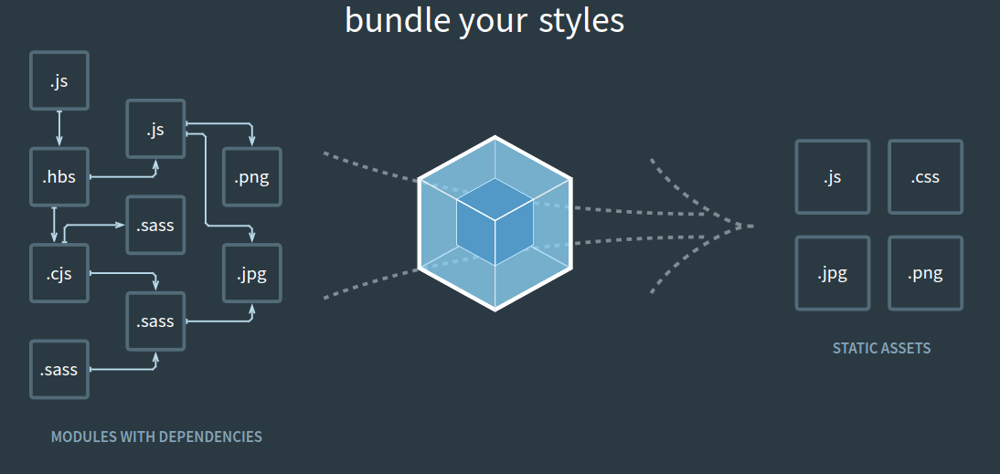
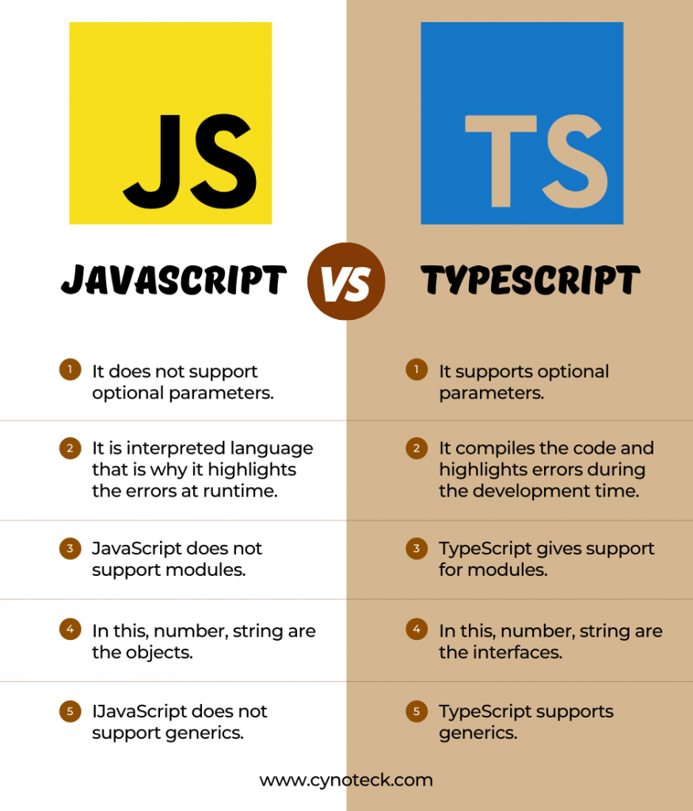
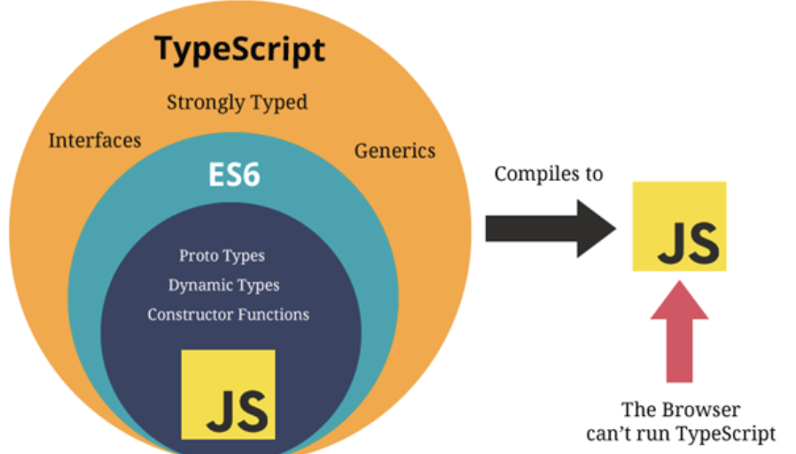
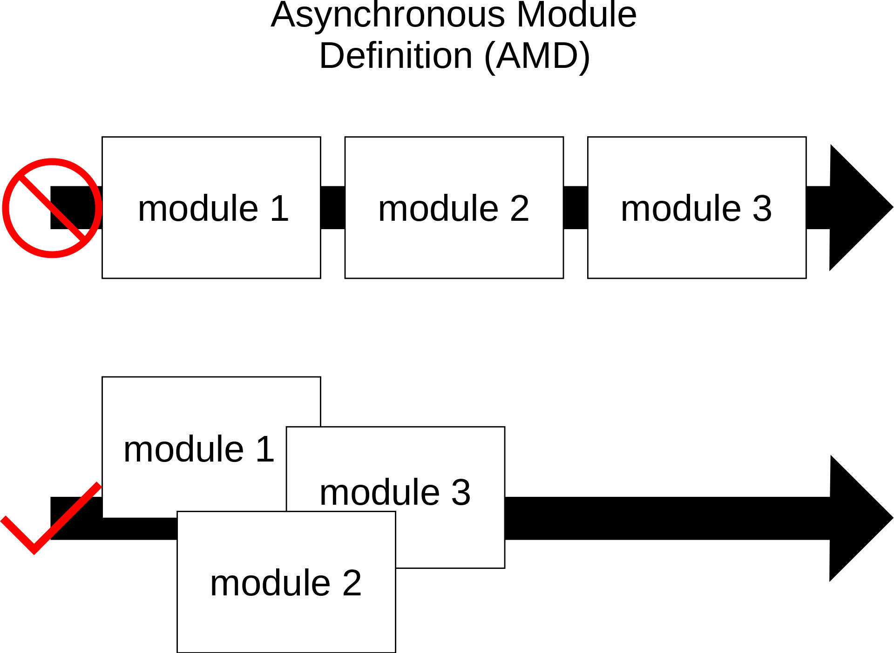

# Web


# 1. 一些基础概念


## 1.1 Node.js

关于Node.js，wiki官方的介绍如下

```
Node.js is a cross-platform, open-source JavaScript runtime environment that can run on Windows, Linux, Unix, macOS, and more. Node.js runs on the V8 JavaScript engine, and executes JavaScript code outside a web browser.
```

Node.js使得Javascript代码无需浏览器就可以运行，Node.js包含了一个v8引擎。

## 1.2 NPM

npm是一个javascript的包管理工具，类似于python的`pip`，包都集中管理在一个仓库中[npmjs](https://www.npmjs.com/)。

npm全称Node Package Manager，与Node有非常强的关联。


### 1.2.1 package.json

通过package.json文件更好地管理包

## 1.3 Vue/Vue-CLI


## 1.4 Webpack

wiki官方对于Webpack的介

```
Webpack is a free and open-source module bundler for JavaScript.[5][6][7][8] It is made primarily for JavaScript, but it can transform front-end assets such as HTML, CSS, and images if the corresponding loaders are included.[9] Webpack takes modules with dependencies and generates static assets representing those modules.[10]
```

**webpack** 是一个用于现代 JavaScript 应用程序的 *静态模块打包工具*。当 webpack 处理应用程序时，它会在内部从一个或多个入口点构建一个 [依赖图(dependency graph)](https://webpack.docschina.org/concepts/dependency-graph/)，然后将你项目中所需的每一个模块组合成一个或多个 *bundles*，它们均为静态资源，用于展示你的内容。




## 1.5 ES module

 Node.js官方对于ES module的介绍

```
ECMAScript modules are the official standard format to package JavaScript code for reuse. Modules are defined using a variety of import and export statements.
```

ES module是与模块化有关的标准


Javascript中使用模块是利用到了`import`与`export`两个语句的，但是并不是所有的浏览器都支持这两个语句。


## 1.6 Babel

wiki官方的介绍

```
Babel is a free and open-source JavaScript transcompiler that is mainly used to convert ECMAScript 2015+ (ES6+) code into backwards-compatible JavaScript code that can be run by older JavaScript engines. It allows web developers to take advantage of the newest features of the language.[4]
```

简而言之，Babel就是一个Javascript的编译器与转译器。


## 1.7 TypeScript与Javascript

TypeScript (TS) 是一个 JavaScript 超集。




从上面的比较中，


## 1.8 浏览器内核/JavaScript Engine

```
A JavaScript engine is a software component that executes JavaScript code. The first JavaScript engines were mere interpreters, but all relevant modern engines use just-in-time compilation for improved performance.
```

JavaScript engines与Rendering Engines(也就是常说的Browser Engines)通过[Document Object Model](https://en.wikipedia.org/wiki/Document_Object_Model)和[Web IDL](https://en.wikipedia.org/wiki/Web_IDL) bindings共同工作，完成浏览器的功能。

JavaScript Engine不仅能够使用在浏览器上，还能够使用在例如Node.js等runtime system上。

由于[ECMAScript](https://en.wikipedia.org/wiki/ECMAScript)是JavaScript的标准，因此JavaScript Engine也叫做**ECMAScript engine**。

```
With the advent of WebAssembly, some engines can also execute this code in the same sandbox as regular JavaScript code.
```

这些JavaScript engines也可以分为两类**Interpreters**和**JIT**类型的。

### 1.8.1 Just-in-time compilation engines

新一代的JavaScript Engine，通过JIT提升性能

- [Carakan](https://en.wikipedia.org/wiki/Carakan_(script_engine)): A JavaScript engine developed by [Opera Software ASA](https://en.wikipedia.org/wiki/Opera_Software_ASA), included in the [10.50](https://en.wikipedia.org/wiki/History_of_the_Opera_web_browser#Version_10) release of the [Opera](https://en.wikipedia.org/wiki/Opera_(web_browser)) web browser, until switching to [V8](https://en.wikipedia.org/wiki/V8_(JavaScript_engine)) with Opera 15 (released in 2013).[[1\]](https://en.wikipedia.org/wiki/List_of_ECMAScript_engines#cite_note-1)[[2\]](https://en.wikipedia.org/wiki/List_of_ECMAScript_engines#cite_note-2)[[3\]](https://en.wikipedia.org/wiki/List_of_ECMAScript_engines#cite_note-3)[[4\]](https://en.wikipedia.org/wiki/List_of_ECMAScript_engines#cite_note-4)
- [Chakra (JScript9)](https://en.wikipedia.org/wiki/Chakra_(JScript_engine)): A [JScript](https://en.wikipedia.org/wiki/JScript) engine used in [Internet Explorer](https://en.wikipedia.org/wiki/Internet_Explorer). It was first previewed at [MIX 10](https://en.wikipedia.org/wiki/MIX_(Microsoft)#MIX_10) as part of the Internet Explorer 9 Platform Preview.[[5\]](https://en.wikipedia.org/wiki/List_of_ECMAScript_engines#cite_note-5)
- [Chakra](https://en.wikipedia.org/wiki/Chakra_(JavaScript_engine)): A [JavaScript](https://en.wikipedia.org/wiki/JavaScript) engine previously used in older versions of [Microsoft Edge](https://en.wikipedia.org/wiki/Microsoft_Edge), before being replaced by V8.[[6\]](https://en.wikipedia.org/wiki/List_of_ECMAScript_engines#cite_note-6)
- [SpiderMonkey](https://en.wikipedia.org/wiki/SpiderMonkey): A JavaScript engine in Mozilla [Gecko](https://en.wikipedia.org/wiki/Gecko_(software)) applications, including [Firefox](https://en.wikipedia.org/wiki/Mozilla_Firefox). The engine currently includes the IonMonkey compiler and OdinMonkey optimization module, has previously included the TraceMonkey compiler (first JavaScript JIT) and JägerMonkey.
- [JavaScriptCore](https://en.wikipedia.org/wiki/JavaScriptCore): A JavaScript interpreter and JIT originally derived from [KJS](https://en.wikipedia.org/wiki/KJS_(software)). It is used in the [WebKit](https://en.wikipedia.org/wiki/WebKit) project and applications such as [Safari](https://en.wikipedia.org/wiki/Safari_(web_browser)). Also known as Nitro, SquirrelFish, and SquirrelFish Extreme.[[7\]](https://en.wikipedia.org/wiki/List_of_ECMAScript_engines#cite_note-7)
- [JScript .NET](https://en.wikipedia.org/wiki/JScript_.NET): A [.NET Framework](https://en.wikipedia.org/wiki/.NET_Framework) [JScript](https://en.wikipedia.org/wiki/JScript) engine used in [ASP.NET](https://en.wikipedia.org/wiki/ASP.NET) based on [Common Language Runtime](https://en.wikipedia.org/wiki/Common_Language_Runtime) and [COM Interop](https://en.wikipedia.org/wiki/COM_Interop). Support was dropped with [.NET Core](https://en.wikipedia.org/wiki/.NET_Core) and [CoreCLR](https://en.wikipedia.org/wiki/CoreCLR) so its future looks questionable for [ASP.NET Core](https://en.wikipedia.org/wiki/ASP.NET_Core).
- [Tamarin](https://en.wikipedia.org/wiki/Tamarin_(software)): An [ActionScript](https://en.wikipedia.org/wiki/ActionScript) and ECMAScript engine used in [Adobe Flash](https://en.wikipedia.org/wiki/Adobe_Flash).
- [V8](https://en.wikipedia.org/wiki/V8_(JavaScript_engine)): A JavaScript engine used in [Google Chrome](https://en.wikipedia.org/wiki/Google_Chrome) and other [Chromium](https://en.wikipedia.org/wiki/Chromium_(web_browser))-based browsers, [Node.js](https://en.wikipedia.org/wiki/Node.js), [Deno](https://en.wikipedia.org/wiki/Deno_(software)), and V8.NET.
- [GNU Guile](https://en.wikipedia.org/wiki/GNU_Guile) features an ECMAScript interpreter as of version 1.9
- [Nashorn](https://en.wikipedia.org/wiki/Nashorn_(JavaScript_engine)): A JavaScript engine used in [Oracle](https://en.wikipedia.org/wiki/Oracle_Corporation) [Java Development Kit](https://en.wikipedia.org/wiki/Java_Development_Kit) (JDK) since version 8.[[8\]](https://en.wikipedia.org/wiki/List_of_ECMAScript_engines#cite_note-8)
- iv, ECMAScript Lexer / Parser / Interpreter / VM / method JIT written in C++.[[9\]](https://en.wikipedia.org/wiki/List_of_ECMAScript_engines#cite_note-9)
- CL-JavaScript: Can compile JavaScript to machine language on Common Lisp implementations that compile to machine language.[[10\]](https://en.wikipedia.org/wiki/List_of_ECMAScript_engines#cite_note-10)
- BESEN: A complete JIT-compiling implementation of ECMAScript Fifth Edition written in Object Pascal.[[11\]](https://en.wikipedia.org/wiki/List_of_ECMAScript_engines#cite_note-11)
- Hermes: developed by [Facebook](https://en.wikipedia.org/wiki/Facebook) for [React Native](https://en.wikipedia.org/wiki/React_Native) mobile apps[[12\]](https://en.wikipedia.org/wiki/List_of_ECMAScript_engines#cite_note-12) Can also be used independent from React Native.
- Graal.js: An ECMAScript compliant JavaScript engine for [GraalVM](https://en.wikipedia.org/wiki/GraalVM) which supports language interoperability that can also execute Node.js applications.


### 1.8.2 Runtime interpreter engines

相比于JIT，运行起来更慢

- Continuum: A [self-interpreter](https://en.wikipedia.org/wiki/Self-interpreter) that supports older drafts of the ECMAScript 2015 specification.[[13\]](https://en.wikipedia.org/wiki/List_of_ECMAScript_engines#cite_note-13) Uniquely, the engine is implemented in ECMAScript 3, which made it possible to run ES2015 in browsers as old as IE6.[[14\]](https://en.wikipedia.org/wiki/List_of_ECMAScript_engines#cite_note-14)
- [Futhark](https://en.wikipedia.org/wiki/Futhark_(script_engine)): The ECMAScript engine of the [Opera](https://en.wikipedia.org/wiki/Opera_(web_browser)) web browser versions 9.50 to 10.10.
- [InScript](https://en.wikipedia.org/wiki/InScript_(JavaScript_engine)): An obsolete [proprietary](https://en.wikipedia.org/wiki/Proprietary_software) library used for [iCab](https://en.wikipedia.org/wiki/ICab) 2 and 3.
- [JScript](https://en.wikipedia.org/wiki/JScript): The engine that is used in [Internet Explorer](https://en.wikipedia.org/wiki/Internet_Explorer) for versions up to IE9, and one component of the [MSHTML](https://en.wikipedia.org/wiki/MSHTML) (Trident) [browser engine](https://en.wikipedia.org/wiki/Browser_engine).
- Jint: Javascript interpreter with integrated engine for .NET
- [KJS](https://en.wikipedia.org/wiki/KJS_(software)): The engine used in [Konqueror](https://en.wikipedia.org/wiki/Konqueror), and one component of [KHTML](https://en.wikipedia.org/wiki/KHTML), a predecessor to JavaScriptCore.
- [Linear B](https://en.wikipedia.org/wiki/Linear_b_(script_engine)): The ECMAScript engine of the [Opera](https://en.wikipedia.org/wiki/Opera_(web_browser)) web browser versions 7.0 to 9.50, exclusive.
- Narcissus: JavaScript implemented in JavaScript (a [meta-circular evaluator](https://en.wikipedia.org/wiki/Meta-circular_evaluator)), intended to run in another JavaScript engine, of theoretical and educational nature only.
- JS-Interpreter A lightweight JavaScript interpreter implemented in JavaScript with step-by-step execution.
- [QtScript](https://en.wikipedia.org/wiki/QtScript): Originally developed by Trolltech, now owned by [The Qt Company](https://en.wikipedia.org/wiki/The_Qt_Company). It provides QObject integration with JavaScriptCore.
- V4 (QJSEngine): Qt's newer ECMAScript engine, powering QML and QtQuick. ES6-compliant and under active development at [The Qt Company](https://en.wikipedia.org/wiki/The_Qt_Company). V4 is JIT compiled.[[15\]](https://en.wikipedia.org/wiki/List_of_ECMAScript_engines#cite_note-15)
- [Rhino](https://en.wikipedia.org/wiki/Rhino_(JavaScript_engine)): One of several JavaScript engines from [Mozilla](https://en.wikipedia.org/wiki/Mozilla), using the [Java platform](https://en.wikipedia.org/wiki/Java_(software_platform)).
- YAJI: An ECMAScript engine based on the FESI implementation by Jean-Marc Lugrin in 1999, using the [Java platform](https://en.wikipedia.org/wiki/Java_(software_platform)), currently being developed to support the latest standards (ECMAScript spec. 262, v5.1).[[16\]](https://en.wikipedia.org/wiki/List_of_ECMAScript_engines#cite_note-16)[[17\]](https://en.wikipedia.org/wiki/List_of_ECMAScript_engines#cite_note-17)[[18\]](https://en.wikipedia.org/wiki/List_of_ECMAScript_engines#cite_note-18)
- Microvium: JavaScript engine for microcontrollers, supporting a restricted subset of the ECMAScript specification, using less than 16 kB of flash memory and 64 B of RAM while idle.[[19\]](https://en.wikipedia.org/wiki/List_of_ECMAScript_engines#cite_note-19)
- Duktape: A small footprint, easily embeddable Ecmascript E5/E5.1 engine.[[20\]](https://en.wikipedia.org/wiki/List_of_ECMAScript_engines#cite_note-20)
- XS JavaScript Engine: An ECMAScript 2020-compliant engine for microcontrollers with limited resources.[[21\]](https://en.wikipedia.org/wiki/List_of_ECMAScript_engines#cite_note-21)[[22\]](https://en.wikipedia.org/wiki/List_of_ECMAScript_engines#cite_note-22) XS is maintained by Moddable as part of the Moddable SDK and was formerly part of the [Kinoma Platform](https://en.wikipedia.org/wiki/Kinoma).[[23\]](https://en.wikipedia.org/wiki/List_of_ECMAScript_engines#cite_note-23)
- [Jsish](https://en.wikipedia.org/wiki/Jsish): An ES5.1 subset interpreter with builtin SQLite, JSON, WebSocket, and ZVFS support.[[24\]](https://en.wikipedia.org/wiki/List_of_ECMAScript_engines#cite_note-24)
- [Espruino](https://en.wikipedia.org/wiki/Espruino): A very small footprint interpreter specifically for [microcontrollers](https://en.wikipedia.org/wiki/Microcontroller). Can run in less than 8 kB of RAM by executing from source (rather than [bytecode](https://en.wikipedia.org/wiki/Bytecode)).
- MuJS: A lightweight ECMAScript interpreter library, designed for embedding in other software to extend them with scripting capabilities. Originally developed for [MuPDF](https://en.wikipedia.org/wiki/MuPDF).[[25\]](https://en.wikipedia.org/wiki/List_of_ECMAScript_engines#cite_note-25)
- mJS: Restricted JavaScript engine. Used for Internet of Things (IoT).
- Tiny-JS: A minimal JavaScript interpreter written in C++.
- JerryScript: A lightweight JavaScript engine by Samsung for microcontrollers with less than 64 KB RAM.
- njs: A lightweight JavaScript interpreter optimized for web server scripting and fastest VM context creation; used in [nginx](https://en.wikipedia.org/wiki/Nginx).[[26\]](https://en.wikipedia.org/wiki/List_of_ECMAScript_engines#cite_note-26)
- QuickJS: A lightweight ECMAScript 6 interpreter by [Fabrice Bellard](https://en.wikipedia.org/wiki/Fabrice_Bellard) and Charlie Gordon.
- engine262: A JavaScript engine written in JavaScript for development and exploration. It is primarily used to validate the ECMAScript specification.
- Boa: A JavaScript engine written in [Rust](https://en.wikipedia.org/wiki/Rust_(programming_language)).[[27\]](https://en.wikipedia.org/wiki/List_of_ECMAScript_engines#cite_note-27)[[28\]](https://en.wikipedia.org/wiki/List_of_ECMAScript_engines#cite_note-28)
- ScriptEase: an old proprietary engine last updated in 2003. Only notable for its use in the [James Webb Space Telescope](https://en.wikipedia.org/wiki/James_Webb_Space_Telescope).[[29\]](https://en.wikipedia.org/wiki/List_of_ECMAScript_engines#cite_note-29)
- LibJS: JavaScript engine of the SerenityOS project.[[30\]](https://en.wikipedia.org/wiki/List_of_ECMAScript_engines#cite_note-30) Initially it was only an AST interpreter, but has in parallel developed a byte code generator and interpreter. As of June 30th 2023 the byte code runtime is close to feature parity, and scored 86.4% on the test262 test suite.[[31\]](https://en.wikipedia.org/wiki/List_of_ECMAScript_engines#cite_note-31) The developer [Andreas Kling](https://en.wikipedia.org/wiki/Andreas_Kling) has stated that he is interested to see how far utility and usability of the engine can be achieved without resorting to [Just-in-time compilation](https://en.wikipedia.org/wiki/Just-in-time_compilation), for complexity and security concerns.

### 1.8.3 Browser Engines

| Engine                                                       | Status[[a\]](https://en.wikipedia.org/wiki/Comparison_of_browser_engines#cite_note-statuses-1) |                           Steward                            |  [License](https://en.wikipedia.org/wiki/Software_license)   |                         Embedded in                          |
| :----------------------------------------------------------- | :----------------------------------------------------------: | :----------------------------------------------------------: | :----------------------------------------------------------: | :----------------------------------------------------------: |
| [WebKit](https://en.wikipedia.org/wiki/WebKit)               |                            Active                            |      [Apple](https://en.wikipedia.org/wiki/Apple_Inc.)       | [GNU LGPL](https://en.wikipedia.org/wiki/GNU_Lesser_General_Public_License), [BSD-style](https://en.wikipedia.org/wiki/BSD_licenses) | [Safari](https://en.wikipedia.org/wiki/Safari_(web_browser)) browser, plus all browsers for [iOS](https://en.wikipedia.org/wiki/IOS);[[3\]](https://en.wikipedia.org/wiki/Comparison_of_browser_engines#cite_note-only_WebKit_for_iOS-4) [GNOME Web](https://en.wikipedia.org/wiki/GNOME_Web), [Konqueror](https://en.wikipedia.org/wiki/Konqueror) |
| [Blink](https://en.wikipedia.org/wiki/Blink_(browser_engine)) |                            Active                            |        [Google](https://en.wikipedia.org/wiki/Google)        | [GNU LGPL](https://en.wikipedia.org/wiki/GNU_Lesser_General_Public_License), [BSD-style](https://en.wikipedia.org/wiki/BSD_licenses) | [Google Chrome](https://en.wikipedia.org/wiki/Google_Chrome) and all other [Chromium](https://en.wikipedia.org/wiki/Chromium_(web_browser))-based browsers, notably [Microsoft Edge](https://en.wikipedia.org/wiki/Microsoft_Edge), [Brave](https://en.wikipedia.org/wiki/Brave_(web_browser)), [Vivaldi](https://en.wikipedia.org/wiki/Vivaldi_(web_browser)), [Samsung Internet](https://en.wikipedia.org/wiki/Samsung_Internet) and [Opera](https://en.wikipedia.org/wiki/Opera_(web_browser))[[4\]](https://en.wikipedia.org/wiki/Comparison_of_browser_engines#cite_note-browser_market_share-5) |
| [Gecko](https://en.wikipedia.org/wiki/Gecko_(software))      |                            Active                            |       [Mozilla](https://en.wikipedia.org/wiki/Mozilla)       | [Mozilla Public](https://en.wikipedia.org/wiki/Mozilla_Public_License) | [Firefox](https://en.wikipedia.org/wiki/Firefox) browser and [Thunderbird](https://en.wikipedia.org/wiki/Mozilla_Thunderbird) email client |
| [Goanna](https://en.wikipedia.org/wiki/Goanna_(software))[[b\]](https://en.wikipedia.org/wiki/Comparison_of_browser_engines#cite_note-7) |                            Active                            | M. C. Straver[[6\]](https://en.wikipedia.org/wiki/Comparison_of_browser_engines#cite_note-8) | [Mozilla Public](https://en.wikipedia.org/wiki/Mozilla_Public_License) | [Pale Moon](https://en.wikipedia.org/wiki/Pale_Moon), [Basilisk](https://en.wikipedia.org/wiki/Basilisk_(web_browser)) and [K-Meleon](https://en.wikipedia.org/wiki/K-Meleon) browsers |
| [Trident](https://en.wikipedia.org/wiki/Trident_(software))[[c\]](https://en.wikipedia.org/wiki/Comparison_of_browser_engines#cite_note-10) |                          Maintained                          |     [Microsoft](https://en.wikipedia.org/wiki/Microsoft)     | [Proprietary](https://en.wikipedia.org/wiki/Proprietary_software) | [Internet Explorer](https://en.wikipedia.org/wiki/Internet_Explorer) browser |
| [EdgeHTML](https://en.wikipedia.org/wiki/EdgeHTML)           |                          Maintained                          |     [Microsoft](https://en.wikipedia.org/wiki/Microsoft)     | [Proprietary](https://en.wikipedia.org/wiki/Proprietary_software) | some [UWP apps](https://en.wikipedia.org/wiki/Universal_Windows_Platform_apps);[[8\]](https://en.wikipedia.org/wiki/Comparison_of_browser_engines#cite_note-11) formerly in the Edge browser[[9\]](https://en.wikipedia.org/wiki/Comparison_of_browser_engines#cite_note-12) |
| [Presto](https://en.wikipedia.org/wiki/Presto_(browser_engine))[[d\]](https://en.wikipedia.org/wiki/Comparison_of_browser_engines#cite_note-presto-13) |                          Maintained                          |    [Opera](https://en.wikipedia.org/wiki/Opera_(company))    | [Proprietary](https://en.wikipedia.org/wiki/Proprietary_software) | [server-side](https://en.wikipedia.org/wiki/Server-side) for low-end phones;[[d\]](https://en.wikipedia.org/wiki/Comparison_of_browser_engines#cite_note-presto-13) formerly in the Opera browser |
| [Flow](https://en.wikipedia.org/wiki/Flow_(web_browser))[[13\]](https://en.wikipedia.org/wiki/Comparison_of_browser_engines#cite_note-17) |                          Maintained                          | Ekioh[[14\]](https://en.wikipedia.org/wiki/Comparison_of_browser_engines#cite_note-18) | [Proprietary](https://en.wikipedia.org/wiki/Proprietary_software) | Flow browser[[15\]](https://en.wikipedia.org/wiki/Comparison_of_browser_engines#cite_note-Flow_browser_homepage-19) |
| [Servo](https://en.wikipedia.org/wiki/Servo_(software))      |                          Maintained                          | [Linux Foundation](https://en.wikipedia.org/wiki/Linux_Foundation) | [Mozilla Public](https://en.wikipedia.org/wiki/Mozilla_Public_License) | experimental browsers[[16\]](https://en.wikipedia.org/wiki/Comparison_of_browser_engines#cite_note-20)[[17\]](https://en.wikipedia.org/wiki/Comparison_of_browser_engines#cite_note-21) |
| [NetSurf](https://en.wikipedia.org/wiki/NetSurf)[[e\]](https://en.wikipedia.org/wiki/Comparison_of_browser_engines#cite_note-24) |                          Maintained                          | [hobbyists](https://en.wikipedia.org/wiki/Hobby)[[20\]](https://en.wikipedia.org/wiki/Comparison_of_browser_engines#cite_note-25) | [GNU GPLv2](https://en.wikipedia.org/wiki/GNU_General_Public_License#Version_2) | NetSurf browser[[21\]](https://en.wikipedia.org/wiki/Comparison_of_browser_engines#cite_note-26) |
| [LibWeb](https://en.wikipedia.org/wiki/SerenityOS#Features)[[f\]](https://en.wikipedia.org/wiki/Comparison_of_browser_engines#cite_note-28) |                          Maintained                          | [hobbyists](https://en.wikipedia.org/wiki/Hobby)[[23\]](https://en.wikipedia.org/wiki/Comparison_of_browser_engines#cite_note-Serenity_FAQ-29) | [2-clause BSD](https://en.wikipedia.org/wiki/BSD_licenses#2-clause_license_("Simplified_BSD_License"_or_"FreeBSD_License")) | Ladybird browser[[22\]](https://en.wikipedia.org/wiki/Comparison_of_browser_engines#cite_note-Ladybird_announcement-27) |
| [KHTML](https://en.wikipedia.org/wiki/KHTML)[[24\]](https://en.wikipedia.org/wiki/Comparison_of_browser_engines#cite_note-30) |                         Discontinued                         |           [KDE](https://en.wikipedia.org/wiki/KDE)           | [GNU LGPL](https://en.wikipedia.org/wiki/GNU_Lesser_General_Public_License) | formerly in the Konqueror browser[[25\]](https://en.wikipedia.org/wiki/Comparison_of_browser_engines#cite_note-31) |


## 1.9 Sass/Scss/Less


## 1.10 ECMAScript

wiki官方的介绍

```
ECMAScript (/ˈɛkməskrɪpt/; ES)[1] is a standard for scripting languages, including JavaScript, JScript, and ActionScript. It is best known as a JavaScript standard intended to ensure the interoperability of web pages across different web browsers.[2]
```

ECMAScript是一个针对脚本语言的规范，而Javascript相当于是对ECMAScript的实现，同样对于ECMAScript的实现还有很多（类似于SQL和mysql）。


TypeScript，JavaScript以及ECMAScript之间的关系：




## 1.11 Module System

在介绍模块化之前，需要回顾一下没有模块化的过去的JavaScript是什么样的。

在过去，网页是由多个html文件构成的，每一个html文件都会导入一系列的`scripts`：

- **Bootstrap**
- **jQuery**
- **Another third-party script (e.g. Font Awesome)**
- **Your custom JavaScript script**

所有的文件都会包含这几个部分，这就导致了code duplication，依赖管理以及变量scope(因为在这种情况下，所有的变量都是处于global scope)的问题。因此需要有模块管理来解决这些问题。


Javascript有许多Module System：

- **CommonJS**，在Node.js中使用的Module System
- **ECMAScript Module(ES module)**，之前在[这里](#1.5-ES-module)提到过
- **RequireJS**
- **AMD(Asynchronous Module Definition)**
- **CMD**
- **SeaJS**
- **Webpack**
- **Babel**

这些都是模块化框架，不同的模块化框架的使用也不同。


### 1.11.1 CommonJS

wiki官方对于CommonJS的介绍

```
CommonJS is a project to standardize the module ecosystem for JavaScript outside of web browsers (e.g. on web servers or native desktop applications).
```

CommonJS适用于**server-side JavaScript with Node.js**，而不是浏览器上(client-side)。

如果需要用于browser-side JavaScript，则必须通过transpiler，因为浏览器不支持CommonJS。

CommonJS中，通过`require()`和`module.exports`导入与导出模块。


### 1.11.2 ECMAScript Module

ES module中，通过`import`与`export`导入与导出模块。


### 1.11.3 RequireJS

RequireJS官方对于RequireJS的介绍

```
RequireJS is a JavaScript file and module loader. It is optimized for in-browser use, but it can be used in other JavaScript environments, like Rhino and Node. Using a modular script loader like RequireJS will improve the speed and quality of your code.
```

可以看到，相比于CommonJS，RequireJS就是为了在浏览器端使用的，RequireJS是对AMD的一个实现。


### 1.11.4 AMD(Asynchronous Module Definition)

wiki官方对于AMD的介绍

```
Asynchronous module definition (AMD) is a specification for the programming language JavaScript. It defines an application programming interface (API) that defines code modules and their dependencies, and loads them asynchronously if desired.
```

AMD兼容了CommonJS中导入与导出模块的方法。





## 1.12 Server-side和Clien-side(Browser-side)


### 1.12.1 List of server-side JavaScript implementations

参考[这里](https://en.wikipedia.org/wiki/List_of_server-side_JavaScript_implementations)

|                     Project-product name                     |                      JavaScript engine                       |                      Server platform(s)                      |                           Comments                           |
| :----------------------------------------------------------: | :----------------------------------------------------------: | :----------------------------------------------------------: | :----------------------------------------------------------: |
| [Alfresco](https://en.wikipedia.org/wiki/Alfresco_(software)) | [Rhino](https://en.wikipedia.org/wiki/Rhino_(JavaScript_engine)) |          Any Java servlet container and standalone.          | Has JavaScript API that allows webscripts to create, access, delete, and manipulate data in the main Alfresco repository |
|  [Apache Sling](https://en.wikipedia.org/wiki/Apache_Sling)  | [Rhino](https://en.wikipedia.org/wiki/Rhino_(JavaScript_engine)) |          Any Java servlet container and standalone           | Generic Java web application framework that allows the use of any script language via the standard Java Script Engine interface; Sling is RESTful by design and sits on top of a [Java Content Repository](https://en.wikipedia.org/wiki/Content_repository_API_for_Java), giving scripts full access to the JCR |
|        [AppJet](https://en.wikipedia.org/wiki/AppJet)        | [Rhino](https://en.wikipedia.org/wiki/Rhino_(JavaScript_engine)) (modified) |                                                              |          Also provides hosting in a virtual machine          |
| [Aptana Jaxer](https://en.wikipedia.org/wiki/Jaxer#Aptana_Jaxer) | [SpiderMonkey](https://en.wikipedia.org/wiki/SpiderMonkey_(JavaScript_engine)) | [Apache HTTP Server](https://en.wikipedia.org/wiki/Apache_HTTP_Server) | A community open source Ajax-server based on the Mozilla browser (DOM + JavaScript engine). HTML, JavaScript, and CSS are native to Jaxer, as are XMLHttpRequests, JSON, DOM scripting, etc. It offers access to databases, files, and networking, as well as logging, process management, scalability, security, integration APIs, and extensibility. Not developed anymore by Aptana. |
|      [ArangoDB](https://en.wikipedia.org/wiki/ArangoDB)      |  [V8](https://en.wikipedia.org/wiki/V8_(JavaScript_engine))  |                                                              | [[1\]](https://en.wikipedia.org/wiki/List_of_server-side_JavaScript_implementations#cite_note-1) |
|   [ASP](https://en.wikipedia.org/wiki/Active_Server_Pages)   |       [JScript](https://en.wikipedia.org/wiki/JScript)       | [IIS](https://en.wikipedia.org/wiki/Internet_Information_Services) |    ASP has been superseded by ASP.NET since January 2002.    |
|       [ASP.NET](https://en.wikipedia.org/wiki/ASP.NET)       |   [JScript.NET](https://en.wikipedia.org/wiki/JScript.NET)   | [IIS](https://en.wikipedia.org/wiki/Internet_Information_Services) | Support for [JScript.NET](https://en.wikipedia.org/wiki/JScript.NET) and its successor [DLR](https://en.wikipedia.org/wiki/Dynamic_Language_Runtime)-based [Managed JScript](https://en.wikipedia.org/wiki/Managed_JScript) has been dropped in [.NET Core](https://en.wikipedia.org/wiki/.NET_Core) (affecting .NET 5 slated to be based on it) so [ASP.NET Core](https://en.wikipedia.org/wiki/ASP.NET_Core) also has no support for JavaScript without a third-party implementation or going back to the older [.NET Framework](https://en.wikipedia.org/wiki/.NET_Framework) (and support for targeting the older non-"Core"-based .NET Framework was dropped in ASP.NET Core 3.0). The [Roslyn](https://en.wikipedia.org/wiki/Roslyn_(compiler)) .NET Compiler Platform which ASP.NET Core employs also has no [ECMAScript](https://en.wikipedia.org/wiki/ECMAScript) support. |
|                             Bun                              | [JavaScriptCore](https://en.wikipedia.org/wiki/JavaScriptCore) |                          Standalone                          | Bundle, transpile, install and run JavaScript & TypeScript projects. Runtime with a native bundler, transpiler, task runner and npm client built-in. |
|    [ChakraCore](https://en.wikipedia.org/wiki/ChakraCore)    | [Chakra](https://en.wikipedia.org/wiki/Chakra_(JavaScript_engine)) | Standalone or as [JS engine](https://en.wikipedia.org/wiki/JavaScript_engine) in [Node.js](https://en.wikipedia.org/wiki/Node.js)[[2\]](https://en.wikipedia.org/wiki/List_of_server-side_JavaScript_implementations#cite_note-2) | JavaScript [engine](https://en.wikipedia.org/wiki/JavaScript_engine) originally developed by [Microsoft](https://en.wikipedia.org/wiki/Microsoft) for use in its [Edge browser](https://en.wikipedia.org/wiki/Microsoft_Edge). Released source under [MIT License](https://en.wikipedia.org/wiki/MIT_License) in January 2016.[[3\]](https://en.wikipedia.org/wiki/List_of_server-side_JavaScript_implementations#cite_note-3) |
|       [CouchDB](https://en.wikipedia.org/wiki/CouchDB)       | [SpiderMonkey](https://en.wikipedia.org/wiki/SpiderMonkey_(JavaScript_engine)) |    Standalone [HTTP](https://en.wikipedia.org/wiki/HTTP)     | Used in [MapReduce](https://en.wikipedia.org/wiki/MapReduce) and update validation functions as well as to transform [JSON](https://en.wikipedia.org/wiki/JSON) documents and view results into [HTML](https://en.wikipedia.org/wiki/HTML) or other [content-types](https://en.wikipedia.org/wiki/Content-type). |
|    [Deno](https://en.wikipedia.org/wiki/Deno_(software))     |  [V8](https://en.wikipedia.org/wiki/V8_(JavaScript_engine))  |                          Standalone                          | Developed in [Rust](https://en.wikipedia.org/wiki/Rust_(programming_language)) by same original author as [Node.js](https://en.wikipedia.org/wiki/Node.js) and directly targets [TypeScript](https://en.wikipedia.org/wiki/TypeScript) but also supports JavaScript and [WebAssembly](https://en.wikipedia.org/wiki/WebAssembly). Employs asynchronous, event-based I/O model via [promise](https://en.wikipedia.org/wiki/Promise_(programming))-based APIs and [Tokio](https://en.wikipedia.org/wiki/Tokio_(software)) scheduler, uses an API security model based upon [FlatBuffers](https://en.wikipedia.org/wiki/FlatBuffers) and implements package management via [ES2015](https://en.wikipedia.org/wiki/ES2015) modules. |
| [Eclipse e4](https://en.wikipedia.org/wiki/Eclipse_(software)) | [Rhino](https://en.wikipedia.org/wiki/Rhino_(JavaScript_engine)) | [Equinox OSGi](https://en.wikipedia.org/wiki/Equinox_OSGi), bundled with [Jetty](https://en.wikipedia.org/wiki/Jetty_(web_server)), any servlet container (using the servlet bridge) | Extensions can be written in JavaScript, not just Java, especially servlets using the [OSGi](https://en.wikipedia.org/wiki/OSGi) [HTTP](https://en.wikipedia.org/wiki/HTTP) Service. Frontends can be developed with [Eclipse RAP](https://en.wikipedia.org/wiki/Rich_Ajax_Platform) using the [SWT](https://en.wikipedia.org/wiki/Standard_Widget_Toolkit) and [JFace](https://en.wikipedia.org/wiki/JFace) APIs, or any other UI framework. Focus is on modularity ([plug-ins](https://en.wikipedia.org/wiki/Plug-in_(computing))), extensibility, scalability. |
| [Google Apps Script](https://en.wikipedia.org/wiki/Google_Apps_Script) |         Rhino (com.google.apps.maestro.rhino) and V8         | [Google AppEngine](https://en.wikipedia.org/wiki/Google_AppEngine) | Implement Enterprise Workflows with Apps Script. Google Apps Script can be embedded in Google Sites giving your Google Site a backend. In addition, you can automate simple tasks across Google Products. Google Apps Script also allows interaction with non Google APIs and JDBC calls to databases. |
|    [HCL Domino](https://en.wikipedia.org/wiki/IBM_Domino)    |                          IBM Domino                          | [IBM Domino (web server)](https://en.wikipedia.org/wiki/IBM_Notes) | as part of the [xPages](https://en.wikipedia.org/wiki/XPages) framework since version 8.5 (2009) |
|                             JSSP                             | [Rhino](https://en.wikipedia.org/wiki/Rhino_(JavaScript_engine)) |                  Any Java servlet container                  |  Contains a modified Rhino version for embedded SQL support  |
|       [MongoDB](https://en.wikipedia.org/wiki/MongoDB)       |  [SpiderMonkey](https://en.wikipedia.org/wiki/SpiderMonkey)  |                   10gen application server                   | Used [V8](https://en.wikipedia.org/wiki/V8_(JavaScript_engine)) from version 2.4[[4\]](https://en.wikipedia.org/wiki/List_of_server-side_JavaScript_implementations#cite_note-mongodb-2.4-4) until version 3.2 which returned to [SpiderMonkey](https://en.wikipedia.org/wiki/SpiderMonkey)[[5\]](https://en.wikipedia.org/wiki/List_of_server-side_JavaScript_implementations#cite_note-mongodb-3.2-5) |
|       [Node.js](https://en.wikipedia.org/wiki/Node.js)       | [V8](https://en.wikipedia.org/wiki/V8_(JavaScript_engine)) ([SpiderMonkey](https://en.wikipedia.org/wiki/SpiderMonkey_(JavaScript_engine)) was supported with JXcore[[6\]](https://en.wikipedia.org/wiki/List_of_server-side_JavaScript_implementations#cite_note-6) fork) |                          Standalone                          | JavaScript asynchronous, event-based I/O. Influenced by systems like Ruby's Event Machine, [Perl](https://en.wikipedia.org/wiki/Perl)'s [POE](https://en.wikipedia.org/wiki/Perl_Object_Environment) or Python's [Twisted](https://en.wikipedia.org/wiki/Twisted_(software)). Plenty of modules available. |
|  [Opera](https://en.wikipedia.org/wiki/Opera_(web_browser))  | [Futhark](https://en.wikipedia.org/wiki/Presto_(layout_engine)#ECMAScript_engines) |                         Opera Unite                          | JavaScript is the server-side language used to develop services for the Opera Unite feature of the Opera browser. This is a server built into the browser. The JavaScript API includes local file access to a virtual sandboxed file-system and persistent storage via persistent global variables. |
|    [PostgreSQL](https://en.wikipedia.org/wiki/PostgreSQL)    |  [V8](https://en.wikipedia.org/wiki/V8_(JavaScript_engine))  | Embedded language PLV8[[7\]](https://en.wikipedia.org/wiki/List_of_server-side_JavaScript_implementations#cite_note-7) | PLV8 is a trusted Javascript language extension for PostgreSQL. It can be used for stored procedures, triggers, etc. |
| [SAP HANA](https://en.wikipedia.org/wiki/SAP_HANA) XS Engine | [V8](https://en.wikipedia.org/wiki/V8_(JavaScript_engine)) ([SpiderMonkey](https://en.wikipedia.org/wiki/SpiderMonkey_(JavaScript_engine)) before SPS11) | SAP HANA XS Engine[[8\]](https://en.wikipedia.org/wiki/List_of_server-side_JavaScript_implementations#cite_note-8) | SAP in-memory database server side engine, which allows direct access SAP HANA database from Javascript applications. XS Engine has web-server functionality and can generate webpages directly, eliminating the application tier. |
|    [Synchronet](https://en.wikipedia.org/wiki/Synchronet)    | [SpiderMonkey](https://en.wikipedia.org/wiki/SpiderMonkey_(JavaScript_engine)) |                          Standalone                          | Bulletin Board System (BBS) software with integrated TCP/IP servers (written in C/C++ and enhanced via SSJS): Telnet, RLogin, SSH, HTTP[S], SMTP, POP3, as well as services written entirely in JavaScript: IMAP, NNTP, IRC, Finger, Gopher, etc. Includes some great classically-inspired "BBS doors" written entirely in JavaScript. Open Source and supported on Windows, Linux, and FreeBSD for little-endian architectures, e.g. X86 and ARM. |
| [WakandaDB](https://en.wikipedia.org/w/index.php?title=Wakanda_(Software)&action=edit&redlink=1) | [JavaScriptCore](https://en.wikipedia.org/wiki/JavaScriptCore) |                          Standalone                          | JavaScript Synchronous multi-threaded web server and no-sql database, supporting the CommonJS module specification, written in C++. |


## 1.13 jQuery

jQuery官方的介绍

```
jQuery is a fast, small, and feature-rich JavaScript library. It makes things like HTML document traversal and manipulation, event handling, animation, and Ajax much simpler with an easy-to-use API that works across a multitude of browsers. With a combination of versatility and extensibility, jQuery has changed the way that millions of people write JavaScript.
```


## 1.14 Document Object Model(DOM)

wiki中对DOM的介绍

```
The Document Object Model (DOM) is a cross-platform and language-independent interface that treats an HTML or XML document as a tree structure wherein each node is an object representing a part of the document. The DOM represents a document with a logical tree.
```

DOM通过一个树形结构来表示一个document，每一个element都是这颗树上的一个node。


# 2. 浏览器启动一个web应用流程


# 3. 跨域


# 4. CSS

