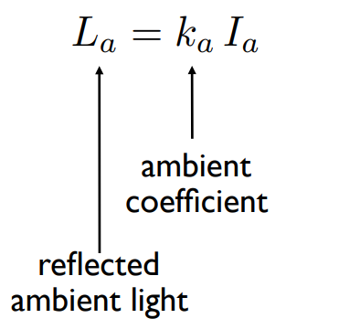
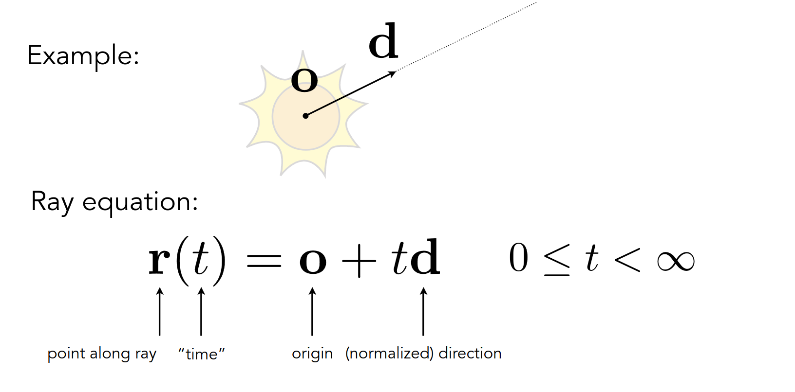

# Lecture4

## 4.1 3D transformation

与2D的变换相同，旋转+平移+缩放

3D transformation组合起来构成了**Model transformation**

Model transformation的顺序一般是**缩放---旋转---平移**的顺序进行。

## 4.2 Viewing transformation

**MVP变换**


- **Model transformation**
- **View transformation**
- **Projection transformation**

MVP变换涉及到图形学中的几个空间之间的变换：

- **Local space**
- **World space**
- **View space**
- **Clip space**
- **Screen space**


实际上更加复杂，**后面**会提到下面的一些空间


### 4.2.1 View/Camera transformation

View transformation负责World space到View space之间的转换

由于摄像机的变换是在世界空间中先旋转后平移得到的，所以需要**先反向进行平移变换，再反向进行旋转变换**。
$$
M_{view} = R_{view}T_{view}
$$


### 4.2.2 Projection transformation

#### 4.2.2.1 Orthographic projection

相当于相机处于无限远的位置上，将一个[l, r]x[b, t]x[f, n]的一个长方体映射到一个[-1, 1]^3立方体中（称为canonical cube），先平移再缩放
$$
M_{orth} = M_{scale}M_{trans}
$$


即先平移到原点，然后缩放

#### 4.2.2.2 Perspective projection

实现近大远小的效果

**Frustum**与**Cuboid**

perspective projection的过程就是

1. 先把Frustum挤压成一个Cuboid
   $$
   M_{presp->ortho}
   $$
   对于近平面**n**，挤压过程中其xyz均不变；对于远平面**f**，其z不变，但是xy会变（中心点xyz均不变）。

   但是对于除了近平面和远平面中的其它点，其z是会改变的，并且会边远，即z的值变小。

2. 然后再正交投影
   $$
   M_{persp} = M_{ortho}M_{persp->ortho}
   $$


最终的变换矩阵为


最终的透视投影变换矩阵为


而OpenGL中的透视投影矩阵为


# Lecture5

如何定义一个视锥Frustum：

- field of view（fovY）垂直可视角

  ```
  广角镜头的fovY更大，因此能够拍摄近处的物体；而fovY小的镜头，能够拍摄远处的物体（因为fovY小，更加近似于正交投影）
  ```

- aspect ratio 宽高比

- 近平面z轴坐标n


做完Projection transformation后（不论是正交还是透视投影），最后场景都会处于一个[-1, 1]^3的立方体中（Canonical Cube），之后就需要将这个cube绘制到2D**屏幕**上，称为Rasterization光栅化。

**而屏幕是一个典型的光栅成像设备。**

**屏幕分辨率**：

- 1280 * 720 720p

- 1920 * 1080 1080p
- 2560x1440 2K
- 4096x2160 4K


## 5.1 Canonical Cube to Screen

视口变换Viewport transform


对于Canonical Cube做了一次拉伸，并且忽略z轴的坐标，变换到屏幕空间


但有的情况下，屏幕空间的原点在左上角，y轴朝下，这个时候的Viewoport transform如下


而对于OpenGL来说，OpenGL的视口变换通过两个函数指定

```c++
void glViewport(	GLint x,
 	GLint y,
 	GLsizei width,
 	GLsizei height);
```

```c++
void glDepthRangef(	GLclampf nearVal,
 	GLclampf farVal);
```

其中(x, y)表示窗口的左下角坐标，nearVal和farVal表示远近剪裁平面到屏幕坐标的映射关系。

即在NDC坐标中，x坐标为-1会被映射到x；x坐标为1会被映射到x + width；z坐标为-1会被映射到nearVal；z坐标为1会被映射到farVal。

所以OpenGL中的视口变换矩阵形式如下


这也是对应上了作业2中的视口变换代码

```c++
//Viewport transformation
for (auto & vert : v)
{
    vert.x() = 0.5*width*(vert.x()+1.0);
    vert.y() = 0.5*height*(vert.y()+1.0);
    vert.z() = vert.z() * f1 + f2;
}
```

## 5.2 Different Raster Display

- CRT阴极射线管

  **隔行扫描技术**用以加速在屏幕上的绘制，但是会带来严重的画面撕裂。

- 现在的显示设备：**Frame Buffer**

  显示的图像是内存中的一块区域。

  - LCD
  - LED
  - Electrophoretic Display墨水屏

## 5.3 

三角形作为primitives有独特的优势。PPT

判断像素中心是否在三角形内部：**向量叉积**

**bounding box**


## 5.4 Rasterization On Real Displays

Bayer pattern

加色系统与减色系统


# Lecture6

采样带来的问题**Artifacts**：Jaggies(锯齿)，Moire Patterns(摩尔纹)，Wagon Wheel Illusion。

前两者是空间上采样带来的问题，而后者是时间上采样带来的问题。**都是因为采样（不论时间上还是空间上）的频率达不到信号变化的频率（不论时间上还是空间上的频率）。**


**Antialiasing**的有效方法：Blurring，模糊后再采样

Antialiasing背后的原理：看**数字图像处理**与**信号与系统**

- 提高采样频率
- 滤波（模糊）


而对于光栅化来说，采用的滤波器的大小为1pixel，对于一个pixel内求平均实现滤波。


实际中的操作**MSAA(Multisample Antialiasing)**，只能**近似**上面的效果。

MSAA操作只是进行了模糊，并没有实际提高分辨率。


而实际应用中的Antialiasing中，由于**复用**的存在，MSAA带来的cost并不与采样数成线性关系。

除了MSAA抗锯齿方法，还有：

- **FXAA**
- **TAA**
- **Super Resolution超分**
- **DLSS**


# Lecture7 Shading

场景中有多个三角形中，如何处理遮挡关系

## 7.1 Painter's Algorithm

但**Painter's Algorithm**存在一些问题。

## 7.2 Z-Buffer

光栅化时，会存储两张图在两个buffer中：

- **frame buffer**
- **depth buffer**

## 7.3 Shading

```
The process of applying a material to an object
```

### 7.3.1 Blinn-Phong Reflectance Model

三种类型的效果

- **Specular highlights**
- **Diffuse reflection**
- **Ambient lighting**


**Shading is Local**，shading并不会带来阴影效果。


#### 7.3.1.1 Diffuse Reflection

**Lambert's cosine law**


**Lambertian(Diffuse) Shading**


由于是漫反射，因此不论从哪一个角度看，结果都是一样，最后的结果因此与观察方向**v**无关。

#### 7.3.1.2 Specular Term

这一项与观察角度**v**是有关的。


- **p**用于控制高光的范围

  

  

- **k-s**镜面反射系数，越大高光越亮

- **h**半程向量


#### 7.3.1.3 Ambient Term

假设每一个点接收到的环境光永远是一个常数




#### 7.3.1.4 Blinn-Phong Reflection Model


## 7.4 Shading Frequencies

Shading Frequencies有三种程度：

- **Flat Shading **对每一个三角形着色
- **Gouraud Shading** 对每一个顶点着色，三角形内部差值
- **Phong Shading** 对每一个像素着色，三角形内部的每一个像素插值出法线方向，然后shading


**如何确定一个顶点的法线方向**

周围三角形法线的加权平均


## 7.5 Graphics Pipeline

关于Graphics Pipeline，[这里](../图形学#Graphic Pipeline)有更详细的介绍

**Shader**用于控制如何着色。


shader可以细分为：**vertex shader**和**fragment shader**

而shading可以发生在**Vertex Processing(Vertex Shading)**和**Fragment Processing(fragment shading)**两个阶段中。

**GLSL**


**GPGPU**


# Lecture9 Texture

**如何定义物体表面不同点的属性**

3D表面每一个点都在2D image上有一个对应的坐标，这个2D image就叫做**texture**，这种映射关系就是纹理映射（Texture mapping）。

**Texture Coordinates**：

- 通过uv两个坐标轴表示
- u，v的范围都是[0, 1]
- 纹理上的值实际上就是Blinn-Phong中diffuse term中的k-d

**Tilable texture**为了解决纹理复用的问题


## 9.1 Barycentric Coordinates重心坐标

知道了三个顶点在纹理上的坐标以及属性，对于三角形内部的点则需要通过插值得到相应的属性，实现平滑过渡。


但重心坐标存在一些问题，**重心坐标没有投影不变性**，即投影到平面后的重心坐标会改变，因此三维空间属性只能在三维空间插值。


## 9.2 Applying Textures


### 9.2.1 Texture Magnification

纹理分辨率 < 图片分辨率

a pixel on a texture **texel**


**Bilinear Interpolation**和**Bicubic Interpolation**


纹理分辨率 > 图片分辨率，问题会更加严重，会引入artifacts。

图片上一个像素覆盖的纹理的区域大小是不同的。

Antialiasing：**Supersampling**

**Point Query与Range Query**


### 9.2.2 Mipmap

**Mipmap**：

- 只能做正方形的范围查询
- 只是近似


**Trilinear interpolation**


但像素映射到纹理上的区域不一定是一个规律的形状，可以是矩形，也可以是其他不规律的形状，如果仅仅采用一个正方形区域的话，就会出现**overblurring**：

- **Anisotropic Filtering** 生成ripmap，用以处理矩形
- **EWA Filtering**


### 9.2.3 Applications of Textures

纹理可以表示的东西有很多：

- 漫反射颜色
- 环境光
- 凹凸贴图


#### 9.2.3.1 Environment Map


球面展开为2D图像会存在失真（distortion）。

解决失真的方法：**Cube Map**


#### 9.2.3.2 Bump/Normal Mapping

```
Adding surface detail without adding more triangles
```

通过凹凸贴图：

- 改变了表面的法线方向
- 改变了表面每一个点的高度

#### 9.2.3.3 Displacement Mapping

Bump Mapping由于不改变几何，因此在物体的边缘会露馅。


#### 9.2.3.4 3D Texture and Volume Rendering

Perlin Noise

#### 9.2.3.5 Ambient Occlusion纹理表示遮挡

**Ambient Occlusion(AO)贴图**

# Lecture10 Geometry

两种几何：

- **Implicit Geometry**

  - 难以通过一个隐函数判断几何的形状
  - 容易判断点是在几何体内还是几何体外

- **Explicit Geometry**

  与Implicit Geometry的特点正好相反

  - 参数映射方式的Expilicit Geometry
  - Triangle


## 10.1 Implicit Geometry

### 10.1.1 Algebraic Surface

对于复杂的几何形体，很难找到一个隐函数表示。


### 10.1.2 Constructive Solid Geometry(CSG)


### 10.1.3 Distance Functions

SDF

Level Set Method

### 10.1.4 Fractal分形


Implicit Function的优点Pros：

- compact description (e.g., a function) 
-  certain queries easy (inside object, distance to surface)
- good for ray-to-surface intersection (more later)
- for simple shapes, exact description / no sampling error
- easy to handle changes in topology (e.g., fluid) 

Cons：

- difficult to model complex shapes


# Lecture11 Geometry: Curves and Surface

## 11.1 Explicit Geometry

### 11.1.1 Point Cloud

### 11.1.2 Polygon Mesh

**Wavefront Object File(.obj)**格式存储Mesh，将顶点，法线，纹理坐标以及连接关系以文本形式存储。

关于Wavefront Object File更详细的介绍[看这里]()


## 11.2 Bezier Curves

Bezier Curves通过控制点定义曲线


### 11.2.1 de Casteljau Algorithm


### 11.2.2 Bezier Curves Algebraic Formula

给出n+1个控制点，定义一条Bezier Curve如下


即Bezier曲线上的点，是以Bernstein多项式为系数的n个点的线性组合。

**3D的曲线也是同理，也可以采用上面的公式。**

### 11.2.3 Properties of Bezier Curves

- Bezier Curve一定过
- Bezier Curve的两端的切线
- Bezier Curve的affine transformation可以通过对控制点的affine transformation得到
- Convex hull property Bezier Curve一定在控制点所形成的凸包之内


### 11.2.4 Piecewise  Bezier Curves

HIgh-Order Bezier Curves(高阶贝赛尔曲线)比较难以通过控制点控制，因此采用Piecewise的方法逐段定义。


保证拼接起来的Bezier Curve是光滑的，需要切线共线并且大小相同。

连续性有不同的要求：

- C0连续
- C1连续
- C2连续


## 11.3 Spline


### 11.3.1 B-Spline(Basis splines)

对Bezier曲线的一个拓展，表达能力更强，具有局部性。

通过基函数


### 11.3.2 NURBS


## 11.3 Bezier Surface

同阶Bezier Surface的控制点数量是同阶Bezier Curves的平方，相当于在两个方向上应用Bezier Curves。


### 11.3.1 Evaluating Bezier Surface


Bezier Curves和Bezier Surface都是显示表示，通过参数映射的方式。


# Lecture12 Geometry3

## 12.1 Mesh

### 12.1.1 Mesh subdivision

细分涉及到两步骤，拆分以及调整位置。

#### 12.1.1.1 Loop Subdivision

只能用于三角形面

#### 12.1.1.2 Catmull-Clark Subdivision

可以用以任意的面

Catmull-Clark前有多少个非四边形面，细分之后非四边形面都会变为奇异点，并且不再会有非四边形面，奇异点也不再会更新。

### 12.1.2 Mesh simplification

相比于二维的层次结构（比如Mipmap），几何的层次结构更加复杂（目前仍在努力的方向）。

#### 12.1.2.1 Collapsing An Edge

**Quadric Error Metrics**

通过优先队列（堆），以及贪心算法（局部最优）。


### 12.1.3 Mesh regularization


## 12.2 Shadow

一切涉及到全局问题，都是光栅化无法处理的。

Shading只是一种局部处理，无法解决阴影的问题。

**Shadow mapping**用于光栅化中产生阴影效果，但是只能处理点光源。


核心思想

```
the points NOT in shadow must be seen both by the light and by the camera
```


硬阴影和软阴影：

- **硬阴影**：点要么在阴影内，要么在阴影外
- **软阴影**：光源有一定大小，本影与半影


Shadow mapping：

1. 首先在点光源处做光栅化，记录场景的深度。
2. 然后从摄像机的位置


浮点数带来的精度问题。

shadow map的分辨率问题。


# Lecture13 Ray Tracing

光栅化着色时，只考虑光线反射一次，无法处理光线反射多次。因此光栅化只是一种近似，质量相对较低。

Rasterization：Real-time

Ray Tracing：offline


关于光线：

- 直线传播
- 不会碰撞
- 光路可逆


## 13.1 Ray casting

采用pinhole camera model。

camera/eye/primary rays

shadow rays


## 13.2 Recursive(Whitted-Style) Ray Tracing


## 13.3 Ray-Surface Intersection


### 13.3.1 光线与Implicit Surface求交

定义一条光线：




回顾之前对于implicit surface的介绍，implicit surface通过隐函数，定义
$$
f(p) = 0
$$
将光线代入，解方程即可得到交点
$$
f(o + td) = 0
$$


### 13.3.2 光线与Explicit Surface求交

光线与explicit surface(mesh)求交，但是显然开销非常大，后续有一些优化手段。


定义一个平面：法线与平面上任意一个点，给定平面的法线**N**以及平面上的一个点**p'**，平面就可以表示为
$$
(\bold{p} - \bold{p'}) \cdot \bold{N} = 0 \\
ax + by + cz + d = 0
$$


### 13.3.3 Möller Trumbore Algorithm

快速判断光线与mesh求交，通过重心坐标来判断。


只要满足
$$
t > 0 \\
b_1 > 0 \\
b_2 > 0
$$
则光线与三角形的交点在三角形内部。


## 13.4 Accelerating Ray-Surface Intersection

### 13.4.1 Bounding Volumes包围盒


#### 13.4.1.3 Axis-Aligned Bounding Box(AABB)


#### 13.4.1.2 Ray Intersection with Axis-Aligned Box

Key ideas：

- das
- sda


# Lecture14/Lecture15


## 14.1 Using AABBs to accelerate ray tracing


### 14.1.1 Uniform Spatial Partitions(Grids)

1. 首先找到bounding box
2. 然后创建出grid，找到那些grid中的哪些盒子中有物体（因此光线与物体相交必须同时满足光线与盒子相交以及光线与盒子内的物体相交）
3. **bresenham算法**


如何选择grid与cell的大小，cell不能太稀疏也不能太密集


但是对于空间中存在大规模的空区域的情况，Uniform Grids的表现就不是特别好。

### 14.1.2 Spatial Partitions

不均匀的划分

- **Oct-Tree**
- **KD-Tree**
- **BSP-Tree**


加速结构的构造是在光线追踪之前，先建立好加速结构。


#### 14.1.2.3 Traversing a KD-Tree


#### 14.1.2.4 KD-Tree存在的一些问题以及如何解决

- KD-Tree建立起来非常困难，需要考虑三角形与盒子的求交
- 一个物体可能存在多个叶子节点中


### 14.1.3 Bounding Volume Hierarchy(BVH)


## 14.2 Radiometry(辐射度量学)

**精确定义光以及光线如何与物体表面作用。**

辐射度量学中的一些概念：**radiant flux，intensity，irradiance，radiance**


### 14.2.1 Radiant Energy and Flux(Power)

**Radiant energy**能量，单位Joule。
$$
Q[J = Joule]
$$
**Radiant flux(power)**是单位时间的能量，也就是功率，单位为Watt或者lumen(流明)，等价于灯泡亮度。
$$
\phi = \frac{dQ}{dt}[W = Watt][lm=lumen]
$$
**Radiant Intensity**每一个**单位立体角**的power。
$$
I(w) = \frac{d\phi}{dw}[\frac{W}{sr}][\frac{lm}{sr}=cd=candela]
$$
单位立体角的计算与弧度类似


$$
\Omega = \frac{A}{r^2}
$$


Intensity的物理意义代表从任意一个方向上的power(亮度)，因此所有方向上的Intensity积分起来就是flux(power)。


**Irradiance**单位面积上的power
$$
E(x) = \frac{d\phi(x)}{dA}[\frac{W}{m^2}][\frac{lm}{m^2}=lux]
$$
这个**面必须与光线垂直**，否则需要投影到垂直方向上。


**Radiance**描述光线的属性，单位立体角单位面积上的power


Radiance也可以是：

- Irradiance per solid angle从某一个方向接收的power

  

- Intensity per projected unit area朝向某一个方向辐射的power

  

即加上了方向性。


上面三个物理量分别用来描述不同情况下的光照


## 14.3 Bidirectional Reflectance Distribution Function(BRDF)


## 14.4 The Reflection Equation


所有方向的入射光线的radiance反射到某一个方向上光线的radiance。


## 14.5 The Rendering Equation


自发光项+反射项
$$
L=E+KE+K^2E+K^3E+...
$$


Global illumation：直接光照+间接光照(n次)


# Lecture16


## 16.1 Monte Carlo Integration


## 16.2 Path Tracing

对于Whitted-Style Ray Tracing的改进，对于Whitted-Style Ray Tracing，存在以下缺陷：

- 当光线打到漫反射面时，就停止弹射
- 当光线打到镜面反射面时，都进行镜面反射或者折射


**求解渲染方程，最终就是要求radiance**，需要用到Monte Carlo Integration。


**假设只考虑直接光照**


通过蒙特卡洛积分，

而N != 1的时候，就叫做**Distributed Ray Tracing**。


## 16.3 Path Tracing with Russian Roulette(RR)


对于每一条path，都有1-P_RR的概率停下来，因此这个算法总有一刻会停止。


## 16.4 Sampling the Light


**还需要加上处理遮挡的部分**


## 16.5 回到Ray Tracing


过去Ray Tracing单指：

- Whitted-style rat tracubf


现在Ray Tracing泛指一切光线传播方法的集合：

- (Unidirectional & Bidirectional)Path Tracing
- Photon mapping
- Metropolis light transport
- VCM/UPBP


渲染出一张图片：

- Rasterization
- Ray Tracing


## 16.6 一些其他方面

- Sampling any function
- importance sampling in Monte Carlo integration
- low discrepancy sequences
- multiple importance sampling
- pixel reconstruction filter
- gamma correction，curves，color space


# Lecture17 Matrerial an Appearances

 


# Lecture19 Cameras，Lens and Light Field


相机模型：

- pinhole camera


相机的组成：

- **shutter**
- **cmos**：记录irradiance


## 19.2 Pinhole Camera

Pinhole Camera拍出的照片没有深度（没有景深效果），没有虚化现象，都是锐利的。

棱镜的存在导致**虚化**现象。


## 19.3 Field of View(FOV)

与传感器大小以及焦距有关

35mm格式的胶片为基准定义视场（传感器大小固定），通过不同的焦距定义视场。

但对于手机上的focal length参数是等价到35mm胶片后得到的focal length，并不是真实的focal length。

视场越窄，看到的越远。


**sensor与film**


## 19.4 Exposure

Exposure = exposure time * irradiance

相机拍照像素上存储的是irradiance。

Exposure time由shutter控制

Irradiance由aperture，focal length控制


Aperture size

Shutter speed

ISO gain 相当于后期处理


### 19.4.1 ISO

线性放大信号，乘上一个倍率以放大信号提升亮度   ，但同时也会放大噪声。


### 19.4.2 F-Number(F-Stop)

写作**FN**或者**F/N.N**，F-Number = 焦距/光圈直径

### 19.4.3 Shutter

快门的打开有一个过程。


**Motion blur**

快门时间如果过长，对于一个运动的物体，就会记录其在快门打开时间内每一个时刻的图像，叠加在一起造成模糊

快门时间短，对于运动的物体就能够记录其清晰图像，但相应的曝光时间变短，亮度也会减弱，因此相应的也需要通过增大光圈来弥补(但是增大光圈有会带来景深)。


**Rolling shuter**

高速运动的物体，一张照片上的不同的位置其实是由不同时刻拍摄的。


**High-Speed Photography**

**Long-Exposure Photography**


## 19.5 The Lens

一些有关Lens的特性：

- **真实情况下棱镜不是理想的，会带来畸变Aberrations**
- 现代相机通过棱镜祖实现可变焦
- 平行光过焦点，过焦点的光会变为平行光


### 19.5.1 The Lens Equation


$$
z_o物距\\
z_i象距\\
$$
通过上面的等式，能够解决许多现象


### 19.5.2 Circle of Confusion(CoC)

一个点经过透镜变成了一个圆圈


从上的式子可以发现光圈增大，CoC也会相应增大因此模糊就更严重。


### 19.5.3 Ray Tracing Ideal Thin Lenses


##  19.6 Depth of Field

大小光圈影响的是模糊的范围，还是有的区域可以清晰显示，就叫做景深。


## 19.7 Light Field/Lumigraph

**Plenoptic Function全光函数**


而光场实际上只是全光函数的一个子集，只有位置与方向。

光场采用两个变量表示物体表面上的位置（可以参考纹理映射），两个变量表示方向的一个四维函数
$$
P(\theta,\phi,u_x,u_y)
$$
另一种光场的参数化过程是采用双平面描述

将物体放置在一个包围盒中，只需要在包围盒的平面上记录通过的光线信息，就能够等价地描述物体，这样就不需要关心这个物体的几何
$$
P(u,v,s,t)
$$


### 19.7.1 Light Field Camera

将原本成像平面的像素替换为一个透镜，透镜用来分光，从而记录radiance

先拍照后调焦


# Lecture20 Color


## 20.1 Biological Basis of Color

颜色只是人眼睛的一种感知，而不是光的一种性质。

而人眼看到的并不是各个波长的光，而是各个波长的光积分之后得到的三个数字S，M，L。


## 20.2 Metamerism(同色异谱)

两种光线可能构成的光谱不同，但是最后显示的颜色(S，M，L)是相同的。

**Color matching**就是利用同色异谱，调和不同波长的光，得到最后相同的颜色。


## 20.3  Color Matching


## 20.4 Standard Color Spaces

