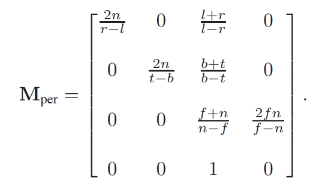
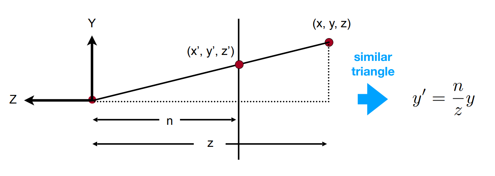
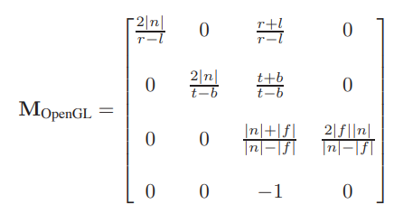
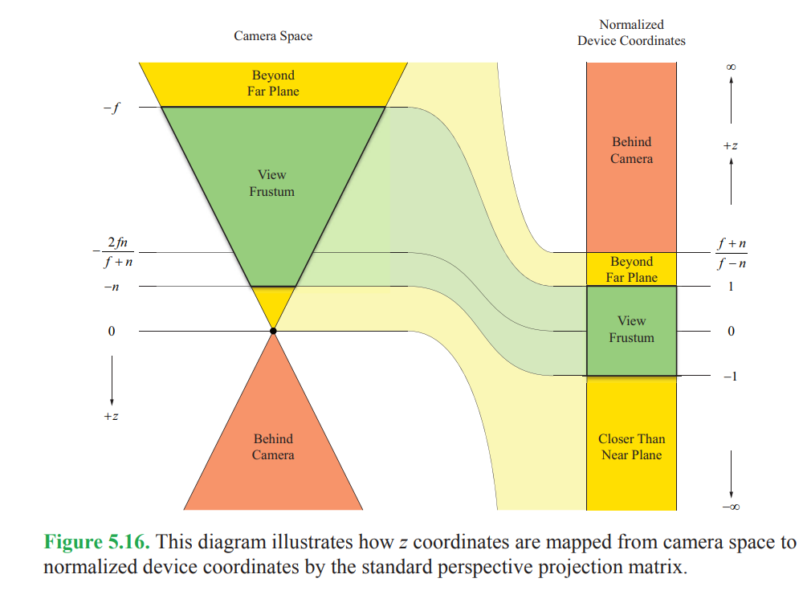
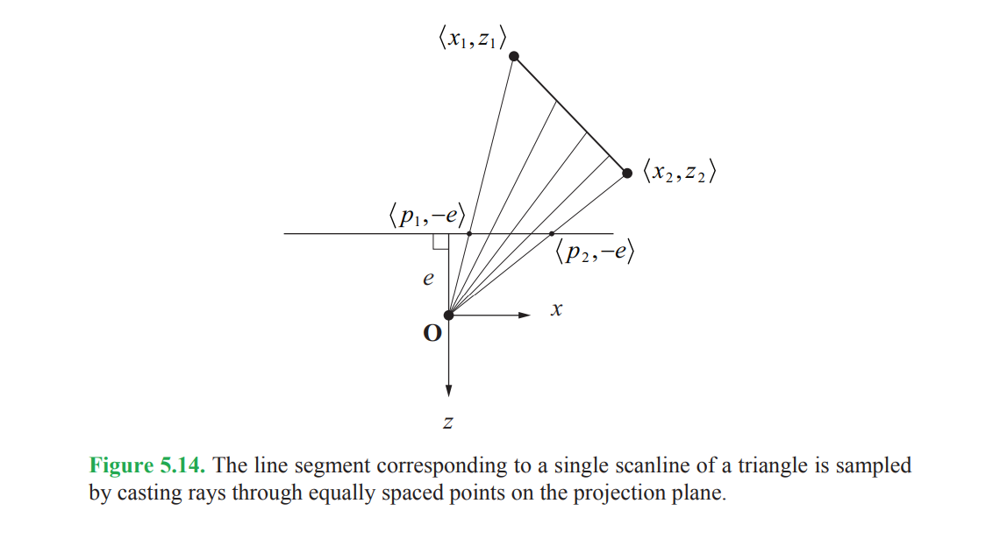
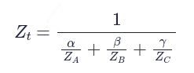
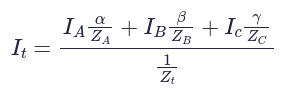
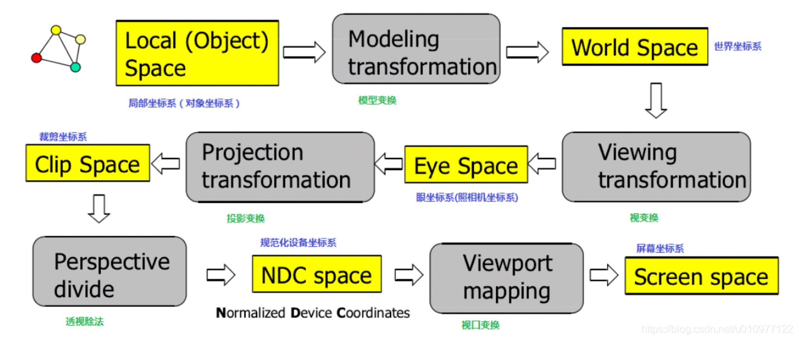
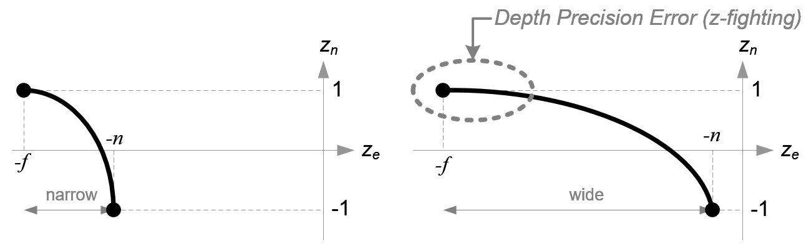

# Assignment0

这里对于Eigen这一各库做一个简单介绍

# Assignment1


# Assignment2

这里碰到了一个非常奇怪的问题，在Assignment2的`rasterizer.cpp`文件中，开头有以下几行

```c++
#include <algorithm>
#include <eigen3/Eigen/src/Core/Matrix.h>
#include <vector>
#include "rasterizer.hpp"
#include <opencv2/opencv.hpp>
#include <math.h>
```

但是如果不把第二行注释掉的话，所有`Vector3f`的定义都会变为`typedef int Vector3f`


## 2.1 透视投影

**齐次坐标处于透视空间中，而欧式空间只是透视空间的一个子集**


参考[《GAMES101》作业框架问题详解](https://zhuanlan.zhihu.com/p/509902950)

作业1，2，3中可能会出现图像颠倒的现象，问题处在透视投影矩阵上。

课堂上的透视投影矩阵



其条件是摄像头处于原点，并且朝向z的负半轴方向观察，如下图所示



因此n和f的值都是负值。


但是作业框架中，n和f的值都是正的，并且n越小表面离摄像头越近（即这里的n和f表示离摄像头的距离），这与OpenGL中的设定相同，因此此时的透视投影矩阵如下：



二者不同的原因在与n和f表达的意义不同，课堂上的n和f代表的是z轴的坐标，而OpenGL中的n和f代表的是近平面和远平面离摄像机的距离。




上图是对透视投影的解释：**本质上就是近大远小**


## 2.2 左手系与右手系

OpenGL在object space以及world space中是右手系，但在window space(screem space)是左手系。

**通过透视投影变换，OpenGL将右手系的Camera Space转变为左手系的Clip Space。**


而左手系与右手系的区别只在**NDC坐标系**中能体现出来，即如果采用左手系，那么在NDC空间中，近平面在-1处而远平面在1处；而如果采用右手系，那么近平面在1处远平面在-1处。

```
这个问题其实跟左手系和右手系无关。首先，opengl之所以是“右手坐标系”，是针对模型空间，视图空间来说的，XYZ轴遵循右手坐标系定则;其次，关于NDC(归一化设备空间)空间，其本来意义是，若一个向量经过mvp矩阵转化，并除以第四个分量w后，若它的XYZ分量均处于[-1，+1]之间，那么它属于NDC空间内，进一步说明它是在视椎体内；我想导致NDC左，右手之分的关键在于NDC坐标系的Z分量，这个值代表的是深度值，若没改变参数的情况下，opengl默认在NDC坐标系下，-1是在近裁剪面处，+1是在远裁剪面处，那么想象一下，近处值小，远处值大，Z轴是朝向屏幕里面的，就解释了为什么NDC是左手系的原因。个人觉得没必要追究NDC是左手还是右手，弄清它实际所表达的意义就行了。

作者：马可
链接：https://www.zhihu.com/question/319254559/answer/644880254
来源：知乎
```


## 2.3 Perspective-Correct Interpolation透视矫正插值

参考：

[虎书11.2.4 Perspective Correct Interpolation]()

[Mathematics for 3D Game Programming and Computer Graphics, Third Edition 5.4 Perspective-Correct Interpolation]()

https://www.comp.nus.edu.sg/~lowkl/publications/lowk_persp_interp_techrep.pdf


### 2.3.1 为什么需要透视矫正插值



在二维情况下，在投影平面上的相同步长随着三角形面与相机之间的距离增加而在线段上产生更大的步长，拓展到三维空间中也是一样。因此二维下的线性插值，对应的是三维中的非线性插值。

由[Barycentric Coordinates](./GAMES101#9.1 Barycentric Coordinates重心坐标)这一部分中。我们知道三维空间属性需要在三维空间中线性插值，但是**大多数计算都是使用透视投影后的二维平面内的数据**，因此需要有一种二维空间中的插值方法等价于三维空间中的线性插值，即**透视矫正插值**。


### 2.3.2 透视矫正插值

z-value的透视矫正插值公式如下：



对于其它属性，透视矫正插值公式如下：



其中alpha，beta，gamma是重心坐标，**I**代表插值属性，**Z**代表深度。

注意这里的Z值在


## 2.4 透视除法

首先在[图形管线](../图形学#Graphcs Pipeline)中，透视除法的位置



透视除法用于从**Clip Space**变换到**NDC Space**，这二者容易被混淆，实际上是不同的东西。

**Vertex Shader的输出就是在Clip Space上**，接着由GPU自己做**透视除法**将顶点转到NDC。

**Fragment Shader的输出在Window Space(也叫Screen Space)上**。

```
透视除法的时候，(x,y,z,w) => (x/w, y/w, z/w, w/w)。会发现最后一个分量变成了1没什么意义，所以不如存点有用的数据，对于SV_Position来说，最后一个分量存的就是w，也即View Space的Z。

对于gl_FragCoord来说，存的是1/w。
```


透视除法的意义

## 2.5 Z-Buffer与W-Buffer

Depth-Buffer有两种，**Z-Buffer**与**W-Buffer**


通过观察透视投影矩阵，可以发现变换后的z坐标是非线性的，而变化后的w坐标就是变化前的z坐标，是一个线性变化。

### 2.5.1 Z-Buffer

Z-Buffer保存的是透视投影后的z坐标。

```
投影后物体会产生近大远小的效果，所以距离眼睛比较近的地方，z 坐标的分辨率比较大，而远处的分辨率则比较小
```

这就涉及到**Zflighting**问题。




### 2.5.2 W-Buffer

W-Buffer保存的是透视投影后的w坐标。

```
换到投影空间中之后，其值依然是线性分布的，这样无论远处还是近处的物体，都有相同的深度分辨率
```


### 2.5.3 Z-Buffer与W-Buffer的相互转换


## 2.6 SSAA vs. MSAA


### 2.6.1 MSAA黑边问题


# Assignment3

一些参考：

https://games-cn.org/forums/topic/zuoye3-interpolated_shadingcoords/

比较好的回答

```
首先，你进行了光栅化，然后这个时候你其实是只知道像素坐标x，y的，经过深度插值，你得到了screen space中对应的某点的坐标（x，y，z）。这个坐标其实也不是真实世界（或者说camera space）里面的点！因为你想projection矩阵本质上是把视锥压缩成了长方体，你算出来的这个坐标是经历了压缩之后的。
那么怎么才能知道camera space中像素对应过去的那个点呢？当然是插值！也就是利用alpha，beta，gamma结合rasterize_triangle传进来的参数viewspace_pos插值出来一个空间中的点。
好了，我们得到了这个所谓的interpolated_shadingcoords，这个点有什么意义呢？这个点其实就是camera space中你真正在着色的那个点！这个点是你插值出来的，所以起了这么个名字。
这个点知道了有什么用？你想想Bling Phong反射模型是不是需要一个叫r的参数，也就是着色点到光源的距离？我们需要拿光源位置和这个着色点来计算出r，同时得到一个light ray的单位向量（也就是那个所谓的向量l）！
最后一个点：我们的重心坐标明明是在2D空间里做的啊？为什么可以拿来插值3D空间的坐标呢？
答案是不行的！这个alpha，beta，gamma本质上是需要经过矫正才能用的！但是！其实误差不大，我们就直接拿过来用了。详见（https://stackoverflow.com/questions/24441631/how-exactly-does-opengl-do-perspectively-correct-linear-interpolation#:~:text=Perspective%20correct%20interpolation,-So%20let’s%20say&text=First%20we%20calculate%20its%20barycentric,on%20the%202D%20triangle%20projection.）
```


## 3.1 关于bump_fragment_shader以及displacement_fragment_shader


# Assignment4


# Assignment5

此次作业实现的是一个Whitted-style光线追踪，注意**光栅化的渲染管线与Ray-Tracing的渲染管线是完全不同的两套，因此并没有光栅化中的各种变换与空间坐标系等概念**。


进行光线追踪第一部就是投射光线，参考[这里](https://www.scratchapixel.com/lessons/3d-basic-rendering/ray-tracing-generating-camera-rays/generating-camera-rays.html)

