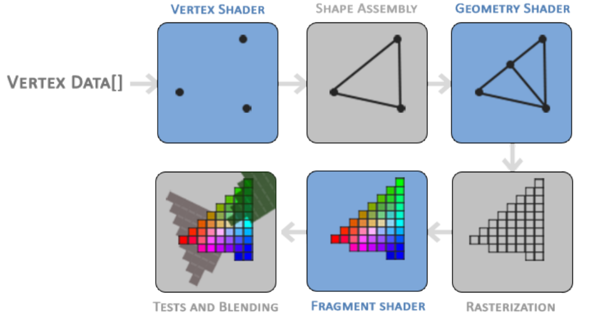

# OpenGL

# 1. Introduction

这一部分没什么内容


# 2. OpenGL

大多数说法都会认为OpenGL是一个API，但实际上，OpenGL仅仅是一个标准。

OpenGL标准定义了函数的输入以及输出，然后由developer实现这一套标准，不同OpenGL的实现方式也不同。

OpenGL library的实现一般来说都是graphics card manufacturers，不同的显卡支持不同的OpenGL版本。这时OpenGL是被包含在显卡的driver中的。

## 2.1 Core-profile vs Immediate mode

OpenGL有两种模式**immediate mode(也叫做fixed function pipeline)**和**core-profile mode**。

**Immediate mode**：OpenGL的大部分功能都被库函数隐藏，用户的控制权较少，虽然使用简单，但是效率低。

**Core-profile mode**：移除了OpenGL中过时的函数，灵活并且高效，但是复杂，更有利于真正理解graphics programming

## 2.2 Extensions

OpenGL的一大特性就是其支持拓展。

```
Whenever a graphics company comes up with a new technique or a new large optimization for rendering this is often found in an extension implemented in the drivers. 
```


## 2.3 State machine

OpenGL就是一个状态机，OpenGL的状态也被叫做**OpenGL context**，OpenGL通过下面两种类型的函数来实现这个状态机：

- **state-changing functions**

- **state-using functions**


## 2.4 Objects

OpenGL中object就是一系列选项的集合，用以表示当前OpenGL状态的一个子集（实际上就是一个结构体）。

```
// The State of OpenGL
struct OpenGL_Context {
	...
	object_name* object_Window_Target;
	...
};
```

```c
// create object
unsigned int objectId = 0;
glGenObject(1, &objectId);
// bind/assign object to context
glBindObject(GL_WINDOW_TARGET, objectId);
// set options of object currently bound to GL_WINDOW_TARGET
glSetObjectOption(GL_WINDOW_TARGET, GL_OPTION_WINDOW_WIDTH, 800);
glSetObjectOption(GL_WINDOW_TARGET, GL_OPTION_WINDOW_HEIGHT, 600);
// set context target back to default
glBindObject(GL_WINDOW_TARGET, 0);
```

上面的代码就是OpenGL的通用的workflow：

- 首先创建一个object，通过一个int类型的objectId作为这个object的索引（之后这个objectId就代表这个object）
- 将object与context做一个binding
- 设置object中的一些选项options
- 然后解绑unbinding

设置的选项会被保存在objectId指向的object中，一旦这个object重新与一个contex绑定，那么object中的option就会重新生效。


因此可以创建多个object，设置好这些object的选项之后，就可以自由地根据需求选择相应的object进行binding。

## 2.5 Get started

skip

## 2.6 Additional Resources

- www.opengl.org/: official website of OpenGL. 
- www.opengl.org/registry/: hosts the OpenGL specifications and extensions for all OpenGL versions.


# 3. Creating a window

第一步要创建一个OpenGL context和一个application window to draw in。但是，这些操作是与底层的OS有关的，因此需要将这些OS相关的操作抽象成OS无关的。**GLUT，SDL，SFML，GLFW**这些库就是实现前面的目的。

## 3.1 GLFW

wiki官方对GLFW的介绍

```wiki
GLFW (Graphics Library Framework) is a lightweight utility library for use with OpenGL. It provides programmers with the ability to create and manage windows and OpenGL contexts, as well as handle joystick, keyboard and mouse input.
```

使用GLFW的目的

```
GLFW is used in programs that require a window, due to OpenGL not providing any mechanisms for creating the necessary contexts, managing windows, user input, timing, etc.
```

## 3.2 Building GLFW

在linux上不需要像在windows上那么麻烦，这里就跳过

## 3.3 First project

skip，使用visual studio需要这一步

## 3.4 Linking


### 3.4.1 OpenGL library on Windows

在windows系统下，OpenGL库`opengl32.lib`是在安装VS时作为Microsoft SDK默认安装的。

### 3.4.2 OpenGL library on Linux

LInux上需要链接到`libGL.so`，通过`-GL`选项。

**这些库包含在Mesa，Nvidia，AMD dev packages中**，关于Mesa等相关概念，看[这里](../linux折腾日记/*nix.md#Linux-Graphic-Stack)


**在linux环境下，通过GCC编译时需要加上`-lglfw3 -lGL -lX11 -lpthread -lXrandr -lXi -ldl`这些选项。**


## 3.5 GLAD

由于OpenGL只是一个标准，其实现是交给驱动厂商实现的，因此对于不同的OpenGL driver，OpenGL库的位置是不同的。

```
the location of most of its functions is not known at compile-time and needs to be
queried at run-time. It is then the task of the developer to retrieve the location of the functions he/she
needs and store them in function pointers for later use.
```

对于获取函数的位置，在Windows下的操作如下

```c++
// define the function’s prototype
typedef void (*GL_GENBUFFERS) (GLsizei, GLuint*); //创建了一个函数指针，void代表没有返回值，GL_GENBUFFERS是函数指针的名称
// find the function and assign it to a function pointer
GL_GENBUFFERS glGenBuffers = (GL_GENBUFFERS)wglGetProcAddress("glGenBuffers");
// function can now be called as normal
unsigned int buffer;
glGenBuffers(1, &buffer);
```

而GLAD库就是为了解决上面的问题，更多关于GLAD的介绍，看[这里]()。

[stack overflow上的讨论](https://stackoverflow.com/questions/55267854/why-use-glad-library-for-opengl-initialization)

[reddit上的讨论](https://www.reddit.com/r/opengl/comments/it2bu2/do_i_have_to_use_an_extension_loading_library/)


# 4. Hello Window

这一部分没什么，就是一段创建window以及context的代码

```c++
GLFWwindow* window = glfwCreateWindow(800, 600, "LearnOpenGL", NULL, NULL);
if (window == NULL)
{
    std::cout << "Failed to create GLFW window" << std::endl;
    glfwTerminate();
    return -1;
}
glfwMakeContextCurrent(window);
```


## 4.1 GLAD

GLAD用于管理OpenGL的函数指针。


## 4.2 Viewport

在创建的窗口上做渲染之前，还需要告诉OpenGL窗口的大小，OpenGL下的这个窗口叫做**viewport**。

通过`glViewport`函数：

```
glViewport(GLint x, GLint y, GLsizei width, GLsizei height)
```

- 前两个参数设置窗口的左下角的位置
- 后两个参数则是窗口的宽和高


```
这个函数设定的窗口实际上就是经过视口变换后的屏幕空间，所以(-1, 1)这个范围内的坐标会被映射到(0, 800)与(0, 600)之间
```

但是每当window的大小改变时，也需要相应的改变viewport的大小，这一步可以通过**callback回调函数**实现，回调函数的作用有更多，更多详细的介绍，看[这里](../linux折腾日记/*nix.md#Callback-Function)

**Callback**在之后也会被经常用到，一般来说callback function的注册需要在窗口创建之后，渲染开始之前。

## 4.3 Ready your engines

**render loop**

```c++
while(!glfwWindowShouldClose(window))
{
	glfwSwapBuffers(window);
	glfwPollEvents();
}
```

其中`glfwPollEvents()`用于监测时间是否发生，然后调用相应的**callback function**。


这里关于buffer，还涉及到**Double buffer**这个概念：

在绘制输出结果到window上时，并不是立刻就绘制出来的，而是从左到右从上到下一个个像素绘制的，因此就可能出现artifacts（屏幕上显示的可能是正在渲染的图像，还没有渲染完成）。所以windowing application会采用double buffer这种策略。**front buffer**是最终的输出结果，**back buffer**是由于渲染与绘制。当在**back buffer**上的渲染完成之后，就可以通过**swap**将back buffer切换成front buffer，从而消除artifact。更多可以参考，[这里](https://www.bilibili.com/video/BV1FK4y1x7bk/?spm_id_from=333.999.0.0&vd_source=72864fffb0293637e3fc450e7ffec677)


## 4.4 One last thing

这里也没什么


## 4.5 Input

通过`glfwGetKey(GLFWwindow *window, int key)`检测相应的key是否被按下。

```
while (!glfwWindowShouldClose(window))
{
    processInput(window);
    glfwSwapBuffers(window);
    glfwPollEvents();
}
```

每一次render loop的迭代就叫做一**帧frame**。


## 4.6 Rendering

```
glClearColor(0.2f, 0.3f, 0.3f, 1.0f);
glClear(GL_COLOR_BUFFER_BIT);
```

上面的`glClearColor`函数就是前面提到的一种`state-changing`函数，而`glClear`就是前面提到的`state-using`函数。


# 5. Hello Triangle

OpenGL的**graphical pipeline**分为两部分：

- transforms your 3D coordinates into 2D coordinates 
- transforms the 2D coordinates into actual colored pixels


整个graphical pipeline 分为许多步，每一步的输入都是前一步的输出，因此就像CPU中的流水线一样，这些步骤可以并行地执行。graphical cards中有许多个streaming processor，并行地处理graphical pipeline中的每一步，每一个在streaming processor上运行的程序就叫做**shader**。


部分的shader是可以被替换成自己的shader的，而OpenGL中的shader是通过**GLSL(OpenGL Shading Language)**编写的。下图中的蓝色部分是可以被自己的shader替换的。




**fragment**：

```
A fragment in OpenGL is all the data required for OpenGL to render a single pixel.
```

