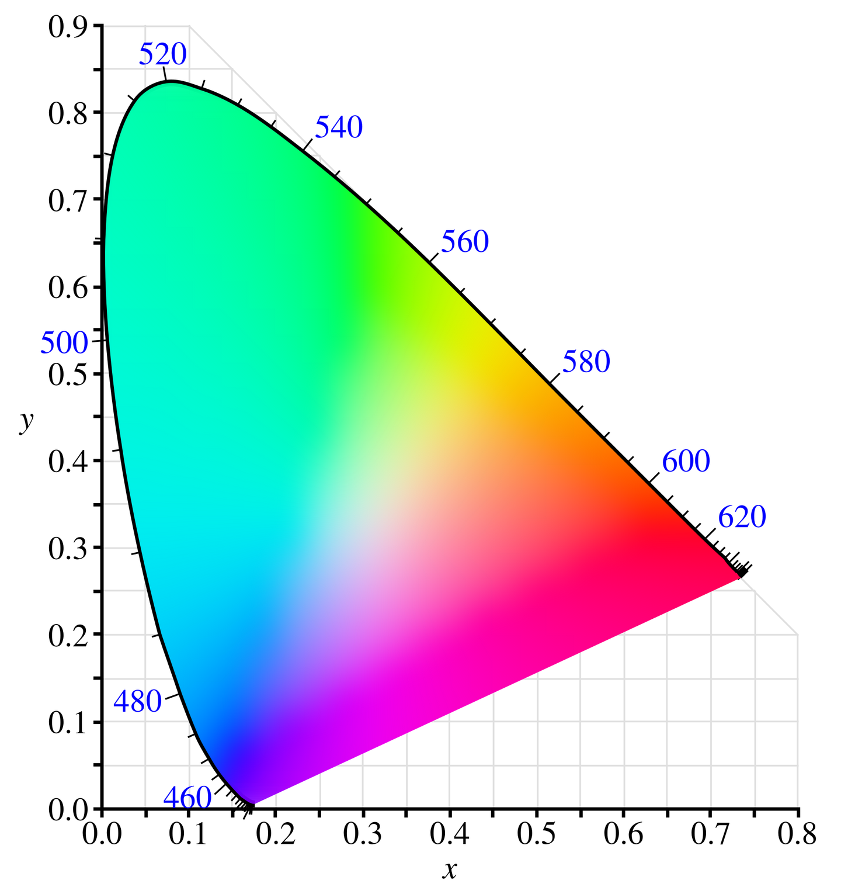
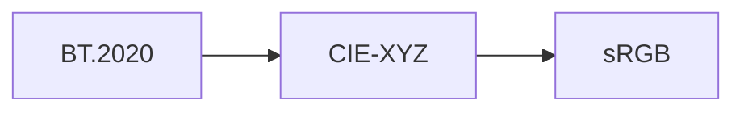

# 计算摄影学

# 1、RAW

# Graphic Pipeline

wiki上的介绍[Graphics pipeline](https://en.wikipedia.org/wiki/Graphics_pipeline)

![There are 11 phases, each enumerated here. Vertex shader and 3D code are the input into animation and transformation. The second phase is the hull shader, tesselation, and the domain shader. The third phase is the geometry shader. The fourth phase is the perspective transformation. The fifth phase is the clipping and backface culling. The 6th phase is triangle rasterization, which outputs texture coordinates. The seventh phase, texture cache, starts separately and takes textures as an input. The seventh phase and the texture coordinates go to the 8th phase, texture filtering. From the 6th phase and the output of the 8th phase, texels, goes to the 9th phase, early Z and pixel shading, which also takes a pixel shader as input. The 10th phase is Z-test, alpha blending, and anti-aliasing. Then the 11th phase is post-processing, which outputs back to back buffer.](assets/1000px-3D-Pipeline.svg.png)

# 色品图与色域

## 1. 色品图

量化颜色---色品图

**CIE国际照明委员会**

当测量出**可见光谱**上所有颜色的三刺激值，可以将这三个分量的数据绘制在一个三维坐标系中，分别表示每一种颜色的R，G，B分量(但是有些数据可能存在负值)。

这个坐标系叫做**CIE-RGB**。

CIE建立了一个新的坐标系，**CIE-XYZ**在这个坐标系中所有的分量都是正数。CIE-XYZ通过CIE-RGB转化而来(通过一个线性代数的坐标变换，乘以一个3x3的矩阵得到)，因此CIE-XYZ上的每一个点在CIE-RGB中都有对应的点。

但是CIE-XYZ上的颜色的亮度值各不相同，需要归一化。

## 2. 色域

因为显示设备无法显示出色品图中的所有颜色，所以不同的显示设备就有一个**色域**，在XYZ坐标系中，一个色域是**新的坐标系**。CIE-XYZ可以被认为是所有色域的超集。

简单的理解为，不同色域，其RGB三个值在色品图中的位置是不同的，所围成的一个三角形所能涵盖的颜色范围也不同，就导致了不同的色域。

而如果要制定一个色域标准，除了R，G，B三个点的位置，还需要指定一个**白点**的位置。

**不同色域之间的转换**，如果直接转换，会存在色彩失真的情况，正确的转换方式(以BT.2020色域与sRGB色域之间的转换为例)是先要转换到CIE-XYZ坐标系下，再转换到sRGB坐标系下(但由于sRGB的色域比BT.2020更小，会存在一些细节的损失)

## 3. 色彩模型color model，色彩空间color space与色域之间的关系

这三者是不同的概念。
