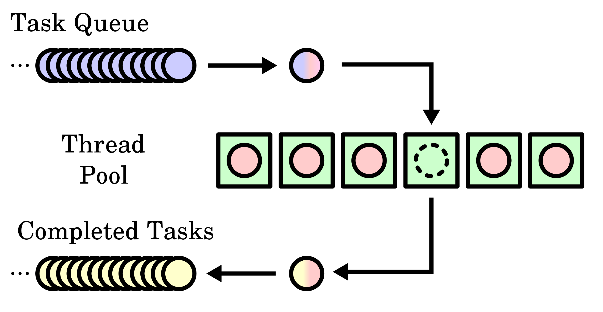

# Introduction to Parallel Computing

这一部分是并行计算相关的一些基础知识。

# 1. 池化技术

有许多池化技术：

- **线程池**
- **内存池**
- **连接池**
- **显存池**
- **......**

这些技术都是通过预先创建好相应的线程，待用户真正发起资源请求是直接从预先创建好的对象池中分配即可，而不需要进行耗时的线程创建。处理完相应的请求，线程又回到睡眠状态，池化技术的优势：

- 降低资源消耗
- 提高相应速度
- 资源集中管理，统一分配管理，减少碎片

## 1.1 线程池

## 1.2 内存池

这一部分涉及到linux的**slab分配器**以及**buddy分配器**。

## 1.3 连接池

## 1.4 显存池

这一部分涉及到Pytorch与TensorFlow等框架的显存管理技术，具体看[这里]()。