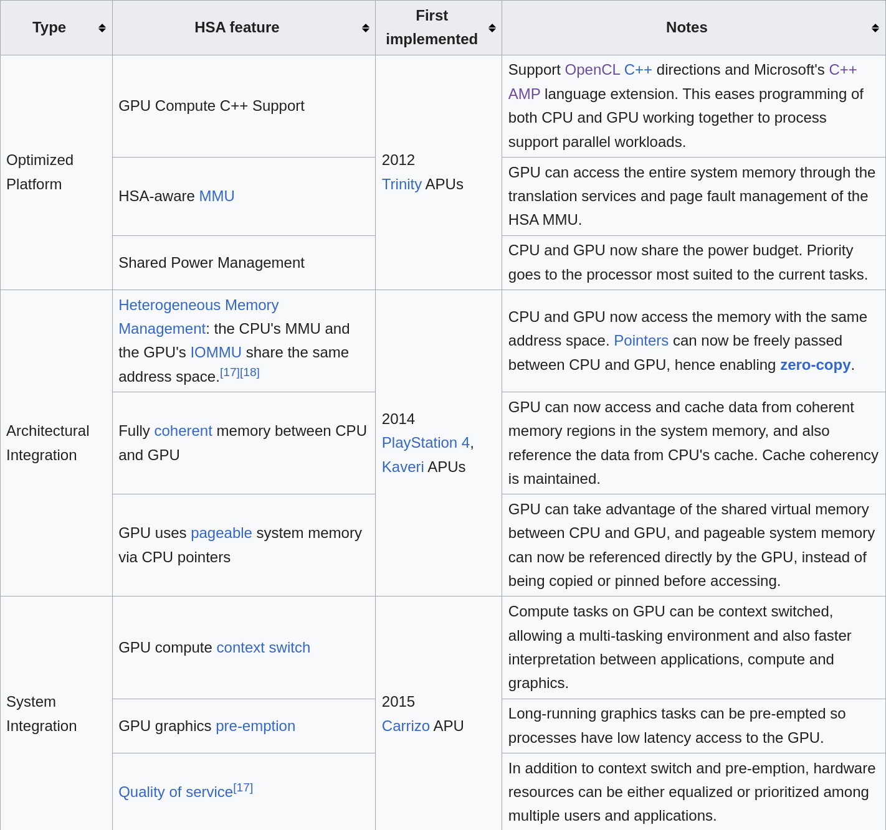
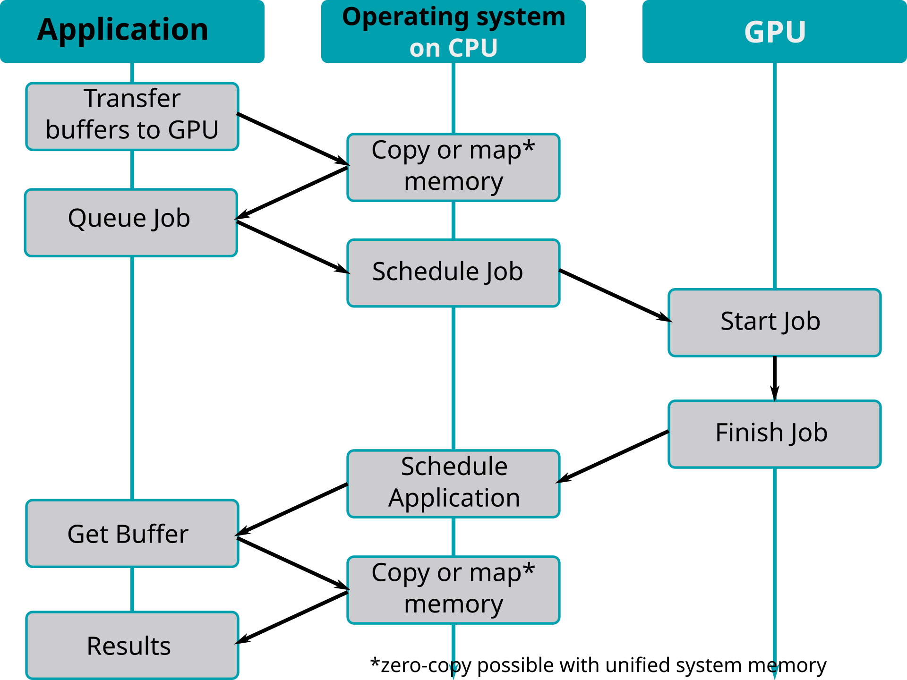
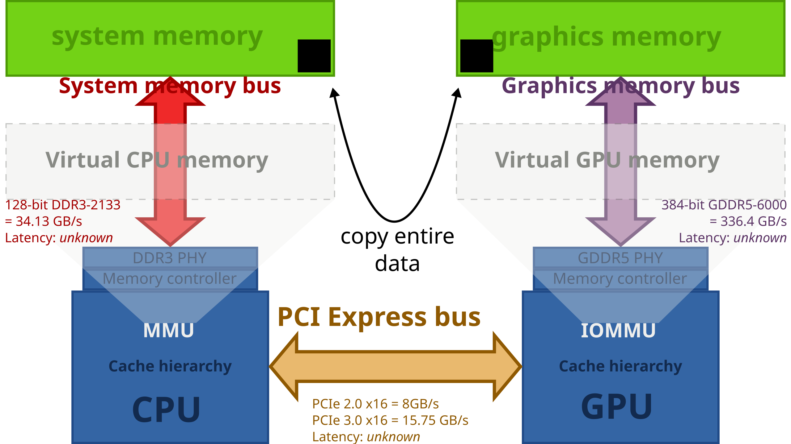
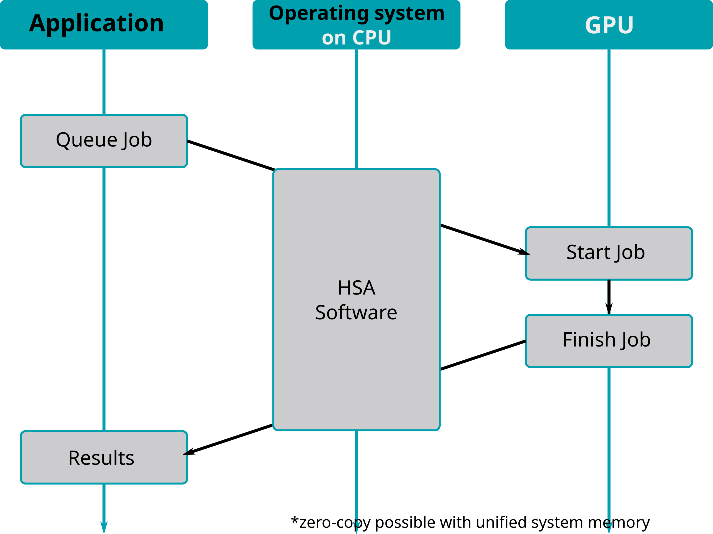
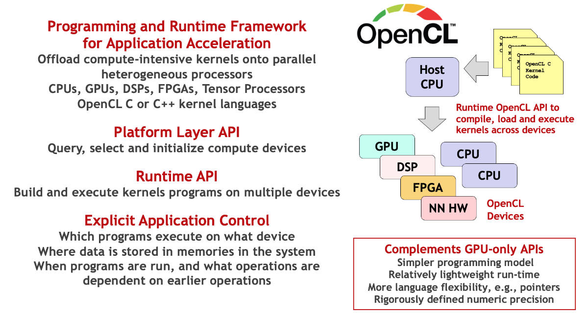
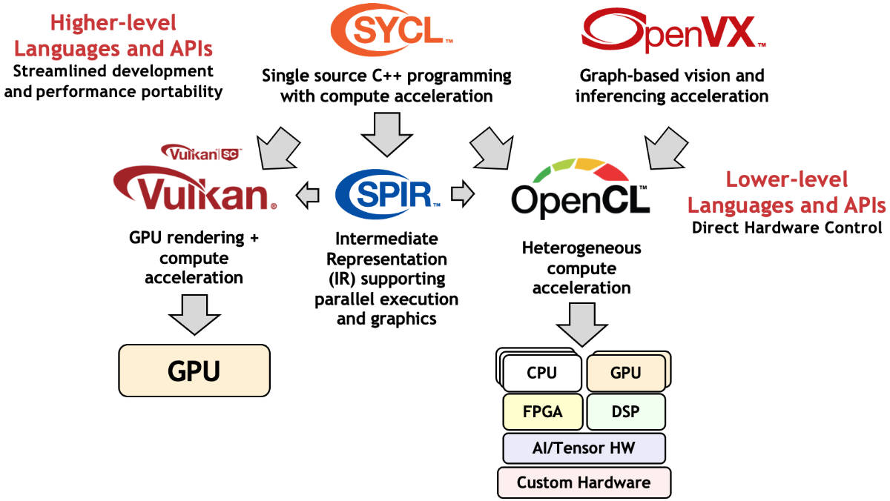

# Introduction to Parallel Computing

这一部分是并行计算相关的一些基础知识。

当我们想通过并行的方法提升程序的性能时，主要是三个方面：

1. Latency 通常以ms为单位
2. Bandwidth 通常以MB/s或者GB/s为单位
3. Throughput 通常以GFLOPS为单位


# Heterogeneous Computing

参考：

1. [Programming Models for Heterogeneous Chips](https://www.slideshare.net/slideshow/programming-models-for-heterogeneous-chips/40911471#2)

在学习CUDA的过程中，学习到了一些异构编程的概念。CUDA是一个异构编程模型(programming model)，但是CUDA不是第一个异构编程模型。但至少目前来看，CUDA是最为成功的异构编程模型。

当我们讨论异构计算与异构编程模型时，同样需要分为两部分讨论：

- 硬件层面：硬件如何为上层应用提供异构架构，这一部分就涉及到一个异构系统(Hetergeneous system)或者异构芯片的构成
- 软件层面：软件如何利用底层异构异构，这一部分就涉及到异构编程模型(Programming models for hetergeneous systems)


异构计算，主要是指使用不同类型指令集和体系架构的计算单元组成系统的计算方式。不同体系结构的计算单元，也就是我们经常听到的各种**'*'PU**，都是不同体系结构不同指令集的计算单元。我们把它们组合在一块构成一个异构系统，共同完成计算。


## Hardware

最早用到异构系统的是超算。许多超算会采用CPU+GPU的异构系统。但是也有选择CPU+[Xeon Phi]()的异构系统。

而对于PC机，或者更准确的说[PC兼容机]()来说，异构计算与异构系统的步伐则要更慢。但最终也是采用CPU+GPU的异构系统。而集显则占据了CPU+GPU异构系统的绝大部分。

但是，在异构系统方面，真正的头号玩家是移动设备(**仅仅代表个人见解**)。移动端的SoC不断各种各样的计算单元(CPU，GPU，DSP，NPU)集成在一块Die上。

Intel，AMD以及Qualcomm都在不断发展自家的异构架构。

### Intel

当问到世界上GPU市场占有率最高的公司，不是NVIDIA，而是Intel。更具体地来说，是Intel的集成显卡。Intel的集成显卡系列([integrated graphics processors](https://en.wikipedia.org/wiki/Integrated_GPU)，IGPs)，统一的名字叫做**Intel Graphics Technology(GT)**。

**Intel HD Graphics**是**Intel Graphics Technology**的第一款产品，于2010年提出。

Intel在Haswell架构中，引入了**Intel HD Graphics**。


除了**Intel HD Graphics系列**之外，还有**Intel Iris Graphics**与**Intel Iris Pro Graphics** IGP系列，于2013提出。


而在Intel的独立显卡方面也有相应的产品。


### AMD

AMD收购ATI之后，在显卡方面得到增强。但是在CPU方面仍然比较薄弱，因此AMD需要将其在GPU方面的优势均衡到CPU上。

为此AMD推出了APU，**Accelerated Processing Unit**(更正式的名字叫做**Fusion**，后面由于版权问题改名叫做HSA，Heterogeneous System Architecture)。

同时为了推广自家的APU(也叫HSA)，AMD与ARM等公司组成了HSA Foundation，意在提供一个软硬件生态(HSA，因此为了和AMD HSA区分，AMD HSA后面以APU称呼，而HSA Foundation的编程模型以HSA称呼)，能够充分发挥异构架构的性能。

AMD将自家APU的发展规划为三个阶段




HSA的目的，是为了减少CPU，GPU以及其它计算单元之间的通信延迟，同时让程序员在这种异构平台上更加容易地编写程序，不在需要显式地控制数据在不同设备内存上的移动。


在其它的一些异构平台编程时(比如使用OpenCL与CUDA)，程序员需要显式地在不同设备之间的内存之间移动数据。

关于Zero-Copy，看[这里]()

在Non-HSA system中，如果程序员想把计算卸载到GPU上(offloading calculations to GPU)，需要经过下面几步




在传统的CPU-GPU异构平台上，CPU与GPU的协作是比较复杂的。由于PCIe协议本身是针对I/O的协议，不带缓存一致性语义。所以一般CPU与GPU之间是通过DMA来传输数据的，而不是Load/Store指令。

后来Intel提出了[IOMMU(**input–output memory management unit**)]()，ARM提出了SMMU。







AMD的HSA与单纯地将CPU与GPU集成到一块Die上不同。

以AMD Kaveri APU为例。


### Qualcomm


### Apple


现代的CPU，ALU计算单元仅占整个核心面积的25%，剩下50%和25%分别用于缓存以及控制器。

而对于GPU来说，ALU计算单元占据了绝大部分Die的面积，而砍掉了控制器中诸如分支预测的等部分从而让出面积容纳更多的计算单元。这也就是为什么GPU不能很好地处理分支与循环。GPU更多的是处理计算。

```
Modern GPUs are very well suited to perform single instruction, multiple data (SIMD) and single instruction, multiple threads (SIMT), while modern CPUs are still being optimized for branching. etc.
```


## Software

但是不论底层的异构架构如何变化，对于一个异构架构来说，真正重要的是一个软件，或者编程模型/框架，能够使得上层应用充分发挥异构架构的性能。


针对不同的异构架构，自然也有不同的编程模型：

- CUDA(NVIDIA GPGPU)
- OpenCL
- Qualcomm Mare
- C++ AMP
- Android Renderscript
- Apple Metal
- AMD HSA


一个好的异构编程框架，既要能够充分发挥异构硬件的性能，又要能够屏蔽底层硬件差异。在这方面，OpenCL做的比较好。OpenCL是一个开放的标准，因此任何厂家都可以在自家的硬件上添加OpenCL的支持。



而像Vulkan等，只能运行在GPU上。



OpenCL由Apple提出，现在由[Khronos Group](https://en.wikipedia.org/wiki/Khronos_Group)维护。Apple提出OpenCL的目的很明显，希望能够在在自家Mac电脑上利用AMD与NVIDIA的GPGPU做通用计算。但是OpenCL真正的受益者是x86平台，苹果的这一举措为未来的x86平台异构计算奠定了坚实的基础。

```
论是CUDA还是FireStream，无论是CUDA核心还是流处理器，软件开发人员都可以通过OpenCL来支持。
```


OpenCL是一个**性能层**的框架，业界有许多产能层的框架采用OpenCL作为后端。


而当我们提到OpenCL时，就又不得不提到由[Khronos Group](https://en.wikipedia.org/wiki/Khronos_Group)维护的另外两组用于图形渲染的标准：Vulkan与OpenGL。

同样是在异构架构上进行计算，OpenGL，Vulkan以及OpenCL之间有着密切的联系。


同样地，OpenCL与OpenGL等图形API的联系，让人思考既然OpenCL是做通用计算的，那么能否使用OpenCL替代OpenGL等图形API来完成渲染？或者利用OpenGL等图形API完成OpenCL的通用计算？

在stackoverflow上找到了类似的问题：[OpenGL vs. OpenCL, which to choose and why?](https://stackoverflow.com/questions/7907510/opengl-vs-opencl-which-to-choose-and-why)


但是目前并没有一个统一的异构编程框架，能够适配各种各样的硬件。大多都是针对某种硬件有特定的异构编程框架。这就对编译器就提出了更高的要求。对于每一种异构编程框架，都需要编译器对其提供相应的支持。如此多的异构编程框架，不同的编程语言以及异构硬件的排列组合，情况只会更多，这就给编译器的开发人员带来非常大的负担。

DSL(Domain-Specific Language)

所以LLVM出现了。


### Conclusion


# 1. 池化技术

有许多池化技术：

- **线程池**
- **内存池**
- **连接池**
- **显存池**
- **......**

这些技术都是通过预先创建好相应的线程，待用户真正发起资源请求是直接从预先创建好的对象池中分配即可，而不需要进行耗时的线程创建。处理完相应的请求，线程又回到睡眠状态，池化技术的优势：

- 降低资源消耗
- 提高相应速度
- 资源集中管理，统一分配管理，减少碎片


## 1.1 线程池


## 1.2 内存池

这一部分涉及到linux的**slab分配器**以及**buddy分配器**。


## 1.3 连接池


## 1.4 显存池

这一部分涉及到Pytorch与TensorFlow等框架的显存管理技术，具体看[这里]()。