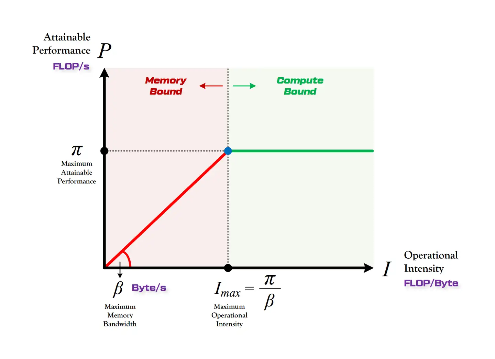

# Roofline Model

和其它performance model相比较，roofline model更加关注processor performance与off-chip memory之间的关系。

operational intensity: operations per byte of DRAM traffic

构建一个硬件平台的Roofline model的步骤：

1. 根据硬件的峰值算力(也可以叫吞吐，OPS/TOPS/FLOPS为单位)以及邮件的峰值内存带宽，可以在坐标系中找到一个点。
2. 从这个点的做一条水平线，以及与零点的一条斜线，就构成了该硬件环境下的Roofline model