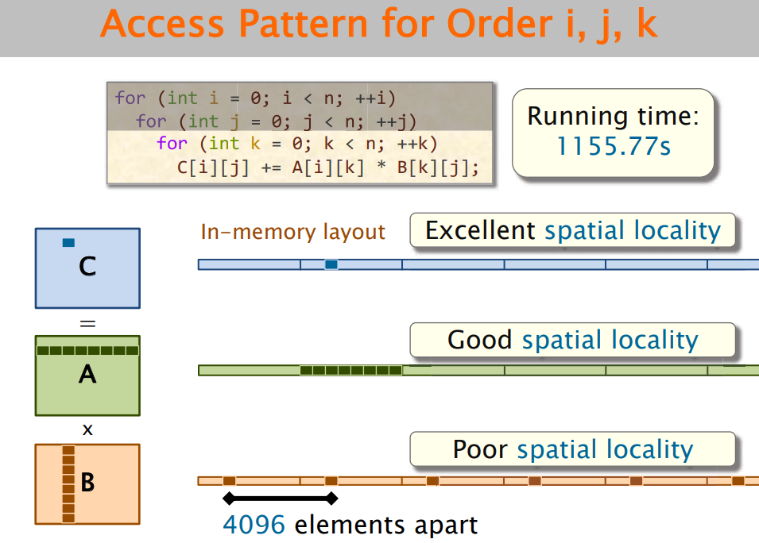

# 性能工程(Performance Engineering)


# 1. Introduction

对于软件，一切我们想要的一些软件特性：compatibility、reliability、robustness等等，这些性质都需要用性能来换取，所以**性能是计算机中的通货**。

```
Perfromance is the currency of computing
```


## 1.1 从矩阵乘法切入

对于一个矩阵乘法，vanilla的实现方式就是一个三层循环

```c
for(int i = 0; i < n;i++) {
    for(int j = 0;j < n;j++) {
        for(int k = 0;k < n;k++) {
            C[i][j] += A[i][k] * B[k][j];
        }
    }
}
```

时间复杂度O(n\^3)，FLOPs为2n\^3。


以两个4096维度的方阵乘法为例，整个矩阵乘法所需要的运算量是2 * 4096 * 4096 * 4096 = 2^37 = 137.439GFLOPs


而拿MIT6.172课程中的服务器运行，这个矩阵乘法运算如果用Python实现，需要24042s。做一个back-of-the-envelope计算
$$
Peak \ Throughput = 836GFLOPS \\
Python \ Troughput = 2^{37} / 21042 = 6.25MFLOPS
$$
实际上Python实现只能够达到0.0075%的峰值吞吐。


下面我们对这个矩阵乘法不断改进，来看最终能够优化到什么程度。


### 1.1.1 Programming Language


### 1.1.2 Loop Order

循环的顺序对于矩阵乘法的影响是因为Cache。特定的循环顺序能够具有更好的局部性，能减少Cache miss。

对于三层循环，一共有6种循环的顺序

1)i，j，k顺序，这是最常用的顺序，但是局部性不是最优的



2)i，k，j顺序，这样能获得非常好的局部性


3)j，k，i顺序，这样的局部性是最差的


4)k，i，j顺序，上面的i，k，j顺序局部性已经非常好了，但是k，i，j也能获得非常好的局部性，有时性能比i，k，j顺序还要好一些


### 1.1.3 Compiler Optimization

现代编译器都有不同级别的编译器优化选项，从-O0到-O3，优化级别越来越高。但是并不是优化级别越高越好，有可能-O2比-O3表现要好。因为编译器的-O3优化的优化策略有时比较激进。


### 1.1.4 Parallel Loops

多核并行能显著提升性能。但是在多核并行时，对不同的循环并行也会带来不同的性能差异。并且，并不是所有的循环都能并行。


### 1.1.5 Tiling And Multi-level Tiling

循环分块同样是利用到了Cache。


而分块的大小则需要多次实验选择出最佳的分块大小。


现代计算机的Memory Hierarchy有着多级Cache，为了能够充分利用多级Cache，需要多级分块。多级分块有多个需要调整的参数s，t等等。


### 1.1.6 并行分治


### 1.1.7 Compiler Vectorization


### 1.1.8 AVX intrinsics


[Intrinsics](https://en.wikipedia.org/wiki/Intrinsic_function)(Intrinsic Function)，是一种在高级语言中提供对特定CPU指令集访问的方法。它们通常由编译器提供，允许开发者在不直接写汇编代码的情况下利用特定的CPU指令。

不同的指令集架构都有其相应的一套Intrinsics：

1. x86架构
2. arm架构
3. 


Moore's law于


性能工程的核心是**底层硬件提供了什么特性 + 上层软件如何利用硬件提供的特性**。


Moore's law与Dennard Scaling


# 2. 性能测量

如何对程序的性能进行测量，这是一个关键问题？

## 2.1 外部测量

外部测量需要用到外部工具，不涉及到对程序的修改。

常用的性能分析工具：

1. time
2. perf
3. intel EMON


一个简单的time输出结果

```
time ./a.out < outputFile > /dev/null

real    0m0.454s
user    0m0.007s
sys     0m0.446s
```

这就引出了几个时间的概念：

- wall-clock time(real time，elapsed time)
- CPU time，CPU time又分为user time(用户态)和sys time(内核态)


对于上面的time的输出结果，real time = user + sys。

但是实际上并不是所有的程序都是如此：

1. 对于并行程序，CPU time > wall-clock time，并行程序的CPU time是所有核上的时间之和
2. 当CPU time < wall-clock time，表面程序因为I/O而阻塞


## 2.2 内部(插桩)测量

插桩既可以在源代码插桩，也可以二进制插桩。在程序中插入插桩点来测量程序性能。


以时间测量为例，有三种插桩方案实现一个间隔计时器(interval timer)。

一种是`rdstc`机器指令。x86架构处理器有一个64位寄存器Time-Stamp Counter(TSC)，记录着从CPU开始运作到现在的时钟周期数。这个寄存器可以通过`rdstc`指令读取值，连续两次读取的值的差值，即是连续两次调用之间CPU运行的周期数。用这个周期数除以CPU运行的频率，即可得到具体的秒数。


一种方式是通过`clock_gettime()`


一种方式是通过`gettimeofday()`


还有一种最原始的取时间方式`time() + localtime()`


四种计时器各有优缺点，最为推荐使用的是`clock_gettime()`。


## 2.3 仿真测量

通过模拟计算机测量程序在虚拟机上的性能。


Valgrind就是一个很好的例子。Valgrind的cache miss率确实并不是真正的cache miss率，而是在一个虚拟机上利用JIT技术仿真出来的结果。

```
$ valgrind --tool=cachegrind --time-stamp=yes ./a.out < outputFile > /dev/null
==00:00:00:00.000 64852== Cachegrind, a cache and branch-prediction profiler
==00:00:00:00.000 64852== Copyright (C) 2002-2017, and GNU GPL'd, by Nicholas Nethercote et al.
==00:00:00:00.000 64852== Using Valgrind-3.18.1 and LibVEX; rerun with -h for copyright info
==00:00:00:00.000 64852== Command: ./a.out
==00:00:00:00.000 64852== 
--00:00:00:00.000 64852-- warning: L3 cache found, using its data for the LL simulation.
==00:00:00:00.822 64852== 
==00:00:00:00.823 64852== I   refs:      5,091,387
==00:00:00:00.823 64852== I1  misses:        1,143
==00:00:00:00.823 64852== LLi misses:        1,141
==00:00:00:00.823 64852== I1  miss rate:      0.02%
==00:00:00:00.823 64852== LLi miss rate:      0.02%
==00:00:00:00.823 64852== 
==00:00:00:00.823 64852== D   refs:      1,566,216  (1,174,597 rd   + 391,619 wr)
==00:00:00:00.823 64852== D1  misses:        2,197  (    1,607 rd   +     590 wr)
==00:00:00:00.823 64852== LLd misses:        1,889  (    1,343 rd   +     546 wr)
==00:00:00:00.823 64852== D1  miss rate:       0.1% (      0.1%     +     0.2%  )
==00:00:00:00.823 64852== LLd miss rate:       0.1% (      0.1%     +     0.1%  )
==00:00:00:00.823 64852== 
==00:00:00:00.823 64852== LL refs:           3,340  (    2,750 rd   +     590 wr)
==00:00:00:00.823 64852== LL misses:         3,030  (    2,484 rd   +     546 wr)
==00:00:00:00.823 64852== LL miss rate:        0.0% (      0.0%     +     0.1%  )
```


乘法和加法fuse，FMA


随机误差(无法改变)和系统误差(可以消除)


## 2.4 不同的数据收集策略

数据收集策略分为计数型，采样型和追踪型。


### 2.4.1 计数型

计数可以通过硬件计数，也可以通过软件计数(比如上下文切换等事件)。

硬件计数器一般都是寄存器。现代的CPU种有一个PMU(Performance Monitoring Unit)。PMU包含了一组寄存器(计数器PMC)，用以统计各种事件发生的次数，这种事件称之为**PMU hardware events**/**hardware events**。

PMU hardware evetns是与CPU制造商相关的，AMD与Intel都有各自的说明


Linux perf采用stat选项能够以计数的方式收集数据

```
$ perf stat -e cycles,instructions ./a.out < outputFile > /dev/null 

 Performance counter stats for './a.out':

     1,563,797,423      cpu_atom/cycles/                                                        (2.04%)
     2,102,264,121      cpu_core/cycles/                                                        (97.96%)
     1,015,783,424      cpu_atom/instructions/           #    0.65  insn per cycle              (2.04%)
     1,997,667,501      cpu_core/instructions/           #    1.28  insn per cycle              (97.96%)

       0.451621908 seconds time elapsed

       0.012994000 seconds user
       0.437803000 seconds sys


```

`-e`选项指明了测量的事件是cycles与instructions。


### 2.4.2 采样型


### 2.4.3 追踪型

日志就属于一种追踪型策略。

1. Linux perf
2. strace
3. bpftrace(eBPF)


## 2.5 GPU等异构平台的性能测量


# 3. Benchmark

Benchmark就是

```
In computing, a benchmark is the act of running a computer program, a set of programs, or other operations, in order to assess the relative performance of an object, normally by running a number of standard tests and trials against it.
A computer benchmark performs a known set of operations by which computer performance can be measured
```

实际上就是一组能够比较全面地测试计算机性能的程序。


## 3.1 Benchmark的演变

Benchmark经历了由最开始的单一指令-->指令组合-->合成程序-->程序内核-->微基准评测程序-->应用基准评测程序/套件的演变。总体的趋势是趋向于**采用真实的具有代表性应用程序**作为benchmark，使得benchmark更加全面并且具有代表性。

并且一些标准化组织相继成立，他们开发和维护标准化基准评测套件(standardized benchmark suite)，评审各个厂商产品的性能并公开发布标准化评测报告，逐渐形成行业标准。

一些常用的标准化benchmark有：

1. SPEC
2. TDC DBMS的benchmark
3. LINPACK benchmark

后续的重点放在SPEC这个标准benchmark上。


**SPEC提供了几套benchmark suite，对应着不同的应用场景**：

- SPEC Cloud
- SPEC CPU
- SPEC Embedded
- SPEC Graphics/Workstations
- SPEC HPC
- SPEC Java Client/Server
- SPEC Storage
- SPEC Power
- SPEC Virtualization


Gibson指令，代表性？？

kernel


 

SPECspeed SPECrate


## 3.2 Benchmark的策略

固定工作量的benchmark


固定时间的benchmark


可变计算和可变时间的benchmark


固定工作量能够涵盖一个工作所有的阶段


## 3.3 Amdahl’s Law与Gustafson’s Law


## 3.4 关于跑分

下面是CPU的

Cinebench R23

Cinebench R15

Cinebench 2024

7-zip解压缩测试

SPEC 2017

X265HD

CPU-Z

MircoBenchX中的C2CLatency核间延迟测试】

能效测试


对于CPU来说，除了上面的这些测试，有的时候还需要对CPU微架构进行测试，对于CPU微架构的测试：

1. 指令吞吐
2. 取指带宽
3. 分支预测
4. 单/多线程带宽
5. 多核互联


下面是GPU的

Time Spy

Fire Strike Extreme

Superposition 1080P Extreme

Steel Nomad Light

3DMarks

CUDA-Z

GPU-Z

Blender渲染测试


先放这里了：

https://www.bilibili.com/video/BV16uxnemEgd/?spm_id_from=333.1007.tianma.2-3-6.click&vd_source=72864fffb0293637e3fc450e7ffec677

下面的是DDR phy，不能叫内存控制器，真正的控制器和cache绑定的

内存侧缓存边上的才是内存控制器，mac和phy不是放在一起的，工艺也不一样


NVLink点对点，UPI是一个ring总线结构

# 4.

特征工程

领域工程

模型驱动过程

领域驱动方法	


可满足性问题


生成有效的配置不是一个简单的问题，需要特征工程

配置/特征在这里是同一个概念


求解器solver


配置优化方法


## 5.

高吞吐一定带来低延时？？

高吞吐与低延迟的关系


linux load1 load5


# Appendix


## Linux Perf使用


### perf的基本命令

`perf`的命令格式与`git`非常相似 都是`perf` + `command`的格式

```
perf

  usage: perf [--version] [--help] [OPTIONS] COMMAND [ARGS]

 The most commonly used perf commands are:
   annotate        Read perf.data (created by perf record) and display annotated code
   archive         Create archive with object files with build-ids found in perf.data file
   bench           General framework for benchmark suites
   buildid-cache   Manage build-id cache.
   buildid-list    List the buildids in a perf.data file
   c2c             Shared Data C2C/HITM Analyzer.
   config          Get and set variables in a configuration file.
   daemon          Run record sessions on background
   data            Data file related processing
   diff            Read perf.data files and display the differential profile
   evlist          List the event names in a perf.data file
   ftrace          simple wrapper for kernel's ftrace functionality
   inject          Filter to augment the events stream with additional information
   iostat          Show I/O performance metrics
   kallsyms        Searches running kernel for symbols
   kvm             Tool to trace/measure kvm guest os
   list            List all symbolic event types
   mem             Profile memory accesses
   record          Run a command and record its profile into perf.data
   report          Read perf.data (created by perf record) and display the profile
   script          Read perf.data (created by perf record) and display trace output
   stat            Run a command and gather performance counter statistics
   test            Runs sanity tests.
   top             System profiling tool.
   version         display the version of perf binary
   probe           Define new dynamic tracepoints

 See 'perf help COMMAND' for more information on a specific command.
```


`perf record`、`perf report`和`perf annotate`都是用于sampling的。

`perf record`会将采集到的数据生成一个文件`perf.data`，然后可以采用一些其它的工具分析这个文件。


### perf生成FlameGraph

参考：

1. [20.04 - How can I get pre-canned scripts for perf script? - Ask Ubuntu](https://askubuntu.com/questions/1397419/how-can-i-get-pre-canned-scripts-for-perf-script)

在使用perf生成火焰图的过程中碰到了一些问题，在此记录。

按照perf官方文档的做法，利用perf生成火焰图，只需要

```sh
perf record -a -g -F 99 sleep 60
perf script report flamegraph
google-chrome flamegraph.html
```

但是在我的机器上这样做会报错

```
Please specify a valid report script(see 'perf script -l' for listing)
```

而当用

```shell
perf script -l
```

输出错误信息

```
open(/usr/libexec/perf-core/scripts) failed.
Check "PERF_EXEC_PATH" env to set scripts dir.
```

这是因为要想perf能够的调用python或者perl的脚本，需要在编译选项中加上对于这两种脚本的支持，但是采用包管理器安装的perf并不带有相应的支持，因此需要自己编译perf。自己编译的perf生成火焰图的脚本是python脚本。


另一种可行的做法是，利用Brendan D. Gregg在github上的生成火焰图的脚本

```shell
git clone https://github.com/brendangregg/FlameGraph.git
```

这个仓库中的相关脚本都是perl脚本。

要利用这一套脚本生成火焰图需要以下几步：

1. 捕获堆栈，这一步需要使用一些tracing工具
2. 折叠堆栈 这一步可以将重复的堆栈累积到一起，总而体现出负载和关键路径，这一步利用到的就是FlameGraph中的`stackcollapse`程序
3. 生成火焰图 这个由flamegraph.pl脚本完成


FlameGraph的生成，有非常多的实现方式，除了Brendan D. Gregg，还有一些其它的火焰图生成的实现


## Valgrind的使用


# MIT 6.172


循环展开分为完全循环展开和部分循环展开。

部分循环展开更加常用。但是过度循环展开会给增大指令cache的未命中率

循环展开编译器能够更好地优化，并且更少的分支指令


Loop fusion