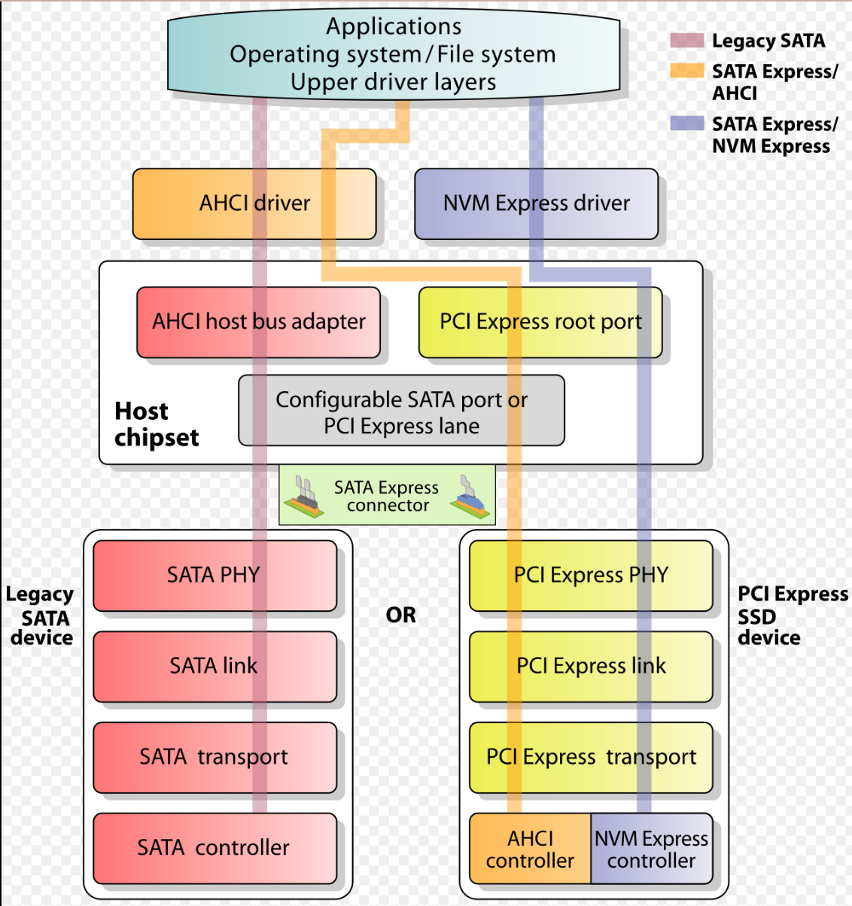

# DELL R730 从NVME SSD启动

参考：

- [How To Boot an NVME SSD from a Legacy BIOS (non UEFI) w/ Intel 750 Series SSD](https://mrlithium.blogspot.com/2015/12/how-to-boot-nvme-ssd-from-legacy-bios.html?m=1)
- [请问 dell R730服务器 操作系统能安装在pcie nvme ssd 上吗？](https://www.dell.com/community/zh/conversations/poweredge%E6%9C%8D%E5%8A%A1%E5%99%A8/%E8%AF%B7%E9%97%AE-dell-r730%E6%9C%8D%E5%8A%A1%E5%99%A8-%E6%93%8D%E4%BD%9C%E7%B3%BB%E7%BB%9F%E8%83%BD%E5%AE%89%E8%A3%85%E5%9C%A8pcie-nvme-ssd-%E4%B8%8A%E5%90%97/647f9118f4ccf8a8de280321)
- [Dell PowerEdge R730 - Boot from PCIe M.2 device](https://www.reddit.com/r/homelab/comments/tcp2rz/dell_poweredge_r730_boot_from_pcie_m2_device/)
- [Boot Dell R730xd from NVMe drive via m.2 PCIe adapter](https://www.reddit.com/r/homelab/comments/gq2s4b/comment/frt7wpt/?utm_source=share&utm_medium=web2x&context=3)

## 1、DELL R730无法从NVME SSD启动的原因

### 1.1 现象

DELL R730的BIOS中是有nvme驱动，能够向nvme SSD中安装系统，但是无法从nvme SSD中启动，启动项是灰色。

### 1.2 NVME协议

wiki的定义

```
NVM Express (NVMe) or Non-Volatile Memory Host Controller Interface Specification (NVMHCIS) is an open, logical-device interface specification for accessing a computer's non-volatile storage media
```

关键NVMe是logical-device interface逻辑设备接口标准，相当于NVMe工作在**应用层**

NVMe协议的实现由storage media上的NVMe controller chip实现，因此NVMe协议的更新换代只是更新NVMe controller chip上的NVMe实现。

#### 1.2.1 Background

最早的SSD使用的是SATA总线，但是SATA总线的低吞吐限制了SSD的速度。

后续采用PCIE总线，但是没有采用标准化的接口标准。后续标准化接口(即NVMe协议)使得OS只需要一种驱动就可以驱动所有遵从标准的SSD（类似于USB）。

#### 1.2.2 Form factors（即物理接口）

1. **AIC (add-in card)**：PCIe接口
2. **U.2**
3. **U.3**
4. **M.2**
5. **EDSFF([Enterprise and Data Center Standard Form Factor](https://en.wikipedia.org/wiki/Enterprise_and_Data_Center_Standard_Form_Factor))**

### 1.3 AHCI协议

wiki定义

```
The Advanced Host Controller Interface (AHCI) is a technical standard defined by Intel that specifies the register-level interface of Serial ATA (SATA) host controllers in a non-implementation-specific manner in its motherboard chipsets
```

**register-level interface of SATA host controller**即计算机主板上的芯片组的SATA host controller(HBA) interface，处于应用层底部。

AHCI用于控制SATA devices。AHCI控制器相当于主机内存与SATA devices之间的桥梁。


AHCI controller对SATA devices封装（encapsulate），然后通过PCI接口提供给主机。因此主机能够通过memory mapped registers和system memory非常容易地访问SATA devices。

因此对于software developer，AHCI controller就是一个PCI设备（**with bus master capability**）。


**To a software developer, an AHCI controller is just a PCI device with bus master capability.**

AHCI controller与SATA controller是等价的概念（从目前能找到的资料来看）。

SATA controller有以下工作模式：

1. IDE mode
2. AHCI mode
3. RAID mode

#### 1.3.1 AHCI带来的System drive boot issues

#### 1.3.2 Find an AHCI controller

通过枚举PCI bus找到AHCI controller。

### 1.4 AHCI与NVMe对比

二者都是HCI（host controller interface）都是一个逻辑设备接口（logical-device interface），只不过AHCI针对的是SATA devices二NVMe针对的是SSD等设备。

#### 1.4.1 Host Controller Interface

HCI是host controller与驱动之间通信的接口。


### 1.5 转接卡是单纯线路连接还是存在逻辑转换

1. NVME转接卡只是单纯的延长线，并不需要编解码芯片，实际上都是走PCIe×4通道。

### 1.6 存储协议栈



## 2、方法一：Clover

[使用Clover二阶引导系统](https://www.reddit.com/r/homelab/comments/gq2s4b/comment/frt7wpt/?utm_source=share&utm_medium=web2x&context=3)，基本原理：

1. **NvmExpressDxe.efi**：Clover中的nvme驱动，通过启用该驱动clover能够从nvme SSD引导OS。
2. **EFI/CLOVER/misc目录下的preboot.log**：F2保存启动日志文件，从日志文件中可以提取出系统EFI分区的GUID。
3. 通过(1)(2)中提取出的GUID构建引导项引导OS。


## 3、方法二：选择特定的SSD（比如Intel或DELL等datacenter级别的SSD，带有option ROM）


### 3.1 Option ROM

位于device上的一块ROM，用以初始化设备以及为主机的BIOS添加对设备的支持。

wiki原文的一段话

```wiki
Option ROMs are necessary to enable non-Plug and Play peripheral devices to boot and to extend the BIOS to provide support for any non-Plug and Play peripheral device in the same way that standard and motherboard-integrated peripherals are supported.
```


## 4、方法三：修改BIOS


## 5、UEFI模式与BIOS模式

