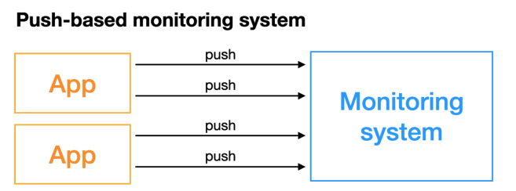
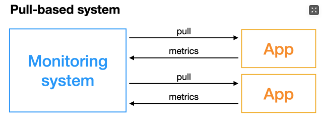

# Prometheus

# 1、Prometheus

## 1.1 Prometheus介绍

官方对于Prometheus的介绍

```
Prometheus, a Cloud Native Computing Foundation project, is a systems and service monitoring system. It collects metrics from configured targets at given intervals, evaluates rule expressions, displays the results, and can trigger alerts when specified conditions are observed
```

即一个系统监控方案。


整个Prometheus的架构如下


```
Prometheus 的基本原理是通过 HTTP 协议周期性抓取被监控组件的状态，任意组件只要提供对应的 HTTP 接口就可以接入监控。不需要任何 SDK 或者其他的集成过程，非常适合做虚拟化环境监控系统，比如 Docker、Kubernetes 等；输出被监控组件信息的 HTTP 接口通常称为 Exporter
```

## 1.2 Metric Export

**Exporter**，Prometheus Server从**Exporter/Jobs**中拉取metrics。

Metric Export有两种方式：

- **PUSH** Client主动将metrics push到Server

  

- **PULL** Server主动拉取metrics

  


Prometheus抓取到metrics后，会存储在内置的数据库中，叫做`TSDB`，然后可以通过PromQL语言查询。

# 2、Prometheus中的一些Concept

## 2.1 Data Model

Prometheus存储数据的方式是以**time series**的方式存储的，即同一个metric或者同一组labeled dimenstion的数据会以**streams of timestamped values**的方式存储。

### 2.1.1 Metric names and labels

每一个time series都以metric name和labels(key-value pair)共同唯一标注

- **Metric names**
- **Metric labels**

### 2.2.2 Samples

time series中一个个样本点就是Samples，Samples构成了time series。

每一个Sample的组成：

- a float64 value
- a millisecond-precision timestamp

### 2.2.3 Notation

给出metric name和a set of labels，就可以唯一而标注一个time series，这个time series的命名(**Notation**)格式如下：

```
<metric name>{<label name>=<label value>, ...}
```

比如一个实际的time series的notion如下

```
api_http_requests_total{method="POST", handler="/messages"}
```


## 2.2 Metric Types

Prometheus的client library有4种core metric types，但是对于server library来说，server library把这四种types都当作untyped time series，即不区分类别，一视同仁。

### 2.2.1 Counter

```
A counter is a cumulative metric that represents a single monotonically increasing counter whose value can only increase or be reset to zero on restart.
```

**Counter不能用在数值可能会减少的情况下。**

### 2.2.2 Gauge

```
A gauge is a metric that represents a single numerical value that can arbitrarily go up and down.
```


### 2.2.3 Histogram


### 2.2.4 Summary


## 2.3 Jobs And Instances

```
In Prometheus terms, an endpoint you can scrape is called an instance, usually corresponding to a single process. A collection of instances with the same purpose, a process replicated for scalability or reliability for example, is called a job.
```

一般来说一个进程就是一个instance，而具有相同类型的instance的集合就是一个job。


当Prometheus从一个target抓取数据时，会自动给抓取到的time series加上两个labels：

- `job`: The configured job name that the target belongs to.
- `instance`: The `<host>:<port>` part of the target's URL that was scraped.


## 2.4 Prometheus Remote-Write Specification


# 3、Configuration

Prometheus的配置通过**命令行参数**以及**配置文件(yaml格式)**进行配置。

- 命令行参数用以配置immutable system parameters
- 配置文件用于配置jobs，instances以及相应的rules

## 3.1 Configuration file

命令行用`--config.file`选项指明需要加载的configuration file。

Prometheus可以在运行时更新配置，有两种方法热加载配置：

- 给Prometheus进程发送`SIGHUP`信号
- 给endpoint `/-/reload`发送HTTP POST请求


Prometheus的配置文件为yaml格式，因此涉及到[yaml语法](./yaml语法#yaml语法)

首先定义一些通用的占位符：

- `<boolean>`: a boolean that can take the values `true` or `false`
- `<duration>`: a duration matching the regular expression `((([0-9]+)y)?(([0-9]+)w)?(([0-9]+)d)?(([0-9]+)h)?(([0-9]+)m)?(([0-9]+)s)?(([0-9]+)ms)?|0)`, e.g. `1d`, `1h30m`, `5m`, `10s`
- `<filename>`: a valid path in the current working directory
- `<float>`: a floating-point number
- `<host>`: a valid string consisting of a hostname or IP followed by an optional port number
- `<int>`: an integer value
- `<labelname>`: a string matching the regular expression `[a-zA-Z_][a-zA-Z0-9_]*`. Any other unsupported character in the source label should be converted to an underscore. For example, the label `app.kubernetes.io/name` should be written as `app_kubernetes_io_name`.
- `<labelvalue>`: a string of unicode characters
- `<path>`: a valid URL path
- `<scheme>`: a string that can take the values `http` or `https`
- `<secret>`: a regular string that is a secret, such as a password
- `<string>`: a regular string
- `<size>`: a size in bytes, e.g. `512MB`. A unit is required. Supported units: B, KB, MB, GB, TB, PB, EB.
- `<tmpl_string>`: a string which is template-expanded before usage


一个配置文件有多个**片段(section)**：

- **global**
- **scrape_config**
- **tls_config**
- **oauth2**
- **azure_sd_config**
- **consul_sd_config**
- **digitalocean_sd_config**
- **docker_sd_config**
- **......**


```yaml
global:
  # How frequently to scrape targets by default.
  [ scrape_interval: <duration> | default = 1m ]

  # How long until a scrape request times out.
  [ scrape_timeout: <duration> | default = 10s ]

  # The protocols to negotiate during a scrape with the client.
  # Supported values (case sensitive): PrometheusProto, OpenMetricsText0.0.1,
  # OpenMetricsText1.0.0, PrometheusText0.0.4.
  # The default value changes to [ PrometheusProto, OpenMetricsText1.0.0, OpenMetricsText0.0.1, PrometheusText0.0.4 ]
  # when native_histogram feature flag is set.
  [ scrape_protocols: [<string>, ...] | default = [ OpenMetricsText1.0.0, OpenMetricsText0.0.1, PrometheusText0.0.4 ] ]

  # How frequently to evaluate rules.
  [ evaluation_interval: <duration> | default = 1m ]

  # The labels to add to any time series or alerts when communicating with
  # external systems (federation, remote storage, Alertmanager).
  external_labels:
    [ <labelname>: <labelvalue> ... ]

  # File to which PromQL queries are logged.
  # Reloading the configuration will reopen the file.
  [ query_log_file: <string> ]

  # An uncompressed response body larger than this many bytes will cause the
  # scrape to fail. 0 means no limit. Example: 100MB.
  # This is an experimental feature, this behaviour could
  # change or be removed in the future.
  [ body_size_limit: <size> | default = 0 ]

  # Per-scrape limit on number of scraped samples that will be accepted.
  # If more than this number of samples are present after metric relabeling
  # the entire scrape will be treated as failed. 0 means no limit.
  [ sample_limit: <int> | default = 0 ]

  # Per-scrape limit on number of labels that will be accepted for a sample. If
  # more than this number of labels are present post metric-relabeling, the
  # entire scrape will be treated as failed. 0 means no limit.
  [ label_limit: <int> | default = 0 ]

  # Per-scrape limit on length of labels name that will be accepted for a sample.
  # If a label name is longer than this number post metric-relabeling, the entire
  # scrape will be treated as failed. 0 means no limit.
  [ label_name_length_limit: <int> | default = 0 ]

  # Per-scrape limit on length of labels value that will be accepted for a sample.
  # If a label value is longer than this number post metric-relabeling, the
  # entire scrape will be treated as failed. 0 means no limit.
  [ label_value_length_limit: <int> | default = 0 ]

  # Per-scrape config limit on number of unique targets that will be
  # accepted. If more than this number of targets are present after target
  # relabeling, Prometheus will mark the targets as failed without scraping them.
  # 0 means no limit. This is an experimental feature, this behaviour could
  # change in the future.
  [ target_limit: <int> | default = 0 ]

  # Limit per scrape config on the number of targets dropped by relabeling
  # that will be kept in memory. 0 means no limit.
  [ keep_dropped_targets: <int> | default = 0 ]

# Rule files specifies a list of globs. Rules and alerts are read from
# all matching files.
rule_files:
  [ - <filepath_glob> ... ]

# Scrape config files specifies a list of globs. Scrape configs are read from
# all matching files and appended to the list of scrape configs.
scrape_config_files:
  [ - <filepath_glob> ... ]

# A list of scrape configurations.
scrape_configs:
  [ - <scrape_config> ... ]

# Alerting specifies settings related to the Alertmanager.
alerting:
  alert_relabel_configs:
    [ - <relabel_config> ... ]
  alertmanagers:
    [ - <alertmanager_config> ... ]

# Settings related to the remote write feature.
remote_write:
  [ - <remote_write> ... ]

# Settings related to the remote read feature.
remote_read:
  [ - <remote_read> ... ]

# Storage related settings that are runtime reloadable.
storage:
  [ tsdb: <tsdb> ]
  [ exemplars: <exemplars> ]

# Configures exporting traces.
tracing:
  [ <tracing_config> ]
```


# 4、Querying

Prometheus提供了一种函数式的查询语言PromQL。


# 利用Prometheus监控Linux主机


# Grafana


