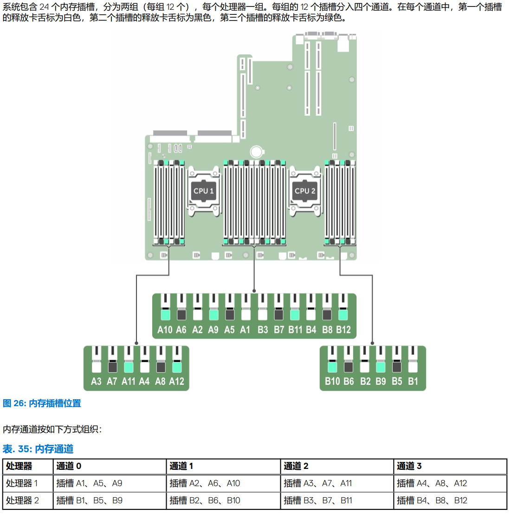
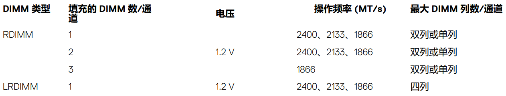

# Homelab


# 1. 服务器选型

目前，主流的服务器供应商：

1. DELL
2. HPE
3. Huawei华为
4. Cisco
5. Supermicro
6. Asus
7. IBM
8. Inspur浪潮
9. Lenovo联想
10. H3C新华三
11. Sugon中科曙光
12. Fujitsu富士通
13. Oracle(实际上是Sun的服务器，只不过Oracle收购了Sun)

当然也有一些其它的厂商也会做服务器，比如Gigabyte技嘉等，但是市场上主流的还是上面提到的厂家。但是作为homelaber，真正能供我们选择的服务器厂商主要集中在其中几家。


```
首先呢，不论中外，为稳定性计，机房里的服务器都不可能“新三年旧三年修修换换又三年”，而是严格遵循定期强制报废和替换制度。这个强制报废期，通常是服务器整机的保修期。
```


## 1.1 Dell

Dell的PowerEdge服务器命名方案，有两种类型：3数字方案和4数字方案。

不论是3个数字还是4个数字的方案，开头都是子母，代表着服务器的形态：

- **R**代表Rack，机架式服务器
- **M**代表Modular，刀片式服务器
- **T**代表Tower，塔式服务器


3个数字方案：

- 第一个数字表明CPU插槽的个数，1~3代表单路服务器，4~7代表双路服务器，8~9代表4路服务器。
- 第二个数字表明服务器是第几代服务器，0代表10代，1代表11代，以此类推
- 第三个数字表明服务器CPU的制造商，0代表Intel，5代表AMD

比如Dell PowerEdge R730就到表13代双路Intel服务器。


4个数字方案：

- 第一个数字表明服务器级别，1~5默认为iDRAC Basic，6~9默认为iDRAC Express
- 第二个数字表明服务器代数，0代表10代，1代表11代，以此类推
- 第三个数字代表CPU插槽个数，1代表1个CPU插槽即单路服务器，2代表2个CPU插槽即双路服务器
- 第四个数字表明服务器CPU的制造商，0代表Intel，5代表AMD

比如Dell PowerEdge R6415就是机架式，14代单路AMD服务器。


# 2. CPU选型


## 2.1 CPU版本

在选购CPU时，对于同一款CPU，也有许多不同的版本：

1. 有锁版本
2. 正式版 
3. QS QS是Qualification Sample的缩写，QS版本也叫ES正显版(带显版)，实际上，QS版也是ES版的一种，但QS版应该算是最好的ES版了，一般是在正式版推出前的最终样品版本，无限接近于正式版，或与之后发布的正式版并无区别。只不过在CPU-Z中显示的规格中会带有**ES**字样
4. ES ES是Engineer Sample的缩写，ES版本的CPU是在正式推出之前进行测试的CPU，用于发现CPU存在的问题并且在正式发行前修正

这里所谓的不显与带显，是指在CPU-Z中是否正确显示名字与规格。


有锁版本的CPU分为两种锁：

- 锁屏
- 锁主板vendor lock


戴尔服务器上的AMD EPYC CPU会被主板锁定，这一项功能是基于AMD的Platform Secure Boot(PSB)功能。

[AMD PSB Vendor Locks EPYC CPUs for Enhanced Security at a Cost](https://www.servethehome.com/amd-psb-vendor-locks-epyc-cpus-for-enhanced-security-at-a-cost/)

无锁的CPU放在Dell或者HP等品牌的机器上用一次，就会加锁，然后就无法在其它主板上点亮。锁品牌但是不锁具体的机器。

AMD这么设计的原因是处于安全考虑，这一部分与[云安全]()有关。

这个机制背后的核心是[AMD Secure Processor]()。


## 2.2 内存通道与PCIE通道

现代的CPU内存控制器集成在CPU die的内部。

真正能够使用到的内存通道数量由CPU、主板以及BIOS设置共同决定。同时，每一个内存通道所能够承载的内存数量也是有限制的，这个就是DPC(DIMMs per channel)

以DELL R730为例，



DELL R730采用的Xeon CPU内存有4通道，R730作为双路服务器，两个CPU合计8通道。而R730有24个DIMM插槽，因此DPC为3。

一般来说，DPC是由主板决定的。通过增大DPC，能够增大每一个通道的内存容量，但是带来的副作用是内存的工作频率下降。

从DELL R730手册中我们也能够发现这个规律




而内存通道数量则是由CPU决定的。

同时BIOS的设置对于内存通道的利用也有影响。BIOS中的许多选项会影响到内存通达的使用。


CPU的PCIe通道数量指的是PCIe Lane的数量。

同时这些PCIe通道还要分为**直连CPU的PCIe通道**和**南桥拓展的间接PCIe通道**。

直连CPU的PCIe通道是直接从CPU的PCIe controller引出的PCIe通道，而南桥拓展的间接PCIe通道则是先从直连CPU通道分出几条连接到南桥(芯片组)，然后再从南桥引出的PCIe通道。

南桥拓展的CPU通道相比于直连CPU通道性能要差。


因此就有PCIe switch


# 3. RAID卡与HBA卡

RAID卡(阵列卡)与HBA卡(直通卡)是两种不同的东西，但是它们之间的功能有交叉。总体来说，RAID卡能具备HBA卡的功能，而HBA卡也能够具备一些基础的RAID能力。


HBA卡的涵盖范围非常广泛。HBA卡有两种模式：**IT(Initiator Target)模式**与**IR(Integrated RAID)模式**，这两种模式就对应着两种HBA固件。

HBA(Host Bus Adapter)，从字面意思就可以看出，是一个将外部其它类型的总线(SCSI，SAS，SATA等)连接到主机总线(Host Bus)上的一个中间设备(Adapter)。因此HBA的主要功能就是将硬盘以及网卡连接到主机上，相当于硬盘控制器。

比如SATA硬盘，在PC上的南桥上有相应的SATA控制器，HBA卡也是类似功能。而对于HBA卡，HBA卡上的HBA芯片是一个通用的CPU，因此就可以对HBA卡刷机。前面提到了，HBA卡有IT和IR两种模式，分别对应着两种固件，用户可以自行刷HBA卡上的固件，从而在IT和IR模式之间切换。

HBA卡在IT模式下，所连接的磁盘对系统是透明的，操作系统能够直接识别与管理。主要用途就是NAS上，因为现在的各种NAS系统需要从系统层面管理硬盘(软RAID)，所以NAS一般都采用IT模式的HBA卡。

而在IR模式下，磁盘是由HBA卡将物理磁盘模拟出虚拟磁盘给操作系统，所以无法直接识别物理硬盘。


而RAID卡功能则更加强大，可以把RAID卡看成一个微型计算机系统。RAID卡有通用CPU，一般是mips，powerpc或者arm架构，大多都采用双核架构，用来通用计算；还有xor引擎，专门用来加速raid5，raid6，对抗raid5和6的写惩罚提高写入速度；还有内存控制器为XOR引擎和CPU提供ram内存作为缓存使用，特别是用来对抗raid5和6的写惩罚使用。硬阵列卡做的raid5，6，50，60才是真正具有强大的读写性能和很好的容灾能力的硬磁盘阵列。


RAID卡的功能主要由RoC(Raid-on-Chip芯片，用硬件实现Raid功能)实现。RoC实际上是两种芯片的载体，一部分实现Raid功能，一部分实现I/O功能，连接硬盘。

而如果RoC去掉Raid功能，则是一个IOC(I/O controller芯片)。RAID卡可以在BIOS中关闭RAID功能，总而变为一个IOC。

实际上上文中将IOC称为HBA卡是一个不准确的叫法，实际上任何能够连接到host bus上的adapter，包括显卡，网卡，IOC其实都是HBA。所以HBA的涵盖范围非常广泛。


RAID卡有单通道，双通道以及八通道等的划分。


