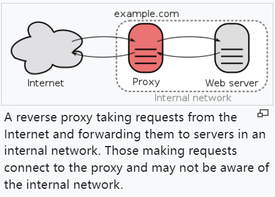
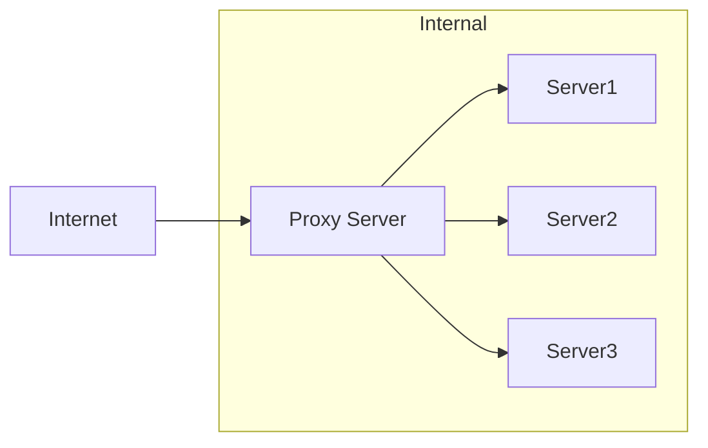
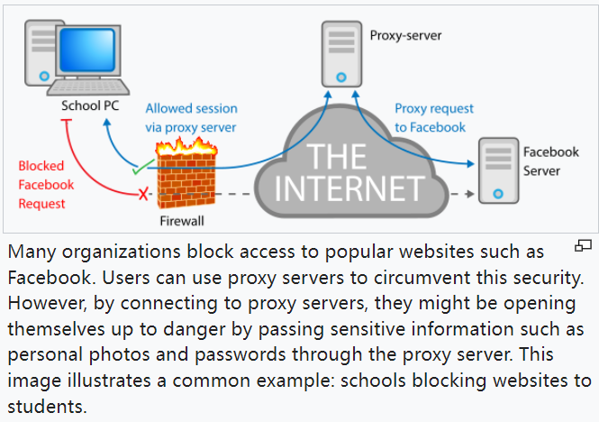
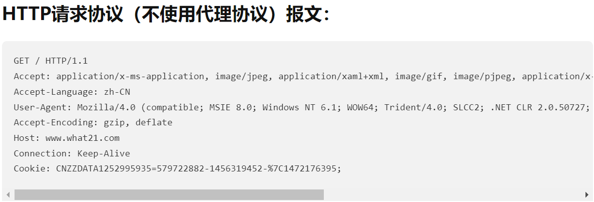
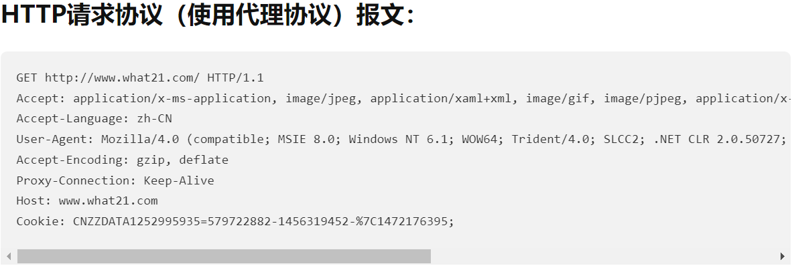
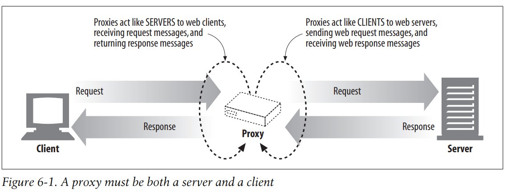
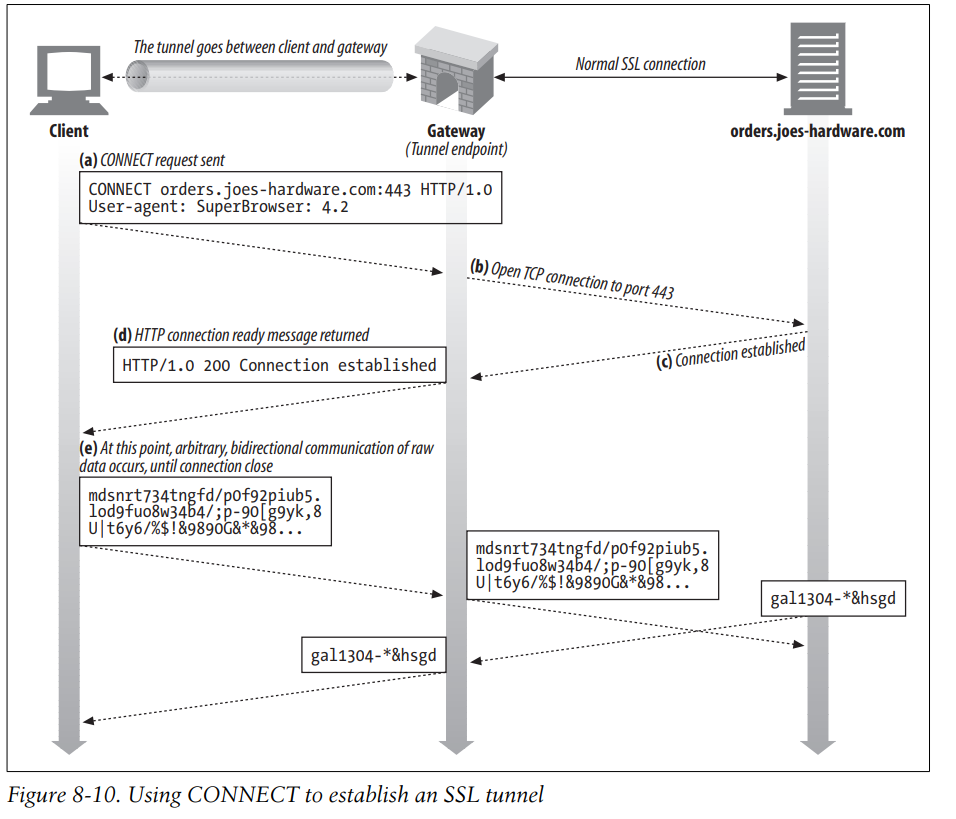

# 代理协议

# 1、代理

## 1.1 Proxy Types

1. Gateway/Tunneling proxy: a proxy server passing unmodified requests and responses。
2. Forward proxy: Internet-facing proxy，用于从Internet上获取资源
3. Reverse proxy: Internal-facing proxy，用于管理私网中对server的访问

## 1.2 Open  proxy

一种forward proxy，可以被Internet上的所有人访问。

又可以细分为：

1. Anonymous proxy：
2. Transparent proxy：

## 1.3 Reverse proxy

所有以内网中Server1，Server2，Server3为目的的流量都会先通过Proxy Server，并且由Proxy Server代理这三个Server做出响应。

## 1.4 Proxy Uses

### 1.4.1 Monitoring and filtering

#### 1.4.1.1 Content-control software

#### 1.4.1.2 Filtering of encrypted data

#### 1.4.1.3 Bypassing filters and censorship

通过使用不在blacklists中的proxy server从而绕过Firewall。

#### 1.4.1.4 Logging and eavesdropping

### 1.4.2 Improving performance

### 1.4.3 Translation

# 2、代理协议

**为什么会有不同的代理协议？**

代理协议用于在客户端，proxy和服务器之间交换数据

## 2.1 HTTP proxy（Web proxy）

HTTP proxy工作在应用层。

采用HTTP proxy的请求与不采用HTTP proxy的请求基本相似，但是会传递一个完整的URL

### 2.1.1 普通代理 [RFC 7230](http://tools.ietf.org/html/rfc7230)

### 2.1.2 隧道代理[Tunneling TCP based protocols through Web proxy servers](https://tools.ietf.org/html/draft-luotonen-web-proxy-tunneling-01)

**HTTP CONNECT方法**：通过HTTP CONNECT方法建立一条连接，转发任意通过这条连接的流量。

### 2.1.3 HTTP代理的设置

1. 手动配置
2. 浏览器预配置
3. PAC（Proxy auto-configuration）
4. WPAD proxy discovery

## 2.2 SOCKS proxy [RFC](https://en.wikipedia.org/wiki/RFC_(identifier)) [1928](https://datatracker.ietf.org/doc/html/rfc1928)

SOCKS协议工作在会话层。

