# 内网穿透（NAT Traversal）

# 1、NAT

NAT主要有三种方式:

- 静态NAT 一对一的映射，一个内网IP映射到了一个公网IP
- 动态NAT 多对多的映射，一个内网IP可以在一个公网IP池中选择映射
- 端口映射NAT

RFC 3489将NAT的实现方式分为：

- **Full-cone NAT(NAT1)** one-to-one NAT。内部地址iAddr:iPort发送的包将通过eAddr:ePort发送；同样外部发送到eAddr:ePort也将被发送到iAddr:iPort

  

  

- **(Address)-restricted-cone NAT(NAT2)** 在这种情况下，内部地址iAddr:iPort发送的包将通过eAddr:ePort发送；但是只有iAddr:iPort曾经向外部主机hAddr:*any*发送过包时，外部的主机hAddr:*any*才可以通过向eAddr:ePort发送包实现向iAddr:iPort发送包(any表示端口号不受限，限制只加在addr上)

  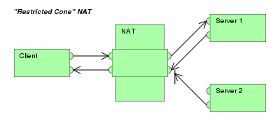

- **Port-restricted cone NAT(NAT3)** 与address restricted cone NAT相同，但是同时对于端口作出了限制。

  

- **Symmetric NAT(NAT4)** 一个内部IP与内部端口加上目的IP与外部端口映射到一个外部IP与外部端口；只有外部的主机接收到内部的主机的一个包时，才可以反过来向其发送包。相当于为每一条不同的连接都分配了一个外部的IP与外部端口。

  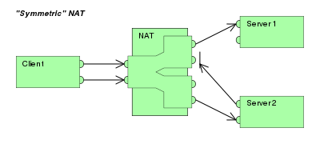

从上往下，NAT的限制是越来越大的。

NAT的局限性：

- 网络层操纵传输层，跨层：NAT运行需要同时操作网络层的IP与传输层的Port
- 对于加密应用不友好：对于加密应用，如果对于传输层的数据进行了加密，那么其无法对于传输层的Port进行转换

# 2、公网IP与私有IP

# 3、NAT Traversal

## 3.1 NAT Traversal原理

## 3.2 实现方案

### 3.2.1

设计自己的协议来实现 NAT 穿透需要满足一下两个条件：

1. 协议基于UDP：TCP是面向流的连接（stream-oriented connection）会带来一定的复杂性。但如果想在NAT穿透时获得面向流的连接，可以采用**QUIC**。

2. 对于收发包的socket有直接控制权：

   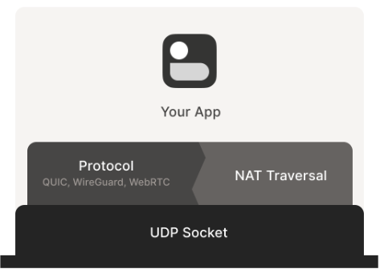

   NAT穿透与其它协议并行运行，共享socket。

   **但是直接访问socket这一条件比较难满足？**因此可以通过一个local proxy，由这个proxy完成NAT穿透，主协议与proxy通信，相当于增加了一个间接层，能够在不对已有的应用程序做改动的情况下实现NAT穿透（花生壳等应该是这个原理）。

### 3.2.2 穿透防火墙

实现NAT Traversal有两个障碍：

1. 有状态防火墙
2. NAT设备

有状态防火墙：

- Windows Defender firewall
- Ubuntu’s ufw (using iptables/nftables)
- BSD/macOS `pf`
- AWS Security Groups（安全组）

#### 3.2.2.1 有状态防火墙

防火墙默认配置：

1. 允许所有出站连接（outbound）
2. 禁止所有入站连接（inbound），但是有一些例外，比如说允许inbound SSH

但对于物理层来说，所有的物理连接都是双向的。防火墙区分入向与出向包就是通过**有状态stateful**区分：防火墙记录每个包的状态（信息），通过状态做出判断。

比如防火墙看到一个出向包（outbound），就会允许相应的入向包通过（有一些非常宽松的防火墙，只要从内部的有一个IP:Port向外发送包，就会允许外部的任意一个主机向其发送包）。

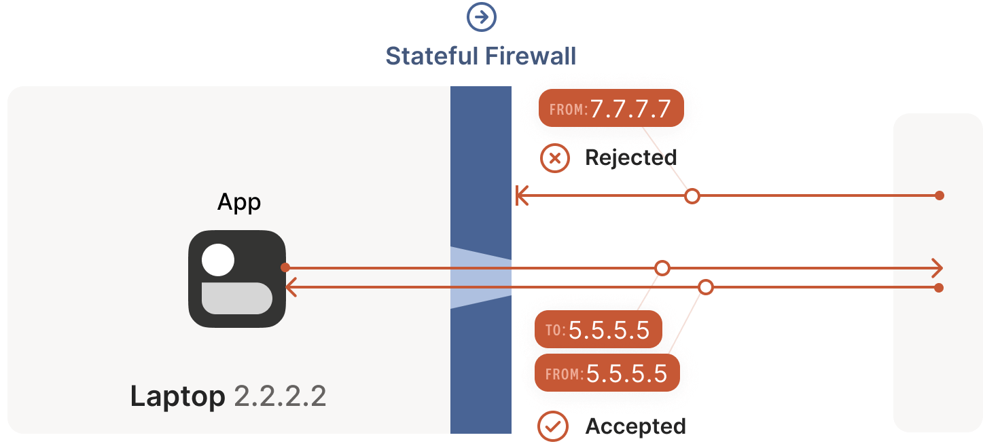

#### 3.2.2.2 防火墙朝向（face-off）

现实场景中防火墙的朝向也是一个问题

**防火墙朝向相同**（服务端IP可以直接访问），这种情况就是当我们在内网中访问Internet中的服务器的常用方式。

上述的两条防火墙默认的规则对于NAT穿透时的UDP流量影响不大，只要路径上所有防火墙朝向是一样的（即允许出站禁止入站，内网访问公网服务器都是这种情况，能够直接访问到）。

**但连接必须由防火墙背后的机器首先发起。**

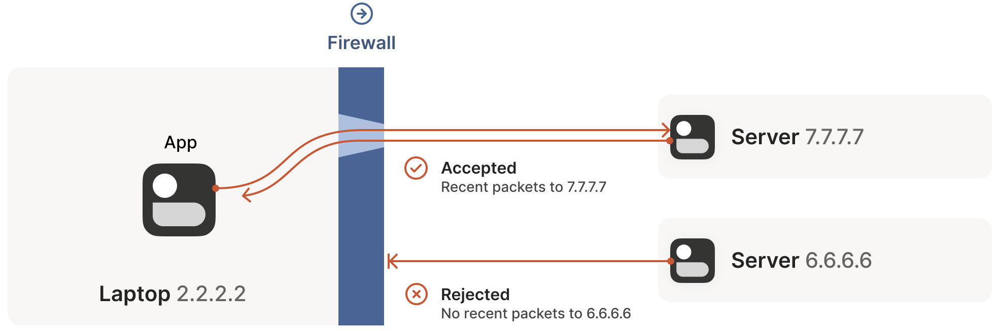

**穿透方案**：客户端直连服务器，或者hub-and-spoke拓扑

但是上面假设通信双方中一端是能直接访问到的。

下图是VPN的hub-and-spoke拓扑，中心hub没有任何防火墙策略。

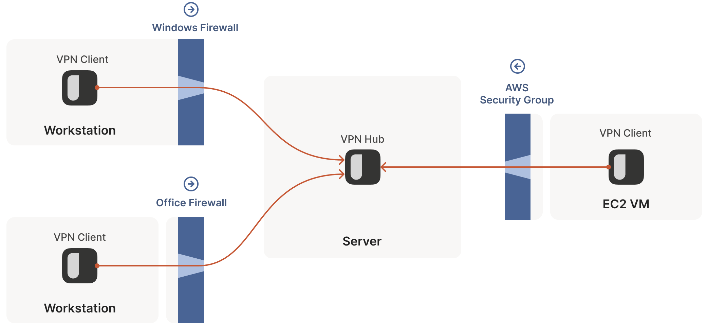

**防火墙朝向不同**（服务端IP不能直接访问）

两个内网客户端直连的情况。

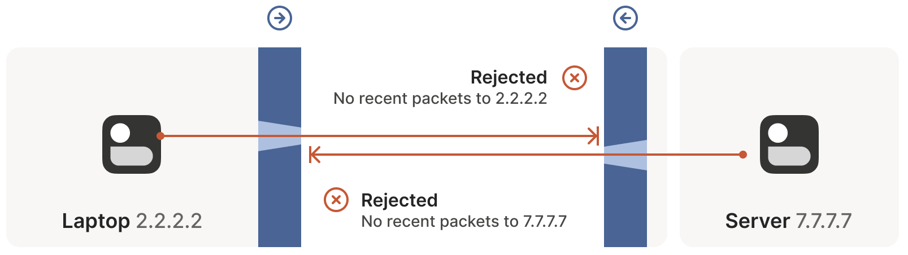

这种情况如果要建立连接，需要两方同时发起连接请求，但是不论如何同时发起连接，总会有一个先后顺序，无法实现同时发起连接，所以无法建立连接。

**穿透方案1**：配置防火墙，让一边或者两边的防火墙打开一个端口，但很多情况下没有配置防火墙的权限，并且对于**mesh组网**不友好

**穿透方案2**：两边同时主动建立连接，在本地防火墙为对方开洞。共享一些信息，让**两端提前知道对方使用的ip:port**。因为有状态防火墙的基本规则就是包必须先出去才可以进来，但是进来的包并不一定需要是先前出去的包的响应，**任何看起来像是响应的包都会被防火墙放进来**。

如何让对方提前知道对方使用的IP：

1. 静态配置，但是灵活性差
2. 通过一个coordination server，同步`ip:port`信息

1. 第一个包`2.2.2.2:1234 -> 7.7.7.7:5678`，会被防火墙拦截。

   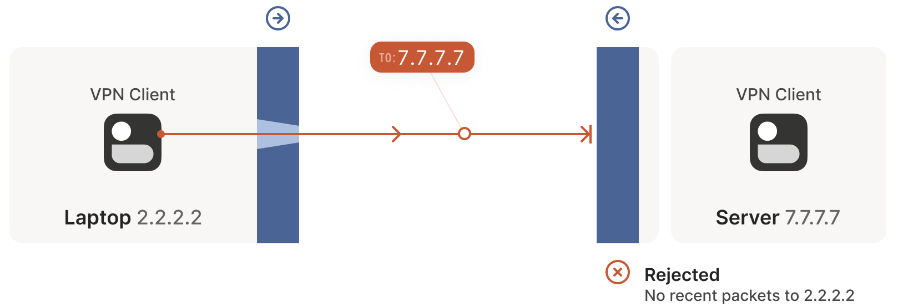

2. 接着第二个包`7.7.7.7:5678 -> 2.2.2.2:1234`

   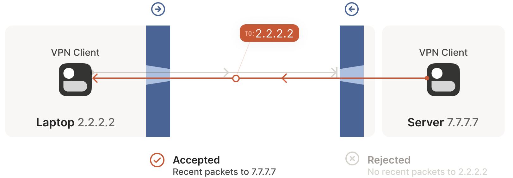

3. 第三个包，对第二个包的应答

   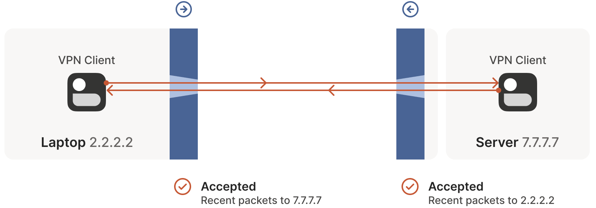

#### 3.2.2.3 穿透防火墙的一些注意事项

**如何实现双方必须几乎同时发起通信？** **旁路信道**

**防火墙定时清理非活跃连接？** 

### 3.2.3 NAT本质

同时发包机制有效的前提是**提前知道对方的ip:port**，但是由于NAT设备的存在，通信双方不知道对方的ip:port是什么。

#### 3.2.3.1 NAT设备与有状态防火墙

NAT设备相当于一个增强版的有状态防火墙，除了先前的入站和出站规则，还会修改数据包

#### 3.2.3.2 SNAT/DNAT

source NAT（SNAT）会对穿透和连接产生影响而DNAT不会

#### 3.2.3.3 SNAT

多个私有IP地址映射到单个公网IP

#### 3.2.3.4 SNAT过程

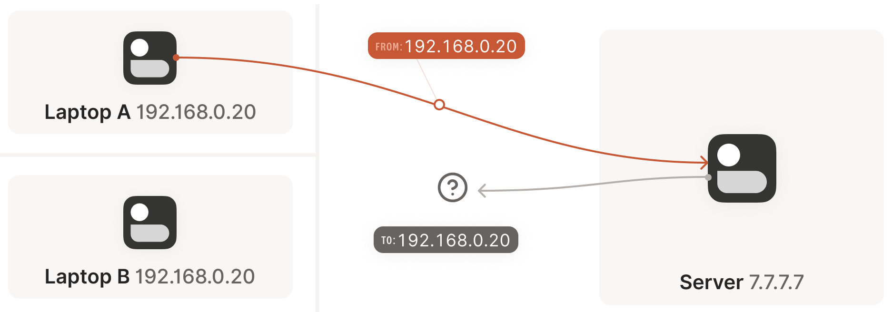

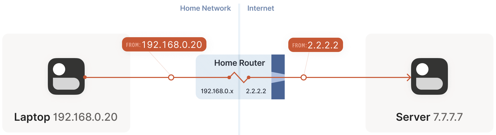

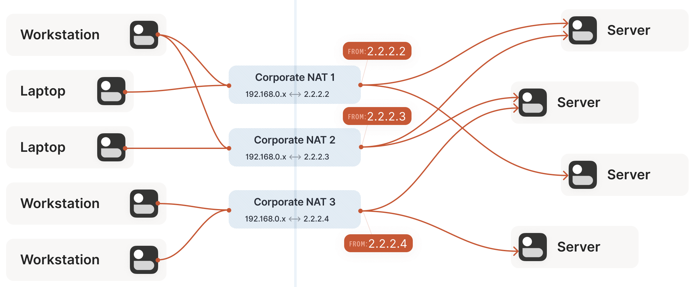

NAT可以由多台设备多个公网IP组成。

#### 3.2.3.5 SNAT给穿透带来挑战

与防火墙朝向不同情况类似，**通信双方不知道对方的ip:port**，无法主动连接。

在SNAT情况下，甚至自身都无法确定自身的信息，因为经过路由的NAT mapping。

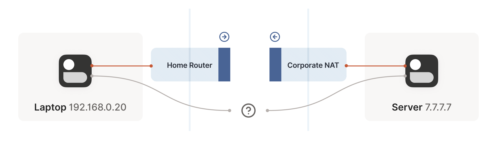

## 3.3 STUN (Session Traversal Utilities for NAT) 协议

### 3.3.1 STUN原理

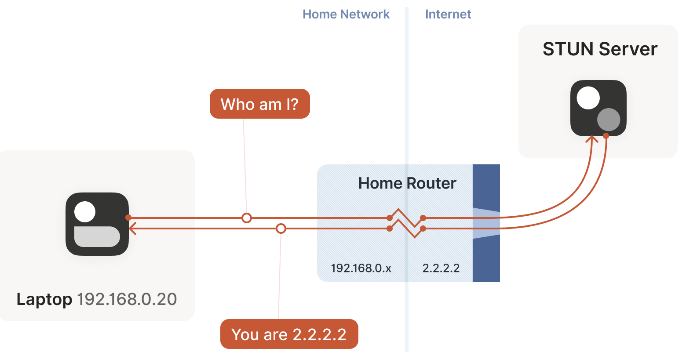

服务器告诉客户端它看到的映射后的公网ip:port。

流程：

1. 笔记本询问服务器从服务器角度看到的ip地址
2. STUN服务器返回一个响应指出笔记本映射后的公网ip:port
3. 将这个信息以某种方式告诉通信对端，就可以建立连接

### 3.3.2 共享socket原因

每一个socket都有一个不同的**ip:port**，因此在NAT设备上的映射也不一样，因此只有在想要使用的socket上通过STUN穿透才能够使用这个socket建立连接。

### 3.3.3 STUN的问题

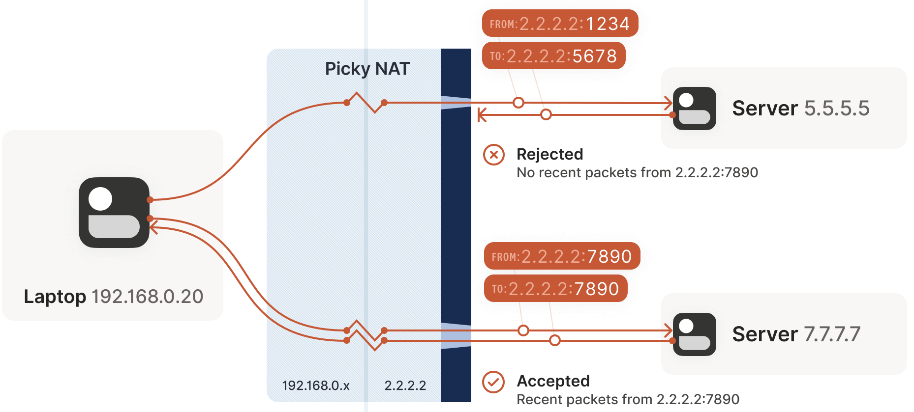

