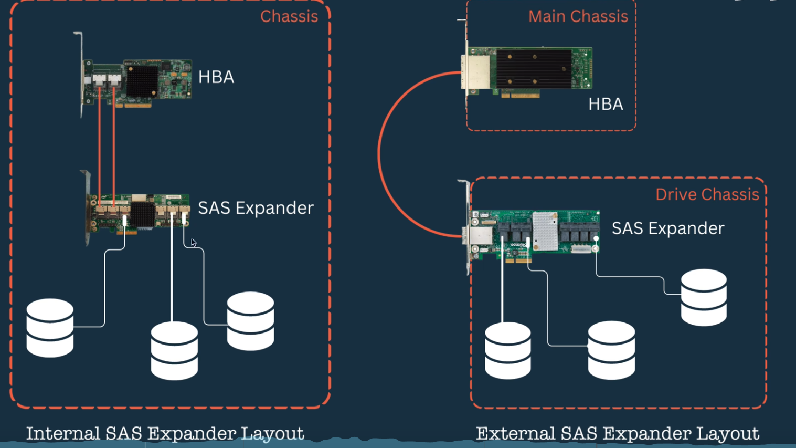
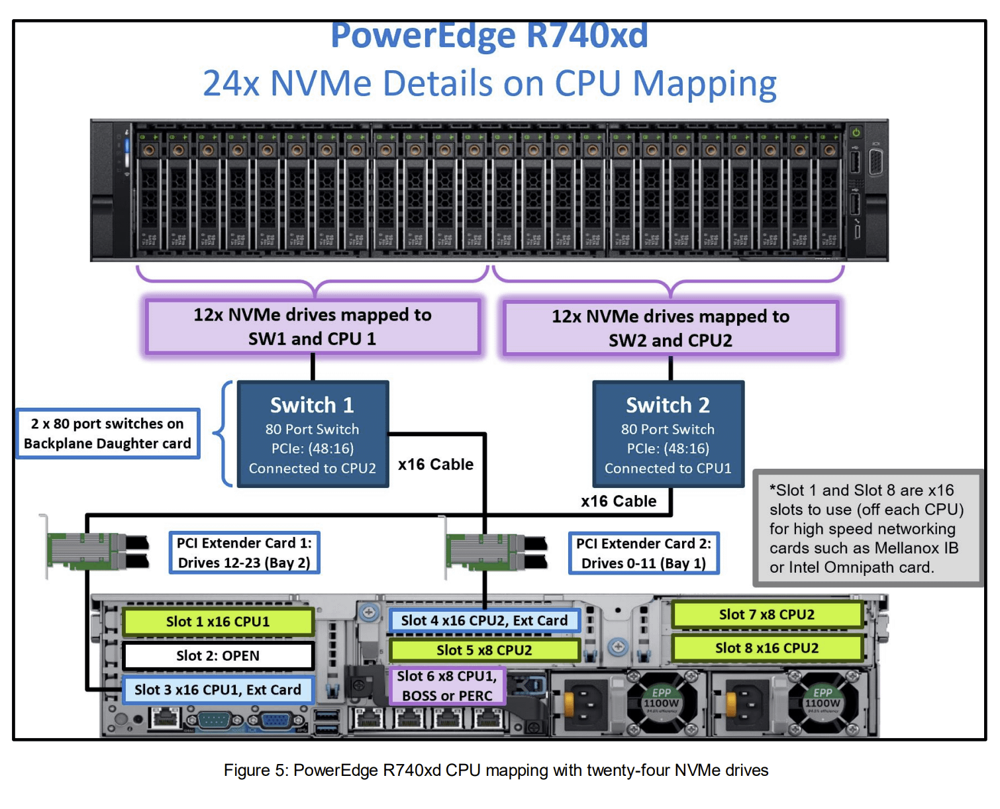

不论是SATA，SAS，NVMe，PCIe和USB都是总线协议：

1. 总线+寻址。
2. 主从关系
3. 路由芯片Expander
   - SAS Expander
   - PCIe Switch
   - USB Hub
   - Intel南桥也可以看作是某种高级的Expander

Raid-on-Chip的

通过Expander扩充RoC能够连接的硬盘数量

SAS Expander连接在RoC之后，扩充RoC能实际连接的硬盘数量。一个SAS接口可以挂4块盘。

这方面主要有博通，PLX与LSI。

BroadCom在RoC方面是主要的芯片提供商，以BroadCom为例介绍其RoC与IOC芯片。

IOC的第二位是偶数，同一代的RoC在IOC的第二位加1，也就是奇数

SAS时代

NVMe时代

tri-mode是目前流行的RoC/IOC特性。那么相应的backplane同样是需要是trimode

NVMe Raid-on-Chip + PCIe Switch？未来的方向？

全NVMe闪？

NVMe全闪：

- 软RAID ZFS
- 硬RAID
  - 4～8闪，直连CPU
  - 12～24闪，RoC+PCIe Switch

DELL R740xd的24小盘位存储布局

如果全部直连CPU的话，24个NVMe会占用96个PCIe通道，拓展性不好。所以需要PCIe Switch作为Expander，然后Switch挂载在RoC上

