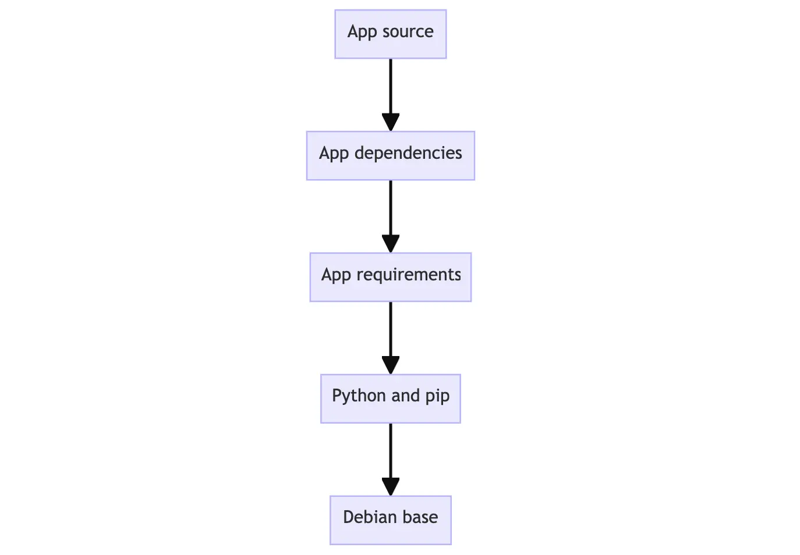

# Container


# 1. Docker的组成

当需要安装Docker时，有两种选项：**Docker Desktop**和**Docker Engine**。

Docker Desktop包含了以下部分：

1. [Docker Engine](https://docs.docker.com/engine/)
2. Docker CLI client
3. [Docker Scout](https://docs.docker.com/scout/) (additional subscription may apply)
4. [Docker Build](https://docs.docker.com/build/)
5. [Docker Extensions](https://docs.docker.com/extensions/)
6. [Docker Compose](https://docs.docker.com/compose/)
7. [Docker Content Trust](https://docs.docker.com/engine/security/trust/)
8. [Kubernetes](https://github.com/kubernetes/kubernetes/)
9. [Credential Helper](https://github.com/docker/docker-credential-helpers/)


而Docker Engine包含以下几个部分：

1. A server with a long-running daemon process [`dockerd`](https://docs.docker.com/reference/cli/dockerd).
2. APIs which specify interfaces that programs can use to talk to and instruct the Docker daemon.
3. A command line interface (CLI) client [`docker`](https://docs.docker.com/reference/cli/docker/).


其中Docker Engine是Docker Desktop的核心组件。简而言之，Docker Desktop相比于Docker Engine，主要提供了一个UI界面。但除了GUI之外，Docker Desktop与Docker Engine还有其它差别。


在Docker Desktop中，运行着一个虚拟机。


Docker Desktop与Docker Engine是可以共存的。

# 2. Docker的基本概念

Docker中有几个概念：

1. Image
2. Container
3. Registry
4. Docker Host
5. Docker Client


## 2.1 Container

```
Containers are isolated processes for each of your app's components.
```


### 2.1.1 


### 2.1.3 Persisting container data(Container Volume)

当从一个镜像启动一个容器时，这个容器的文件和配置都是从相应的镜像中获取的。容器运行过程中创建、修改和删除的文件都是临时的，不会影响到原始镜像以及其它容器，并且会随着容器被删除而被删除。

而**Container volumes**就是docker提供的持久数据存储的机制。container volume相当于容器内到容器外的一种symbol link。


首先需要创建一个volume

```sh
docker volume create <volume-name>
```

然后将这个volume挂载到容器上

```
docker run -d -p 80:80 -v <volume-name>:<directory-in-container> <container-tag>
```

这样，所有写入容器中相应目录下的文件都会被保存到相应的容器之外的volume中，即使容器被删除，这个volume依然存在。

一个volume可以被多个容器共享，从而实现容器之间的文件共享。


## 2.2 Image

Container是由Image创建而来的，Container所需要的各种依赖、文件和配置都是来自于相应的Docker image的。

```
A container image is a standardized package that includes all of the files, binaries, libraries, and configurations to run a container.
```

Images有两个非常重要的特点：

1. Images are immutable. Once an image is created, it can't be modified. You can only make a new image or add changes on top of it(Docker images只能增，不能改).
2. Container images are composed of layers. Each layer represented a set of file system changes that add, remove, or modify files(对应第一条，Docker images只能在原有的基础上，通过增加layer来实现文件的增和删除，一旦某一个layer被创建，就不可以被更改).


### 2.2.1 Building images

一个image中的每一层都包含着一些对于文件系统的改变：增加、删除和修改。


理论上container image包含下面几层：

1. The first layer adds basic commands and a package manager, such as apt.
2. The second layer installs a Python runtime and pip for dependency management.
3. The third layer copies in an application’s specific requirements.txt file.
4. The fourth layer installs that application’s specific dependencies.
5. The fifth layer copies in the actual source code of the application.



这种分层的好处是不同的image之间可以复用某一些layer。比如如果想创建两个python application的image，可以复用同一个Python base image。


docker image这种分层的机制，是通过**content-addressable storage**以及**union filesystems**实现的：

1. After each layer is downloaded, it is extracted into its own directory on the host filesystem.
2. When you run a container from an image, a union filesystem is created where layers are stacked on top of each other, creating a new and unified view.
3. When the container starts, its root directory is set to the location of this unified directory, using `chroot`.

在容器的union filesystem中，除了每一层image layer都有一个对应的目录，对于每一个从当前镜像创建的容器，也会有一个对应的目录。这就使得运行的container可以修改文件系统，但是同时又不会修改image layers，使得同一个镜像可以运行多个容器。


### 2.2.2 Dockerfile

Dockerfile是一个用于创建container image的文本文件，包含了一系列创建image的命令。

```dockerfile
FROM python:3.12
WORKDIR /usr/local/app

# Install the application dependencies
COPY requirements.txt ./
RUN pip install --no-cache-dir -r requirements.txt

# Copy in the source code
COPY src ./src
EXPOSE 5000

# Setup an app user so the container doesn't run as the root user
RUN useradd app
USER app

CMD ["uvicorn", "app.main:app", "--host", "0.0.0.0", "--port", "8080"]
```

完整的Dockerfile命令参考 [Dockerfile reference](https://docs.docker.com/engine/reference/builder/)


### 2.2.3 Build, tag, and publish an image

有了一个Dockerfile，我们就可以从这个Dockerfile build，tag以及publish一个image。

Docker构建一个image的基本命令是`docker build`。`docker build`会根据Dockerfile以及[build context](https://docs.docker.com/build/concepts/context/#what-is-a-build-context)构建相应的image。

但是当我们`docker build .`尝试构建一个镜像的时候，有的时候会报错

```
failed to fetch oauth token
```

可以通过以下方式解决

```sh
export DOCKER_BUILDKIT=0
export COMPOSE_DOCKER_CLI_BUILD=0
```

原因是因为采用buildkit构建镜像是不稳定的，所以禁用buildkit构建能够解决


采用`docker build`构建一个image后，这个image会有一个SHA256的ID，但是这个ID不方便记忆。因此需要给image一个容易记忆的名字，这个过程就是**tag**。

image的名字有一个规范

```
[HOST[:PORT_NUMBER]/]PATH[:TAG]
```

- `HOST`: The optional registry hostname where the image is located. If no host is specified, Docker's public registry at `docker.io` is used by default.
- `PORT_NUMBER`: The registry port number if a hostname is provided
- `PATH`: The path of the image, consisting of slash-separated components. For Docker Hub, the format follows `[NAMESPACE/]REPOSITORY`, where namespace is either a user's or organization's name. If no namespace is specified, `library` is used, which is the namespace for Docker Official Images.
- `TAG`: A custom, human-readable identifier that's typically used to identify different versions or variants of an image. If no tag is specified, `latest` is used by default.


当一个image有了tag之后，就可以pulish，将image上传到registry上。

```
docker push my-username/my-image
```


### 2.2.4 Building Cache

当运行`docker build`创建images时，docker会顺序执行Dockerfile中的每一条指令，对于每一条指令，docker都会创建一个layer。

docker存在一个cache，当某条指令在过去被执行过时，docker不会再执行一次，而是会采用之前缓存的layer，总而更快的构建镜像。

在一些情况下，docker的缓存会失效：

- Any changes to the command of a `RUN` instruction invalidates that layer. Docker detects the change and invalidates the build cache if there's any modification to a `RUN` command in your Dockerfile.
- Any changes to files copied into the image with the `COPY` or `ADD` instructions. Docker keeps an eye on any alterations to files within your project directory. Whether it's a change in content or properties like permissions, Docker considers these modifications as triggers to invalidate the cache.
- Once one layer is invalidated, all following layers are also invalidated. If any previous layer, including the base image or intermediary layers, has been invalidated due to changes, Docker ensures that subsequent layers relying on it are also invalidated. This keeps the build process synchronized and prevents inconsistencies.


以下面的Dockerfile作为例子

```dockerfile
FROM node:20-alpine
WORKDIR /app
COPY . .
RUN yarn install --production
EXPOSE 3000
CMD ["node", "./src/index.js"]
```

按照之前提到的docker缓存失效的几种情况，每当我们修改项目中的任何文件时，都会导致`COPY . .`这一层缓存失效，从而到后后面的`RUN`也失效，需要重新运行`yarn`安装依赖。

而修改成下面这样

```dockerfile
FROM node:20-alpine
WORKDIR /app
COPY package.json yarn.lock ./
RUN yarn install --production 
COPY . . 
EXPOSE 3000
CMD ["node", "src/index.js"]
```

如果package.json以及yarn.lock(即依赖文件)没有改变，即使是其它文件发生改变，影响的也是`COPY . .`之后的缓存，而不会重新安装依赖。


### 2.2.5 Multi-stage builds

在之前的build过程中，所有的命令都是顺序在一个container中执行的：downloading dependencies, compiling code, and packaging the application。

这些layer最终都会出现在image中，导致了image过于臃肿。而Multi-stage build就是为了解决这个问题。


## 2.3 Registry

Docker采用一个中心服务器存储和管理container images，这个中心服务器就是一个Registry，有许多公共的registry： [Docker Hub](https://hub.docker.com/)，[Amazon Elastic Container Registry(ECR)](https://aws.amazon.com/ecr/), [Azure Container Registry (ACR)](https://azure.microsoft.com/en-in/products/container-registry), and [Google Container Registry (GCR)](https://cloud.google.com/artifact-registry)


Registry和Repository不同，一个Registry下可以有多个Repository。可以把Repository看作是存放同一个项目的所有images的文件夹。


Docker Hub的免费版本允许用户创建一个私有的repository和无限的公共的repository。


## 2.4 Docker Compose

一般来说，每一个容器应该满足`do one thing and do it well`，所以对于每一种服务，尽量单独开一个容器跑。但是当多个容器之间有关联时，每当想通过`docker run`运行时，需要一个个`docker run`，并且需要设置好网络以及各个容器的参数。每一次启动都非常麻烦。

而Docker Compose就是为了解决这个问题。采用Docker Compose，可以通过一个YAML配置文件来管理。


对于一个Docker Container来说，它的一个简单的生命周期如下所示


## 2.5 Docker Architecture

