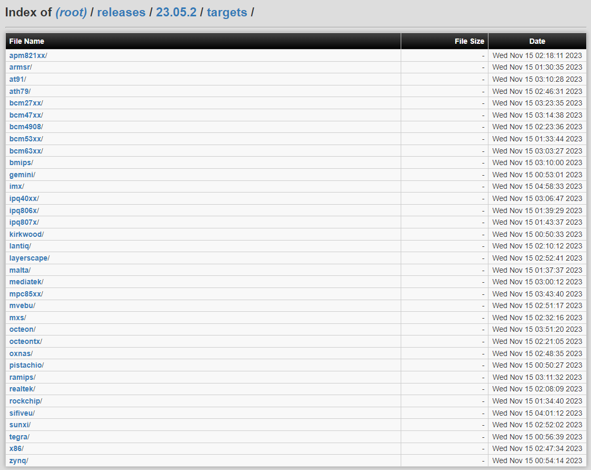
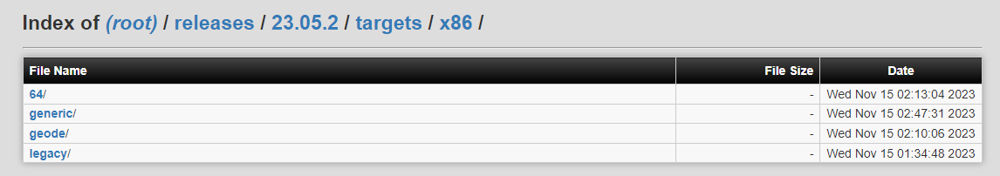
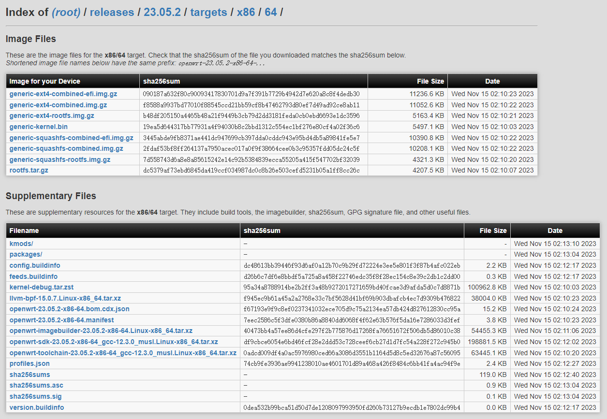
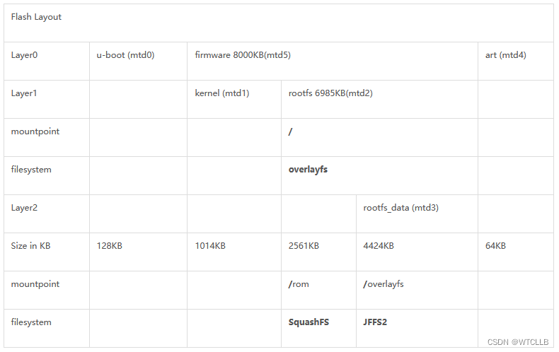
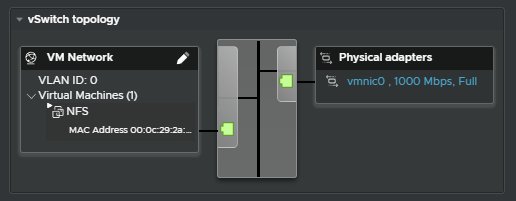
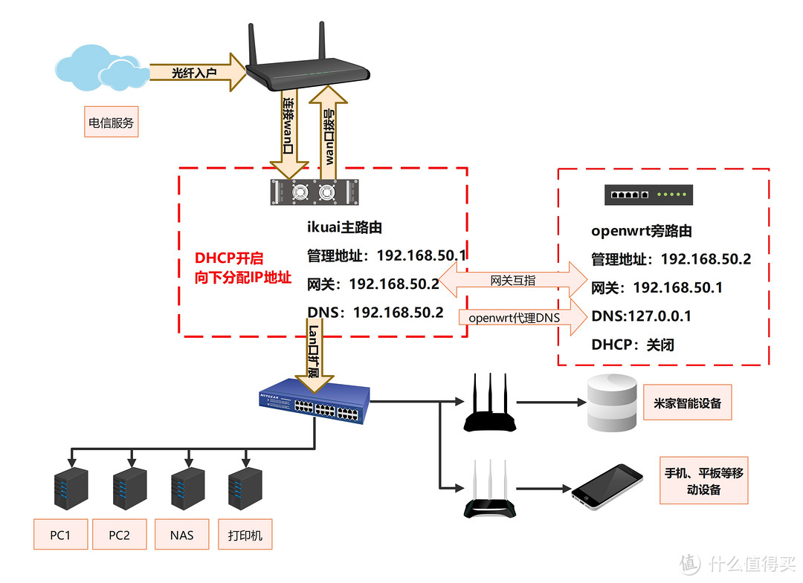

# 搭建软路由记录

环境esxi7.0.3U3o。

# 1、软路由

通过软件实现路由功能。软路由系统openwrt，ikuai，ros以及lede等。

## 1.1软路由系统

1. **LEDE（也叫Openwrt）**：开源，可以自己配置编译
2. **RouteOS（ROS）**：付费，专业
3. **ikuai **：闭源，付费
4. **PFsense**：开源
5. **Sophos**
6. **Untangle**
7. **WFilter-NGF**
8. **基于CentOS改造路由**

## 1.2 OpenWrt镜像选择

OpenWrt有多种镜像选择

首先是**处理器架构**

**以x86为例**，x86下又分为：

1. **64** x86_64
2. **generic** x86_32，奔腾4以上，i586等。
3. **geode** 为AMD geode处理器定制
4. **legacy** 停产的处理器，奔腾4之前，i386

以**x86_64**为例

1. **squashfs**：一种只读压缩文件系统，该磁盘映像使用传统布局，包括一个只读分区和一个读写分区，读写分区大小受限，可恢复出厂设置
2. **ext4**：不用多说
3. **efi**：采用UEFI
4. **combined**：包括bootloader、kernel、rootfs

OpenWRT使用**MTD**来标记Flash的每个分区，方便使用名称来操作分区；

1. u-boot(mtd0)，该分区存放引导程序bootloader；
2. kernel(mtd1)，该分区存放Linux内核；
3. rootfs(mtd2)，该分区分成两部分，一部分使用SquashFS文件系统，挂载到/rom，为只读部分，包括一些基础的文件和一些默认配置文件，另一部分为mtd3；
4. rootfs_data (mtd3)，该分区使用JFFS2文件系统，为可写部分，包括可以更改的配置文件、安装的软件包等；
5. art (mtd4)，该分区用于存储wifi的校准数据；
6. firmware (mtd5)，该分区包含分区mtd1和mtd2。

# 2、虚拟机实现

## 2.1 虚拟机创建

1. **OS**：openwrt是一个嵌入式Linux系统。客户机的操作系统选择为Linux。

2. **内存**：内存需要勾选`预留所有客户机内存`选项，锁定内存，因为后续需要**直通网卡**

3. **网卡**：方案一：虚拟网卡，esxi会虚拟出一个eth0网卡，作为默认lan口连接到esxi，是一个万兆的口，但在一定程度上损失网速并且占用CPU。

   方案二：直接直通一个物理网卡给openwrt作为lan口。

4. **启动选项**：选择EFI启动引导方式选择BIOS，并且取消勾选`启用UEFI安全引导`。

5. **openwrt镜像**：官网的openwrt镜像只是内核版本，没有其他功能，需要自己安装插件。因此可以采用网上其它预编译好的多功能版本镜像。

**虚拟化直通**：见**虚拟化技术**笔记

## 2.2 写入镜像

**StarWind V2V Converter**软件用于将虚拟机从一种格式克隆和转换为另一种格式，以及将物理机转换为虚拟机。

Physical to Virtual (P2V)

## 2.3 设置网卡

网卡配置文件位于etc/config/network。

由于设置了网卡直通，因此ESXi网络拓扑下OpenWrt并没有接入虚拟机

## 2.4 OpenWrt管理后台

1. 配置IP，DNS，网关（主路由）
2. 关闭旁路有DHCP服务，DHCP由主路由负责
3. 强制链路
4. **取消桥接接口**：如果采取直通网卡，需要取消桥接；否则不需要。

## 2.5 配置主路由

网关，首选DNS，备选DNS都改为OpenWrt（网关互指）：通过网关互指，主路由会将数据发送到OpenWrt处理，而OpenWrt处理后再发回主路由，由主路由发向外网

关于**网关互指**讨论

# 3、OpenWrt旁路由进阶使用

网络拓扑

以太网网关 172.23.136.1 子网255.255.254.0

wifi网关 172.30.128.1 子网255.255.128.0