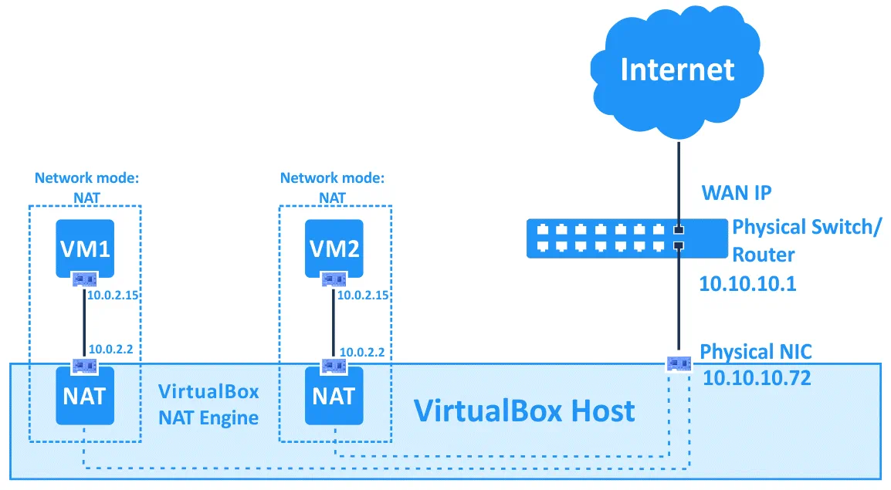
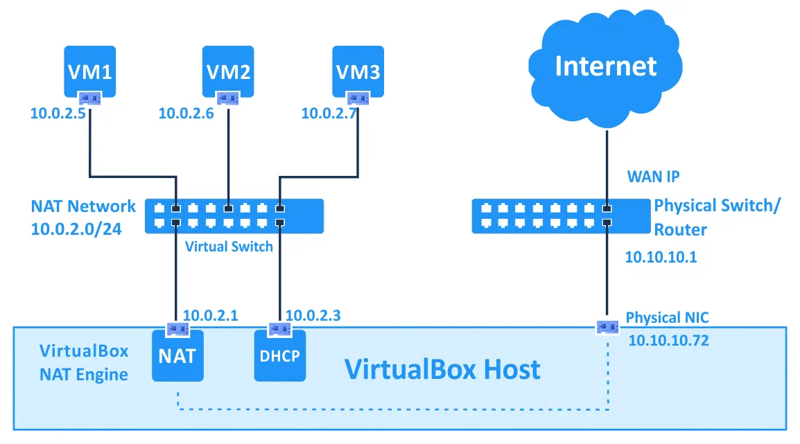
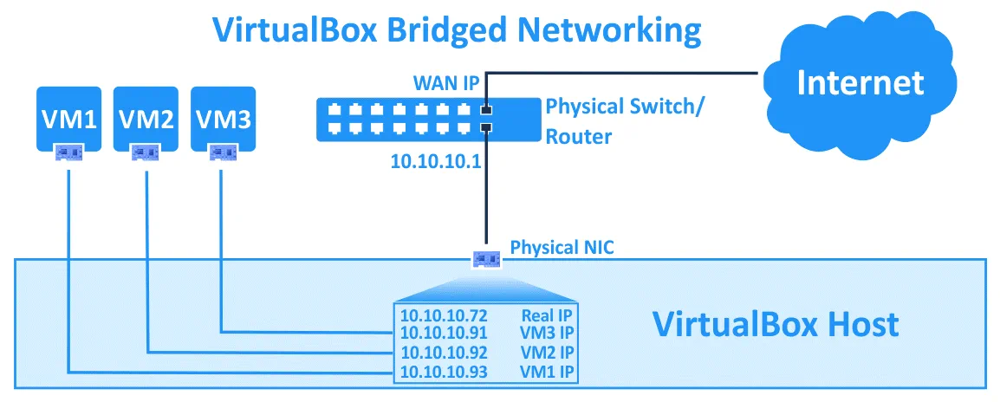
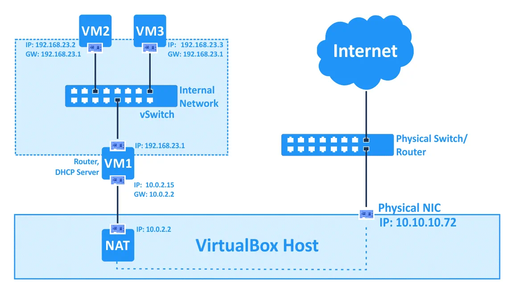
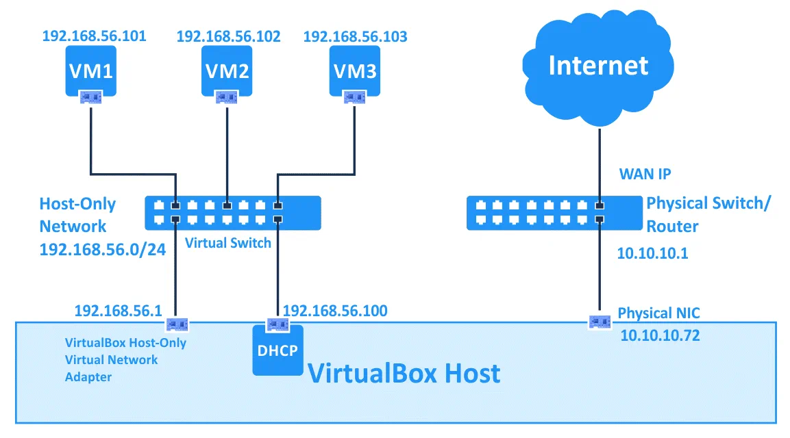
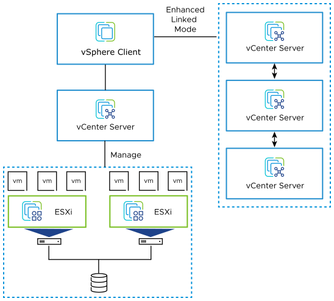

# 虚拟化实践

# 1. VMware

**VMware已经被Broadcom收购(610亿$)。**

# 2. VirtualBox

## 2.1 虚拟机中的网络配置

对于VirtualBox中，每一个VM可以有至多8个虚拟网卡，通过软件模拟的方式来实现，有六种类型

虚拟网卡的类型：

- **AMD PCnet-PCI II (Am79C970A)**
- **AMD PCnet-FAST III (Am79C973)**
- **Intel PRO/1000 MT Desktop (82540EM)**
- **Intel PRO/1000 T Server (82543GC)**
- **Intel PRO/1000 MT Server (82545EM)**
- **Paravirtualized Network Adapter (virtio-net)**

VirtualBox还提供了不同的network modes，并且不同的虚拟网卡可以配制成不同的network mode：

- **Not attached **这种情况是是模拟没有插网线的情况

- **NAT** 在这种模式下，guest OS处于一个LAN中，通过virtual NAT访问主机。但是主机无法访问到guest OS(NAT的特点，外部无法访问内部，内部可以访问外部，在这种模式下，guest OS就处于一个内部LAN中)。

  这种情况下的VM的IP通过VirtualBox内置的DHCP服务器与NAT engine分配，DHCP IP与默认网关IP为10.0.2.2，而VM获取到的IP为10.0.2.15，**这些IP无法被修改**

  

- **NAT Network** 这种模式下，多个VM之间可以互联，并且可以访问主机。但是外部不能访问VM。这种模式类似于有一个NatNetwork局域网10.0.2.0/24，有一台虚拟交换机将这个局域网内的设备连接在一块，通过一个虚拟NAT router连接到主机。

  这个局域网的IP是可以修改的。

  

- **Bridged Adapter** 这种模式用于将VM连接到host machine所连接到的物理设备上(Switch/Router)。在这种模式下，数据包是直接发送到虚拟网卡，而不需要额外的routing，并且host与VM之间可以相互访问。

  

- **Internal Network**

  

- **Host-only Adapter**

  

# 3. ESXi

### 3.1 vSphere与vCenter与ESXi的关系

vSphere是VMware数据中心产品，是一套软件的集合，包括了ESXi，vCenter以及vSphere client等。

# 4. PVE

