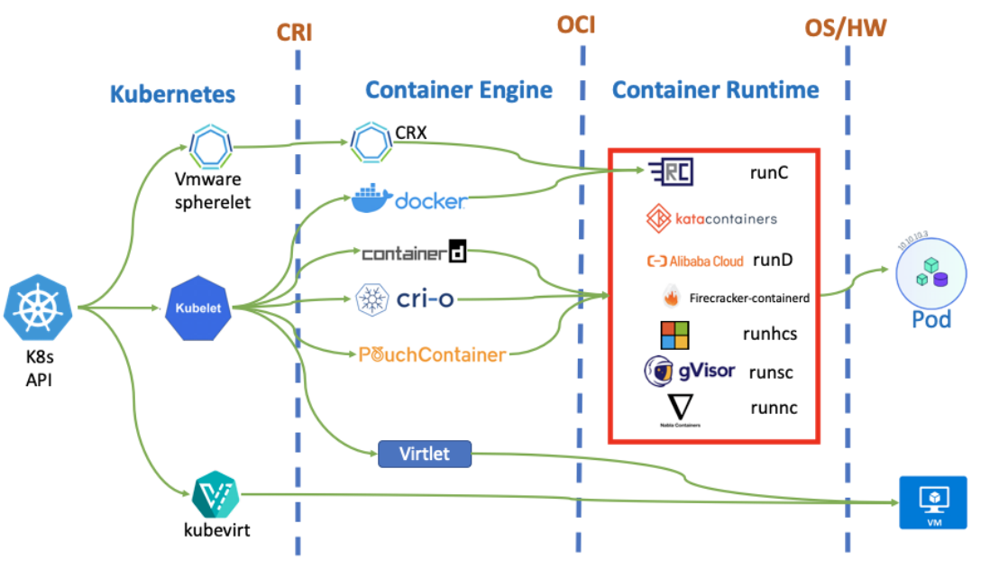
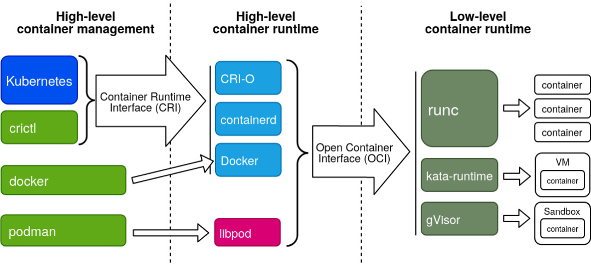

# 虚拟化技术


# 1. Containerization技术

## 1.1 Introduction

wiki官方对于Containerization技术的介绍

```wiki
In software engineering, containerization is operating system-level virtualization or application-level virtualization over multiple network resources so that software applications can run in isolated user spaces called containers in any cloud or non-cloud environment, regardless of type or vendor.
```

从wiki官方的介绍可以对Containerization技术有一个大概的了解：

- 其是一种**operating system-level virtualization/application-level virtualization**技术
- cloud/non-cloud environment
- regardless of type or vendor
- sharing a common operating system kernel


Container分为两类：

- **OS containers**
- **Application containers**


容器 = 容器镜像 + 执行引擎


## 1.2 Container management, orchestration, clustering


## 1.3 Containerization的发展

### 1.3.1 OS-level virtualization

wiki对于OS-level virtualization的介绍

```wiki
OS-level virtualization is an operating system (OS) virtualization paradigm in which the kernel allows the existence of multiple isolated user space instances, called containers (LXC, Solaris containers, AIX WPARs, HP-UX SRP Containers, Docker, Podman), zones (Solaris containers), virtual private servers (OpenVZ), partitions, virtual environments (VEs), virtual kernels (DragonFly BSD), or jails (FreeBSD jail or chroot jail).
```

关键词：the existence of multiple isolated [user space](https://en.wikipedia.org/wiki/User_space_and_kernel_space) instances，这些isolated [user space](https://en.wikipedia.org/wiki/User_space_and_kernel_space) instances就叫做contrainer。


#### 1.3.1.1 chroot与jail

container技术最早可以追溯到**chroot**。

wiki对于chroot的介绍

```
chroot is an operation on Unix and Unix-like operating systems that changes the apparent root directory for the current running process and its children. 
```

`chroot`可以改变进程的root directory，通过指定一个path，chroot可以将这个path作为进程的root directory，因此对于该进程来说，其`/`目录就是path目录。


#### 1.3.1.2 cgroups(control groups)，namespaces与LXC(Linux Container)


### 1.3.2



Containerization技术的组成：

- Container Engine
- Container Runtime




一个容器管理系统分为三层：

1. High-level Container Management
2. High-level Container Runtime(Container Engine)
3. Low-level Container Runtime(Container Runtime)

层与层之间有着接口，High-level Container Management 和 Container Engine 之间的接口规范是 CRI，Container Engine 和Container Runtime 之间的接口规范是 OCI。


### 1.3.？


## 1.4 使用Container


### 1.4.1 Docker


# 2. SR-IOV