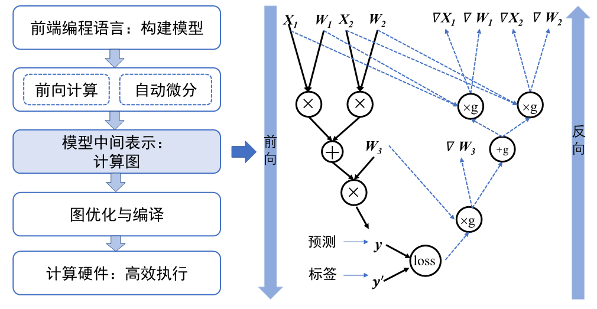
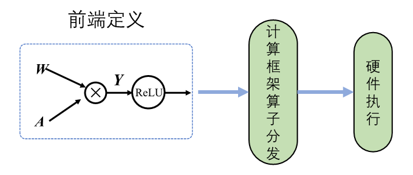
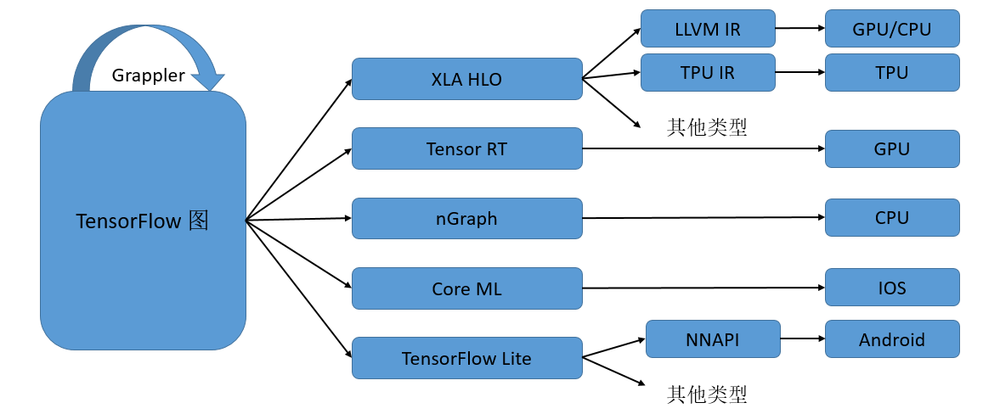
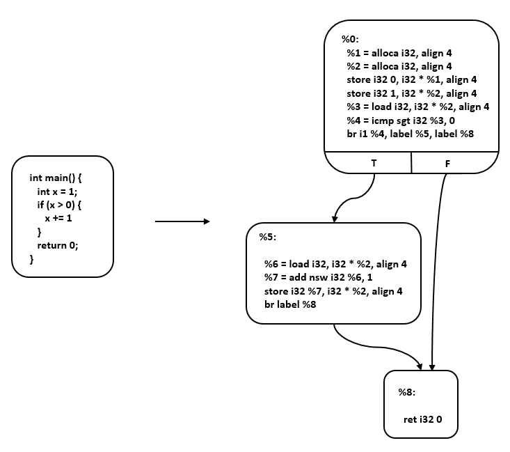

# 机器学习系统：设计与实现

# 4、计算图

## 4.1 计算图背景与作用

早期的机器学习框架描述的神经网络结构简单，可以用简单的配置文件表达网络结构（如Caffe基于Protocol Buffer定义模型）。但随着网络结构越来越复杂，需要通过基于计算图的框架来理解，描述以及执行模型。


下图是基于计算图的架构，前后端分离的设计：

1. **统一的计算过程表达** 不同的高层次语言（前端）表达成一个统一的数据结构（中间表示即计算图）共享底层（后端）。计算图可以表述用户的输入数据、模型中的计算逻辑（通常称为算子）以及算子之间的执行顺序。
2. **自动化计算梯度**
3. **分析模型变量生命周期** 通过计算图分析计算产生的中间变量何时产生以及销毁
4. **优化程序执行** 系统利用计算图找到最佳并行计算策略




## 4.2 计算图的构成

计算图由基本数据结构**张量**（Tensor）和基本运算单元**算子**构成。

### 4.2.1 张量（Tensor）与算子

张量不仅存储数据，还需要存储张量自身的信息（名字，数据类型和存储位置等）。

张量还可分为不规则张量和系数张量


算子也分多种类型：

- **张量操作算子**：包括张量的结构操作和数学运算。张量的结构操作通常用于张量的形状、维度调整以及张量合并等，比如在卷积神经网络中可以选择图像数据以通道在前或者通道在后的格式来进行计算，调整图像张量的通道顺序就需要结构操作。张量相关的数学运算算子，例如矩阵乘法、计算范数、行列式和特征值计算，在机器学习模型的梯度计算中经常被使用到。
- **神经网络算子**：包括特征提取、激活函数、损失函数、优化算法等，是构建神经网络模型频繁使用的核心算子。常见的卷积操作就是特征提取算子，用来提取比原输入更具代表性的特征张量。激活函数能够增加神经网络模型非线性能力，帮助模型表达更加复杂的数据特征关系。损失函数和优化算法则与模型参数训练更新息息相关。
- **数据流算子**：包含数据的预处理与数据载入相关算子，数据预处理算子主要是针对图像数据和文本数据的裁剪填充、归一化、数据增强等操作。数据载入算子通常会对数据集进行随机乱序(Shuffle)、分批次载入(Batch)以及预载入(Pre-fetch)等操作。数据流操作主要功能是对原始数据进行处理后，转换为机器学习框架本身支持的数据格式，并且按照迭代次数输入给网络进行训练或者推理，提升数据载入速度，减少内存占用空间，降低网络训练数据等待时间。
- **控制流算子**：可以控制计算图中的数据流向，当表示灵活复杂的模型时需要控制流。使用频率比较高的控制流算子有条件运算符和循环运算符。控制流操作一般分为两类，机器学习框架本身提供的控制流操作符和前端语言控制流操作符。控制流操作不仅会影响神经网络模型前向运算的数据流向，也会影响反向梯度运算的数据流向。


### 4.2.2 计算依赖

算子之间的依赖关系影响算子执行顺序与并行情况。三种依赖关系：

1. **直接依赖**
2. **间接依赖**
3. **相互独立**

**计算图是一个有向无环图**，不允许存在循环依赖。


循环依赖导致正反馈，数值传递过程中被无限放大，造成上溢或者下溢。所有应该避免算子间循环依赖。


**循环关系**通过**展开（Unrolling）**机制实现。


```
区分循环关系和循环依赖的关键在于，具有两个独特标识符的计算节点之间是否存在相互依赖关系。循环关系在展开复制计算子图的时候会给复制的所有张量和运算符赋予新的标识符，区分被复制的原始子图，以避免形成循环依赖。
```


### 4.2.3 控制流

目前主流的机器学习框架中通常使用两种方式来提供控制流：

- **前端语言控制流**：通过Python语言控制流语句来进行计算图中的控制决策。使用前端语言控制流构建模型结构简便快捷，但是由于机器学习框架的数据计算运行在后端硬件，造成控制流和数据流之间的分离，计算图不能完整运行在后端计算硬件上。因此这类实现方式也被称为**图外方法（Out-of-Graph Approach）**
- **机器学习框架控制原语**：机器学习框架在内部设计了低级别细粒度的控制原语运算符。低级别控制原语运算符能够执行在计算硬件上，与模型结构结合使用可将整体计算图在后端运算，这种实现方式也被称为**图内方法（In-Graph Approach）**

图外方法：Python中的if-else、while和for等。

图内方法：TensorFlow中的tf.cond、tf.while_loop和tf.case等，更加底层。

图外方法虽然易用，但后端计算硬件可能无法支持前端语言的运行环境，导致无法直接执行前端语言控制流。而图内方法虽然编写烦琐，但可以不依赖前端语言环境直接在计算硬件上执行。在进行模型编译、优化与运行时都具备优势，提高运行效率。

两种方法各有应用场景。

当存在控制流时，构造的反向梯度计算图也需要生成相应的控制流

条件控制


循环控制，循环控制需要展开，对于每一个相同的运算操作都要赋予一个唯一的标识符，以区分相同操作的多次调用。

每一次循环都直接依赖于前一次循环的计算结果，所以在循环控制中需要维护一个张量列表，将循环迭代的**中间结果**缓存起来，这些中间结果将参与前向计算和梯度计算。


### 4.2.4 基于链式法则计算梯度


在计算梯度时，需要时使用到前向图的中间结果以及参数值(即**W**)，因此需要**管理中间结果的内存周期**从而更高效地完成计算。

## 4.3 计算图生成

**静态图**：固定，执行期间不依赖前端语言描述，用于部署

**动态图**：需要根据前端语言描述动态生成，用于结构调整

### 4.3.1 静态生成

先编译成**计算图**后执行


**数据占位符(Placeholder)**：机器学习框架在进行静态生成编译时并不读取输入数据，此时需要一种特殊的张量来表示输入数据辅助构建完整的计算图，这种特殊的张量就是数据占位符。


静态计算图的两大优势：

- **计算性能**

  ```
  静态图经过机器学习框架编译时能够获取模型完整的图拓扑关系。机器学习框架掌控全局信息便更容易制定计算图的优化策略，比如算子融合将网络中的两个或多个细粒度的算子融合为一个粗粒度算子
  ```

- **直接部署**

  ```
  在部署模型进行应用时，可以将静态计算图序列化保存。在模型推理阶段，执行序列化的模型即可，无需重新编译前端语言源代码。机器学习框架可以将静态计算图转换为支持不同计算硬件直接调用的代码。结合计算图序列化和计算图转硬件代码两种特性，静态图模型可以直接部署在不同的硬件上面，提供高效的推理服务。
  ```

**计算图序列化**与**计算图转硬件代码**：

- **计算图序列化**：通过计算图序列化保存，在模型推理阶段直接执行序列化的模型即可，不需要重新再编译出计算图。
- **计算图转硬件码**：将静态计算图转换为支持不同计算硬件直接调用的代码。

### 4.3.2 动态生成

动态图采用解析式的执行方式，边编译边执行

```
动态图采用前端语言自身的解释器对代码进行解析，利用机器学习框架本身的算子分发功能，算子会即刻执行并输出结果。动态图模式采用用户友好的命令式编程范式，使用前端语言构建神经网络模型更加简洁，深受广大深度学习研究者青睐。
```



**算子分发功能**

```
使用前端语言构建完成模型表达后，动态生成并不采用机器学习框架编译器生成完整的静态计算图，而是采用前端语言的解释器Python API调用机器学习框架，框架利用自身的算子分发功能，将Python调用的算子在相应的硬件如CPU、GPU、NPU等上进行加速计算，然后再将计算结果返回给前端。该过程并不产生静态的计算图，而是按照前端语言描述模型结构，按照计算依赖关系进行调度执行，动态生成临时的图拓扑结构。
```


### 4.3.3 二者的一个比较

| 特性             | 静态图               | 动态图               |
| ---------------- | -------------------- | -------------------- |
| 即时获取中间结果 | 否                   | 是                   |
| 代码调试难易     | 难                   | 易                   |
| 控制流实现方式   | 特定的语法           | 前端语言语法         |
| 性能             | 优化策略多，性能更佳 | 图优化受限，性能较差 |
| 内存占用         | 内存占用少           | 内存占用相对较多     |
| 内存占用         | 可直接部署           | 不可直接部署         |

### 4.3.4 动态图与静态图的转换和融合

目前各大机器学习框架TF，Torch等，都能够将动态图转换为静态图。

| 框架         | 动态图转静态图                                               |
| ------------ | ------------------------------------------------------------ |
| TensorFlow   | @tf_function追踪算子调度构建静态 图，其中AutoGraph机制可以自动转换控制流为静态表达 |
| MindSpore    | contex t.set_context(mode=context.PYNATIVE_MODE)动态图模 式，context.set_context(mode=context.GRAPH_MODE) 静态图模式，@ms_function支持基于源码转换 |
| PyTorch      | torch.jit.script()支 持基于源码转换，torch.jit.trace()支持基于追踪转换 |
| PaddlePaddle | paddle.jit.to_static()支持基于源码转换 ，paddle.jit.TracedLayer.trace()支持基于追踪转换 |

动态图转换为静态图的实现方式有两种：

- **基于追踪转换**：以动态图模式执行并记录调度的算子，构建和保存为静态图模型。
- **基于源码转换**：分析前端代码来将动态图代码自动转写为静态图代码，并在底层自动帮用户使用静态图执行器运行。


## 4.4 计算图的调度

模型的训练就是按照设定好的训练迭代次数来循环执行计算图的过程。


### 4.4.1 算子调度执行

分为两步：

1. 通过拓扑排序，得到线性的算子调度序列
2. 将线性序列中的算子分配到指令流进行运算，尽可能将序列中的算子并行执行，提高计算资源的利用率


拓扑排序就是不断循环将入度为0的节点取出放入队列中，直至有向无环图中的全部节点都加入到队列中。

生成调度序列之后，需要将序列中的算子与数据分发到指定的GPU/NPU上执行运算。根据算子依赖关系和计算设备数量，可以将无相互依赖关系的算子分发到不同的计算设备，同时执行运算，这一过程称之为并行计算。

### 4.4.2 串行与并行


并行可以将两个互相独立的算子分配到两个硬件上做并行计算。


并行也有不同的程度：

- **算子并行** 将单个算子拆分成多个相互独立的算子
- **模型并行** 将计算图进行合理的拆分，分配到不同的设备上并行
- **数据并行** 同时以不同的数据训练多个相同结构的计算图

### 4.4.3 数据载入同步与异步机制

```
一次完整计算图的训练执行过程包含：数据载入、数据预处理、网络训练三个环节。三个环节之间的任务调度是以串行方式进行，每一个环节都有赖于前一个环节的输出。但计算图的训练是多轮迭代的过程，多轮训练之间的三个环节可以用同步与异步两种机制来进行调度执行。
```


下面这种异步方式类似于流水线，数据载入属于I/O操作，预处理由别的模块完成而训练由计算图进行，三个阶段可以并行。


而将异步与并行结合在一起，通过异步降低延时，通过并行提高吞吐


# 5、AI编译器和前端技术

AI编译器是一种从编译器中衍生出来的一种。

## 5.1 AI编译器设计原理

AI编译器主要受到LLVM的影响，关于LLVM，[看这里](../编译原理/LLVM)


LLVM的整体架构如上图所示，通过这样的设计，无论是新增硬件的支持，还是新增前端的支持，都可以尽可能地复用IR相关的部分。

IR可以是单层也可以是多层，而LLVM是典型的单层IR，其前后端优化都基于相同的LLVM IR进行。


而AI编译器一般采用**多层IR**，下图是Tensorflow的MLIR设计



TF的MLIR(Muti-Level IR)包含了三个层次：

- **TensorFlow Graph IR**
- **XLA（Accelerated Linear Algebra，加速线性代数）**
- **HLO（High Level Operations，高级运算）**
- **特定硬件的LLVM IR 或者TPU IR**

```
Graph IR主要实现整图级别的优化和操作，如图优化、图切分等，比较适合静态图的执行模式。由于整图级别的IR缺少相应的硬件信息，难以进行硬件相关的优化，所以在中间层次就出现了硬件相关的通用编译优化，比如XLA、Tensor RT、MindSpore的图算融合等，它们能够针对不同的硬件进行算子融合等优化，提升不同网络在特定硬件上的执行性能。
最后一个层次的IR是特定硬件加速器专有的IR，一般由硬件厂商自带的编译器提供，如Ascend硬件自带的TBE编译器就是基于TVM的Halide IR生成高效的执行算子。
多层级IR的优势是IR表达上更加地灵活，可以在不同层级的IR上进行合适的PASS优化，更加便捷和高效。 但是多层级IR也存在一些劣势。首先，多层级IR需要进行不同IR之间的转换，而IR转换要做到完全兼容是非常困难的，工程工作量很大，还可能带来信息的损失。上一层IR优化掉某些信息之后，下一层需要考虑其影响，因此IR转换对优化执行的顺序有着更强的约束。其次，多层级IR有些优化既可以在上一层IR进行，也可以在下一层IR进行，让框架开发者很难选择。最后，不同层级IR定义的算子粒度大小不同，可能会给精度带来一定的影响。
```


## 5.2 AI编译器前端技术概述


AI编译器前端与传统编译器的不同之处在与对**自动微分**功能的支持。但是为了能够支持自动微分，AI编译器需要在传统中间表示的基础上设计新的中间表示结构。


### 5.2.1 中间表示

传统机器学习框架的中间表示分为三大类，分别是**线性中间表示，图中间表示以及混合中间表示**。传统编译器的中间表示难以完全满足机器学习框架对于中间表示的一系列需求。因此，机器学习框架的开发者在传统中间表示的设计基础上不断扩展，提出了很多适用于机器学习框架的中间表示。

## 

### 5.2.2 自动微分

自动微分(Automatic Differentiation， AD)是一种介于**符号微分**和**数值微分**之间的针对计算图进行符号解析的求导方法

自动微分通常在编译器前端优化中实现，通过对中间表示的符号解析来生成带有梯度函数的中间表示。


### 5.2.3 类型系统与静态分析

为了有效减少程序在运行时可能出现的错误，编译器的前端引入了类型系统（Type System）和静态分析（Static Analysis）系统。类型系统可以防止程序在运行时发生类型错误，而静态分析能够为编译优化提供线索和信息，有效减少代码中存在的结构性错误、安全漏洞等问题。


### 5.2.4 前端编译优化

前端的编译优化与硬件无关。


## 5.3 中间表示IR


### 5.3.1 中间表示的基本概念


### 5.3.2 中间表示的种类

| 组织结构 特点 | 举例                         |                            |
| ------------- | ---------------------------- | -------------------------- |
| Linear IR     | 基于线性代码 堆栈机代码      | 三地址代码                 |
| Graphical IR  | 基于图 抽象语                | 法树、有向无环图、控制流图 |
| Hybrid IR     | 基于图与线性代码混合 LLVM IR |                            |


#### 5.3.2.1 线性中间表示

常用线性中间表示有**堆栈机代码(Stack-Machine Code)和三地址代码(Three Address Code)**。

堆栈机代码是一种单地址代码；而三地址代码模拟的是RISC机器的指令格式，通过一个**四元组(一个运算符和三个地址(两个操作数、一个目标))**实现。


#### 5.3.2.2 图中间表示

常见的图中间表示有**抽象语法树(Abstract Syntax Tree，AST)、有向无环图(Directed Acyclic Graph，DAG)、控制流图(Control-Flow Graph，CFG)**等。


相比于AST存在冗余，DAG通过重用相同的子树，一个结点可以有多个父结点来消除冗余。


#### 5.3.2.3 混合中间表示

LLVM IR采用的就是混合中间表示。

LLVM IR采用线性中间表示表示一个`BasicBlock`，采用图中间表示表示这些`BasicBlock`之间的控制流。

基本块中，每条指令以静态单赋值(Static Single Assignment， SSA)的形式。SSA形式要求每个变量只赋值一次，并且每个变量在使用之前定义。




### 5.3.3 机器学习框架的中间表示

AI编译器的中间表示需要考虑以下几个方面：

- **张量表达**
- 前端语言构建完成模型表达后，动态生成并不采用机器学习框架编译器生成完整的静态计算图，而是采用前端语言的解释器Python API调用机器学习框架，框架利用自身的算子分发功能，将Python调用的算子在相应的硬件如CPU、GPU、NPU等上进行加速计算，然后再将计算结果返回给前端。该过程并不产生静态的计算图，而是按照前端**自动微分**
- **计算图模式** 采用静态图还是动态图
- **支持高阶函数和闭包** 这一部分涉及到函数式编成，看[这里]()
- **编译优化** AI编译器的优化主要包括：**硬件无关的优化、硬件相关的优化、部署推理相关的优化**等，都依赖于IR的实现
- **JIT**


一些主流的机器学习框架的中间表示

#### 5.3.3.1 PyTorch

PyTorch基于动态图。Torch采用TorchScript IR作为IR。TorchScript IR是基于SSA的线性IR，通过JIT的**Tracing**和**Scripting**方法将Python转变为TorchScript IR。


#### 5.3.3.2 Jax

Jax同时支持静态图与动态图，其中间表示采用Jaxpr(JAX Program Representation) IR。

Jaxpr IR采用ANF(A-norm Form)的函数式形式。


#### 5.3.3.3 TensorFlow

TF同时支持静态图与动态图。但是其静态图的机制更加知名。在静态图机制中，运行TensorFlow的程序会经历一系列的抽象以及分析，程序会逐步从高层的中间表示向底层的中间表示进行转换，我们把这种变换成为**lowering**。


为了适配不同的硬件平台，基于静态计算图，TensorFlow采用了多种IR设计。


蓝色部分是基于图的中间表示，绿色部分是基于SSA的中间表示。在中间表示的转换过程中，各个层级的中间表示各自为政，无法互相有效地沟通信息，也不清楚其他层级的中间表示做了哪些优化，因此每个中间表示只能尽力将当前的优化做到最好，造成了很多优化在每个层级的中间表示中重复进行, 从而导致优化效率的低下。尤其是从图中间表示到SSA中间表示的变化过大，转换开销极大。此外，各个层级的相同优化的代码无法复用，也降低了开发效率。


#### 5.3.3.4 MLIR

而MLIR就是为了解决上面TensorFlow架构存在的问题。

MLIR详细看[这里](../编译原理/编译技术.md#5.3.3-MLIR(**M**ulti-**L**evel **I**ntermediate **R**epresentation))


#### 5.3.3.5 MindSpore

略


## 5.4 自动微分

计算机求导方法有以下几种：

- **手工微分(Manual Differentiation)**
- **数值微分(Numerical Differentiation)**
- **符号微分(Symbolic Differentiation)**
- **自动微分(Automatic Differentiation)**


# 6. 编译器后端和运行时


## 6.1 概述

编译器前端主要将用户代码进行解析翻译得到计算图IR，并对其进行设备信息无关的优化，此时的优化并不考虑程序执行的底层硬件信息。**编译器后端的主要职责是对前端下发的IR做进一步的计算图优化，让其更加贴合硬件，并为IR中的计算节点选择在硬件上执行的算子，然后为每个算子的输入输出分配硬件内存，最终生成一个可以在硬件上执行的任务序列。**


编译器前端生成的IR属于一个较高的抽象层次，隐藏一些底层运行的细节信息，此时无法直接对应硬件上的算子。通过对IR进行算子拆分与融合，得到一个优化后的计算图。再经过算子选择，得到一个完整的算子序列，最后遍历算子序列，为每个算子分配相应的输入输出内存，然后将算子加载到设备上执行计算。


## 6.2 计算图优化

后端的计算图优化主要是针对硬件的优化，根据优化适用于所有硬件还是只适合特定硬件，可以分为**通用硬件优化**和**特定硬件优化**，例如为了适配硬件指令限制而做的子图变换和与特定硬件无关的算子内存IO优化。


### 6.2.1 通用硬件优化

硬件无关，核心是子图的等价变换：在计算图中尝试匹配特定的子图结构，找到目标子图结构后，通过等价替换方式，将其替换成对硬件更友好的子图结构。

算子按照对于资源的需求可以分为两类：**计算密集型算子**与**访存密集型算子**。

计算密集型算子的时间绝大部分花在计算上，如卷积、全连接；访存密集型算子的时间绝大部分花在访存上，他们大部分是Element-Wise算子，例如 ReLU、Element-Wise Sum等。

一般来说计算密集型与访存密集型算子是相伴出现的，比如Conv + ReLU，因此二者可以融合在一块。


### 6.2.2 特定硬件优化

特定硬件优化是指该计算图的优化是在特定硬件上才能做的优化，常见的基于硬件的优化包括由于**硬件指令的限制**而做的优化，**特定硬件存储格式**导致的优化等。


**硬件指令的限制**

在一些特定的硬件上，IR中计算节点没有直接对应的硬件算子，只能通过子图的变换来达到子图中所有算子在对应的硬件上的存在。


**数据排布格式的限制**


## 6.3 算子选择

**计算图优化使得计算图上的每一个结点都有一组算子与之对应。**

计算图优化后，需要对IR图上的每个节点进行算子选择，才能生成真正在设备上执行的算子序列。由于IR图上的节点可能有后端的很多算子与其对应，不同规格的算子在不同的情况下执行效率各不相同，在算子选择阶段的主要任务就是如何根据IR图中的信息在众多算子中选择出最合适的一个算子去目标设备上执行。


### 6.3.1 算子选择的基础概念

对于经过图优化之后的IR计算图，其中每一个结点都有一个或者一组算子与之对应。每一个结点都是一个最小的硬件执行单元，但是这个执行单元并没有具体设备相关的信息(**算子信息**)。

**算子信息**包括：

1. 数据排布格式，NHWC还是HCHW。
2. 计算精度，float32，float16还是int8等。


**数据排布格式**

MLSYS中的数据排布格式一般有两种，NCHW与NHWC。对于这两种数据格式，都需要要将其展开成一维存储在内存中。因此就涉及到如何从逻辑索引映射到内存中的索引。

对于NCHW，其映射关系如下


PyTorch默认采用的就是NCHW的格式。


对于NHWC，其映射关系如下


TensorFlow默认采用NHWC格式，在PyTorch中称之为Channel-Last。


但是在硬件上，这两种数据排布格式可能不是最优的。

```
在机器学习系统中，用户输入的数据往往会远远大于计算部件一次性计算所能容纳的最大范围，所以此时必须将输入的数据进行切片分批送到运算部件中进行运算。为了加速运算很多框架又引入了一些块布局格式来进行进一步的优化，这种优化可以使用一些硬件的加速指令，对数据进行搬移和运算。比如oneDNN上的nChw16c 和nChw8c 格式，以及Ascend芯片的5HD等格式。这种特殊的数据格式与硬件更为贴合，可以快速的将矩阵向量化，并且极大的利用片内缓存。
```


**数据精度**

关于浮点数参考IEEE 754浮点数标准。

在IEEE 754之外，Google也有自己的bfloat16标准。


**算子信息库**

对于不同的数据格式与不同的数据精度，不同的硬件下会有不同的算子支持。一个硬件上支持的所有算子的集合定义为该硬件的算子信息库。


### 7.3.2 算子选择的过程


## 7.4 内存分配


### 7.4.1 Host内存与Device内存


### 7.4.2 内存分配

计算图中算子的输入输出分配的是Device内存。


内存池


### 7.4.3 内存复用


## 7.5 计算调度与执行

根据是否将算子编译为计算图，计算的调度可以分为**单算子调度**与**计算图调度**两种方式。

而根据硬件提供的能力差异，计算图的执行方式又可以分为逐算子下发执行的**交互式执行**以及将整个计算图或者部分子图一次性下发到硬件的**下沉式执行**两种模式。


### 7.5.1 单算子调度

单算子调度是相对于计算图而言，算法或者模型中包含的算子通过Python语言的运行时被逐个调度执行。

PyTorch的默认执行方式，TensorFlow的Eager模式以及MindSpore的PyNative模式都是属于单算子调度。

算子在Python侧被触发执行后，会经过机器学习框架初始化，其中需要确定包括算子的精度，输入与输出的类型和大小以及对应的硬件设备等信息，接着框架会为该算子分配计算所需的内存，最后交给具体的硬件计算设备完成计算的执行。


```
单算子调度方式的好处在于其灵活性，由于算子直接通过Python运行时调度，一方面可以表达任意复杂的计算逻辑，尤其是在需要复杂控制流以及需要Python原生数据结构支持来实现复杂算法的场景；另一方面单算子调度对于程序正确性的调试非常便利，开发人员可以在代码执行过程中打印任意需要调试的变量；最后一点是通过Python运行时驱动算子的方式，可以在计算中与Python庞大而丰富的生态库协同完成计算任务。
```


### 7.5.2 计算图调度

单算子调度一方面是难于进行计算性能的优化，原因是由于缺乏计算图的全局信息，单算子执行时无法根据上下文完成算子融合，代数化简等优化；另一方面由于缺乏计算的拓扑关系，整个计算只能串行调度执行，即无法通过运行时完成并行计算。


对于异构环境，一张计算图可以由运行在不同设备上的算子组成为异构计算图。不同硬件上的算子有：

- **CPU算子**
- **GPU算子**
- **NPU算子**
- **Python算子** Python算子与CPU算子都是在CPU上运行

异构计算图需要能够准确标识算子执行所在的设备。


## 7.6 算子编译器(其实就是NN Compiler)

这一部分就是涉及到[介绍AI Compiler](../编译原理/编译器发展史.md#AI-Compiler)中所提到的关于优化方面的策略。

从目的上来说，算子编译器致力于提高算子的**执行性能**。从工程实现上来说，算子编译器的输入一般为Python等**动态语言**描述的张量计算，而输出一般为**特定AI芯片**上的可执行文件。

### 7.6.1 算子调度策略


### 7.6.2 子策略组合优化


### 7.6.3 调度空间算法优化

通过对调度空间搜索/求解，自动生成对应算子调度。


# 8. 硬件加速器

