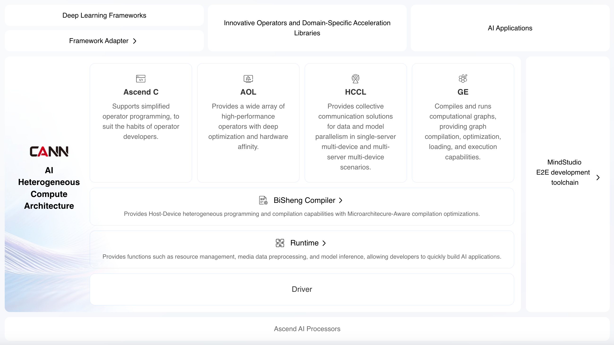
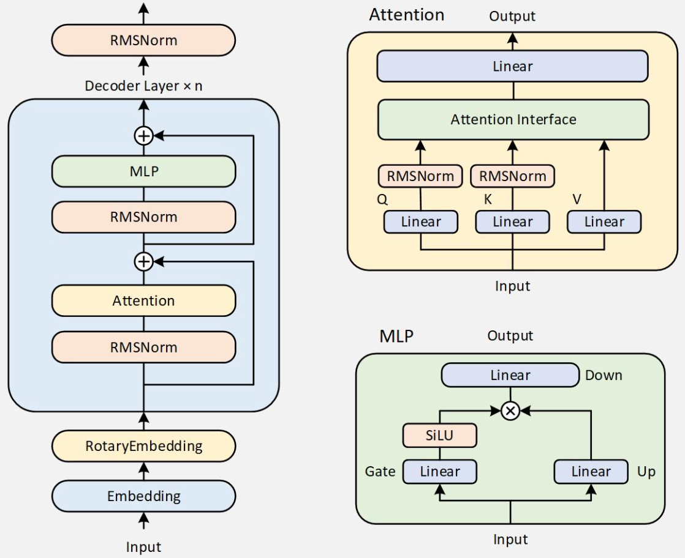

# CANN架构与算子开发

## CANN架构

## CANN算子开发方式

### 基于TBE的算子开发

TBE DSL/TBE TIK

算子的执行分为计算过程与调度过程

## Ascend平台算子融合记录

针对Qwen3 Dense模型。

Qwen3 Dense模型结构如下

主要分为以下几类算子：

1. Attention类，Attention算子采用vllm自带的FlashAttention以及PageAttention的实现
2. Linear类，QKV三个矩阵融合
3. Rope旋转位置编码，**TODO**
4. RMSNorm算子
5. SwiGLU算子，通过将整个MLP融合成一个算子实现融合[**Done**]，实现方式参考https://www.hiascend.com/doc_center/source/zh/Pytorch/60RC1/apiref/apilist/ptaoplist_000744.html

**TODO：**

1. 探索Rope算子的融合，可以参考https://gitee.com/ascend/cann-ops-adv中的Rope算子融合
2. torchair图模式的优化

