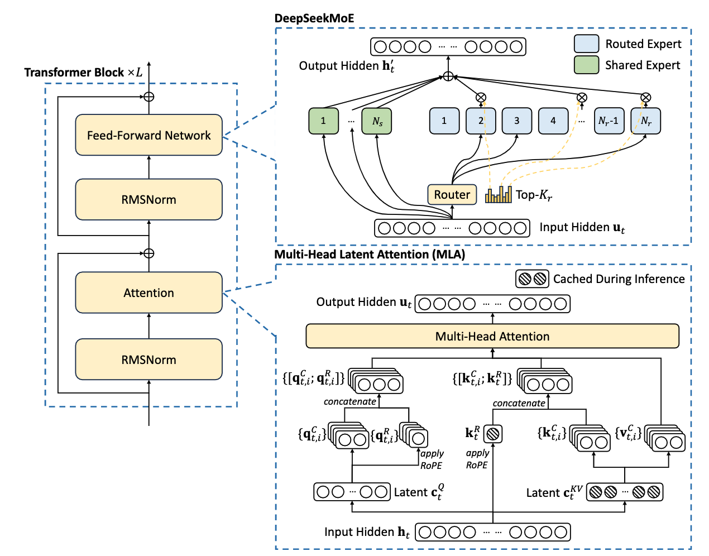
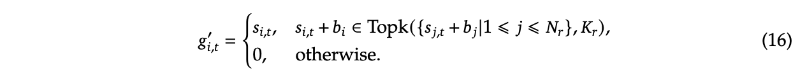
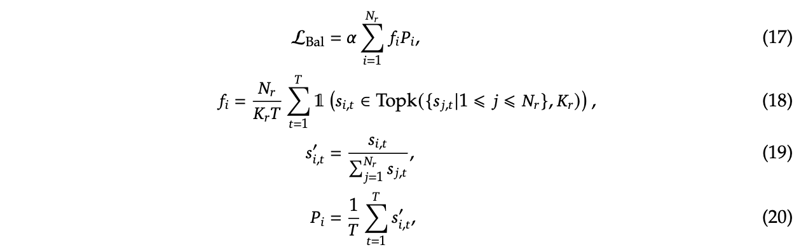

# DeepSeek-V3/R1技术报告

## Abstract

| 一些重要参数          | 解释                                                         | Value |
| --------------------- | ------------------------------------------------------------ | ----- |
| hidden_act            | 激活函数，V3采用的是SiLU                                     |       |
| hidden_size           |                                                              | 7168  |
| intermediate_size     | 由于V3的前3层是dense FFN结构，所以这里的intermediate_size是dense FFN的中间维度，大小是9xmoe_intermediate_size | 18432 |
| kv_lora_rank          | 原文中$c_t^{KV}$的维度                                       | 512   |
| q_lora_rank           | 原文中$c_t^{Q}$的维度                                        | 1536  |
| qk_nope_head_dim      | 每个head的query和key的非位置编码维度                         | 128   |
| qk_rope_head_dim      | 每个head的query和key的位置编码维度                           | 64    |
| v_head_dim            |                                                              | 128   |
| num_attention_heads   |                                                              | 128   |
| num_key_value_heads   |                                                              | 128   |
| moe_intermediate_size | 每个专家的FFN的中间维度                                      | 2048  |
| n_routed_experts      | 可被路由的专家个数                                           | 256   |
| n_shared_experts      | 共享专家个数                                                 | 1     |

DeepSeek-V3是一个**671B**参数量的**MoE**语言模型(单模态)，推理时每个token会激活**37B**(稀疏MoE模型)的参数，参数可以分解为几个部分：

1. Embedding Layer
2. MLA Layer(x61)，激活采用SiLU激活
3. MoE Layer(x61，前三层没有MoE，采用的稠密FFN)
4. RMSNorm Layer

| V3参数分布                    | Params       | 占比 |
| ----------------------------- | ------------ | ---- |
| Embedding Layer(输入输出共享) | 7168x129280= |      |
| MLA                           |              |      |
| MoE                           |              |      |
| RMSNorm                       |              |      |

DeepSeek-V3的主要贡献点：

算法方面：

1. 为了实现推理的高效的加速，继续沿用了**MLA**
2. 为了实现训练的加速，沿用了DeepSeek-V2的**DeepSeekMoE**结构
3. 同时为了提升模型的性能，采用了auxiliary-loss-free strategy，这个策略是为了实现MoE模型专家之间的负载均衡，同时避免显式引入一个load-balance loss影响模型表现
4. 以及MTP(multi-token prediction training objective，与投机采样类似，一次forward能够生成多个token)

在工程方面：

1. DeepSeek-V3采用FP8混合精度训练
2. DualPipe更高效的流水线并行，更少的bubbles以及通过计算和通信的重叠隐藏延迟
3. 专家并行
4. 更加精细的memory优化策略，使得不需要tensor parrallelism(tensor parrallelism通信代价非常高)

在训练方面：

1. 预训练数据采用14.8T的高质量语料库
2. 预训练中采用了两阶段的context length训练，第一个阶段的context length为32K，第二阶段的context length为128K
3. post-training阶段采用了DeepSeek-R1，通过蒸馏从DeepSeek-R1中蒸馏出long CoT模型的reasoning能力到标准的LLM中

## 模型结构

一个整体的结构

### MoE结构

最早的采用MoE结构的开源模型是Mixtral 8x7B(实际是46B的大小)。

MoE训练过程中会出现负载不均衡的现象，有的专家接收到的Token比较多，有的专家接收到的Token比较少，就会导致有的FFN层充分训练，但是有的FFN层欠训练，所以需要有负载均衡的机制来保证每一个专家都能够得到充分的训练。

整体MoE结构的核心：

1. Gating/Router的设置
2. 负载均衡的auxiliary loss的设置
3. 专家的设置

### DeepSeekMoE

相比于其它的MoE结构，DeepSeekMoE有以下特点：

1. Fine-grianed experts，DeepSeekMoE有256 + 1个的众多专家数量，每一次激活1 + 8个专家
2. Auxiliary-loss free load balancing机制
3. Complementary Sequence-Wise Auxiliary Loss
4. Node-Limited Routing
5. No Token-Dropping
6. sigmoid函数

1个共享专家(稳定被激活)和256个专家(每个Token激活其中8个专家)。

整体的结构和DeepSeek-V2一样。但是通过引入auxiliary-loss-free load balancing strategy，可以避免因负载均衡带来的性能下降。

> 对于MoE模型，不同专家之间不均衡的负载会带来性能下降以及推理成本的上升。所以一般会通过一个辅助的损失来实现负载均衡，但是引入辅助的损失会给原始的梯度带来噪声，对MoE模型最终的性能带来损失。

**auxiliary-loss-free load balancing strategy**通过引入一个偏置项$b$(每一个专家都有一个偏置项)，实现loss-free。

$N_r$是routed experts的数量(256)，$N_s$是shared epxert的数量(1)，$K_r$是每一个Token激活的专家数量(8)。

这个偏置项只用来做routing，而不会用来做加权。偏置项大小的调整通过引入一个参数$\gamma$。

在实际的训练/推理过程中，会检测每一个batch对每一个专家的负载，对于负载低的专家，会对其的$b + \gamma$；对于负载过高的专家，会对其的$b - \gamma$。

**如何检测专家的负载以及如何调整偏置项的更多细节在[AUXILIARY-LOSS-FREE LOAD BALANCING STRATEGY FOR MIXTURE-OF-EXPERTS](https://arxiv.org/pdf/2408.15664)中。**

每一个专家会记录一个历史的batch的负载信息(应该是上一个batch的负载信息$c_i$)。这里的$u$大小(也就是先前提到的$\gamma$)设置为0.001。

**Complementary Sequence-Wise Auxiliary Loss**。为了避免同一个sequence内部的imbalance，采用complementary sequence-wise balance loss。

$T$是序列中的Token数量。

一步步分解上面的loss：

1. $\mathbb{1}\left( s_{i,t} \in \text{Topk}\left( \left\{ s_{j,t} \mid 1 \leq j \leq N_r \right\}, K_r \right) \right)$表示如果第$t$个token被第$i$个专家选中，就为1，否则为0。所以$f_i$就代表一个batch中每个专家被token选中的频率。
2. $s'_{i,t} = \frac{s_{i,t}}{\sum_{j=1}^{N_r} s_{j,t}}$相当于一个softmax归一化操作，每一个token $t$路由对第$i$个专家的"亲和度"。
3. $P_i$相当于序列对于专家$i$的亲和度。

可以把$P_i$看作每个专家的期望负载，而$f_i$是每一个专家的实际负载

所以整个$L_{Bal}$的含义就是：尽量让一个batch对于每一个专家的$f_i$和$P_i$相近，这样的loss是最小的。

**Node-Limited Routing**

Node-Limited Routing机制限制了每一个token至多会被发送到$M$个节点的专家进行处理，依据是选择$\frac{K_r}{M}$。在V3的场景下$M=4$，$K_r = 8$，意味着每次选中4个节点(一共8个节点)，每个节点选中2个专家。这一部份与接下来的专家并行有关。

**Experts Parallelism**

由于每个专家的推理是独立进行的，因此天然适合于将不同专家分布到不同的GPU/Node上并行推理。

V3采用的64路EP并行，而一共有256个routed专家，因此每张卡上是有4个专家的。而一个节点一般都是有8卡，因此每个节点是32个专家。

### MLA

MLA中涉及到以下几个参数：

1. $W^{DKV}$ 
2. $W^{UV}$
3. $W^{UK}$
4. $W^{KR}$
5. $W^{DQ}$
6. $W^{UQ}$
7. $W^{QR}$

### MTP

MTP背后的核心思想是希望一次推理能够生成多个Token。

## Infrastructures

一些背景知识：

1. 几种并行策略：TP，DP，PP，SP，EP

   

2. gradient checkpoint(recomputation)

3. computation-communication overlap(计算与通信重叠)

4. All-to-all通信操作

DeepSeek-V3的训练集群是在2048xH800上训练。每个节点8xH800通过NVLink以互联，节点之间通过NVSwitch互联。不同节点之间的通信通过InfiniBand(IB)网络。

并行策略如下

| TP   | PP   | EP   | SP   | DP          | CP(Context Parallism) |
| ---- | ---- | ---- | ---- | ----------- | --------------------- |
| 1    | 16   | 64   | 10   | 128(ZeRO-1) | 1                     |

训练采用的框架是HAI-LLM框架(自己搭建的)。并行策略采用16路流水线并行，64路专家并行，ZeRO-1的数据并行。训练并没有采用张量并行。

### DualPipe

流水线并行(PP)的演进：

1. GPipe朴素流水并行(F-then-B)

   

2. PipeDream(1F1B)，一个mini-batch前向完成之后立刻进入反向传播阶段，及时释放不必要的显存。同时模型参数的更新涉及到异步的操作。

   

3. Zero Bubble Pipeline(ZB1P)

   

优化PP的核心就是**减少bubble率**以及**减少显存占用**。

### Efficient Communication Kernels

### FP8 Training

混合精度训练的通用范式(Apex/Torch amp)

## 预训练

预训练使用的语料一共有14.8T tokens。

## Post Training与数据飞轮

### SFT

SFT阶段数据一共有1.5M。SFT数据分为两大类，Reasoning data和Non-reasoning data，分别对应日常生活中的两类任务。

Reasoning data主要涉及到数学、代码等逻辑强需要推理的任务；Non-reasoning data主要涉及到一些日常任务。

通过内部更强的模型来合成数据，原文表述：

> For reasoning-related datasets, including those focused on mathematics, code competition problems, and logic puzzles, we generate the data by leveraging an internal DeepSeek-R1 model.

但一个明显的问题是，R1是基于V3训练得到的，但是V3却反过来用R1产生的数据做SFT？

DeepSeek-V3-Base

DeepSeek-V3

DeepSeek-R1-Zero

DeepSeek-R1

### RL

### 拒绝采样

## LLM as Judge

## More

