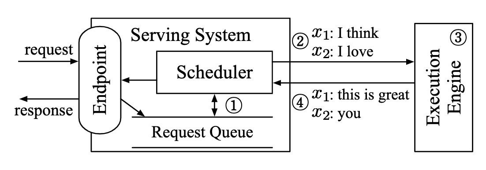
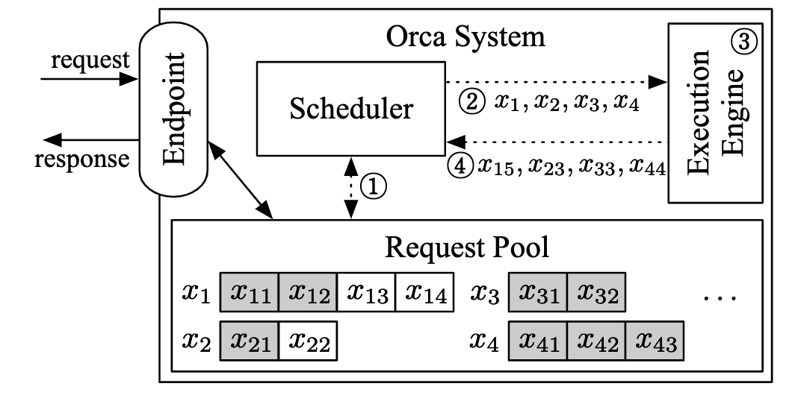
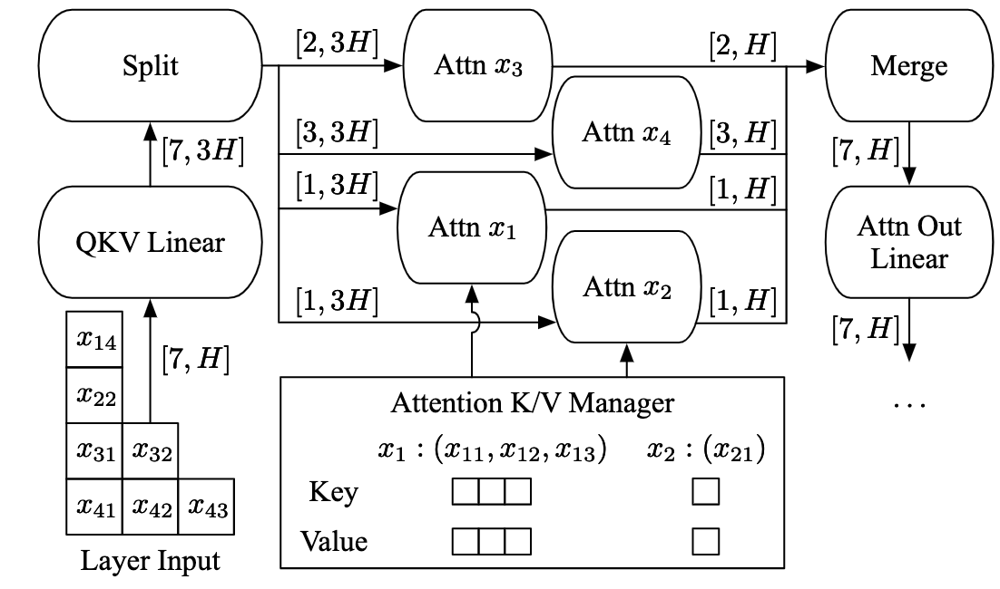
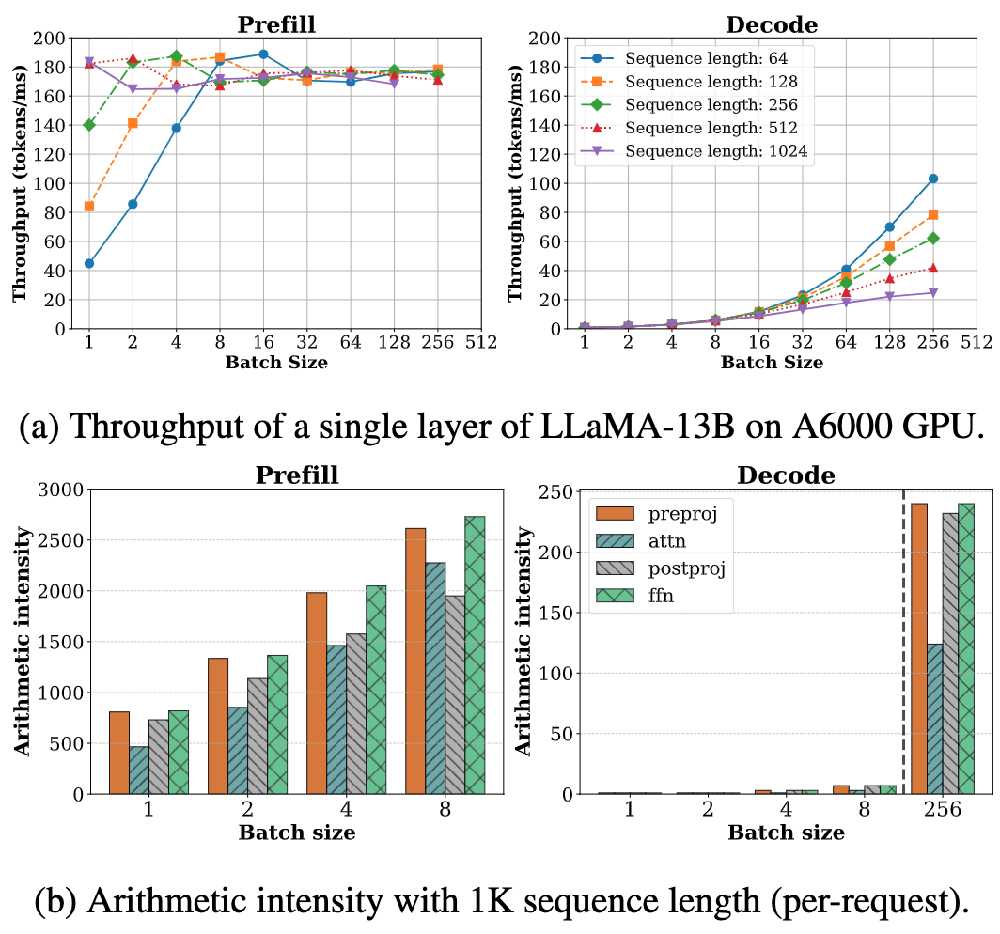
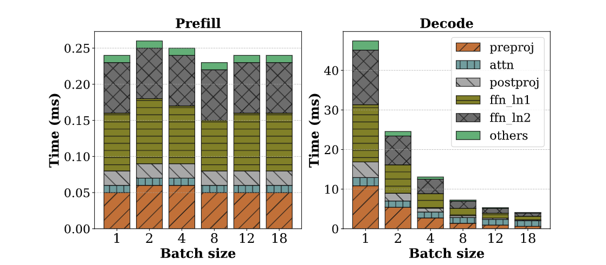
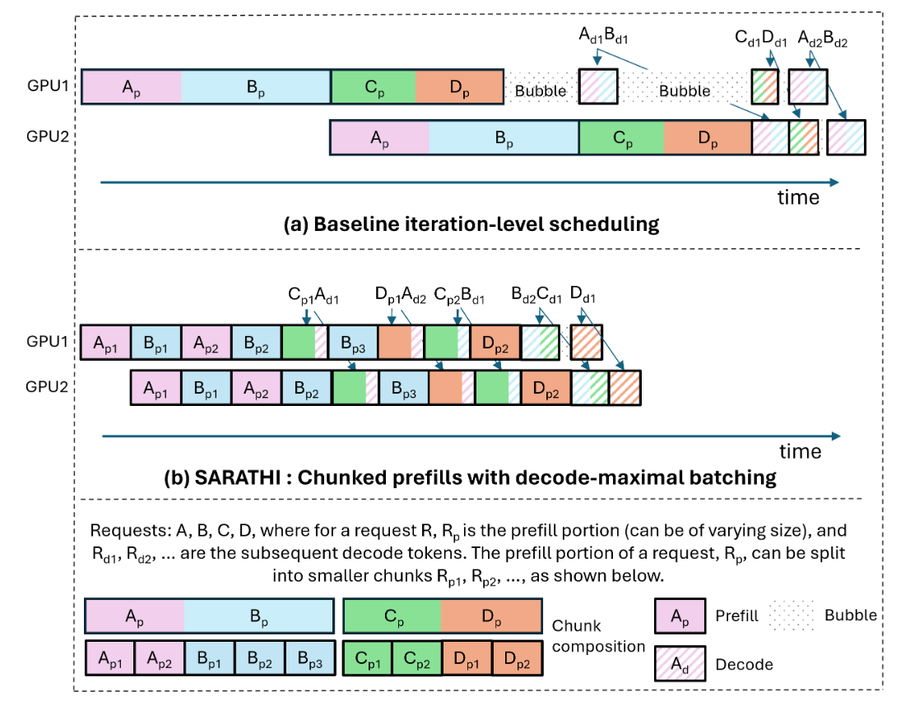
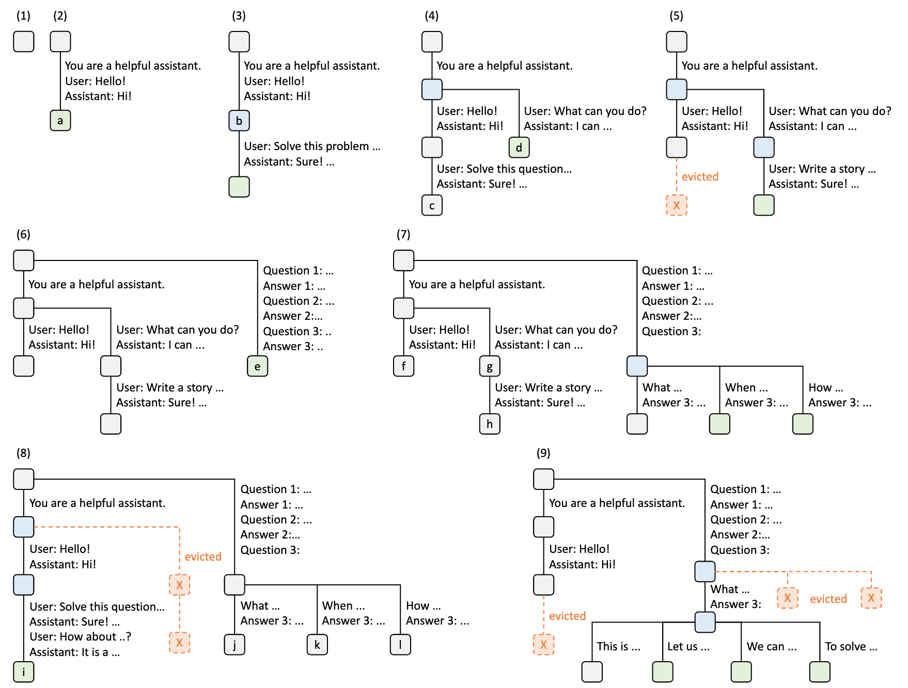

# LLM Serving System性能评估指标

对LLM Serving System的性能主要通过两个指标反映，TTFT(Time to First Token)和TPOT(Time Per Output Token)。

结合LLM推理过程Prefill与Decode两个过程，TTFT反映出了Prefill的性能，而TPOT反映出了Decode的性能。

# Continuous Batching

[Orca: A Distributed Serving System for Transformer-Based Generative Models](https://www.usenix.org/system/files/osdi22-yu.pdf)

[How continuous batching enables 23x throughput in LLM inference while reducing p50 latency](https://www.anyscale.com/blog/continuous-batching-llm-inference)

传统的ML inference serving system中，分为两个部分：serving system layer和execution engine layer

Serving system layer负责处理用户请求，组batch，现有的一些serving system layer有Triton。

Execution engine layer负责做推理，比如FasterTransformer。

Request level schedule存在两个问题：

1. batch中提前完成的请求必须等待最慢的请求完成才能返回
2. 新来的请求无法必须等待上一个batch处理完才能够被处理

ORCA的两个关键的Contribution分别解决上面的两个问题：

1. Iteration-level scheduling
2. Selective batching

**Iteration-level scheduling**

不再是以整个请求的粒度进行调度，而是以每一个iteration为粒度进行调度，即每生成一个token，判断序列是否完成。

请求到达顺序：x1 -> x2 -> x3/x4(灰色为Prefill的Token)

在Iteration-level scheduling调度的情况下：

1. 对于

**Selective batching**

但是将不同序列(Request)组装成batch进行推理有相应前提，如果：

1. 两条请求都处于Prefill阶段，但是两条请求Token长度不一致；
2. 一条请求位于Prefill阶段，另一条请求位于Decode阶段；
3. 两条请求都位于Decode阶段，但是序列长度不一致

上面三种情况的请求都无法组成一个batch进行推理。

LLM在推理的时候只会涉及到3个维度[B, L, H]，即Batch大小**B**，序列长度**L**以及hidden size **H**。对于一些非Attention算子(Linear、LayerNorm、SwiGLU)，可以将**B**和**L**融合成一个维度并行处理(即flatten)。而对于Attention算子，则不做batch处理，每一条请求各自做Attention。

针对Attention算子，主流的推理引擎都会有定制的Attention算子优化这一部分。

**ORCA与模型并行**

inter-layer parallelism(tensor-parallelism)与intra-layer parallelism(pipeline-parallelism)

# Chunk Prefill

[SARATHI: Efficient LLM Inference by Piggybacking Decodes with Chunked Prefills](https://arxiv.org/pdf/2308.16369)

在Prefill阶段，由于输入Prompt的序列足够长，那么batch size比较小也能够充分打满GPU的利用率；但是在Decode阶段，如果batch size小，GPU的利用率将会非常低，但是如果batch size过大，由于需要频繁读取KV-Cache，IO开销会非常大。

上面的图很清晰地反映出了Prefill与Decode的特点：

1. 对于Prefill
2. 对于Decode

# Prefix Caching(RadixAttention)

[SGLang: Efficient Execution of Structured Language Model Programs](https://arxiv.org/pdf/2312.07104)

跨请求KV-Cache复用。

# PD分离

[DistServe: Disaggregating Prefill and Decoding for Goodput-optimized Large Language Model Serving](https://arxiv.org/pdf/2401.09670)

[Mooncake: A KVCache-centric Disaggregated Architecture for LLM Serving](https://arxiv.org/pdf/2407.00079)

# Speculative Decoding

# MoE模型推理优化

[DeepSeek-V3/R1 推理系统概览](https://zhuanlan.zhihu.com/p/27181462601)

# 算子优化

## 图优化

## AI Compiler

# MISC

