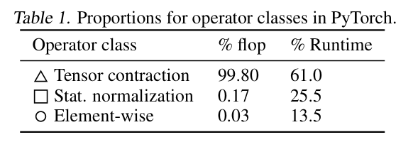
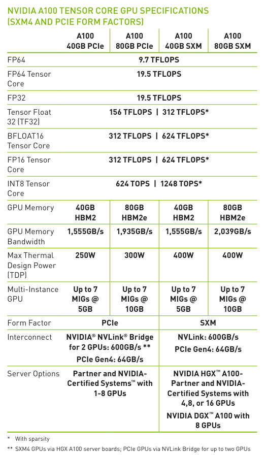
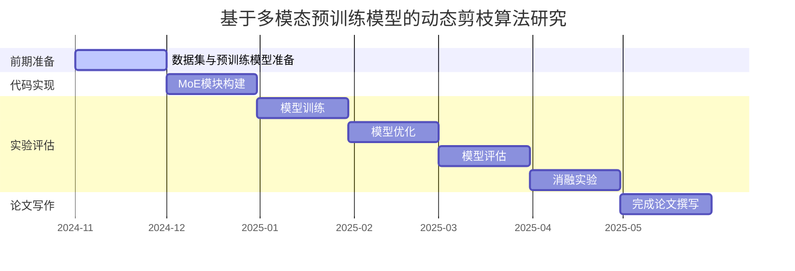
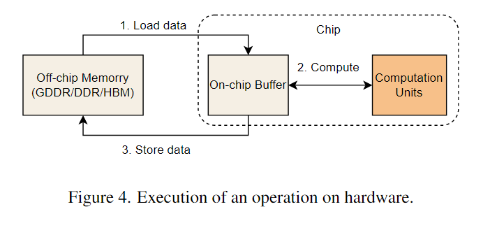
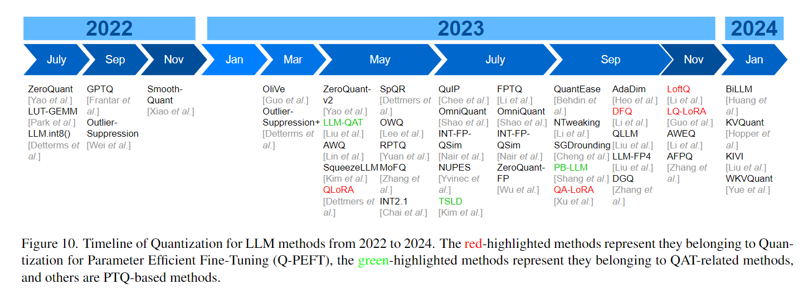

LLM推理面临着compute bound(**compute bound也可以分为throughput bound和latency bound??**)与memory bound(from Roofline model)和latency bound三大瓶颈，而memory bound又可以分为memory latency bound和memory bandwidth bound。或许还有一个CPU bound。

- memory bound是低arithmetic intensity的，memory units饱和
- compute bound是高arithmetic intensity的，compute units饱和
- latency bound是memory units没有饱和，compute units可能没有饱和

相比于memory bound与compute bound，latency bound更难解决。

**在计算和访存可以良好重叠的情况下**，程序的执行时间主要花费在等待计算完成。一种观点认为，性能优化本质上是在尽可能地增加程序运行在 compute bound 下的时间，因为一般来说我们可以减少访问内存的开销，但是几乎不能减少对应的计算量（除非更换算法）。

compute bound 通常只出现在计算大规模矩阵乘法时(Nvidia Tensor Core)。

从上表可以看出，对于 FP32 而言，如果我们不进行矩阵乘法，我们的计算能力只能达到 19.5TFLOPS 而不是通常声称的 312TFLOPS（即使是 19.5TFLOPS 也是考虑了 FMA 专用硬件，实际计算能力可能只有 9.75TFLOPS）。

非矩阵乘法运算花费的时间远大于他们对应的计算量，其中原因便是Bandwidth Bound。

decoding是典型的memory bound过程（当前现在实际在工程落地的过程中，发现了其实还是算子级别的compute bound）

但是prefill阶段在LLM推理过程中只执行一次，而decoding阶段会执行多次，因此解决memory-bound问题更加关键。

latency bound，有的文章说latency bound的优化策略是，将其转化为memory bound，通过减小并行度，增大每个线程的工作量来实现。

LLM serving层面的latency bound依赖于不同的decoding算法。

Decoding Algorithm：

1. Non-autoregressive decoding
2. Speculative decoding
3. Early exiting
4. Cascade inference

Architecture Design：

1. Configuration downsizing：shallow encoder/decoder，weight sharing，vocabulary shrinking
2. Attention simplification：简化标准的attention机制
3. Activation sharing：

LLM serving注重的两个指标：low latency和high throughput。

推理速度有几个关键指标：

1. **Time To First Token (TTFT)**
2. **Time Per Output Token (TPOT)**
3. **Latency**  latency = *(TTFT)* + *(TPOT)* * (the number of tokens to be generated)
4. **Throughput**

上面的四个指标显然是越快越好，但是实际上throughput与time per token之间有一个权衡。

从Roofline Model分析不同的推理加速策略对compute bound，memory bound以及，latency bound三方面的影响。

首先是**量化**。

量化分为对：

1. Weight的量化，**W**
2. Activation的量化，**A**
3. KV-Cache的量化，**KV**
4. 梯度/优化器参数的量化

现有的量化方案有W16A16，W8A16，W4A16，W8A8

参考：

1. [1]https://www.databricks.com/blog/llm-inference-performance-engineering-best-practices