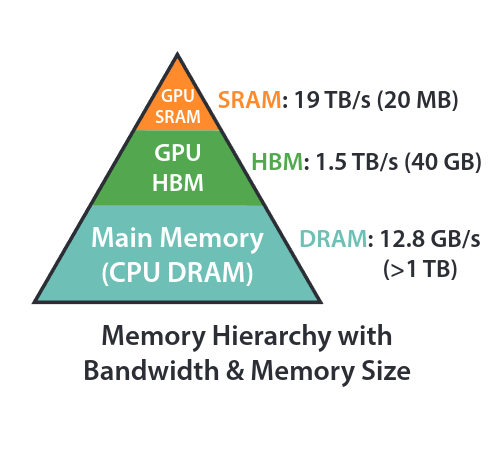
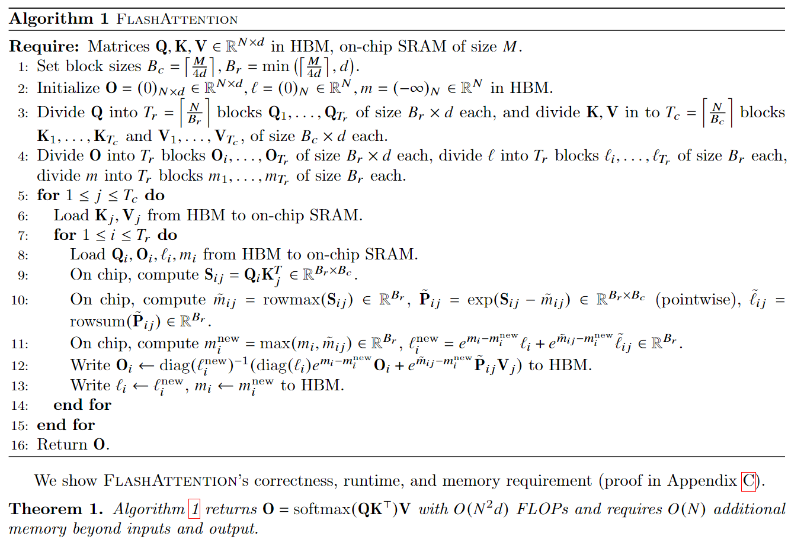
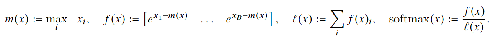
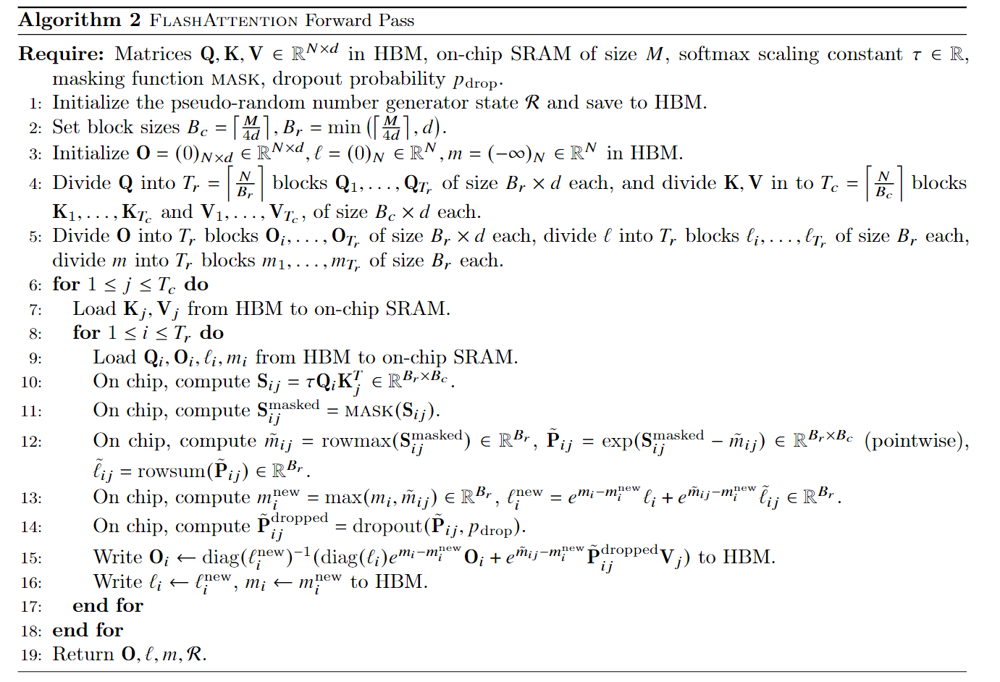
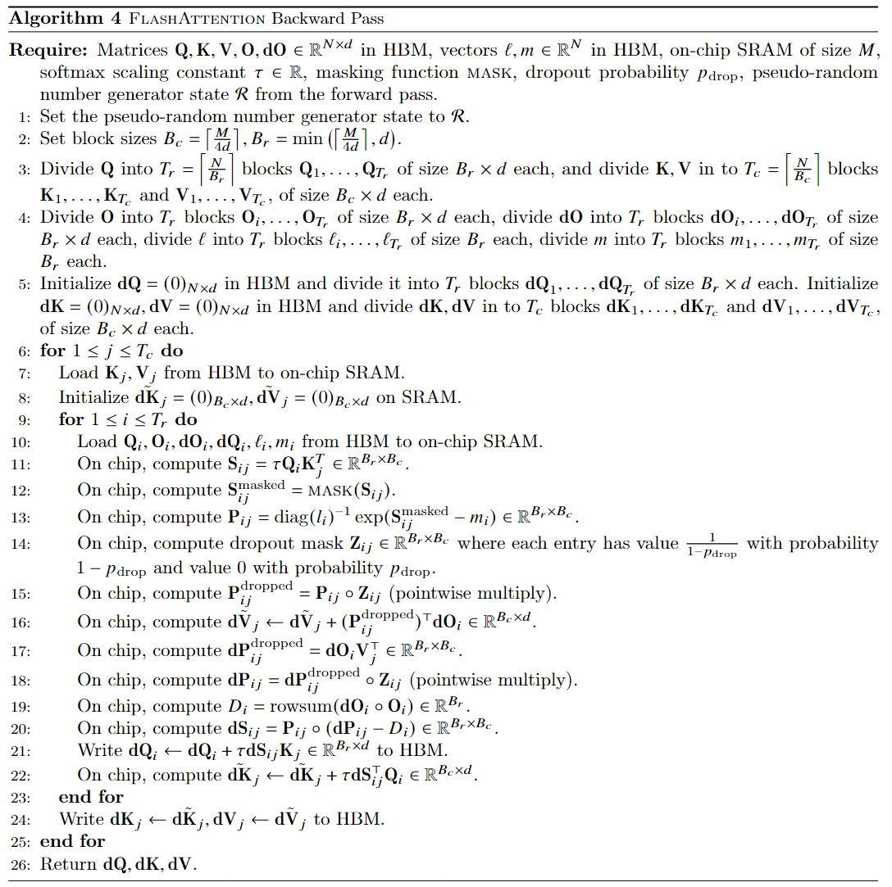

# LLM/VLM压缩与推理加速

一些LLM/VLM压缩与推理加速的技术与项目：

1. vLLM
2. Mooncake
3. Attentionstore
4. GraphRAG
5. MSRA Ladder与T-MAC
6. llamacpp

LLM中的scaling law

Langchain

llamaindex

scale-out与scale-up

LLM API **output token**与**input token**

# FlashAttention

FlashAttention原文涉及到非常多的算法复杂度的表示，这里先稍微总结一下[算法的复杂度表示]()，便于后面理解与分析FlashAttention的复杂度。

FlashAttention的整体算法流程如下，

**这里的除4从上下文来看，并不是因为一个float类型的数值需要4个字节，而是FlashAttention将SRAM拆分成4个区域**

其中
$$
B_{r} = \frac{M}{4d}
$$
是指块的行(row)大小，
$$
B_{c} = min(\frac{M}{4d}, d) <= B_{r}
$$
是指块的列(col)大小。

需要这样设置B-r和B-c的大小的原因是，这样设置可以保证
$$
B_{r} \times B_{c} < \frac{M}{4}
$$
这样的话就可以把4个B_r x B_c大小的块放在SRAM中，B_r和B_c都是token的个数。

**以下就是FlashAttention的核心思想：**总结为两部分就是**Tiling**和**Recomputation**

FlashAttention算法的核心是，每次加载大小为**Θ(𝑀)**(也就是GPU SRAM大小)的K，V块到GPU的SRAM上，然后在Q上迭代。这样K，V块就一直呆在高速的SRAM中，而Q块需要从更加低速的HBM中读取放入到SRAM中，一切计算在SRAM中进行。计算结果O再从SRAM写回HBM中。

FlashAttention把GPU的SRAM分拆成了4个部分，其中K block，V block，Q block与O block分别占据1/4。而其它需要保存的辅助信息，比如l和m，根据[论文作者的说法](https://github.com/Dao-AILab/flash-attention/issues/618)可以放到寄存器里。

**下面是FlashAttention的具体实现细节：**

实现FlashAttention，关键在于如何分块计算softmax(**Tiling**)，因为softmax是需要用到全局信息的。

而对于分块计算softmax

因此在分块计算softmax的时候，就需要记录一些额外信息，就是上面的m(x)和l(x)。**Tiling**解决了attention O(n^2)的时间复杂度问题。

而为了解决attention O(N^2)空间复杂度的问题，采用了**Recomputation**技术。

在transformer的训练过程中需要一次正向传播紧接着一次反向传播。反向传播需要用到正向传播过程中的中间值来求导，从而更新参数。中间值的存储(attention map/matrix)，这就带来了O(N^2)的空间复杂度问题。

但是有了在前向传播过程中，**Tiling**过程保存的额外信息m(x)和l(x)，就能够利用存放在SRAM中的Q block，K block和V block非常容易地计算出**S(Scores)**和**P(Probabilities)**。

尽管这样会带来额外的FLOPs，但是由于更少的HBM访问，总体来看还是能够带来反向传播过程的加速。

**整体的正向传播过程：**

**整体的反向传播过程：**

