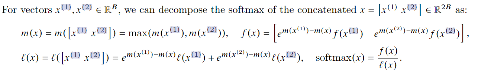

# LLM/VLM压缩与推理加速

一些LLM/VLM压缩与推理加速的技术与项目：

1. vLLM
2. Mooncake
3. Attentionstore
4. GraphRAG
5. MSRA Ladder与T-MAC
6. llamacpp
7. xinference
8. ollama
9. TGI
10. llamafile
11. PPL(商汤)


LLM中的scaling law


Langchain

llamaindex


scale-out与scale-up


LLM API **output token**与**input token**


LLM量化：

1. GPTQ
2. GGML
3. AWQ
4. GGUF
5. SmoothQuant
6. ZeroQuant
7. 各种Quant


模型结构改进：

1. MQA
2. GQA
3. MLA
4. flash attention
5. page attention


MHA是最早随着


batch方面：

1. continuous batch
2. 


算子库：

1. FlashInfer
2. xformers


# FlashAttention

FlashAttention原文涉及到非常多的算法复杂度的表示，这里先稍微总结一下[算法的复杂度表示]()，便于后面理解与分析FlashAttention的复杂度。


FlashAttention的整体算法流程如下，


**这里的除4从上下文来看，并不是因为一个float类型的数值需要4个字节，而是FlashAttention将SRAM拆分成4个区域**

其中
$$
B_{r} = \frac{M}{4d}
$$
是指块的行(row)大小，
$$
B_{c} = min(\frac{M}{4d}, d) <= B_{r}
$$
是指块的列(col)大小。

需要这样设置B-r和B-c的大小的原因是，这样设置可以保证
$$
B_{r} \times B_{c} < \frac{M}{4}
$$
这样的话就可以把4个B_r x B_c大小的块放在SRAM中，B_r和B_c都是token的个数。


**以下就是FlashAttention的核心思想：**总结为两部分就是**Tiling**和**Recomputation**

FlashAttention算法的核心是，每次加载大小为**Θ(𝑀)**(也就是GPU SRAM大小)的K，V块到GPU的SRAM上，然后在Q上迭代。这样K，V块就一直呆在高速的SRAM中，而Q块需要从更加低速的HBM中读取放入到SRAM中，一切计算在SRAM中进行。计算结果O再从SRAM写回HBM中。

FlashAttention把GPU的SRAM分拆成了4个部分，其中K block，V block，Q block与O block分别占据1/4。而其它需要保存的辅助信息，比如l和m，根据[论文作者的说法](https://github.com/Dao-AILab/flash-attention/issues/618)可以放到寄存器里。


**下面是FlashAttention的具体实现细节：**

实现FlashAttention，关键在于如何分块计算softmax(**Tiling**)，因为softmax是需要用到全局信息的。


而对于分块计算softmax



因此在分块计算softmax的时候，就需要记录一些额外信息，就是上面的m(x)和l(x)。**Tiling**解决了attention O(n^2)的时间复杂度问题。

而为了解决attention O(N^2)空间复杂度的问题，采用了**Recomputation**技术。

在transformer的训练过程中需要一次正向传播紧接着一次反向传播。反向传播需要用到正向传播过程中的中间值来求导，从而更新参数。中间值的存储(attention map/matrix)，这就带来了O(N^2)的空间复杂度问题。

但是有了在前向传播过程中，**Tiling**过程保存的额外信息m(x)和l(x)，就能够利用存放在SRAM中的Q block，K block和V block非常容易地计算出**S(Scores)**和**P(Probabilities)**。

尽管这样会带来额外的FLOPs，但是由于更少的HBM访问，总体来看还是能够带来反向传播过程的加速。


**整体的正向传播过程：**


**整体的反向传播过程：**


# vLLM与PagedAttention


## Background

当LLM需要开放给用户，提供服务时，往往在同一时间需要面对大量用户的请求。要处理如此大的吞吐量，需要将同一时间的请求batching在一块进行推理。

LLM推理端需要面对三大bound：compute-bound，memory-bound，latency bound(最后一个bound不太清楚)。而带来memory-bound的重要因素之一就是KV cache。


LLM推理过程中，显存的占用情况如下


有三种类型的显存浪费：

1. reserved
2. internal fragmentation
3. external fragmentation


KV cache的计算：

对于每一个token，隐藏层维度为$d$，层数为$L$，采用FP16格式，需要
$$
2 \times d \times L \times 2
$$
大小的KV cache来存储。


显存将会是一个长期的bottleneck。


# LLM推理引擎/推理框架(LLM serving system)


LLM serving system关注于如何将LLM部署到实际的生产环境中，为上层的AI应用提供更好的服务。因此LLM serving system典型的受众是提供LLM推理的云服务厂商。


## 为什么LLM需要推理框架


## 目前主流的LLM推理框架

目前有许多LLM推理框架：

1. vLLM
2. 


## vLLM


vLLM的架构如上，分为几个部分：

- Scheduler，vLLM的Scheduler是一个中心化的scheduler
- KV Cache Manager，KV Cache Manager是通过scheduler发出的命令来控制KV Cache


PagedAttention将KV cache切分成KV blocks，每一个KV block的大小为$B$，那么每一个key block与value block可以表示如下
$$
K_{j} = (k_{(j-1)B},...,k_{jB}) \\
V_{j} = (v_{(j-1)B},...,v_{jB})
$$
相应的attention core的计算方式也转变为了分块计算
$$
A_{ij} = \frac{exp(q^{T}_{i}K_{j}/\sqrt{d})}{\sum_{t=1}^{\lceil i/B \rceil}exp(q^{T}_{i}K_{t}/\sqrt{d})},\ o_i = 
$$


vLLM的显存管理借鉴了OS中的虚拟内存。vLLM将KV cache以固定大小的KV blocks组织，每一个KV block就相当于OS虚拟内存中的一个page。


# GPT系列


## GPT4o1


# LLM的量化

量化分为PTQ和QAT


## LLM.int8()

LLM.int8()的量化分为两步：

1. vector-wise quantization
2. mixed-precision decomposition


# Finetune(SFT, supervised fine-tuning)


目前主流的Finetune方法：

1. FFT全量微调
2. RAG
3. PEFT参数高效微调：
   - Adapter Tuning
   - LORA
   - QLoRA
   - Prefix-Tuning
   - Prompt Tuning
   - P-tuning v2


目前也有许多LLM的微调工具：

1. unsloth
2. XTuner
3. 


# RAG


# LLM训练：全精度，半精度，混合精度


# Tokenization

参考：

1. [All you need to know about Tokenization in LLMs | by Tayyib Ul Hassan Gondal | The Deep Hub | Medium](https://medium.com/thedeephub/all-you-need-to-know-about-tokenization-in-llms-7a801302cf54)


首先，什么是Token？下面的解释我觉得是最好的。

```
Tokens are the smallest units of meaning in a text that can be processed by a language model
```

Token可以是一个world，subworld甚至是一个character，可以有着不同的粒度，但是token还并不是后面我们提到的embdding涉及到数的概念，它还是由字符组成的一个小序列。


因此为了将这些token能够被LLM处理，每一个token都会被赋予唯一的整数标识，这个整数标识会被向量化(也就是embedding)成一个向量。这样LLM就能够处理token。同样的LLM的输出也是一个向量，这个向量再被对应到某个整数，这个整数的对应token就是输出。

因此，按照上面的逻辑，我们**需要一个双向的查找表(lookup table)，分别将token对应到一个integer以及将一个integer对应到一个token**。同时，我们还需要一个**embedding table，将一个integer与其对应的embedding对应起来**。


当我们有一个corpus，将其tokenization需要经过一下几个步骤：

1. **Find All Unique Characters**
2. **Create Lookup Tables**
3. **Use an Embedding Table**

在LLM的pre-training和inference的workflow中，在tokenization之后，每一个token会有一个唯一的标识符，这个标识符是一个整数。同时还会有一个查找表，这个表就是每一个token对应的vector representation(**embedding**)。

而vocabulary size就是一个tokenization后的unique token的个数。如果我们按照上面的逻辑，character-level的tokenization的话，那么最后的vocabulary size就是英文字母表的大小，也就是26个英文字母(再加上标点符号)，大概也没有超过100.

这么做有两个问题：

1. 这样的tokenization策略并没有考虑到其它的语言，只考虑了英文，language diversity差
2. 由于vocabulary size非常小，因此会导致在处理corpus产生的序列长度会非常长，token的个数非常多，在LLM的最大输入序列长度(我们叫它**window size**)固定的情况下，由于每一个embedding只对应着一个英文字母或者标点符号，因此LLM一次能够处理的信息量就非常少


因此很自然地，我们会用一个world-level tokenization的策略，但是这同样面临着两个问题：

1. 这样的tokenization策略同样没有考虑到其它的语言，只考虑了英文，language diversity差
2. 由于英语中的词汇量非常大，这会导致vocabulary size也非常大，所以embedding table也会非常大，增加了计算复杂度。并且LLM在window size不变的情况下，更多的信息被压缩进了这些token中，这可能并不是一件好事，可能会导致一个次优解。因为LLM需要捕捉长序列的依赖以及token中的一些细节上下文信息。

**embedding table and the language model head will have more rows????**


从上面的分析可以看出，tokenization的粒度的选择是一个非常重要的问题。不同粒度的分词器(tokenizer)实际上就是在词汇量(**vocabulary**)和语义独立性(**context-independent representation**)方面的取舍。

一个折中的方案是采用subworld-tokenization策略。

subworld的核心就是，对于常出现的词不拆分成subworld，而对于不经常出现的词拆封成多个subworlds。

采用subworld：

1. 能够维持一个适中大小的vocabulary
2. 使得LLM能够比较好地学习到token的context-independent representations
3. 使得LLM能够处理其从未见到过的单词


目前常用的tokenization算法有：

1. BPE
2. WordPiece
3. SentencePiece


## BPE(Byte Pair Encoding)

[Neural Machine Translation of Rare Words with Subword Units (Sennrich et al., 2015)](https://arxiv.org/abs/1508.07909)


# 最优化方法


## AdamW

**L2 Norm与Weight Decay并不等价**