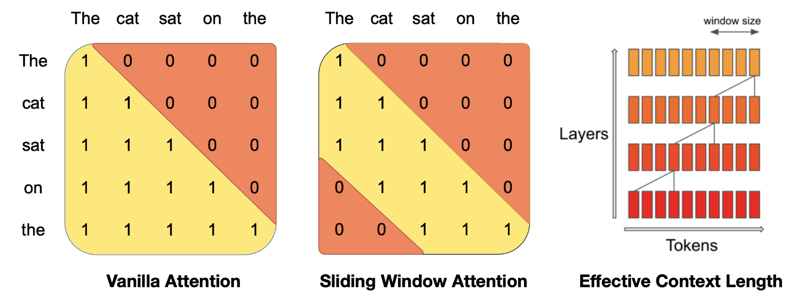

# LLM/VLM压缩与推理加速

一些LLM/VLM压缩与推理加速的技术与项目：

1. vLLM
2. Mooncake
3. Attentionstore
4. GraphRAG
5. MSRA Ladder与T-MAC
6. llamacpp
7. xinference
8. ollama
9. TGI
10. llamafile
11. PPL(商汤)


LLM中的scaling law


Langchain

llamaindex


scale-out与scale-up


LLM API **output token**与**input token**


LLM量化：

1. GPTQ
2. GGML
3. AWQ
4. GGUF
5. SmoothQuant
6. ZeroQuant
7. 各种Quant


模型结构改进：

1. MQA
2. GQA
3. MLA
4. flash attention
5. page attention


MHA是最早随着


batch方面：

1. continuous batch
2. 


算子库：

1. FlashInfer
2. xformers


# FlashAttention

FlashAttention原文涉及到非常多的算法复杂度的表示，这里先稍微总结一下[算法的复杂度表示]()，便于后面理解与分析FlashAttention的复杂度。


FlashAttention的整体算法流程如下，


**这里的除4从上下文来看，并不是因为一个float类型的数值需要4个字节，而是FlashAttention将SRAM拆分成4个区域**

其中
$$
B_{r} = \frac{M}{4d}
$$
是指块的行(row)大小，
$$
B_{c} = min(\frac{M}{4d}, d) <= B_{r}
$$
是指块的列(col)大小。

需要这样设置B-r和B-c的大小的原因是，这样设置可以保证
$$
B_{r} \times B_{c} < \frac{M}{4}
$$
这样的话就可以把4个B_r x B_c大小的块放在SRAM中，B_r和B_c都是token的个数。


**以下就是FlashAttention的核心思想：**总结为两部分就是**Tiling**和**Recomputation**

FlashAttention算法的核心是，每次加载大小为**Θ(𝑀)**(也就是GPU SRAM大小)的K，V块到GPU的SRAM上，然后在Q上迭代。这样K，V块就一直呆在高速的SRAM中，而Q块需要从更加低速的HBM中读取放入到SRAM中，一切计算在SRAM中进行。计算结果O再从SRAM写回HBM中。

FlashAttention把GPU的SRAM分拆成了4个部分，其中K block，V block，Q block与O block分别占据1/4。而其它需要保存的辅助信息，比如l和m，根据[论文作者的说法](https://github.com/Dao-AILab/flash-attention/issues/618)可以放到寄存器里。


**下面是FlashAttention的具体实现细节：**

实现FlashAttention，关键在于如何分块计算softmax(**Tiling**)，因为softmax是需要用到全局信息的。


而对于分块计算softmax


因此在分块计算softmax的时候，就需要记录一些额外信息，就是上面的m(x)和l(x)。**Tiling**解决了attention O(n^2)的时间复杂度问题。

而为了解决attention O(N^2)空间复杂度的问题，采用了**Recomputation**技术。

在transformer的训练过程中需要一次正向传播紧接着一次反向传播。反向传播需要用到正向传播过程中的中间值来求导，从而更新参数。中间值的存储(attention map/matrix)，这就带来了O(N^2)的空间复杂度问题。

但是有了在前向传播过程中，**Tiling**过程保存的额外信息m(x)和l(x)，就能够利用存放在SRAM中的Q block，K block和V block非常容易地计算出**S(Scores)**和**P(Probabilities)**。

尽管这样会带来额外的FLOPs，但是由于更少的HBM访问，总体来看还是能够带来反向传播过程的加速。


**整体的正向传播过程：**


**整体的反向传播过程：**


# vLLM与PagedAttention


## Background

当LLM需要开放给用户，提供服务时，往往在同一时间需要面对大量用户的请求。要处理如此大的吞吐量，需要将同一时间的请求batching在一块进行推理。

LLM推理端需要面对三大bound：compute-bound，memory-bound，latency bound(最后一个bound不太清楚)。而带来memory-bound的重要因素之一就是KV cache。


LLM推理过程中，显存的占用情况如下


有三种类型的显存浪费：

1. reserved
2. internal fragmentation
3. external fragmentation


KV cache的计算：

对于每一个token，隐藏层维度为$d$，层数为$L$，采用FP16格式，需要
$$
2 \times d \times L \times 2
$$
大小的KV cache来存储。

每一层transformer都有自己的KV-Cache。

显存将会是一个长期的bottleneck。


# LLM推理引擎/推理框架(LLM serving system)


LLM serving system关注于如何将LLM部署到实际的生产环境中，为上层的AI应用提供更好的服务。因此LLM serving system典型的受众是提供LLM推理的云服务厂商。


## 为什么LLM需要推理框架


## 目前主流的LLM推理框架

目前有许多LLM推理框架：

1. vLLM
2. 


## vLLM


vLLM的架构如上，分为几个部分：

- Scheduler，vLLM的Scheduler是一个中心化的scheduler
- KV Cache Manager，KV Cache Manager是通过scheduler发出的命令来控制KV Cache


PagedAttention将KV cache切分成KV blocks，每一个KV block的大小为$B$，那么每一个key block与value block可以表示如下
$$
K_{j} = (k_{(j-1)B},...,k_{jB}) \\
V_{j} = (v_{(j-1)B},...,v_{jB})
$$
相应的attention core的计算方式也转变为了分块计算
$$
A_{ij} = \frac{exp(q^{T}_{i}K_{j}/\sqrt{d})}{\sum_{t=1}^{\lceil i/B \rceil}exp(q^{T}_{i}K_{t}/\sqrt{d})},\ o_i = 
$$


vLLM的显存管理借鉴了OS中的虚拟内存。vLLM将KV cache以固定大小的KV blocks组织，每一个KV block就相当于OS虚拟内存中的一个page。


# GPT系列


## GPT4o1


# LLM的量化

量化分为PTQ和QAT


## LLM.int8()

LLM.int8()的量化分为两步：

1. vector-wise quantization
2. mixed-precision decomposition


# Finetune(SFT, supervised fine-tuning)


**Instruction-following data**。

GPT-3 --> InstructGPT/ChatGPT

T5 --> FLAN-T5

PaLM --> FLAN-PaLM

OPT --> OPT-IML

Flamingo与Vicuna


目前主流的Finetune方法：

1. FFT全量微调
2. RAG
3. PEFT参数高效微调：
   - Adapter Tuning
   - LORA
   - QLoRA
   - Prefix-Tuning
   - Prompt Tuning
   - P-tuning v2


目前也有许多LLM的微调工具：

1. unsloth
2. XTuner
3. 


# RAG

RAG的开山之作[Retrieval-Augmented Generation for Knowledge-Intensive NLP Tasks]()


RAG-Squence Model，每个检索到的document负责生成一个序列，最后再加权求和
$$
p_{RAG-Sequence}()
$$


RAG-Token Model，每个检索到的document生成一个token，token加权求和然后再生成下一个token
$$
p_{RAG-Token}()
$$


向量数据库


# LLM训练：全精度，半精度，混合精度


# Tokenization

参考：

1. [All you need to know about Tokenization in LLMs | by Tayyib Ul Hassan Gondal | The Deep Hub | Medium](https://medium.com/thedeephub/all-you-need-to-know-about-tokenization-in-llms-7a801302cf54)


首先，什么是Token？下面的解释我觉得是最好的。

```
Tokens are the smallest units of meaning in a text that can be processed by a language model
```

Token可以是一个world，subworld甚至是一个character，可以有着不同的粒度，但是token还并不是后面我们提到的embdding涉及到数的概念，它还是由字符组成的一个小序列。


因此为了将这些token能够被LLM处理，每一个token都会被赋予唯一的整数标识，这个整数标识会被向量化(也就是embedding)成一个向量。这样LLM就能够处理token。同样的LLM的输出也是一个向量，这个向量再被对应到某个整数，这个整数的对应token就是输出。

因此，按照上面的逻辑，我们**需要一个双向的查找表(lookup table)，分别将token对应到一个integer以及将一个integer对应到一个token**。同时，我们还需要一个**embedding table，将一个integer与其对应的embedding对应起来**。


当我们有一个corpus，将其tokenization需要经过一下几个步骤：

1. **Find All Unique Characters**
2. **Create Lookup Tables**
3. **Use an Embedding Table**

在LLM的pre-training和inference的workflow中，在tokenization之后，每一个token会有一个唯一的标识符，这个标识符是一个整数。同时还会有一个查找表，这个表就是每一个token对应的vector representation(**embedding**)。

而vocabulary size就是一个tokenization后的unique token的个数。如果我们按照上面的逻辑，character-level的tokenization的话，那么最后的vocabulary size就是英文字母表的大小，也就是26个英文字母(再加上标点符号)，大概也没有超过100.

这么做有两个问题：

1. 这样的tokenization策略并没有考虑到其它的语言，只考虑了英文，language diversity差
2. 由于vocabulary size非常小，因此会导致在处理corpus产生的序列长度会非常长，token的个数非常多，在LLM的最大输入序列长度(我们叫它**window size**)固定的情况下，由于每一个embedding只对应着一个英文字母或者标点符号，因此LLM一次能够处理的信息量就非常少


因此很自然地，我们会用一个world-level tokenization的策略，但是这同样面临着两个问题：

1. 这样的tokenization策略同样没有考虑到其它的语言，只考虑了英文，language diversity差
2. 由于英语中的词汇量非常大，这会导致vocabulary size也非常大，所以embedding table也会非常大，增加了计算复杂度。并且LLM在window size不变的情况下，更多的信息被压缩进了这些token中，这可能并不是一件好事，可能会导致一个次优解。因为LLM需要捕捉长序列的依赖以及token中的一些细节上下文信息。

**embedding table and the language model head will have more rows????**


从上面的分析可以看出，tokenization的粒度的选择是一个非常重要的问题。不同粒度的分词器(tokenizer)实际上就是在词汇量(**vocabulary**)和语义独立性(**context-independent representation**)方面的取舍。

一个折中的方案是采用subworld-tokenization策略。

subworld的核心就是，对于常出现的词不拆分成subworld，而对于不经常出现的词拆封成多个subworlds。

采用subworld：

1. 能够维持一个适中大小的vocabulary
2. 使得LLM能够比较好地学习到token的context-independent representations
3. 使得LLM能够处理其从未见到过的单词


目前常用的tokenization算法有：

1. BPE
2. WordPiece
3. SentencePiece


## BPE(Byte Pair Encoding)

[Neural Machine Translation of Rare Words with Subword Units (Sennrich et al., 2015)](https://arxiv.org/abs/1508.07909)


# Emebedding


# Context Window/Contex Length


Context window = input tokens + output tokens


# Hallucination in LLM

两种幻觉：

1. Faithfulness，对应faithfulness hallucination
2. Factualness，对应factuality hallucination


# LLM面临的Memory Wall，Compute Wall以及Latency Wall

decoding是典型的memory bound过程(当前现在实际在工程落地的过程中，发现了其实还是算子级别的compute bound)。


# 最优化方法


## AdamW

**L2 Norm与Weight Decay并不等价**


# Encoder-Only/Decoder-Only/Encoder-Decoder

三种大模型架构都有各自的代表工作：

1. Encoder-Only(autoencoder)：BERT
2. Decoder-Only(autoregressive)：GPT
3. Encoder-Decoder：T5，BART **T5: This form of masking is appropriate when attending over a "prefix", i.e. some context provided to the model that is later used when making predictions**
4. PrefixLM： GLM，UniLM
5. Permuted Language Model(PLM)：XLNet


从T5的结论来看，L层的encoder-decoder结构和L层的decoder-only(language model)结构的计算量是相同的，因为decoder-only结构需要把输入和输出并起来训练，而encoder-decoder结构不需要。


当然，这里用模型结构来表达不足够确切，因为除了模型结构外，一般还包含自监督的学习方法，常见的学习方法包括AutoEncoding(简称AE)和AutoRegressive(简称AR)。AE即我们常说的双向语言模型，而AR则代表从左到右的单向语言模型。


几种结构的比较：


# Long Context

参考：

1. [LLM长上下文问题](https://www.linsight.cn/c4da56c0.html)
2. [聊聊拉长LLaMA的一些经验](https://blog.csdn.net/CompHub/article/details/132031711)
3. [再谈Long-Context LLM](https://zhuanlan.zhihu.com/p/660660723)

首先一个普遍的事实是：如果我们直接训练2k/4k长度的模型，然后在推理的时候设定8k或者16k窗口，那么PPL会急剧上升，导致模型直接讲不了人话，原因之一在之前讲RoPE的时候也有提到，对于没有训练过的**位置编码**，模型不能很好地处理。

除了性能方面的影响之外，长上下文导致的另一个问题就是计算复杂度以及显存占用的急剧上升。


RoPE这个位置编码方法extrapolation的性质不是特别好，相比于RoPE，ALiBi位置编码的外推性能更加好。

**extrapolation**：外推就是指短文本上训练，长文本上推理。


拉长LLM有一下几种方案：

1. **直接训练(具备原生的Long Context能力)**，但是直接训练的训练成本高
2. **采用外推**，一般来说性能差
3. **微调方案**，分两阶段，第一阶段用2k或者4k训练一个基础模型，等到模型把文本内容和短位置关系都学好之后，再来用相比第一阶段小的数据量优化在长上下文情况下的效果。
4. **预训练采用短文本和长文本共同训练**，即预训练开始阶段采用短文本，预训练的最后采用长文本(QWen，MPT)。
5. **在位置编码方面改进**
6. **模型结构的改进**

这些方案总结来说，就是**提高长度外推能力+优化长文本时的推理速度+降低长文本内存消耗**。


## 模型结构改进

这一部分的工作主要有对transformer结构的改进，以及sparse attention等工作。

### 1. MHA/MQA/GQA/MLA

后面在这里[详细介绍了](#MHA/MQA/GQA/MLA)这一部分的内容


### 2. sliding window attention

Longformer是最早提出SWA的，而后来的Mixtral将其发扬光大。

Longformer本身结合了SWA的local attention以及一个global attention，longformer认为这两种attention都非常有必要，并且通过消融实验证明

```
the local attention is primarily used to build contextual representations, while the global attention allows Longformer to build full sequence representations for prediction.
```

但是longformer最初的架构是encoder与encoder-decoder架构。


### 3. hash-based attention


### 4. dilated attention


### 5. 总结

总的来说，efficient attention可以分为：

1. 


## 位置编码

RoPE是常用的个PE方法，最早由Roformer提出。RoPE本身extrapolation的性质不是特别好。


较短的预训练模型(2k、4k)应用在长上下文会因为训练和推理的两个不一致导致效果下降

- 推理时用到了没训练过的位置编码
- 推理时注意力机制所处理的token数量远超训练时的数量，导致注意力机制的崩坏

这两个问题可以分别通过位置编码和attention score的放缩来缓解。

# MHA/MQA/GQA/MLA

参考：

1. [缓存与效果的极限拉扯：从MHA、MQA、GQA到MLA](https://zhuanlan.zhihu.com/p/700588653)
2. ###### [[KV Cache优化]🔥MQA/GQA/YOCO/CLA/MLKV笔记: 层内和层间KV Cache共享](https://zhuanlan.zhihu.com/p/697311739)


MHA(multi-head attention)，出自[Attention is all you need](https://arxiv.org/pdf/1706.03762)最早的transformer实现，不多赘述。

后续的MQA、GQA以及MLA都是围绕如何减少KV Cache的大小。

MQA(multi-query attention)，出自[Fast Transformer Decoding: One Write-Head is All You Need](https://arxiv.org/pdf/1911.02150)，谷歌的Noam Shazeer的工作。

GQA(grouped-query attention)，出自[GQA: Training Generalized Multi-Query Transformer Models from Multi-Head Checkpoints](https://arxiv.org/pdf/2305.13245)

MLA(multi-head latent attention)，由DeepSeek提出[DeepSeek-V2: A Strong, Economical, and Efficient Mixture-of-Experts Language Model](https://arxiv.org/pdf/2405.04434)

MQA的思想就是让所有attention head共享keys和values。


后续的工作还有微软的YOCO(You Only Cache Once)以及CLA(Cross-Layer Attention)。


首先来看MQA。


# 困惑度PPL

困惑度是用来衡量语言模型(Causal Language Model)的一个指标。需要明确，困惑的是对于一个句子而言的，一个句子的困惑度计算公式如下：
$$
PP(S) = P(w_1w_2 \cdots w_N)^{-\frac{1}{N}}
$$


# Mixtral技术报告


## 1. Introduction

Mixtral这个系列的模型，基于transformer架构，采用了GQA以及SWA等技术，使得模型兼顾了performance和efficiency。


## 2. Architecture Details

Mixtral 7B模型的参数如下：


### 2.1 Sliding Window Attention(SWA)



vanilla attention的实现，计算复杂度与序列长度的二次方成正比；显存消耗与序列长度成线性关系。

在Mixtral中，采用了SWA，每一个token只能访问到上一层的**W**个token。但是当有k层时，最后一层的最后一个token实际上可以访问到$k \times W$个token的信息。

因此对于Mixtral 7B的4096的大小来说，context length实际上能够达到131K。但对应的需要对FlashAttenion以及xFormer中的算子做修改。

与CNN中的卷积和类似，通过卷积，感受野会逐层扩大一圈


只不过相比于CNN，LLM中的窗口递增的方向是单向的，只能够向前递增。


### 2.2 Rolling Buffer Cache

上面的SWA固定的窗口大小，这就使得Mixtral中KV-Cache的也可以固定下来。超出窗口的KV-Cache就不需要被缓存了，从而保证训练与推理的一致。Mixtral中采用了rolling buffer cache技术。

具体的实现方案是将KV-Cache的大小固定为window的大小，然后通过对token位置模上窗口大小**W**来决定KV-Cache中哪个K-V需要被替换。


### 2.3 Pre-fill and Chunking

在推理的pre-fill阶段，需要生成prompt的KV填充到KV-Cache中。而Mixtral在prompt非常长的时候将其切块(chunking)处理，而块的大小就是window size。


```
比如窗口大小为4，system prompt大小为9时，就可以把system prompt的kv缓存切成 [4,4,1] 三块。

第一块由于和当前的输入距离超过了一个window的大小，所以是完全看不见的，对应的attention mask全为0，因此可以完全忽略。

第二块的attention mask则是一个上三角矩阵，当前的输入需要用到这部分信息。

第三块是一个下三角矩阵（的左边部分），包含了当前的输入在内。

在推理的时候，我们只需要用到第二块和第三块的内容，这就节省了缓存的操作。

而且无论prompt有多长，只要我们按窗口大小分块，一定只会用到最后两块。
```

结果就如上图所示，最终只会用到最后两个chunk。


## 3. Results

这部分暂时略过，用到的时候再补充。


# QWen技术报告


# DeepSeek-V3技术报告

DeepSeek-V3是一个671B参数量的MoE语言模型(单模态)，推理时每个token会激活37B的参数。


DeepSeek-V3的主要贡献点：

1. 为了实现推理的高效的加速，继续沿用了MLA
2. 为了实现训练的加速，沿用了DeepSeek-V2的DeepSeekMoE结构
3. 同时为了提升模型的性能，采用了auxiliary-loss-free strategy，这个策略是为了实现MoE模型专家之间的负载均衡
4. 以及multi-token prediction training objective


在工程方面：

1. DeepSeek-V3采用FP8混合精度训练
2. DualPipe更高效的流水线并行，更少的bubbles以及通过计算和通信的重叠隐藏延迟
3. 专家并行
4. 更加精细的memory优化策略，使得不需要tensor parrallelism(tensor parrallelism通信代价非常高)


在训练方面：

1. 预训练数据采用14.8T的高质量语料库
2. 预训练中采用了两阶段的context length训练，第一个阶段的context length为32K，第二阶段的context length为128K
3. post-training阶段采用了DeepSeek-R1，通过蒸馏从DeepSeek-R1中蒸馏出long CoT模型的reasoning能力到标准的LLM中


## 模型结构


整体的结构和DeepSeek-V2一样。但是通过引入auxiliary-loss-free load balancing strategy，可以避免因负载均衡带来的性能下降。

> 对于MoE模型，不同专家之间不均衡的负载会带来性能下降以及推理成本的上升。所以一半会通过一个辅助的损失来实现负载均衡，但是引入辅助的损失会给原始的梯度带来噪声，对MoE模型最终的性能带来损失。

auxiliary-loss-free load balancing strategy通过引入一个偏置项，实现loss-free。


这个偏置项只用来做routing，而不会用来做加权。

**Complementary Sequence-Wise Auxiliary Loss**。为了避免同一个sequence内部的imbalance，采用complementary sequence-wise balance loss。


首先是**MLA**，MLA的原理上图已经非常清晰了。

其次就是DeepSeekMoE结构。


DeepSeek中，有一部分的专家是所有token共享的，$N_s$。


MTP部份。


## Infrastructures

DeepSeek-V3的训练集群是在2048xH800上训练。每个节点8xH800通过NVLink以互联，节点之间通过NVSwitch互联。不同节点之间的通信通过InfiniBand(IB)网络。


训练采用的框架是HAI-LLM框架(自己搭建的)。并行策略采用16路流水线并行，64路专家并行，ZeRO-1的数据并行。训练并没有采用张量并行。


# 开源LLM


1. LLaMA
2. Vicuna
3. Alpaca
4. Bloom
5. MPT
6. GLM
7. QWen
8. falcon
9. phi
10. T5
11. Mixtral
12. InternLM
13. Deepseek
14. OPT
15. miniGPT
