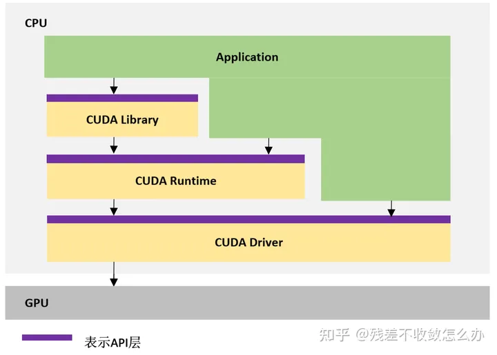
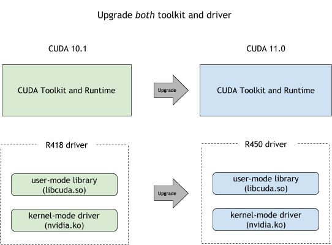
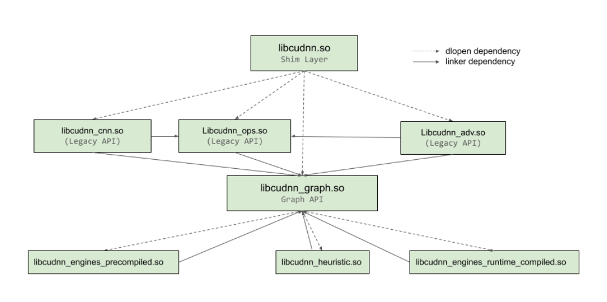
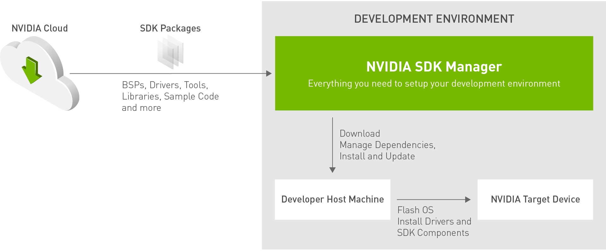
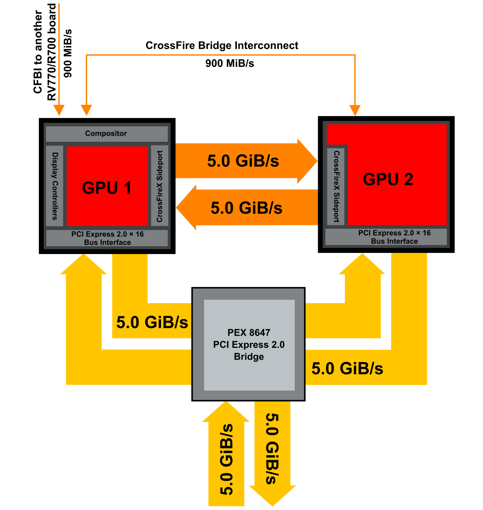

# NVIDIA技术


# 1、NVIDIA CUDA TOOLKIT

NVIDIA官方对于NVIDIA CUDA TOOLKIT的介绍

```
The NVIDIA® CUDA® Toolkit provides a development environment for creating high-performance, GPU-accelerated applications. With it, you can develop, optimize, and deploy your applications on GPU-accelerated embedded systems, desktop workstations, enterprise data centers, cloud-based platforms, and supercomputers. The toolkit includes GPU-accelerated libraries, debugging and optimization tools, a C/C++ compiler, and a runtime library.
```

CUDA TOOLKIT中包括以下components：

1. GPU-accelerated libraries
2. debugging and optimization tools
3. a C/C++ compiler
4. a runtime library

更细致的组件划分见https://docs.nvidia.com/cuda/cuda-toolkit-release-notes/index.html


## 1.1 GPU-accelerated libraries

GPU-accelerated libraries主要涉及到以下库（动态/静态）：

1. **cuBLAS**：

   ```
   The cuBLAS library is an implementation of BLAS (Basic Linear Algebra Subprograms) on top of the NVIDIA®CUDA™ runtime.
   ```

   cuBLAS的API定义在`cublas.h`和`cublas_v2.h`，实现在同名的动态库中。需要使用cuBLAS的应用需要链接到

   - The DSO `cublas.so` for Linux
   - The DLL `cublas.dll` for Windows, or
   - The dynamic library `cublas.dylib` for Mac OS X.

   [这里](../python/python的一些问题.md)就有一个涉及到cublas.so动态库的问题。

2. **cuFFT**：

   ```
   cuFFT, the NVIDIA® CUDA® Fast Fourier Transform (FFT) product. It consists of two separate libraries: cuFFT and cuFFTW. The cuFFT library is designed to provide high performance on NVIDIA GPUs. The cuFFTW library is provided as a porting tool to enable users of FFTW to start using NVIDIA GPUs with a minimum amount of effort.
   ```

   cuFFT library头文件为`inc/cufft.h`，相应的动态库为`{lib, lib64}/libcufft.so`

3. **nvJPEG**：

   ```
   The nvJPEG Library provides high-performance GPU accelerated JPEG decoding functionality for image formats commonly used in deep learning and hyperscale multimedia applications.
   ```

4. **Thrust**：

   ```
   Thrust is the C++ parallel algorithms library which inspired the introduction of parallel algorithms to the C++ Standard Library.
   ```

5. **cuSPARSE**：

   ```
   The cuSPARSE library contains a set of GPU-accelerated basic linear algebra subroutines used for handling sparse matrices that perform significantly faster than CPU-only alternatives.
   ```

6. **CUDA C++ Standard Library**：

   ```
   The API reference for libcu++, the CUDA C++ standard library.
   ```

   实现在`libcu++.so`中

其余还有许多库，不再赘述

## 1.2 debugging and optimization tools

这一部分涉及到的主要工具就是**CUDA-GDB**，CUDA-GDB实际上是GNU-GDB的一个拓展。

**optimization tools**暂时不确定是哪个。

## 1.3 C/C++ compiler

1. **NVCC**

   ```
   the CUDA compiler driver. nvcc accepts a range of conventional compiler options, such as for defining macros and include/library paths, and for steering the compilation process.
   ```

2. **NVRTC（Runtime Compilation）**

   ```
   NVRTC is a runtime compilation library for CUDA C++. It accepts CUDA C++ source code in character string form and creates handles that can be used to obtain the PTX. The PTX string generated by NVRTC can be loaded by cuModuleLoadData and cuModuleLoadDataEx, and linked with other modules by cuLinkAddData of the CUDA Driver API. This facility can often provide optimizations and performance not possible in a purely offline static compilation.
   ```

   

## 1.4 runtime library

对于**runtime（运行时）**的概念，在这里有介绍[在这里](../系统/操作系统#1、Runtime)。

1. **CUDA Runtime API**

   ```
   The runtime API eases device code management by providing implicit initialization, context management, and module management.
   ```

   CUDA Runtime API的实现：

   - Linux：**libcudart.a**和**libcudart.so**
   - Windows：**cudart.lib**和**cudart.dll**

2. **CUDA Driver API**

   ```
   the driver API offers more fine-grained control, especially over contexts and module loading than CUDA Runtime API
   ```
   
   CUDA Driver API提供了更底层的控制



## 1.5 Miscellaneous

除了上述之外还有许许多多的其他Components，参考**[cuda-docs](https://docs.nvidia.com/cuda/)**


### 1.5.1 NVCC版本与NVIDIA-SMI显示的版本不一致

参考：[【CUDA】nvcc和nvidia-smi显示的版本不一致？](https://www.jianshu.com/p/eb5335708f2a)

从[1.4](#1.4 runtime library)可知，CUDA有runtime API(`libcudart.so`)和driver API(`libcuda.so`)，二者都有对应的版本。

`nvcc -V`显示的是CUDA runtime API的版本，而`nvidia-smi`显示的是CUDA driver API的版本。

```
用于支持driver API的必要文件由GPU driver installer安装，nvidia-smi属于这一类API；而用于支持runtime API的必要文件由CUDA Toolkit installer安装的。nvcc是与CUDA Toolkit一起安装的CUDA compiler-driver tool，只知道自身构建时的CUDA runtime版本，并不知道安装了什么版本的GPU driver，甚至不知道是否安装了GPU driver。
一般driver API能向下兼容runtime API。
CUDA Toolkit Installer通常会集成了GPU driver Installer，如果你的CUDA均通过CUDA Tooklkit Installer来安装，那么runtime api 和 driver api的版本应该是一致的，也就是说， nvcc --version 和 nvidia-smi 显示的版本应该一样。否则，你可能使用了单独的GPU driver installer来安装GPU dirver，这样就会导致 nvidia-smi 和 nvcc --version 显示的版本不一致了。
```

### 1.5.2 

**驱动需要root权限才可以更换，但是CUDA版本只要驱动满足要求不需要root权限就可以更换**

### 1.5.3 CUDA安装以及多版本CUDA共存

有了上述的一些关于CUDA的基本知识后，我们就可以看一看如何安装CUDA。

CUDA安装时需要设置两个环境变量：

- 将CUDA下的bin目录加入到PATH中
- 将CUDA下的lib64目录加入到LD_LIBRARY_PATH中


官网下载CUDA时，会有三种安装方式（以Ubuntu为例）：

- deb(local)
- deb(network)
- runfile(local) 一个脚本文件，因为采用deb方式安装可能会更改显卡驱动，而采用runfile不会


这里涉及到一个工具[update-alternatives](../linux折腾日记/类unix#update-alternatives)。


## 1.6 CUDA Compatibility

CUDA，Driver，GPU以及Compute Capability之间有着一定的兼容关系

CUDA Toolkit中会包含一个**用于开发目的的**NVIDIA driver，自带的driver支持相应CUDA Toolkit版本的所有特性。


CUDA Toolkit，driver和Compute Capability的版本对应关系如下

| **UDA Toolkit** | **Linux x86_64 Minimum Required Driver Version** | **Windows Minimum Required Driver Version** |
| --------------- | ------------------------------------------------ | ------------------------------------------- |
| CUDA 12.x       | >=525.60.13                                      | >=527.41                                    |
| CUDA 11.x       | >= 450.80.02*                                    | >=452.39*                                   |
| CUDA 10.2       | >= 440.33                                        | >=441.22                                    |
| CUDA 10.1       | >= 418.39                                        | >=418.96                                    |
| CUDA 10.0       | >= 410.48                                        | >=411.31                                    |


因此如果要更新CUDA，就必须更新CUDA Toolkit以及相应的driver



但CUDA Compatibility有时可以确保不用总是更新整个系统。


# 2、cuDNN

官方介绍

```
The NVIDIA CUDA Deep Neural Network library (cuDNN) is a GPU-accelerated library of primitives for deep neural networks. cuDNN provides highly tuned implementations for standard routines such as forward and backward convolution, attention, matmul, pooling, and normalization. For more details about what the library does and what its key concepts are, the Developer Guide is a good place to start.
```




cuDNN的安装


# 3、NVIDIA SDK MANAGER

NVIDIA官方对于SDK Manager的介绍

```
NVIDIA SDK Manager provides an end-to-end development environment setup solution for NVIDIA’s Jetson, HoloPack, Holoscan, Rivermax, DeepStream, Aerial Research Cloud (ARC), Ethernet Switch, DRIVE and DOCA SDKs for both host and target devices.
```



Nvidia官方有很多SDK，通过SDK Manager就能够非常容易的部署这些SDK到相应的设备上。


# NVIDIA VPI（Vision Programming Interface）

官方对VPI的介绍

```
NVIDIA® Vision Programming Interface (VPI) is a software library that implements computer vision (CV) and image processing (IP) algorithms on several computing hardware platforms available in NVIDIA embedded and discrete devices.
VPI provides seamless access to computing hardware that must be accessed through different and sometimes incompatible APIs, such as OpenCV and NVIDIA® CUDA® SDK, or for which public APIs do not exist, such as PVA (Programmable Vision Accelerator), VIC (Video and Image Compositor) and OFA (Optical Flow Accelerator).
```

## 为什么需要VPI


# 4、TensorRT


# 5、Crossfire与SLI(NVLink)

两种技术都是通过多张GPU并行工作来提升性能。

**当不采用Crossfire或者SLI(NVLink)时，多卡之间共用PCIE通道，会带来带宽降低的问题。**

## 5.1 Crossfire

AMD的multi-GPU技术，[AMD CrossFire](https://en.wikipedia.org/wiki/AMD_CrossFire)




## 5.2 SLI(NVLink)

NVIDIA的multi-GPU技术，[Scalable Link Interface](https://en.wikipedia.org/wiki/Scalable_Link_Interface)。后续的技术是[NVLink](https://en.wikipedia.org/wiki/NVLink)。


## 5.3 存在的一些问题

- 采用两种多GPU技术并不能带来性能的线性提升，性能存在较大损失。
- 并不是所有的游戏或者程序都支持SLI
- 多卡之间的负载均衡是一个问题


# 6. Nvidia GPU架构

## 6.1 各种各样的Core

### 6.1.1 CUDA Core

CUDA Core又可以分为：

- FP32 cores
- FP64 cores
- INT32 cores

这些都是CUDA cores。CUDA core的出现要早于Tensor core，NVIDIA是先推出CUDA core然后推出Tensor core。


### 6.1.2 Tensor Core

Tensor Core支持混合精度的计算，不同代的Tensor Core支持的精度也不相同，截至目前(2024/7/10)，最新的Tensor Core为五代，应用在NVIDIA Blackwell架构上：

- First Generation
- Second Generation
- Third Generation
- Fourth Generation
- Fifth Generation


### 6.1.3 RT Core


## 6.2 NVIDIA GPU架构(mircoarchitecture)演变

### 6.2.1 Tesla(2006)

资料不多，Tesla架构先前也有一些架构，但是同样资料不多。

### 6.2.2 Fermi(2010)

NVIDIA称之为**The First Complete GPU Computing Architecture**

### 6.2.3 Keper(2012)


### 6.2.4 Maxwell(2014)


### 6.2.5 Pascal(2016)


### 6.2.6 Volta(2017)


### 6.2.7 Turing(2018)


### 6.2.8 Ampere(2020)


### 6.2.9 Ada Lovelace(2022)


### 6.2.10 Hopper(2022)


### 6.2.11 Blackwell(2024)
