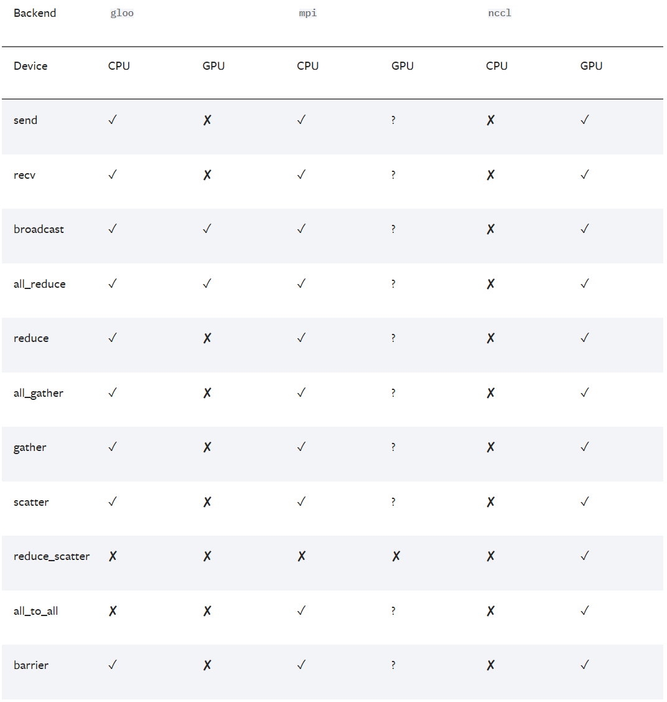
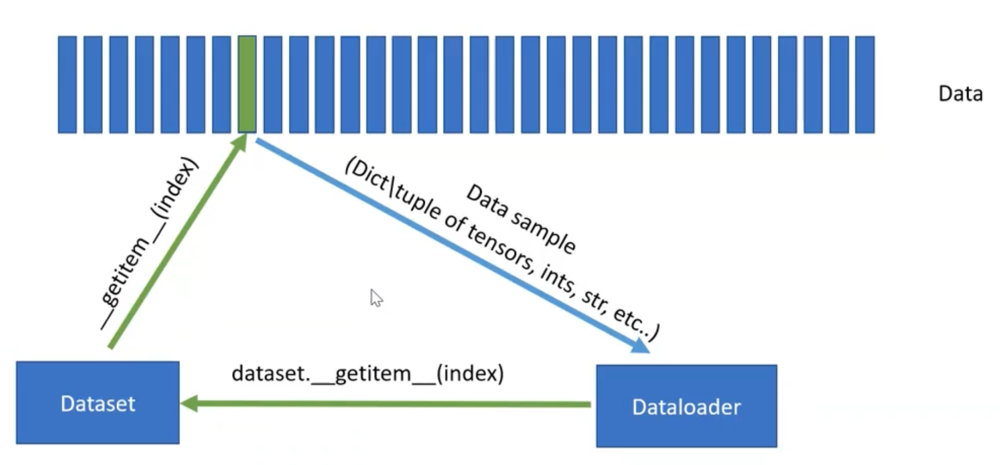
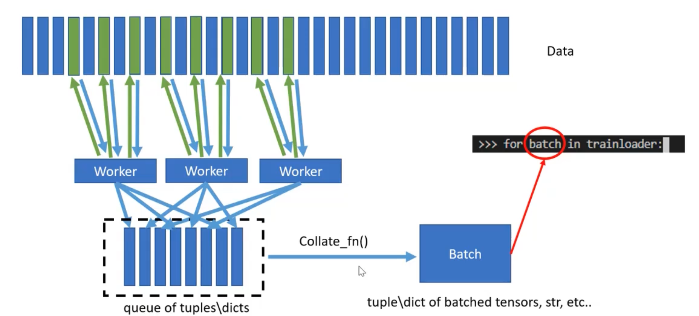

# PyTorch源码解析


**PyTorch 背后的理念是，它存在于CUDA、ROCm 或 OneAPI 等框架之上，并根据系统中安装的硬件简单地调用适当的后端。理论上，这意味着为 PyTorch 编写的代码应该可以在几乎任何支持它的东西上运行。**

# 1. Installation From Source

在分析源码之前，就必须能够成功从源码编译PyTorch。在编译PyTorch时，有非常多的选项可以选择，理清楚PyTorch的编译过程可以更好地了解PyTorch与其它组件之间的联系。

# 2. PyTorch的组成模块

现代的深度学习框架(PyTorch和Tensorflow)，都是两层架构

1. python前端，提供更高层次更好用的API
2. C++后端，执行具体的计算


# 3. PyTorch不同模块的机制


## 3.1 torch.autograd

**Autograd**是PyTorch中自动求导模块。自动求导是所有深度学习系统中最为重要的功能之一。

pytorch中的`Tensor`类有一个属性`requires_grad`，用以来声明需要对哪些Tensor自动求导。


## 3.2 PyTorch显存管理

参考：

1. 


PyTorch中的显存分为：

1. reserved memory
2. allocated memory
3. context memory

首先直接给出结论：

1. reserved memory >= allocated memory
2. 在调用`torch.cuda.empty_cache()`之后，reserved memory ~= allocated memory
3. reserved memory = allocated memory + cached memory


reserved memory就是pytorch向GPU申请的总的显存，给pytorch用的。

allocated memory中，有一部分是context memory这部分是pytorch框架占用的(官方称呼叫**CUDA context**)，而剩下的就是存储中间变量的。

cached memory，这一部分的显存是充当缓冲区的作用，以便在pytorch需要给tensor分配显存时，能够快速从cached memory中直接分配，而不需要重新申请；在tensor被释放之后，也不会被回收，而是继续留作缓冲区。一般这一块显存不会太大，否则过于浪费显存。


在分析PyTorch显存时，尽量使用`torch.cuda`而不要使用nvidia-smi。


## 3.3 DP


## 3.4 DDP

### 3.4.1 Introduction

之前在[分布式训练与推理](./分布式训练与推理.md)中讲到了DDP，一般我们讲DDP都是PyTorch的DDP。


DDP涉及到几个并行计算中常用到的概念：

1. group，group是一个进程组。对应着完成一个分布式任务的所有进程，一般来说group都是一个，对应`torch.distributed.init_process_group`API。
2. world size，world size是在一个分布式任务中的rank数量，对应着`torch.distributed.get_world_size()`API
3. rank，rank是一个分布式任务中的所有进程的唯一标识，从0一直到world size - 1，对于着`torch.distributed.get_rank()`API。rank与GPU并不是严格一一对应的，虽然大部分情况下一个GPU一个rank。一个rank可以包含多个GPU，一个GPU上也可以有多个rank。
4. local rank ，local rank是一个进程在其所在node上的唯一标识，local rank在不同的node之间是独立的，可以重复，范围是0到nproc_per_node - 1。Local rank不由PyTorch的分布式API直接提供，而通常是在启动分布式训练时由用户设定的环境变量，或者通过训练脚本的参数传入。
5. node，node对应一个物理节点，一般来说是一台有着多卡的机器。
6. nnode，node的数量。
7. nproc_per_node，每个node上的进程数量。


PyTorch的DDP支持三种通信后端，用以多进程之间的通信，不同的通信后端支持的特性也不同




`torch.distributed.init_process_group`用以初始化一个group，这个函数不能执行两次。在这个API中，需要指定用到的通信后端，以及`init_method`。

通信后端前面讲到过，而这里的`init_method`可以是TCP连接、File共享文件系统、ENV环境变量三种方式。分别对应着不同的进程间通信方式：

- `init_method='tcp://ip:port'`： 通过指定rank 0(即：MASTER进程)的IP和端口，各个进程进行信息交换。 需指定 rank 和 world_size 这两个参数。
- `init_method='file://path'`：通过所有进程都可以访问共享文件系统来进行信息共享。需要指定rank和world_size参数。
- `init_method=env://`：从环境变量中读取分布式的信息(os.environ)，主要包括 `MASTER_ADDR, MASTER_PORT, RANK, WORLD_SIZE`。 其中，rank和world_size可以选择手动指定，否则从环境变量读取。


之前提到的world size，rank，local rank是需要在启动DDP任务时候设置好的。


如果需要启动一个DDP的任务，也有不同的方法：

1. 手动一个一个启动

2. `torch.multiprocessing`中的`mp.spawn`，

   

3. `torch.distributed.launch`(已经过时)/`torchrun`，`torchrun`会


### 3.4.2 


## 3.5 FSDP


## 3.6 PyTorch hook

为了节省显存，PyTorch在计算图过程中不会保存中间变量(中间的输出的激活，非叶子张量的梯度等)，所以需要注册hook来获得这些中间量。


## 3.7 Optimizer

PyTorch中有许多优化器可以选用，位于`torch.optim`。

而这些优化器都继承自一个基类**Optimizer**。


## 3.8 Pytorch中的模型的保存与读取

Pytorch的模型的存储格式有pkl，pt，pth。而对于checkpoint采用tar格式保存。

Pytorch的模型主要包含两个部分：模型结构和权重。其中模型是继承nn.Module的类，**权重的数据结构是一个字典**（key是层名，value是权重向量）。存储也由此分为两种形式：存储整个模型（包括结构和权重），和只存储模型权重。

pkl，pt，pth三种格式都支持只存储权重和存储整个模型，区别就在于文件的内容。


**保存模型结构和参数**

```python
torch.save(model_object, './model.pth')
```

加载时

```
loaded_model = torch.load(save_dir)
```

**只保存参数**，网络结构由对应网络的class来定义

```python
torch.save(model_object.state_dict(), './params.pth')
```

加载时需要先获得模型结构

```python
loaded_model = models.resnet152()   #注意这里需要对模型结构有定义
loaded_model.load_state_dict(torch.load(save_dir))
```

**保存训练检查点(模型结构，模型权重state_dict，优化器状态以及训练进度等)**

```
loaded_model = models.resnet152()
checkpoint = torch.load('path_to_checkpoint')
loaded_model.load_state_dict(checkpoint[''])
```

torch的模型文件后缀有.pkl，.pt，.pth，.pth.tar多种格式，对于不同的存储方式采用何种后缀并没有统一的规定，一般来说

| 存储方式                 | 拓展名   |
| ------------------------ | -------- |
| 只存储模型权重           | .pth     |
| 模型权重与模型结构       | .pt      |
| 保存训练检查点checkpoint | .pth.tar |
| 以上三种                 | .pkl     |


**现在结合在[这里]()讲到的序列化与反序列化来更深入地来看这些保存的模型。**

首先我们来看`torch.load()`与`torch.save()`这一对。

之前在[这里]()提到了，`torch.load()`是依靠python的pickle库读取的。但是`torch.load()`不单单只做了反序列化，同时还会将文件中的tensor移动到对应的设备(GPU)上。这个tensor在保存的时候是在哪个设备上的，unpickling之后也会被`torch.load`加载到对应的设备上。

而`map_location`参数就是为了改变`torch.load`时这些tensor加载的位置。

一个模型保存和加载的位置，组合起来一共有4种情况：

- CPU-CPU
- CPU-GPU
- GPU-CPU
- GPU-GPU

在PyTorch的Turtorial中详细介绍了四种模式的区别，[Saving and Loading Models — PyTorch Tutorials 2.4.0+cu121 documentation](https://pytorch.org/tutorials/beginner/saving_loading_models.html#saving-loading-model-across-devices)

总的来看，当save&load的设备不同时，需要添加map_location参数。当需要load到GPU时，需要加上`model.to(device)`。


对于一个PyTorch模型，都是继承了`torch.nn.Module`的一个类。模型的可训练参数都是存放在这个类中的***parameters***变量中(通过`model.parameters()`访问)。

而`state_dict`就是一个Python字典类对象，来将每一层和其对应的参数的tensor(也就是上面的***parameters***变量)映射起来，以一个key-value对存放在这个字典中。

除此之外，PyTorch的Optimizer也有一个`state_dict`。访问`state_dict`需要使用函数`state_dict()`。

而对于PyTorch模型来说，它是一个`torch.nn.Module`这个类的对象，是一个层次结构，每一层都是这个类的一个成员，并且每一层都有自己的***parameters***变量以及`state_dict`。


对于`torch.load`和`torch.save`来说，其能够读取和保存的信息是非常多的(因为其基于Python的pickle)，只要是结构化的数据(比如Python字典或者Python对象)，都能够保存和读取。


**Pytorch单卡和多卡模型存储也有不同**

**多卡并行的模型每层的名称前多了一个“module”**，因此在单卡加载多卡模型时需要注意。


## 3.9 PyTorch中的Tensor


## 3.10 PyTorch CheckPoint机制


## 3.11 PyTorch中的各种运算


## 3.12 PyTorch中的广播机制


## 3.13 Dataset与DataLoader

[Algorithm Researcher explains how Pytorch Datasets and DataLoaders work](https://www.youtube.com/watch?v=Sj-gIb0QiRM)


这里涉及到两个类`Dataset`以及`DataLoader`。

`Dataset`类的作用是构建起索引到数据的映射，`DataLoader`负责以特定的方式从数据集中迭代的产生 一个个batch的样本集合。在enumerate过程中实际上是dataloader按照其参数sampler规定的策略调用了其dataset的getitem方法。


继承`Dataset`需要实现两个函数`__getitem__`与`__len__`。

`__getitem__`根据索引从硬盘中读取并返回数据，而`__len__`返回整个数据集大小。



`Dataloader`的构建需要传入一个`Dataset`类型的变量。dataloader就会调用dataset的`__getitem__`与`__len__`。

dataloader会调用`__len__`，结合batch的大小从而得到对于传入的数据集需要构造多少个batch(也就是iteration的个数)；dataloader会调用`__getitem__`从而构造出一个batch。

dataloader可以通过多进程的方式加速数据的加载。通过多个worker进程，每个worker进程调用`__getitem__`并行读取数据，将得到的数据放入到一个队列中。然后dataloder再调用`collate_fn`从这个队列中读取数据构建batch。




上面是对于Dataset以及DataLoader类工作原理的一个简单介绍，下面详细讲一下。

```python
torch.utils.data.DataLoader(dataset, batch_size=1, shuffle=None, sampler=None, batch_sampler=None, num_workers=0, collate_fn=None, pin_memory=False, drop_last=False, timeout=0, worker_init_fn=None, multiprocessing_context=None, generator=None, *, prefetch_factor=None, persistent_workers=False, pin_memory_device='')
```


pin_memory和non_blocking

pin_memory在CUDA中已经有了介绍。


## 3.14 PyTorch中的混合精度训练

最近改代码碰到了混合精度训练，在这里记录一下。

混合精度训练最经典的是英伟达和百度的这篇论文[MIXED PRECISION TRAINING]()。

混合精度训练混合的是FP16和FP32两种精度。FP16的动态范围要远远小于FP32的动态范围，因此在很容易出现上溢出和下溢出两种情况(这一部分可以参考[这里]())


## 3.15 CUDA graph与torch.compile

在讲CUDA graph之前，需要了解一个CUDA算子(kernel)是如何执行的。


## 3.16 torch.profile


## 3.17 PyTorch中的device(主要针对CUDA设备)

PyTorch中，torch.cuda相当于是CUDA C++的一个python前端。

PyTorch中有一下API用于管理CUDA设备：

1. toch.device类，创建一个设备对象，对象名称可以是str，也可以是str:ordinal用以制定具体的设备编号

1. torch.cuda.device([*torch.device*](https://pytorch.org/docs/stable/tensor_attributes.html#torch.device) *or* [*int*](https://docs.python.org/3/library/functions.html#int))，与torch.device不同，torch.cuda.device()返回的是一个上下文管理器，用以切换设备
2. torch.cuda.set_device([*torch.device*](https://pytorch.org/docs/stable/tensor_attributes.html#torch.device) *or* [*int*](https://docs.python.org/3/library/functions.html#int))
3. torch.cuda.current_device()
4. torch.Tensor.to()
5. torch.Tensor.cuda()


## 3.18 动态图机制

PyTorch采用的是动态计算图机制，动态体现在以下两点：

1. 动态图是随着代码计算过程动态构建的
2. 反向传播结束之后动态图会被销毁


PyTorch中的计算图是一个有向无环图(DAG)，包括叶子节点，根节点等节点：

1. 

forward和backward都有各自的计算图。


PyTorch捕获计算图


## 3.19 Autograd mechanics


# 4. 总体架构


PyTorch也是一个前后端分离的架构，大致执行流程：

1. PyTorch捕获计算图
2. 将计算图的节点lowering到底层
3. 通过dispatcher将相应的kernel调用转发到对应的后端
4. 翻译成机器码并在不同的机器上执行


在阅读了大量的参考文献之后，我发现了三种能够与我的混合专家模块(以下简称MoE)能够非常好地契合的剪枝模块，分别是TokenPacker，MobileVLM中提出的LDP以及Average Pooling。通过一个路由模块，根据每一张图片的CLS token经过路由模块处理，得到每一个专家的概率，然后交由概率最大的专家处理。目前我设置的视觉侧剪枝后的token个数为144，而原始的ViT的token个数是576。LLaVA训练时间长的一大原因就是因为视觉侧的token个数过多，而通过减少大部分的视觉token，极大加快了LLaVA的训练速度。
在融合不同的剪枝模块的过程中，不同的剪枝模块剪枝后的序列长度(token个数)是不同的。但是为了保证训练能够以batch为大小进行训练，必须使得每一个剪枝模块输出的序列长度是相同的。经过调研与讨论，我采用了一种非常常用的方案对齐序列长度，通过在序列后面补零来对齐每个序列的长度，同时不会给训练带来负面影响。


在LLaVA原有基础上，实现了相关的代码，准备好了对应的数据集，按照LLaVA给出的训练知道，进行两阶段的训练。首先进行预训练，训练我的剪枝模块以及路由模块。预训练完毕之后，利用LLaVA给出的SFT数据进行微调，对剪枝模块、路由模块以及LLM进行指令微调。目前的结论是在引入了我所提出的剪枝模块之后，两阶段的训练速度都有非常大的提升。
在得到最终训练好的模型之后，我在MMEBench这个多模态benchmark对我的算法表现进行评估。未经过剪枝的LLaVA在MME上的得分为1510，而引入了我的剪枝算法后在MME上的的得分为1460，性能略有下降。目前还在寻找改进方案。


最初计划引入Q-Former这一个剪枝模块作为剪枝专家之一，但是Q-Former需要在大规模的图像-文本对上进行预训练。同时，一些预训练好的Q-Former，由于其输出的token的特征维度与目前我所采用的其它剪枝模块不匹配，如果需要融入需要做对齐。因此暂时没有将Q-Former作为一个剪枝专家加入到我的算法中。


后续计划通过一个Projector，来讲Q-Former与我的算法的特征维度对齐，从而能够将预训练好的Q-Former加入到我的算法当中。后续计划通过一个Projector，来讲Q-Former与我的算法的特征维度对齐，从而能够将预训练好的Q-Former加入到我的算法当中。后续计划通过一个Projector，来讲Q-Former与我的算法的特征维度对齐，从而能够将预训练好的Q-Former加入到我的算法当中。后续计划通过一个Projector，来讲Q-Former与我的算法的特征维度对齐，从而能够将预训练好的Q-Former加入到我的算法当中。
