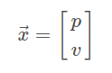

# 1. RK3588模型部署


# 2. 目标追踪概要

参考文献：

- [How a Kalman filter works, in pictures](https://www.bzarg.com/p/how-a-kalman-filter-works-in-pictures/)
- [Kalman Filter Turtorial](https://www.kalmanfilter.net/alphabeta.html)

估计过去的状态叫**平滑**，估计当前的状态叫**滤波**，估计未来的状态叫**预测**

卡尔曼滤波的作用就是

```
The Kalman Filter algorithm is a powerful tool for estimating and predicting system states in the presence of uncertainty and is widely used as a fundamental component in applications such as target tracking, navigation, and control. 
```

## 2.1 卡尔曼滤波

假设当前的系统状态包含两个变量，速度**v**与位置**p**，那么系统状态**x**可以用一个向量来表示



对于现实中的系统(比如机器人或者无人机)，这两个变量对于估计系统的下一个状态是不准确的(因为存在外界的干扰以及传感器本身的精度问题)，因此卡尔曼滤波通过综合一切可以获得的系统的信息，从而对于系统的状态作出一个最佳的估计。

由于状态这个二维向量是不准确的，因此在卡尔曼滤波中假设其满足**高斯分布**建模其不确定性质。


其中高斯分布的均值**μ**是系统**最可能的状态**，而标准差**σ**则是不确定性的表示。


## 2.2 匈牙利算法