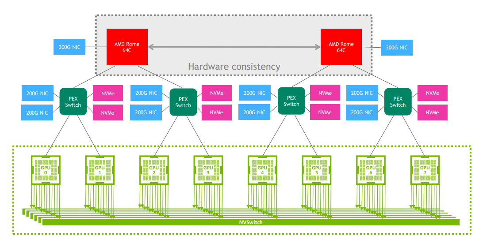

# Numbers everyone (programmer) should know (2023)

```
L1 cache reference                           0.5 ns
Branch mispredict                            5   ns
L2 cache reference                           7   ns                      14x L1 cache
Mutex lock/unlock                           25   ns
Main memory reference                      100   ns                      20x L2 cache, 200x L1 cache
Compress 1K bytes with Snappy            3,000   ns        3 µs
Read 1 MB sequentially from memory      20,000   ns       20 µs          ~50GB/sec DDR5
Read 1 MB sequentially from NVMe       100,000   ns      100 µs          ~10GB/sec NVMe, 5x memory
Round trip within same datacenter      500,000   ns      500 µs
Read 1 MB sequentially from SSD      2,000,000   ns    2,000 µs    2 ms  ~0.5GB/sec SSD, 100x memory, 20x NVMe
Read 1 MB sequentially from HDD      6,000,000   ns    6,000 µs    6 ms  ~150MB/sec 300x memory, 60x NVMe, 3x SSD
Send 1 MB over 1 Gbps network       10,000,000   ns   10,000 µs   10 ms
Disk seek                           10,000,000   ns   10,000 µs   10 ms  20x datacenter roundtrip
Send packet CA->Netherlands->CA    150,000,000   ns  150,000 µs  150 ms
```


# Infrastructure


# 1. 硬件部分

## 1.1 PCIe Switch

在PCIe Swtich方面，博通是处于垄断地位。

## 1.2 NVLink

NVLink点对点的连接。

NVLink截止目前(2024-10-8)，一共有5代。

|                                 |     Second Generation      |      Third Generation      |      Fourth Generation      | Fifth Generation              |
| :-----------------------------: | :------------------------: | :------------------------: | :-------------------------: | ----------------------------- |
|    NVLink bandwidth per GPU     |          300GB/s           |          600GB/s           |           900GB/s           | 1,800GB/s                     |
| Maximum Number of Links per GPU |             6              |             12             |             18              | 18                            |
| Supported NVIDIA Architectures  | NVIDIA Volta™ architecture | NVIDIA Ampere architecture | NVIDIA Hopper™ architecture | NVIDIA Blackwell architecture |

A100采用第三代NVLink，12条lane，每条NVLink带宽单向是25GB/s，双向是50GB/s(一般表明的带宽都是双向带宽)，总共600GB/s。

H100/H200采用第四代NVLink，18条lane，每条NVLink带宽单向是25GB/s，双向是50GB/s，总共900GB/s。


但是并不是所有的服务器机型都能够支持NVLink，需要NVLink机型，也就是SXM机型，GPU的接口是SXM接口的才支持GPU间的NVLink互联。

NVIDIA为了能够在普通的PCIe服务器上也能用到NVLink的大带宽，NVIDIA还推出了NVLink Bridge，只能支持两卡之间的互联。

## 1.3 NVSwitch

NVSwitch截止目前(2024-10-8)，一共有4代。

|                                                              |      First Generation      |     Second Generation      |      Third Generation       |         NVLink Switch         |
| :----------------------------------------------------------: | :------------------------: | :------------------------: | :-------------------------: | :---------------------------: |
| Number of GPUs with direct connection within a NVLink domain |          Up to 8           |          Up to 8           |           Up to 8           |           Up to 576           |
|                NVSwitch GPU-to-GPU bandwidth                 |          300GB/s           |          600GB/s           |           900GB/s           |           1,800GB/s           |
|                  Total aggregate bandwidth                   |          2.4TB/s           |          4.8TB/s           |           7.2TB/s           |             1PB/s             |
|                Supported NVIDIA architectures                | NVIDIA Volta™ architecture | NVIDIA Ampere architecture | NVIDIA Hopper™ architecture | NVIDIA Blackwell architecture |


NVSwitch最早是一块芯片的形式，放置在HGX平台上。

后续GB200架构上，NVIDIA用NVSwitch芯片做出了真正的NVLink交换机。包含两块NVLink Switch芯片，每块72个端口。每个端口的双向带块100GB/s


## 1.4 HBM

## 1.5 NVIDIA HGX与DGX

参考：

1. [STH NVIDIA DGX versus NVIDIA HGX What is the Difference](https://www.servethehome.com/nvidia-dgx-versus-nvidia-hgx-what-is-the-difference/)
2. [Inspur NF5488A5 8x NVIDIA A100 HGX Platform Review (servethehome.com)](https://www.servethehome.com/inspur-nf5488a5-8x-nvidia-a100-hgx-platform-review-amd-epyc/)

HGX与DGX是NVIDIA不同的产品线，是NVIDIA售卖其8x GPU system with NVLink的不同形式。

首先需要明确的是，HGX与DGX都是NVIDIA搭载NVLink互联的8x GPU平台，采用的是SXM接口。


早先(P100时代)NVIDIA的商业模式是，不同的OEM厂商会构建自己的GPU主板，然后从NVIDIA购买SXM规格的GPU，最后再由OEM厂商(或者个人或组织)组装这些GPU到主板上。

但是不论是OEM厂商还是个人安装这些GPU到主板上都会有不小的难度。


而随着V100时代的到来，NVIDIA标准化了整个8x SXM GPU平台，更多的NVLinks，并且添加了NVSwitch，整个baseboard主板的拓扑结构被NVIDIA标准化了，这就是HGX。


HGX-1的架构并没有引入NVSwitch，而是通过博通的PCIe Switch与CPU通信，GPU之间还是需要通过NVLink直接通信。


而到了HGX-2，NVIDIA引入了NVSwitch，每一块baseboard上有6块(**fully non-blocking**)NVSwitch芯片，每一块SXM规格的V100有6条NVLink分别与6块NVSwitch相连。


HGX-2上的NVSwitch是第一代，有18个端口，其中8个端口各连接一块V100，剩余8个端口与另一块baseboard对应的NVSwitch互联(还空余出两个端口，用于与CPU相连)。


除了baseboard的拓扑结构被标准化，GPU散热器也是由NVIDIA规定，并且由NVIDIA将GPUs和散热器安装在baseboard值上。


因此，OEM厂商可以直接从NVIDIA购买组装好的8x GPU baseboard(**HGX**)，然后自行在这个baseboard的基础上添加CPU，RAM，Storage等。但是这个**HGX baseboard**的拓扑是无法被改变的。


而到了A100和H100时代，NVSwitch升级为第二代，使得其散热器也变大(最右边的一列6块就是NVSwitch的散热器，下面就是NVSwitch芯片)。A100 HGX platform代号"**Delta**"(下图)


每一块SXM规格的A100有12个NVLink端口，可以连接12条NVLink。每块A100用2条NVLink与NVSwitch连接，一共6块NVSwitch，正好吃满12条NVLink。

第二代的NVSwitch有36个NVLink port。连接A100消耗掉16个端口，剩余的20个端口可以连接到另一块A100 HGX上对应的NVSwitch的端口(但实际上貌似并没有向之前V100 HGX-2那样的两块baseboard互联的例子)。


A100 HGX通过PCIe通道与PCIe Switch连接，然后连接到CPU上。**PCIe Switch并不搭载在HGX上，而是在另一块服务器制造商提供的主板上**。

A100 HGX正面长这样，正面的接口包括了中间的PCIe接口，用于将HGX连接到PCIe Switch然后连接到CPU。两边的对称的接口是HGX的电源接口。


一般的A100 HGX GPU服务器拓扑结构如下。





H100 HGX platform代号"**Delta  Next**"。


所以总的来说，NVIDIA HGX就是搭载了8x GPU(A100，H100等型号)，带有NVLink，NVSwitch的一块主板(baseboard)。OEM厂商从NVIDIA购买HGX(HGX都是一样的)，然后在HGX的基础上添加CPU，RAM以及存储等构成一台GPU服务器。服务器厂商只需要设计HGX之外的兼容HGX，满足HGX接口的主板即可。

而NVIDIA DGX则是NVIDIA以自家的HGX为基础搭建的一套GPU服务器，是NVIDIA自己的GPU服务器解决方案，相当于NVIDIA显卡的公版，而对应的HGX则是OEM版。


GPU服务器都是模块化的设计，GPU模组就是NVIDIA HGX。


## 1.6 SXM


## 1.7 InfiniBand


# 2. 软件部分


## 2.1 集群管理

[深度学习的集群管理 - 李理的博客 (fancyerii.github.io)](https://fancyerii.github.io/2024/04/28/cluster-manager/)

- Yarn
- Spark
- k8s
- Ray
- Slurm