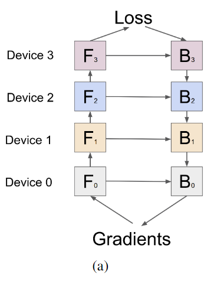
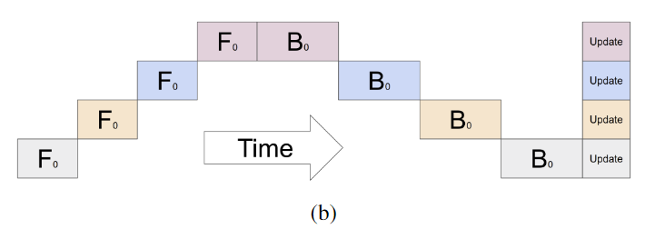
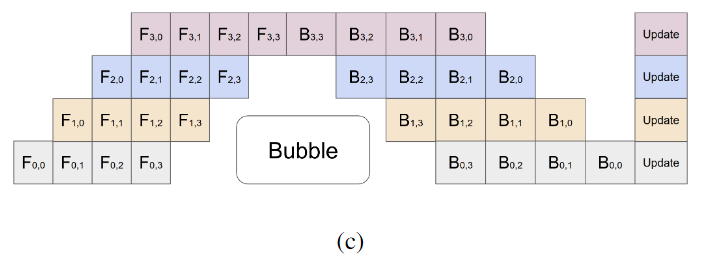
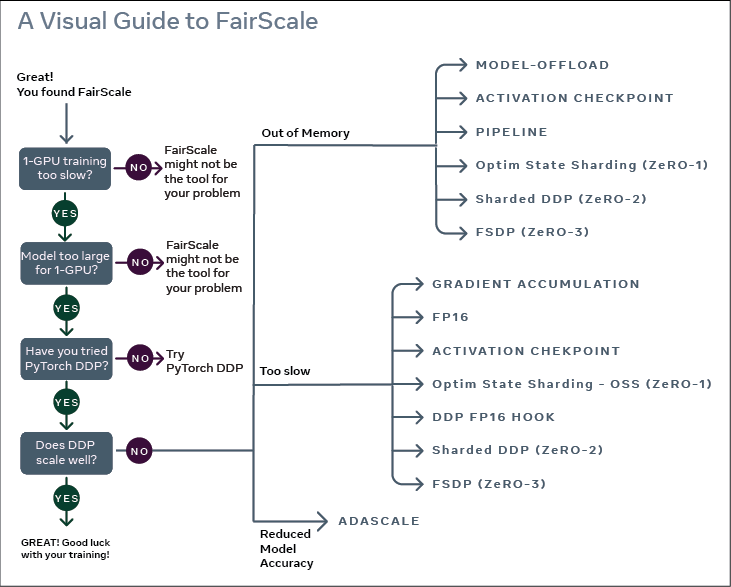

# 分布式推理与训练

常见的并行策略有：

- 数据并行 Data Parallism
- 模型并行 Model Parallism
- 流水并行 Pipeline Parallism
- 张量并行 Tensor Parallism
- 混合并行

# 1. 张量并行Tensor Parallism

Megatron-LM

张量并行，模型并行，数据并行是一个并列的并行方式；但是也可以把张量并行看作是模型并行的一种。

all-reduce可以自动求导(本质上就是一个加法)

对于Megatron来说，通讯的开销是$O(Lbsd_{model})$，而对于数据并行来说，通讯的开销是$O(d_{model}^2n)$。二者其实在通讯开销上是差不多的。

但是对于Megatron来说，通信和计算必须同步，不能是异步的；而对于数据并行来说，这二者可以是异步的。所有数据并行对于通讯的要求更低，但是随之而来的是由于每张卡都需要一个模型的副本，因此对于显存的要求更高；但是Megatron正好相反。

Megatron每张卡上的计算量FLOPs相比于单卡是不变的，但是随着模型的大小，通信量会增加，因此性能必然会随着GPU的数量增加而降低。

# 2. 流水并行Pipeline Parallism

参考：

1. [图解大模型训练之：流水线并行（Pipeline Parallelism），以Gpipe为例 - 知乎 (zhihu.com)](https://zhuanlan.zhihu.com/p/613196255)
2. [GPipe: Efficient Training of Giant Neural Networks using Pipeline Parallelism](https://arxiv.org/abs/1811.06965)
3. [PipeDream: Fast and Efficient Pipeline Parallel DNN Training](https://arxiv.org/abs/1806.03377)

Lingvo框架可复现性。

经典的流水并行范式有Google提出的**Gpipe**以及微软提出的**PipeDream**。

简单的模型并行方案如下图所示

这种模型并行方案存在两个问题：

1. GPU利用率低，在每一个时间片内，只有一个GPU在运转，其余的GPU都没有利用上
2. 中间结果占用内存，随着模型的增大，需要存放更多的中间结果

为了解决GPU空置率高的问题，GPipe在mini-batch上进一步切分**micro-batch**。

为了解决中间结果内存占用高的问题，GPipe采用了**re-materialization**。

GPipe的流水并行如下图所示，横坐标代表着不同的时间，纵坐标代表着不同的GPU

在正向传播的过程中，假设我们有K个GPU。GPipe将大小为N的mini-batch进一步切割成M个大小相同的micro-batch，然后在K个GPU上进行流水并行。

而反向传播的过程中，每一个micro-batch计算梯度，在最后阶段将M个mini-batch的梯度汇聚起来，更新K个GPU上的参数。

但是整个GPipe流程中，依然存在一些GPU在一些时间是空置的，这些GPU空闲时间片叫做bubble。

当流水线的深度变深时，GPU的利用率相应会上升。

模型并行+数据并行

# 3. 数据并行Data Parallism

参考：

1. [图解大模型训练之：数据并行上篇(DP, DDP与ZeRO) - 知乎 (zhihu.com)](https://zhuanlan.zhihu.com/p/617133971)
2. [Scaling Distributed Machine Learning  with the Parameter Server](https://www.usenix.org/system/files/conference/osdi14/osdi14-paper-li_mu.pdf)

数据并行的核心思想就是**在各个GPU上都拷贝一份完整模型，各自吃一份数据，算一份梯度，最后对梯度进行累加来更新整体模型**。随着模型逐渐变大，DP也会带来更大的存储和GPU间的通信量，这是需要考虑的问题。

Data Parallism有三种实现方式：

1. **DP(Data Parallelism)**最早的数据并行模式，一般采用参数服务器这一编程框架。实际中多用于单机多卡
2. **DDP(Distributed Data Parallelism)**分布式数据并行，采用Ring AllReduce的通讯方式，实际中多用于多机场景
3. **ZeRO** 零冗余优化器。由微软推出并应用于其DeepSpeed框架中。严格来讲ZeRO采用数据并行+张量并行的方式，旨在降低存储。

## 3.1 经典(朴素)DP

实现DP的一种经典编程框架是参数服务器(Parameter Server)。

在经典的DP中，GPU分为计算GPU与梯度聚合GPU。

在参数服务器中，同样分为worker node与server node，分别对应着计算GPU与梯度聚合GPU。

DP面临的问题主要是：

1. **存储开销大**，每块GPU上都存了一份完整的模型，造成冗余
2. **通信开销大**，server node需要和每一个worker node传输梯度，因此server node与worker node之间的带宽就有可能成为整个系统的瓶颈。

DP的负载不均衡，因此一般用于单机多卡的场景。

## 3.2 DDP

DDP是一种更加通用的解决方案，既能多机也能单机。DDP解决了DP中的负载不均衡问题，将server node上的通讯压力均衡到各个worker node上。

DDP torchrun

dist.init_process_group(backend='nccl', init_method='env://')

### 3.2.1 PyTorch的DDP

看这里[PyTorch源码解析](./PyTorch源码解析.md)

### 3.3 ZeRO

DDP解决了DP的通信开销大的问题。而ZeRO则解决了DP的存储开销大的问题。

[DeepSpeed](./DeepSpeed.md)采用到了ZeRO。

# 4. 模型并行Model Parallism

目前有许多分布式训练的方法

