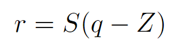

# 模型压缩


## 1、网络的构成

权重 + 计算op（算子）

**量化就是将我们训练好的模型，不论是权重、还是计算op，都转换为低精度去计算**

一般来说，模型训练的权重值是FP32。

FP32 --> FP16也是量化，这种方式量化几乎无损，不需要校准

FP32 --> INT8量化，有损，需要校准

## 2、量化过程

量化的两个重要过程：量化与反量化。


量化实际上就是通过一定的映射关系，将FP32等高精度的类型映射到相应的低精度的类型。

**不同的映射关系也意味着不同的量化方案。**


### 2.1 数据类型

在正式讲量化前，有必要了解模型训练与推理时的数据类型。

许多浮点数标准是由IEEE 754规定的。

### 2.1.1 FP80


FP80用于对精度有非常高要求的科学计算中，不会在神经网络的训练和推理中使用

### 2.1.2 FP64

FP64用于对精度有要求的科学计算中，不会在神经网络的训练和推理中使用。但是TF与PyTorch框架有相应的支持。

### 2.1.3 FP32

FP32是网络训练与推理时的标准数据类型。权重，激活以及优化器的数据类型都是FP32。

FP32的精度低，不适用于科学计算。

### 2.1.4 FP16


### 2.1.5 BF16

BF16由谷歌提出。


**在LLM中，BF16用作训练和推理。**

### 2.1.6 TF32


### 2.1.7 INT8


### 2.1.8 INT4，INT3，INT2


### 2.1.9 总结

FP16，BF16以及FP32是LLM在训练推理过程常见的三种类型。


### 2.2 基于线性量化的对称量化(Scale Quantization)和非对称量化(Affine Quantization)

下面的工作来自于NVIDIA的**[INTEGER QUANTIZATION FOR DEEP LEARNING INFERENCE: PRINCIPLES AND EMPIRICAL EVALUATION]**


非对称量化和对称量化的不同就在于实数0能否对应着整数0。

对称量化和非对称量化都属于**线性量化**

```
线性量化将FP32映射到INT8数据类型，每个间隔是相等的，而不相等的就称为非线性量化。
```

**对称量化公式**


实际上对称量化核心就是以下公式
$$
x_{int} = s * x
$$
clip操作用于当x-int超过范围时将超过范围的int类型映射到量化后范围的最大值/最小值


**非对称量化公式**


实际上非对称量化就是以下公式
$$
x_{int} = s * x + z
$$


clip的作用与上面相同。

其中**α**是输入数据分布中的实数最大值，而**β**是输入数据分布中的实数最小值。

当前**不同的量化算法和优化策略往往是寻找一个恰当的[**α,β**]（即最小值和最大值），使得 clip 和 round 操作导致的误差较小。**

**反量化公式**


对于量化的公式，不同论文给出的不太一样，但是基本思想都是一样，总体大差不差。量化更多的是一个工程方面的问题，在实现细节方面可能会存在一些差别。


这是LLM.int8()(bitsandbytes，**bnb**)给出的量化公式

**absolute maximum quantization(对称量化，symmetric quantization)：**


**Zeropoint quantization(非对称量化，asymmetric quantization)**：


而在谷歌的**[Quantization and Training of Neural Networks for Efficient Integer-Arithmetic-Only Inference]**中，将上面的两种用一个式子统一起来



量化还需要一个量化范围


而**Z**的计算
$$
z(a, b, n) := (n/2 - 1) - b/s
$$


在谷歌的一篇量化的whitepaper **[Quantizing deep convolutional networks for efficient inference: A whitepaper]**中


总结一些上面三篇工作

### 2.2 非线性量化

**非线性量化对于部署不太友好，但是量化效果好**。比如**对数量化**，将乘法操作转变为加法操作。


### 2.3 量化粒度

量化粒度有多种：

- **per-tensor**
- **per-channel**
- **per-vector**
- **Global**

**pre-tensor**对于同一块输入和激活值，采用一个scale；而**pre-channel**作用于权重，对于每一个通道，采用一个scale。

一般量化粒度越小，模型精度越高但是相应也会带来更高的计算成本。

另一方面，量化粒度也决定了卷积操作(或者GEMM操作)能否通过INT8实现从而获得相比于FP32卷积的加速。


### 2.4 量化核心操作

量化过程中最核心的操作是**卷积量化**，卷积可以拆分为**im2col+sgemm**。参考这里[卷积加速](#卷积加速)。

卷积表示为矩阵相乘以后
$$
Y=XW
$$
输出Y中的每一个元素是由


得到的。

但是每一个元素都有自己的scale，因此需要将这两项给提出来。


如果想要将这两项给提出来，那么输入每一行必须共享scale而权重每一列需要共享scale。这就是为什么最小的量化粒度是**per-row**和**per-col**。

此时就是INT8类型的卷积运算，然后再反量化。

硬件对于INT8类型的操作往往有相应的指令集优化，并且INT8类型所需要的内存是FP32的四分之一，可以提高算子的吞吐。相当于减少延迟，提高吞吐。

上面是对于对称量化，对于非对称量化，情况会有一些复，计算量更大。


### 2.5 动态范围选择(Calibration)

为了计算`scale`以及非对称量化中的`z`，需要知道`FP32 weight/activation` 的实际动态范围(找到**α** and **β**)。而`activation`的动态范围是会变化的，所以需要通过`calibration`校准，从而采样出实际的动态范围。


**clipping error**与**rounding error**的取舍


动态范围的选择算法：

- **MinMax**
- **MovingAverageMinMax**
- **Kullback-Leibler divergence**


**饱和状态与不饱和状态**：

- **饱和状态**：出现某些 `FP32` 数值不在这个实际动态范围之内我们称之为饱和状态
- **不饱和状态**：量化过程中的每一个 `FP32` 数值都在这个实际动态范围内


### 2.6 量化与反量化

**量化技术的早期，只有卷积算子支持量化**，但实际网络中还包含其他算子，而其他算子又只支持 `FP32` 计算，因此需要把 INT8 转换成 FP32，所以需要引入反量化层。

**因此量化还需要考虑算子的支持。**

**量化不仅需要考虑算子的支持，还需要考虑底层硬件的支持**，比如对于NVIDIA的GPU，其就有FP32 Tensor Core与FP16 Tensor Core，分别负责两种精度的矩阵的运算。 


**为什么不能全网络量化？**

对于一些非线性算子，比如softmax等，量化带来的精度损失是非常巨大的。所以目前大部分都是量化+反量化


## 2.7 量化一个模型方式

获得一个模型的对应量化模型有几种方式：

- **直接量化**
- **量化 + calibrator **
- **基于finetune**


PTQ


QAT


### 2.7 其它一些需要注意的

模型做推理时，权重只占很少一部分的内存，大部分内存占用来自激活值activation。如果做低比特量化只关注卷积的话（很多论文其实也是只量化了卷积），那么是无法带来内存占用降低的。

因此需要将更多的activation进行量化，但是这样做会带来更多的精度损失。


# 目前的一些量化方案

- Pytorch
- TensorRT
- NNCF
- AIMET
- TensorRT的Pytorch-quantization，主要针对Pytorch（TF已经有很好用的官方量化工具了）
- **TVM**
- OpenVINO
- NCNN


具体方法有：

- `data free`：不使用校准集，传统的方法直接将浮点参数转化成量化数，使用上非常简单，但是一般会带来很大的精度损失，但是高通最新的论文 `DFQ` 不使用校准集也得到了很高的精度。
- `calibration`：基于校准集方案，通过输入少量真实数据进行统计分析。很多芯片厂商都提供这样的功能，如 `tensorRT`、高通、海思、地平线、寒武纪
- `finetune`：基于训练 `finetune` 的方案，将量化误差在训练时仿真建模，调整权重使其更适合量化。好处是能带来更大的精度提升，缺点是要修改模型训练代码，开发周期较长。


另一些量化方案：

1. **二值化**，其可以用简单的位运算来同时计算大量的数。对比从 nvidia gpu 到 x86 平台，1bit 计算分别有 5 到128倍的理论性能提升。且其只会引入一个额外的量化操作，该操作可以享受到 SIMD（单指令多数据流）的加速收益。
2. **线性量化**(最常见)，又可细分为非对称，对称和 `ristretto` 几种。在 `nvdia gpu`，`x86`、`arm` 和 部分 `AI` 芯片平台上，均支持 `8bit` 的计算，效率提升从 `1` 倍到 `16` 倍不等，其中 `tensor core` 甚至支持 `4bit`计算，这也是非常有潜力的方向。**线性量化引入的额外量化/反量化计算都是标准的向量操作**，因此也可以使用 `SIMD` 进行加速，带来的额外计算耗时不大。
3. **对数量化**，一种比较特殊的量化方法。两个同底的幂指数进行相乘，那么等价于其指数相加，降低了计算强度。同时加法也被转变为索引计算。目前 `nvdia gpu`，`x86`、`arm` 三大平台上没有实现对数量化的加速库，但是目前已知海思 `351X` 系列芯片上使用了对数量化。


工业界和学术界的量化不太一样。

从**[Quantization and Training of Neural Networks for Efficient Integer-Arithmetic-Only Inference]**这篇谷歌提出的量化方案来看，这篇文章中采用的是全量化网络，对输入做量化然后输出做反量化。中间的计算都是定点计算。

这篇文章的量化方案在TFLite中有对应的实现，参考[LiteRT 8-bit quantization specification  | Google AI Edge  | Google AI for Developers](https://ai.google.dev/edge/litert/models/quantization_spec)。TensorFlow/TFLite非常早就支持了PTQ与QAT。

虽然谷歌上面的那篇文章只对输出做了反量化，对于网络中间的量不做反量化。但是其网络中也有类似的结构，与反量化的作用类似，只不过执行的操作是定点操作。


TensorRT的量化方案与TF类似但也有不同。

TensorRT的量化方式有两种`implicitly`以及`explicitly`量化。


在线量化与离线量化


# 卷积加速

## 1、FFT

通过快速傅里叶变换，将卷积转变为矩阵乘积。

但是由于feature map和卷积核的尺寸不同，因此需要补0。

## 2、im2col+sgemm

同样是将卷积转变为矩阵乘法。

这种方法的核心思想是不论是图像还是卷积核，都是按照**行优先**存储的。

### 2.1 im2col

**im2col**就是将输入图像的像素点按照“卷积区域”，挨个排列起来。


对于多通道的输入图像


### 2.2 Sgemm（Single precision GEneral Matrix Multiply）

Sgemm是单精度矩阵乘法。除了Sgemm,还有Dgemm，Cgemm，Zgemm，Dsymm，Zhemm等。

## 3、Winograd

出自于[Fast Algorithms for Convolutional Neural Networks](https://arxiv.org/abs/1509.09308)

## 4. Fourier


# 矩阵乘法的加速

最原始的矩阵乘法的复杂度是O(n^3)，n是矩阵的维度（假设是方阵）


**Strassen's Algorithm**


**Winograd**

证明了


**AlphaTensor**


# BLAS

**Basic Linear Algebra Subprograms** (**BLAS**)是一个针对线性代数库的通用标准与规范，规定了一系列底层用于线性代数计算的函数的接口(与OpenGL相同)。


BLAS最早是由Fortran编写，作为一个Fortran库。Fortran版本的BLAS是作为一个reference implementation，优化并不是特别好。后续也有C语言版本的cBLAS。

有许多BLAS的实现，基本都遵循BLAS的接口规范,，而且一部分是专门为某一些硬件优化的，利用到了特定的硬件特性：

- [cuBLAS](https://en.wikipedia.org/wiki/CUDA#Programming_abilities)
- [rocBLAS](https://en.wikipedia.org/wiki/ROCm#rocBLAS_/_hipBLAS)
- [OpenBLAS](https://en.wikipedia.org/wiki/OpenBLAS)
- [BLIS (BLAS-like Library Instantiation Software)](https://en.wikipedia.org/wiki/BLIS_(software))
- [Intel Math Kernel Library](https://en.wikipedia.org/wiki/Intel_Math_Kernel_Library) (iMKL)
- [ATLAS](https://en.wikipedia.org/wiki/Automatically_Tuned_Linear_Algebra_Software)

许多数值计算的软件或者包都利用到了BLAS-compatible库来进行线性代数计算，比较知名的有MATLAB，NumPy，R，LAPACK，LINPACK，GNU Octave等。


## GEMM(General Matrix Multiply)


# 稀疏化

稀疏在不同的语境下有不同的含义：

- 对于模型压缩领域，稀疏化是压缩模型的一种方法
- 对于大模型领域，稀疏模型指模型具有非常大的容量，但只有模型的用于给定的任务、样本或标记的某些部分被激活。与之相关的还有**MoE**以及**密集模型**。


稀疏方式分类

- **结构化稀疏**  结构化稀疏能够获得规则的稀疏化结构，但是无法获得高的压缩率。精度低。`removes parameters in groups`
- **非结构化稀疏** 非结构化稀疏能够获得更高的压缩率，但是无法保持一个规则的稀疏化结构，实际应用中很难做推理加速。但是精度高。

按照稀疏的粒度来划分，有可以分为：

- **细粒度稀疏** 细粒度的稀疏在单个权重的维度上进行稀疏 
- **粗粒度稀疏** 粗粒度的稀疏在filter/channel维度上进行稀疏


a、b、c分别为非结构化稀疏、粗粒度结构化稀疏、细粒度结构化稀疏。


## 相关论文


# 训练加速

## Transformer的训练加速

分为token reduction和parameter reduction：

- token reduction使用更少数量的token但是参数量不变
- parameter reduction使用更少的参数
- data reduction则是在数据层面减少冗余


## CNN的训练加速

- 剪枝梯度
- 量化


# Network Architecture Search
