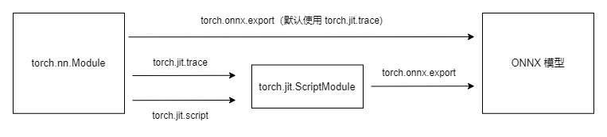
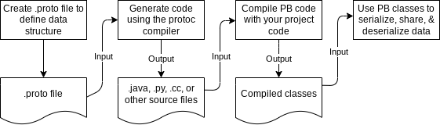

# 模型部署

参考系列文章[模型部署入门教程](https://zhuanlan.zhihu.com/p/477743341)


# 推理引擎

推理引擎由**CUDA**或**OpenCL**等高性能面向硬件的框架编写，把中间表示转化成特定文件格式，在对应硬件平台上运行。

## 1、TensorRT

TensorRT是可以在**NVIDIA**各种**GPU硬件平台**下运行的一个**C++推理框架**，利用Pytorch、TF或者其他框架训练好的模型，可以转化为TensorRT的格式，然后利用TensorRT推理引擎去运行我们这个模型，从而提升这个模型在英伟达GPU上运行的速度。

**TensorRT专注于推理**


### 1.1 TensorRT

### 1.2 转TensorRT

TensorRT获取网络结构的三种方式：

- 使用`TF-TRT`，将TensorRT集成在TensorFlow中
- 使用`ONNX2TensorRT`，即ONNX转换trt的工具
- 手动构造模型结构，然后手动将权重信息挪过去，非常灵活但是时间成本略高，有大佬已经尝试过了：[tensorrtx](https://link.zhihu.com/?target=https%3A//github.com/wang-xinyu/tensorrtx)


### 1.3 Dynamic Batch


# 中间表示

中间表示只描述网络结构，针对网络结构做出优化。

## 1、计算图

见《机器学习系统：设计和实现》第四章

## 2、ONNX

ONNX(Open Neural Network Exchange)，ONNX提出的目的是

```
ONNX aims at providing a common language any machine learning framework can use to describe its models. 
```


### 2.1 Pytorch与Onnx

要使得PyTorch模型能够顺利地转化为ONNX，需要有一下三个要求：

1. 算子在 PyTorch 中有实现 
2. 有把该 PyTorch 算子映射成一个或多个 ONNX 算子的方法 
3. ONNX 有相应的算子 


因此，对于这三个要求，如果不满足，也有相应的解决方案：

1. PyTorch 算子 
   - 组合现有算子  
   - 添加 TorchScript 算子 
   - 添加普通 C++ 拓展算子 
2. 映射方法  
   - 为 ATen 算子添加符号函数 
   - 为 TorchScript 算子添加符号函数  
   - 封装成 `torch.autograd.Function` 并添加符号函数 
3. ONNX 算子 
   - 使用现有 ONNX 算子 
   - 定义新 ONNX 算子 


算子在PyTorch的ATen库中已经实现，ONNX中也有相关算子的定义，但是缺少映射规则，这时候只需要**为 ATen 算子补充描述映射规则的符号函数(symbolic函数)**。


### 2.1.1 torch.onnx.export

Pytorch中自带了一个将模型转为ONNX的API，`torch.onnx.export`。这个函数的转换流程如下



函数原型：

```python
torch.onnx.export(model, args, f, export_params=True, verbose=False, training=<TrainingMode.EVAL: 0>, input_names=None, output_names=None, operator_export_type=<OperatorExportTypes.ONNX: 0>, opset_version=None, do_constant_folding=True, dynamic_axes=None, keep_initializers_as_inputs=None, custom_opsets=None, export_modules_as_functions=False, autograd_inlining=True)
```

但是这个API能够接受许多参数，下面是一些比较重要的参数：

- **model([`torch.nn.Module`](https://pytorch.org/docs/stable/generated/torch.nn.Module.html#torch.nn.Module), [`torch.jit.ScriptModule`](https://pytorch.org/docs/stable/generated/torch.jit.ScriptModule.html#torch.jit.ScriptModule) or [`torch.jit.ScriptFunction`](https://pytorch.org/docs/stable/generated/torch.jit.ScriptFunction.html#torch.jit.ScriptFunction))** 模型结构
- **args** 模型的输入
- **f** 导出的onnx文件名
- **export_params** 这个选项用以


### 2.1.2 PyTorch对ONNX的算子支持。

```
在转换普通的torch.nn.Module模型时，PyTorch 一方面会用跟踪法执行前向推理，把遇到的算子整合成计算图；另一方面，PyTorch 还会把遇到的每个算子翻译成 ONNX 中定义的算子。在这个翻译过程中，可能会碰到以下情况：
	1.该算子可以一对一地翻译成一个 ONNX 算子。
	2.该算子在 ONNX 中没有直接对应的算子，会翻译成一至多个 ONNX 算子。
	3.该算子没有定义翻译成 ONNX 的规则，报错。 
```

PyTorch的算子是向ONNX的算子对齐的，ONNX的算子在[这里](https://github.com/onnx/onnx/blob/main/docs/Operators.md)都有详细介绍。


PyTorch中，与ONNX有关的定义位于[`torch/onnx`目录](https://github.com/pytorch/pytorch/tree/main/torch/onnx)中，这个目录如下


`symbolic_opset{n}.py`是符号表文件，表示 PyTorch 在支持第 n 版 ONNX 算子集时新加入的内容。


## 2.2 深入ONNX

### 2.2.1 Protobuf

在讲ONNX之前，需要了解下Protobuf，Protobuf在[序列化与反序列化](#序列化(serialization)与反序列化(deserialization))这一部分中有提到，参考那篇文章即可。

ONNX利用到了Protobuf来序列化并且保存ONNX graph。

### 2.2.2 ONNX格式与ONNX的生成

首先需要明确Input, Output, Node, Initializer, Attributes这几个概念

ONNX中Node就是各种各样的ONNXA Operator，它们也有输入与输出。

Initializer就是一些常量(比如权重等)

Attribute就是Operator的一些参数。


既然ONNX采用Protobuf存储ONNX graph，那么[**onnx.proto**](https://github.com/onnx/onnx/blob/main/onnx/onnx.proto)就定义了ONNX graph的通用结构。

这个文件中`message`关键字开头的对象是我们需要关心的，有几个核心的`message`对象

- `ModelProto`
- `GraphProto`
- `NodeProto`
- `ValueInfoProto`
- `TensorProto`
- `AttributeProto`


ONNX还需要表示网络的拓扑结构。


在了解了ONNX定义graph结构的`onnx.proto`之后，我们就可以知道一个网络的ONNX文件是如何生成的了。

在`onnx.proto`定义了ONNX graph的结构之后，首先需要用protobuf compiler(`protoc`)编译`onnx.proto`生成相应的`python/java/c++`文件，其中定义了相关的类以及用于序列化的API。

对于如下的`onnx.proto`

```protobuf
syntax = "proto3";

package onnx;

// OP节点
message NodeProto {
  string name = 1;    
  string op_type = 2;  
}

// 图
message GraphProto {
  repeated NodeProto nodes = 1;
  string name = 2;   
}
```

经过`protoc`编译后，生成`onnx_pb2.py`文件

```python
# -*- coding: utf-8 -*-
# Generated by the protocol buffer compiler.  DO NOT EDIT!
# source: onnx.proto
"""Generated protocol buffer code."""
from google.protobuf.internal import builder as _builder
from google.protobuf import descriptor as _descriptor
from google.protobuf import descriptor_pool as _descriptor_pool
from google.protobuf import symbol_database as _symbol_database
# @@protoc_insertion_point(imports)

_sym_db = _symbol_database.Default()


DESCRIPTOR = _descriptor_pool.Default().AddSerializedFile(b'\n\nonnx.proto\x12\x04onnx\"*\n\tNodeProto\x12\x0c\n\x04name\x18\x01 \x01(\t\x12\x0f\n\x07op_type\x18\x02 \x01(\t\":\n\nGraphProto\x12\x1e\n\x05nodes\x18\x01 \x03(\x0b\x32\x0f.onnx.NodeProto\x12\x0c\n\x04name\x18\x02 \x01(\tb\x06proto3')

_builder.BuildMessageAndEnumDescriptors(DESCRIPTOR, globals())
_builder.BuildTopDescriptorsAndMessages(DESCRIPTOR, 'onnx_pb2', globals())
if _descriptor._USE_C_DESCRIPTORS == False:

  DESCRIPTOR._options = None
  _NODEPROTO._serialized_start=20
  _NODEPROTO._serialized_end=62
  _GRAPHPROTO._serialized_start=64
  _GRAPHPROTO._serialized_end=122
# @@protoc_insertion_point(module_scope)

```

然后我们可以手动创建一个满足`onnx.proto`定义的结构的graph，然后将其序列化

```python
import onnx_pb2

# 定义Conv OP
def Conv2d(name):
    conv = onnx_pb2.NodeProto()
    conv.op_type = "conv2d"
    conv.name = name
    return conv

# 定义BN OP
def BatchNorm(name):
    batch_norm = onnx_pb2.NodeProto()
    batch_norm.op_type = "batch_norm"
    batch_norm.name = name
    return batch_norm

# 定义Relu OP
def Relu(name):
    relu = onnx_pb2.NodeProto()
    relu.op_type = "relu"
    relu.name = name
    return relu

# 定义序列化容器
def Sequential():
    seq = onnx_pb2.GraphProto()
    return seq

def export(model, output_path): 
    with open(output_path, "wb") as f:  
        print(str(model))
        f.write(model.SerializeToString())

if __name__=="__main__":
    conv1 = Conv2d("conv1")
    batch_norm1 = BatchNorm("batch_norm1")
    relu1 = Relu("relu1")
    seq = Sequential()
    seq.nodes.extend([conv1, batch_norm1, relu1])
    export(seq, "test_protobuf.onnx")
```

这样就生成了一个序列化的由三个算子构成的graph。


但是上面导出的`test_protobuf.onnx`在使用Netron可视化的时候会报错


### 2.2.3 ONNX Operator(算子)

ONNX的算子主要位于两个域中`ai.onnx`与`ai.onnx.ml`


ONNX的算子库


### 2.2.4 实际模型转换中的许多坑

既然提出ONNX的目的是为了使得模型能够脱离其所依赖的框架，更加容易地部署。但是实际上，从不同DL框架的模型转化为ONNX的过程中依然有非常多的坑。


## 3、Torchscript


# 深度学习框架

## 1、Pytorch

### 1.1 Pytorch中的模型的保存与读取

Pytorch的模型的存储格式有pkl，pt，pth。而对于checkpoint采用tar格式保存。

Pytorch的模型主要包含两个部分：模型结构和权重。其中模型是继承nn.Module的类，权重的数据结构是一个字典（key是层名，value是权重向量）。存储也由此分为两种形式：存储整个模型（包括结构和权重），和只存储模型权重。

pkl，pt，pth三种格式都支持只存储权重和存储整个模型。


# 芯片的算力指标

FLOPS，TOPS，MACs


# 序列化(serialization)与反序列化(deserialization)

*"pickling"* 是将 Python 对象及其所拥有的层次结构转化为一个字节流(**字符串或者文件**，**序列化也可以序列化成字符串**)的过程，而 *"unpickling"* 是相反的操作，会将来自一个 [binary file](https://docs.python.org/zh-cn/3/glossary.html#term-binary-file) 或者 [bytes-like object](https://docs.python.org/zh-cn/3/glossary.html#term-bytes-like-object) 的字节流转化回一个对象层次结构。

序列化也叫做：**“serialization”, “marshalling,” [[1\]](https://docs.python.org/3/library/pickle.html#id7) or “flattening”**

这一部分还与**[json]()**以及**[yaml]()**有联系，本质上都是如何通存储结构化的对象(object)的信息。

不同的序列化的方式也相应的有不同的物理格式，目前的比较常用的格式有：

1. **JSON**
2. **YAML**
3. **CSV**
4. **XML**
5. **PICKLE**
6. **PROTOBUF**

而pytorch保存模型实际上就使用到了python的序列化/反序列化库**pickle**。


## Protocal Buffers(Protobuf)


### Protobuf的工作原理



### Protobuf语法


# 算子

当我们模型实际落地时，一个绕不开的话题就是算子。算子在各个层级都有涉及：芯片支持不支持某个算子，框架支持不支持某个算子......

这里罗列一些想到的问题：

- 所谓芯片支持/不支持某个算子，是为什么？
- 所谓框架支持/不支持某个算子，是为什么？
- PyTorch算子，TF算子以及ONNX算子之间有什么区别和联系，以及当我们对模型进行转换时，对于这些算子会进行什么操作？
- 算子对齐是如何做的？


## 什么是算子(Operator)

算子实际上就是一个个计算单元，用以对张量执行基本操作(四则运算，数学函数，维度压缩Squeeze，维度修改Reshape等)。

提到算子，就不得不提到另外两个概念，**Kernel**与**中间态(Intermediate Representation)**。

在AI框架中，使用C++(CUDA)实现的算子就是指的是Kernel(CUDA的Kernel函数)，Kernel并不支持自动梯度计算(Autograd模块)，**不感知微分的概念**，是一种狭义上的算子，算子的底层实现。

而更加广义的算子，其是就是一个函数，比如PyTorch的Conv2D，配合PyTorch Autograd模块可以做到自动梯度计算。

而**中间态(Intermediate Representation)**，一般用于在得到网络的结构的优化，与LLVM中的中间表示类似。


知乎上的个人认为非常好的回答

```
算子是指支持dnn模型训练与推理的基本运算单元及组合。比如conv2d，matmul。深度模型由pytorch，TF等上层框架表达实现，一般人并不关心他们是如何由具体的硬件实现的。实际上，这些模型在硬件执行前首先经过图级优化，分解为一个个算子。算子如何适配具体芯片的特点需要针对硬件特性仔细安排。这个就是nvidia显卡的cudnn，cublas等cuda要做的事情。类似的还有在x86 CPU上的mkl blas等。对于ai芯片公司来说，其芯片都有自己的硬件架构和特性，现有的这些算子优化实现都显然不支持。因此为了让DNN模型在自己芯片运行和发挥最佳性能，就需要定制自己的算子库。

作者：viewdeep
链接：https://www.zhihu.com/question/422521822/answer/1489461228
来源：知乎
```

