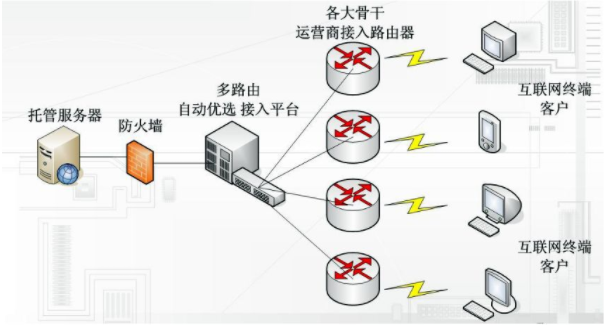
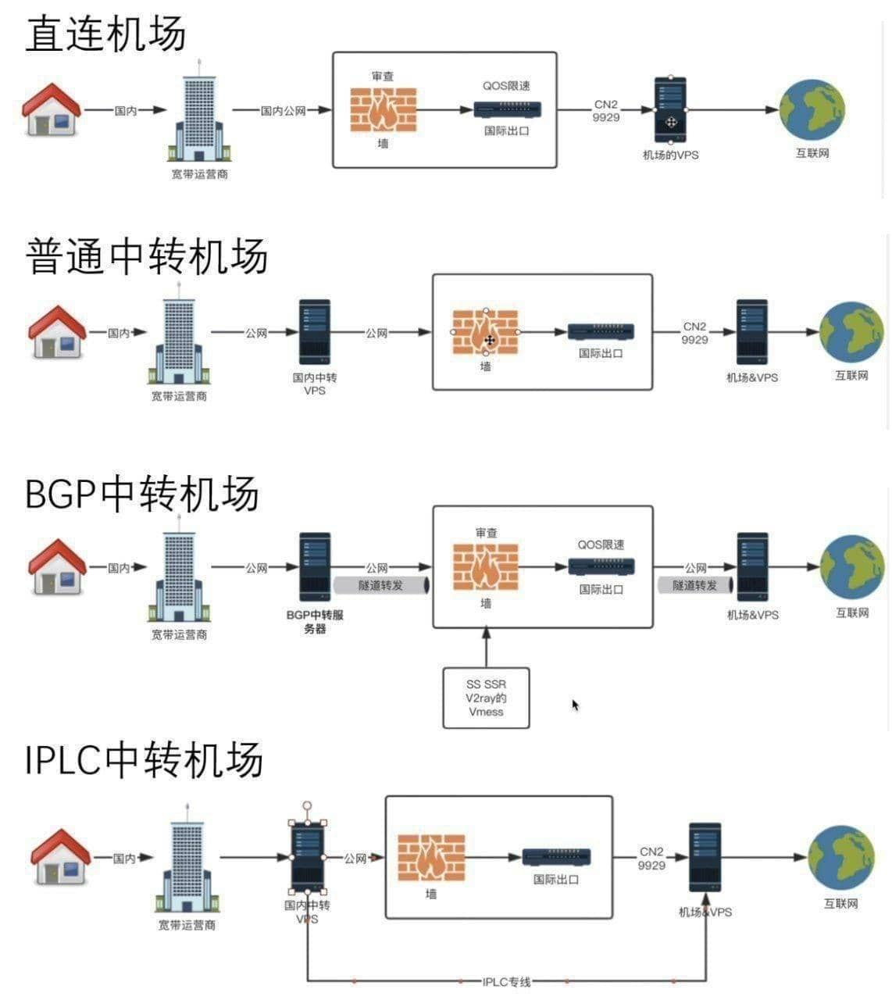

# 科学上网/翻墙

# 1、内网线路（国际专线IPLC IEPL）

**内网机场**

**IPLC（International Private Leased Circuit）**

**IEPL（International Ethernet Private Line）**

IPLC和IEPL不过墙（不受公网审查）

IPLC和IEPL都是内网线路，不转到公网。如果需要访问公网IPLC/IEPL两端还是需要接入互联网。

全局IPLC：数据直接进入内网专线。

通过机场走内网专线：只有中间一部分是内网专线

IPLC物理层（纯粹的物理层传输电路，TDM技术，需要相应的路由器），IEPL数据链路层（以太网链路，设备间MAC地址通讯，延迟相对更低）

优势：

1. 时延低
2. 稳定，不受公网影响
3. 不受审查

但上述优势还涉及到**木桶效应**，如果用户在接入公网（BGP）这一段优化不是特别好，即使采用内网线路优势也不是特别明显。

内网线路也可能拥堵，机场本身技术能力，运维能力与内网专线采购价格也会影响。负载均衡，运维，超售问题

内网机场运作模式：通过限制每个用户流量，使得购买的内网线路能够承载更多用户，获得更多理论，冗余的负载可以通过免费流量分发或者邀请码分发。

**多级供应商**

与之相对的**CN2**和**163**线路

# 2、其他各种线路

## 2.1 163骨干网（CN1）

163骨干网是以202.97 IP地址开头的路由。

国内访问不存在瓶颈，在国际出口存在拥堵，电信的大多数用户和流量接入163骨干网。

## 2.2 CN2（Chinatelecom Next Carrier Network）

CN2线路是以59.43 IP地址开头的路由，一些VPS提供商会通过接入CN2线路加快访问速度。

CN2搭载了**QoS技术**，能够识别网络中流量的需求，动态根据服务内容调整网络通畅性，服务与流量分优先级。

对于低延时低带宽的游戏数据，对于延时需求较低大带宽的流媒体数据，QoS能够同时满足。

**被QoS**：QoS针对流量类型限速。

CN2GT（Global Transit）CN2GT的回国线路还是采用163骨干网

CN2GIA（Global Internet Access）贵，稳定，拥有独立的回国线路

有的游戏加速器使用的就是有QoS的CN2线路，有的直接使用IPLC专线

## 2.3 BGP线路

上述的CN1和CN2都只是**电信**的普通专线，只有电信用户访问速度快，而BGP线路可以做到所有运营商的用户访问速度都很快。

三大运营商线路：

- 中国电信
- 中国联通
- 中国移动

三线BGP：电信、联通、移动

五线BGP：电信、联通、移动、铁通、教育网

对于BGP线路，多条线路综合到一个IP访问，通过BGP协议和AS号实现互联。

BGP机房（也成为多线机房）

自动识别线路（电信，移动和联通），自动选择最佳线路。

## 2.4 三巨头线路

1. GCP（Google Cloud Platform）
2. AWS
3. Azure

## 2.5 香港线路

1. PCCW
2. HKT
3. HKBN

对各种线路的总结：

骨干网之间的带宽小，而国际出口带宽大，导致南北互联问题。

国际线路分为**公网**和**内网**，二者又可以进一步划分为**合租**和**独享**。

# 3、VPS vs. 机场

## 3.1 VPS供应商的选择

一些VPS供应商的选择[看这里](../服务器折腾日记/云服务器#云服务器的选择)

## 3.2 VPS优势与劣势

优势：

- 可玩性高，可以自行添加功能，可以折腾

劣势：

- 不稳定，IP和端口容易被封，QoS限速，速度存在问题
- 需要选择加密协议与算法
- VPS只有唯一的一个地理位置可用，流媒体的解锁

## 3.3 机场的优势与劣势

与VPS相反

**[毒药]([https://www.duyaoss.com/](https://www.youtube.com/redirect?event=video_description&redir_token=QUFFLUhqbDhnbnBXeVlvbGtKRUN3QkdTeVdZR2M4MkFRUXxBQ3Jtc0trdGdBLWJ4c0tJZmlrdXRLV2NvekV2S2VBNjZFdWRsWnlTaFdzUEgyQjd6SVFmbDFfMUNneEtCYzVWN2x5bG9VZjhfeTA5V3NuQlc5LXA4aTJTNWEyNXFhSmMwRkVUNVZtNm9xT2xZZzI4QURuM2hPWQ&q=https%3A%2F%2Fwww.duyaoss.com%2F&v=kf90r28t4f0))**测速各大VPS。
