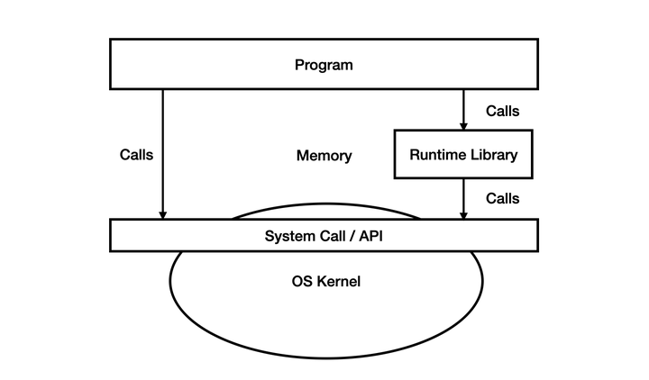
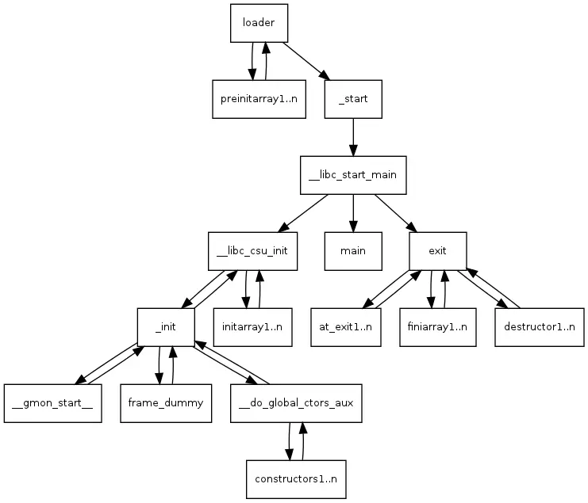

# 1、Runtime


**Runtime**的有多种含义：

1. 程序的一个执行阶段：运行时
2. 运行时库Runtime library
3. 运行时系统


## 1.1 程序的生命周期的一个阶段


## 1.2 Runtime library

Linux下`glibc`，Windows下`CRT`



但**运行时库不只是标准库**，还有一些其它的代码在编译时会被插入到最后的可执行文件中，比如main函数，它在真正执行前就需要大量来自运行时库的辅助。

参考[Linux x86 Program Start Up](https://link.zhihu.com/?target=http%3A//dbp-consulting.com/tutorials/debugging/linuxProgramStartup.html)



运行时库还可能被隐式调用，**gcc的libgcc和clang的compiler-rt**，这些库特定于编译器。

### 1.2.1 libgcc

GCC中对于libgcc的描述

```

GCC provides a low-level runtime library, libgcc.a or libgcc_s.so.1 on some platforms. GCC generates calls to routines in this library automatically, whenever it needs to perform some operation that is too complicated to emit inline code for.
```

**libgcc**中的函数大部分用于实现目标处理器上无法直接实现的算术运算。

因此libgcc中的routines一部分是用machine-independent C另一部分是hand-written in assembly language（相应的CPU的汇编）。

### 1.2.2 compiler-rt

Clang/LLVM中对于compiler-rt的描述

## Runtime System（Runtime Environment）

对于更加高级的语言，如JAVA，C#，javascript等，其Runtime值得就是Runtime System了。

- **JAVA**的Runtime是**JRE**
- **C#**的Runtime是**CLR**
- **Javascript**的Runtime是**浏览器**或者**Node.js**


# 2、Linux x86 Program Start Up

原文[Linux x86 Program Start Up](https://link.zhihu.com/?target=http%3A//dbp-consulting.com/tutorials/debugging/linuxProgramStartup.html)


在程序开始执行**_start**之前，需要由**loader**完成一些准备工作：

1. 执行**execve()**系统调用
2. 建立起堆栈
3. 打开三个文件描述符
4. 调用preinitializer


## 2.1 _start

```assembly
080482e0 <_start>:
80482e0:       31 ed                   xor    %ebp,%ebp #将ebp的值设为0，这是由ABI规定的，最外层的stack frame从0地址开始。
80482e2:       5e                      pop    %esi #esi的值为argc
80482e3:       89 e1                   mov    %esp,%ecx #ecx指向argv 
80482e5:       83 e4 f0                and    $0xfffffff0,%esp #16字节对齐
80482e8:       50                      push   %eax #从这里开始为__libc_start_main准备push参数，eax这一项只是为了16字节对齐，不会被使用
80482e9:       54                      push   %esp
80482ea:       52                      push   %edx
80482eb:       68 00 84 04 08          push   $0x8048400
80482f0:       68 a0 83 04 08          push   $0x80483a0
80482f5:       51                      push   %ecx
80482f6:       56                      push   %esi
80482f7:       68 94 83 04 08          push   $0x8048394
80482fc:       e8 c3 ff ff ff          call   80482c4 <__libc_start_main@plt>
8048301:       f4                      hlt
```


## 2.2 __libc_start_main

这个函数处于glibc中，位于csu/libc-start.c文件中。

```c
int __libc_start_main(  int (*main) (int, char * *, char * *),
			    int argc, char * * ubp_av,
			    void (*init) (void),
			    void (*fini) (void),
			    void (*rtld_fini) (void),
			    void (* stack_end));
```


其中还涉及到两个函数**__libc_csu_init**和**__libc_csu_fini**。

其中**__libc_csu_fini**是个glibc的函数，位于csu/elf-init.c，是一个destructor。


## 2.3 Environment variables

关于OS中的环境变量，看这里[这里](#3、环境变量)

main函数其实有三个参数，函数原型

```c
int main(int argc, char** argv, char** envp)
```

第三个参数**envp**环境变量的传递，涉及到**__libc_init_first**函数。

```c
void __libc_init_first(int argc, char *arg0, ...)
{
    char **argv = &arg0, **envp = &argv[argc + 1];
    __environ = envp;
    __libc_init (argc, argv, envp);
}
```

**__libc_init_first**函数会设置一个全局变量**__environ**，这个全局变量就是环境变量，通过argv的null字符之后找到这个环境变量的地址。而在环境变量这个字符串的null字符之后，还有一个ELF auxiliary vector。 

loader会通过ELF auxiliary vector传递一些信息给进程，可以通过设置环境变量**LD_SHOW_AUXV=1**来观察。

```
$ LD_SHOW_AUXV=1 ./prog1
AT_SYSINFO:      0xe62414
AT_SYSINFO_EHDR: 0xe62000
AT_HWCAP:    fpu vme de pse tsc msr pae mce cx8 apic
             mtrr pge mca cmov pat pse36 clflush dts
             acpi mmx fxsr sse sse2 ss ht tm pbe
AT_PAGESZ:       4096
AT_CLKTCK:       100
AT_PHDR:         0x8048034
AT_PHENT:        32
AT_PHNUM:        8
AT_BASE:         0x686000
AT_FLAGS:        0x0
AT_ENTRY:        0x80482e0 #_start的地址
AT_UID:          1002
AT_EUID:         1002
AT_GID:          1000
AT_EGID:         1000
AT_SECURE:       0
AT_RANDOM:       0xbff09acb
AT_EXECFN:       ./prog1
AT_PLATFORM:     i686
```


总的来说，**__libc_start_main**的作用如下：

- Takes care of some security problems with setuid setgid programs
- Starts up threading
- Registers the **fini** (our program), and **rtld_fini** (run-time loader) arguments to get run by **at_exit** to run the program's and the loader's cleanup routines
- Calls the **init** argument
- Calls the **main** with the **argc** and **argv** arguments passed to it and with the global __environ argument as detailed above.
- Calls **exit** with the return value of main


## 2.4 __libc_csu_init —— program's constructor

**__libc_start_main**中的**init**参数，被设置为**__libc_csu_init**，这个函数位于csu/elf-init.c中。

```c
void
__libc_csu_init (int argc, char **argv, char **envp)
{

  _init ();

  const size_t size = __init_array_end - __init_array_start;
  for (size_t i = 0; i < size; i++)
      (*__init_array_start [i]) (argc, argv, envp);
}
```

每一个C的可执行程序都有一个C level constructor **__libc_csu_init**和一个C level destructor **__libc_csu_fini**。

```assembly
 080483a0 <__libc_csu_init>:
 80483a0:       55                      push   %ebp
 80483a1:       89 e5                   mov    %esp,%ebp
 80483a3:       57                      push   %edi
 80483a4:       56                      push   %esi
 80483a5:       53                      push   %ebx
 80483a6:       e8 5a 00 00 00          call   8048405 <__i686.get_pc_thunk.bx>
 80483ab:       81 c3 49 1c 00 00       add    $0x1c49,%ebx
 80483b1:       83 ec 1c                sub    $0x1c,%esp
 80483b4:       e8 bb fe ff ff          call   8048274 <_init>
 80483b9:       8d bb 20 ff ff ff       lea    -0xe0(%ebx),%edi
 80483bf:       8d 83 20 ff ff ff       lea    -0xe0(%ebx),%eax
 80483c5:       29 c7                   sub    %eax,%edi
 80483c7:       c1 ff 02                sar    $0x2,%edi
 80483ca:       85 ff                   test   %edi,%edi
 80483cc:       74 24                   je     80483f2 <__libc_csu_init+0x52>
 80483ce:       31 f6                   xor    %esi,%esi
 80483d0:       8b 45 10                mov    0x10(%ebp),%eax
 80483d3:       89 44 24 08             mov    %eax,0x8(%esp)
 80483d7:       8b 45 0c                mov    0xc(%ebp),%eax
 80483da:       89 44 24 04             mov    %eax,0x4(%esp)
 80483de:       8b 45 08                mov    0x8(%ebp),%eax
 80483e1:       89 04 24                mov    %eax,(%esp)
 80483e4:       ff 94 b3 20 ff ff ff    call   *-0xe0(%ebx,%esi,4)
 80483eb:       83 c6 01                add    $0x1,%esi
 80483ee:       39 fe                   cmp    %edi,%esi
 80483f0:       72 de                   jb     80483d0 <__libc_csu_init+0x30>
 80483f2:       83 c4 1c                add    $0x1c,%esp
 80483f5:       5b                      pop    %ebx
 80483f6:       5e                      pop    %esi
 80483f7:       5f                      pop    %edi
 80483f8:       5d                      pop    %ebp
 80483f9:       c3                      ret
```


**get_pc_thunk**用于position independent code。

```assembly
push %ebx
call __get_pc_thunk_bx
add  $_GLOBAL_OFFSET_TABLE_,%ebx
```

```assembly
__get_pc_thunk_bx:
movel (%esp),%ebx
return
```


# 3、环境变量


# 4、File


## 4.1 Archive File

wiki中对Archive file的介绍[Archive file](https://en.wikipedia.org/wiki/Archive_file)

Archive file包括一个或多个文件以及**metadata**，将这些文件归档为一个单独的文件，将目录结构等存储在metadata中：

1. 方便传播，因为大部分网络协议都不支持以文件夹的形式传输多个文件。

2. 存储开销小，容易压缩。开销小体现在

   ```
   it takes less time to write one large block than many small blocks
   ```

3. 在**Software distribution**方面非常有用，这时的Archive file就称之为**package**。package本质上是一个archive file，但是在其基础上还有描述其他内容的metadata，比如**[manifest file](https://en.wikipedia.org/wiki/Manifest_file)**。Examples include [deb](https://en.wikipedia.org/wiki/Deb_(file_format)) for [Debian](https://en.wikipedia.org/wiki/Debian), [JAR](https://en.wikipedia.org/wiki/JAR_(file_format)) for [Java](https://en.wikipedia.org/wiki/Java_(programming_language)), [APK](https://en.wikipedia.org/wiki/APK_(file_format)) for [Android](https://en.wikipedia.org/wiki/Android_(operating_system)), and [self-extracting](https://en.wikipedia.org/wiki/Self-extracting_archive) [Windows Installer](https://en.wikipedia.org/wiki/Windows_Installer) [executables](https://en.wikipedia.org/wiki/Executable_file)。

### 4.1.1 Archive file支持的features

Features supported by various kinds of archives include:

- converting [metadata](https://en.wikipedia.org/wiki/Metadata) into data stored inside a file (e.g., file name, permissions, etc.)
- [checksums](https://en.wikipedia.org/wiki/Checksum) to detect errors
- [data compression](https://en.wikipedia.org/wiki/Data_compression)
- file concatenation to store multiple files in a single file
- file patches / updates (when [recording changes since a previous archive](https://en.wikipedia.org/wiki/Incremental_backup))
- [encryption](https://en.wikipedia.org/wiki/Encryption)
- [error correction code](https://en.wikipedia.org/wiki/Error_correction_code) to fix errors
- [splitting a large file into many equal sized files](https://en.wikipedia.org/wiki/File_spanning) for storage or transmission

Some archive programs have self-extraction, **self-installation**, source volume and medium information, and package notes/description.

### 4.1.2 Archive formats

Archive file有多种格式：

- **Archiving only** formats store [metadata](https://en.wikipedia.org/wiki/Metadata) and [concatenate](https://en.wikipedia.org/wiki/Concatenate) files.
- **Compression only** formats only compress files.
- **Multi-function** formats can store [metadata](https://en.wikipedia.org/wiki/Metadata_discovery), concatenate, compress, encrypt, create error detection and recovery information, and package the archive into self-extracting and self-expanding files.
- **Software packaging** formats are used to create [software packages](https://en.wikipedia.org/wiki/Software_package_(installation)) that may be self-installing files.
- **Disk image** formats are used to create [disk images](https://en.wikipedia.org/wiki/Disk_image) of mass storage volumes.

不同archive formats之间的比较[List of archive formats](https://en.wikipedia.org/wiki/List_of_archive_formats) *and* [Comparison of archive formats](https://en.wikipedia.org/wiki/Comparison_of_archive_formats)

| [Archive formats](https://en.wikipedia.org/wiki/Archive_format) |                                                              |
| -----------------------------------------------------------: | ------------------------------------------------------------ |
|                                               Archiving only | [ar](https://en.wikipedia.org/wiki/Ar_(Unix)) [cpio](https://en.wikipedia.org/wiki/Cpio) [shar](https://en.wikipedia.org/wiki/Shar) [tar](https://en.wikipedia.org/wiki/Tar_(computing)) [LBR](https://en.wikipedia.org/wiki/LBR_(file_format)) [WAD](https://en.wikipedia.org/wiki/Doom_modding) [WARC](https://en.wikipedia.org/wiki/WARC_(file_format)) |
|                                             Compression only | [Brotli](https://en.wikipedia.org/wiki/Brotli) [bzip2](https://en.wikipedia.org/wiki/Bzip2) [compress](https://en.wikipedia.org/wiki/Compress) [gzip](https://en.wikipedia.org/wiki/Gzip) [Zopfli](https://en.wikipedia.org/wiki/Zopfli) [LZMA](https://en.wikipedia.org/wiki/Lempel–Ziv–Markov_chain_algorithm) [LZ4](https://en.wikipedia.org/wiki/LZ4_(compression_algorithm)) [lzip](https://en.wikipedia.org/wiki/Lzip) [lzop](https://en.wikipedia.org/wiki/Lzop) [SQ](https://en.wikipedia.org/wiki/SQ_(program)) [xz](https://en.wikipedia.org/wiki/XZ_Utils) [Zstandard](https://en.wikipedia.org/wiki/Zstandard) |
|                                    Archiving and compression | [7z](https://en.wikipedia.org/wiki/7z) [ACE](https://en.wikipedia.org/wiki/ACE_(compressed_file_format)) [ARC](https://en.wikipedia.org/wiki/ARC_(file_format)) [ARJ](https://en.wikipedia.org/wiki/ARJ) [B1](https://en.wikipedia.org/wiki/B1_(archive_format)) [Cabinet](https://en.wikipedia.org/wiki/Cabinet_(file_format)) [cfs](https://en.wikipedia.org/wiki/CFS_(file_format)) [cpt](https://en.wikipedia.org/wiki/Compact_Pro) [dar](https://en.wikipedia.org/wiki/Dar_(disk_archiver)) DGCA [dmg](https://en.wikipedia.org/wiki/Apple_Disk_Image) [egg](https://en.wikipedia.org/wiki/EGG_(file_format)) [kgb](https://en.wikipedia.org/wiki/KGB_Archiver) [LHA](https://en.wikipedia.org/wiki/LHA_(file_format)) [LZX](https://en.wikipedia.org/wiki/LZX) [MPQ](https://en.wikipedia.org/wiki/MPQ_(file_format)) [PEA](https://en.wikipedia.org/wiki/PeaZip#Native_archive_format) [RAR](https://en.wikipedia.org/wiki/RAR_(file_format)) [rzip](https://en.wikipedia.org/wiki/Rzip) sit   [sitx](https://en.wikipedia.org/wiki/StuffIt) [SQX](https://en.wikipedia.org/wiki/SQX) [UDA](https://en.wikipedia.org/wiki/PAQ) [Xar](https://en.wikipedia.org/wiki/Xar_(archiver)) [zoo](https://en.wikipedia.org/wiki/Zoo_(file_format)) [ZIP](https://en.wikipedia.org/wiki/ZIP_(file_format)) [ZPAQ](https://en.wikipedia.org/wiki/ZPAQ) |
| [Software packaging and distribution](https://en.wikipedia.org/wiki/Package_format) | [apk](https://en.wikipedia.org/wiki/Apk_(file_format)) [App](https://en.wikipedia.org/wiki/App_(file_format)) [APPX](https://en.wikipedia.org/wiki/APPX) [deb](https://en.wikipedia.org/wiki/Deb_(file_format)) [HAP](https://en.wikipedia.org/wiki/App_(file_format)) [ipa](https://en.wikipedia.org/wiki/.ipa) [JAR](https://en.wikipedia.org/wiki/JAR_(file_format))([WAR](https://en.wikipedia.org/wiki/WAR_(file_format)) [Java RAR](https://en.wikipedia.org/wiki/Java_EE_Connector_Architecture) [EAR](https://en.wikipedia.org/wiki/EAR_(file_format))) [MSI](https://en.wikipedia.org/wiki/Windows_Installer) [MSIX](https://en.wikipedia.org/wiki/App_Installer) [Package (macOS)](https://en.wikipedia.org/wiki/Package_(macOS)) [RPM](https://en.wikipedia.org/wiki/RPM_Package_Manager) [XAP](https://en.wikipedia.org/wiki/XAP_(file_format)) [XBAP](https://en.wikipedia.org/wiki/XAML_Browser_Applications) |
|                          Document packaging and distribution | [OEB Package Format](https://en.wikipedia.org/wiki/Open_eBook) [OEBPS Container Format](https://en.wikipedia.org/wiki/EPUB) [Open Packaging Conventions](https://en.wikipedia.org/wiki/Open_Packaging_Conventions) [PAQ](https://en.wikipedia.org/wiki/PAQ) |


# 5、硬中断与软中断

**软中断**：由软件（进程）产生的中断，同步中断

**硬中断**：由计算机硬件产生的中断，异步中断

这里涉及到**中断interruption**与**异常Exception**以及**陷入Trap**之间的一个区别。


# 6、内核线程


# 7. 并发(Concurrency)与并行(Parallelism)

Quoting [Sun's *Multithreaded Programming Guide*](http://docs.oracle.com/cd/E19455-01/806-5257/6je9h032b/index.html):

- Concurrency: A condition that exists when at least two threads are making progress. A more generalized form of parallelism that can include time-slicing as a form of virtual parallelism.
- Parallelism: A condition that arises when at least two threads are executing simultaneously.


## 7.1 I/O密集型与CPU密集型任务

