# LLVM

# 1. LLVM名称的由来

```
LLVM is a set of compiler and toolchain technologies[4] that can be used to develop a frontend for any programming language and a backend for any instruction set architecture.
```

LLVM最初是Low Level Virtual Machine的缩写，但随着LLVM的发展，其更多的是作为一个compiler而不是virtual machine，因此Low Level Virtual Machine这一层含义就被抛弃。而现今，**LLVM是一系列low-level toolchain components的集合**。

# 2. Introduction

首先是LLVM的组成，LLVM分为核心项目和外部项目，外部项目是一些工具以及库：

- **核心项目：**
  - **LLVM**：LLVM Core libraries，与LLVM IR有关的一些核心库。
  - **Clang**："LLVM native" C/C++/Objective-C compiler
- **外部项目：**
  - **Compiler-RT**：
  - **LLDB**：调试
  - **LLD**：linker，相比于GNU linker更加快
  - **MLIR**：a novel approach to building reusable and extensible compiler infrastructure
  - **Clang extra tools**：
  - **polly**：利用多面体编译技术实现的一系列优化方式
  - **libc++/libc++ ABI**：C++标准库的LLVM实现
  - ......


## 2.1 clang-tools-extra

早期的LLVM采用一个定制的GCC作为其前端

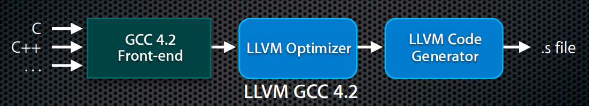

后续采用Clang作为前端，**并且Clang不仅仅是一个前端，还可以作为一个compiler driver，用以管理整个编译流程，这也是为什么能够通过clang命令直接生成最后的可执行文件**。


Clang同时还提供了一些libraries，利用这些libraries可以实现一些工具，比如Clang自带的一些工具：

- **Clang Check**
- **Clang Format**


`clang-tools-extra`是一系列基于Clang的工具的集合。


### 2.2 Compiler-RT

相当于GCC中的**libgcc**，为目标平台提供其硬件不支持的低级功能的优化实现(比如在32位平台上实现64位除法)。

一个很明显的例子：

```c++
#include <stdio.h>
#include <stdint.h>
#include <stdlib.h>
int main() {
    uint64_t a = 0ULL, b = 0ULL;
    scanf ("%lld %lld", &a, &b);
    printf ("64-bit division is %lld\n", a / b);
    return EXIT_SUCCESS;
}
```

采用下面两种方式编译：

```shell
$ clang -S -m32 test.c -o test-32bit.S //32位架构上
$ clang -S test.c -o test-64bit.S //64位架构上
```

会发现在32位架构上产生的汇编代码，浮点数除法变为了

```assembly
call ___udivdi3
```

这个函数就是Compiler-RT中的函数。

关于这一点，在知乎上关于运行时的讨论中也有一个相同的例子，看[这里](https://www.zhihu.com/question/20607178)


### 2.3 DragonEgg plugin

`llvm-gcc`是定制的GCC frontend for LLVM，但是由于编译GCC比较麻烦，因此出现了DragonEgg。

DragonEgg利用了GCC plugin system，将LLVM以插件的形式载入到现有的GCC中。

DragonEgg将GCC的middle-end与backend替换成了LLVM

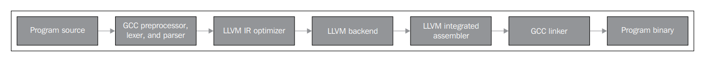

**但DragonEgg目前不再被使用，也停止了更新**


### 2.4 Libc++ standard library

对应GCC中的libstdc++。

LLVM中涉及到的几个Runtime libraries：

- **libc++**
- **Compiler-RT**
- **libclc(The OpenCL runtime library)**

当系统中缺少libc++时，Clang会链接到GCC的libstdc++。


[这里]()有一个关于linux下各种C/C++库之间关系的总结


# 3. LLVM架构

**LLVM在不同语义下有不同的含义，具体含义看实际情况。**

LLVM的设计哲学：**模块化，代码复用以及IR中间表示**


LLVM有多种数据结构用以表达程序逻辑，不同阶段采用不同的表示并且在重要的阶段转换表达方式：

- AST抽象语法树
- IR
- DAG有向无环图


LLVM IR用以表示驻留内存的程序，并且可以存储到磁盘。IR能够存储到磁盘能带来许多优势：

- 终生程序优化
- 过程间优化
- 链接时优化


LLVM IR的基本特性：

- **SSA**表示和无限寄存器让优化能够快速执行
- 整个程序的IR存储到磁盘让链接时优化易于实现
- **three-address instructions**

关于SSA与three-address instructions，看[这里]()


LLVM compiler infrastructure的几个重要部分：

- **Clang前端：将代码翻译成IR，包含：**
  - **词法分析器lexer**
  - **语法解析器parser**
  - **语义分析器**
  - **LLVM IR代码生成器**
- **IR**
- **LLVM后端**

因此有时会看到**Clang/LLVM**这样的说法，就是因为Clang负责前端而LLVM负责后端。

## 3.1 与传统的区别

参考[这里](https://aosabook.org/en/v1/llvm.html)


传统的programming language implementation(也就是compiler)存在的问题：

- 传统编译器的设计一般是monolithic executables的，这就导致无法进行代码重用（比如无法利用GCC中的**parser**来进行static analysis或者refactoring）。脚本语言也是一样，其解释器或者runtime同样设计一个monolithic executables的设计。这就导致不同语言的实现之间无法进行代码重用。

- 传统编译器要么是static compiler的实现，要么是runtime compiler(比如interpreter或者JIT compiler)的实现。但是很少有编译器能够同时结合两者。

  关于Static compiling与Dynamic compiling，看[这里]()


traditional static compiler采用三阶段的设计：

- frontend将代码转变为AST表示
- AST表示转变为一种中间表示，Optimizer在上面做优化
- backend负责最后的代码生成，包括**instruction selection, register allocation, and instruction scheduling**


![[Three Major Components of a Three-Phase Compiler]](assets/SimpleCompiler.png)


采用这种三阶段的设计，优势在于不同的语言与不同的目标架构之间可以共享同一套**Common code representation**，从而只需要将开发的重点放在编写相应的Front end与(或)相应的Back end上，而不需要从头开始写一个编译器。初次之外，这种设计能够吸引更多contributors，有一个更好的社区环境，促使其优化与完善。

![[Retargetablity]](assets/RetargetableCompiler.png)


但这种三阶段的设计模式在过去一直都没有被完整地实现(**以GCC为例，传统 GCC 的前端直接对应于后端**)，但还是有三种比较成功的案例：

- **Java and .NET virtual machine**
- **translate the input source to C code and send it through existing C compilers**
- **GCC**：GCC的IR中间表示叫做**GIMPLE**


但这三种应用都还只是monolithic application。比如对于GCC来说，要想将GCC嵌入到某一个应用中，将GCC作为runtime/JIT compiler使用或者从GCC中提取出模块是非常困难的（GCC代码的耦合度非常高）。


![[LLVM's Implementation of the Three-Phase Design]](assets/LLVMCompiler1.png)


```
编译器前端技术发展已经非常成熟了. 工作岗位一般就是给新的语言维护前端, 或者在原来的语言上魔改, 然后魔改前端. 因为这些语言仍然在进化, 所以编译器前端仍然是需要人手的, 但注定会是一个比较小众的行业.

编译器的中端, 对于 CPU 架构, 目前可以认为比较成熟了. 换句话说, CPU 上能优化掉的东西, 已经发掘地差不多了. 但是, 对于异构计算, 则是还有很多研究和开发的空间. 比如 GPU 上的代码优化, 比如计算图的优化. 像现在比较活跃的就是 MLIR 项目.

编译器后端岗位倒是很多人在做, 主要是很多新的芯片和架构, 这个很多厂商和科研机构很关心, 工作岗位不少.
```


# 4. LLVM Pipeline

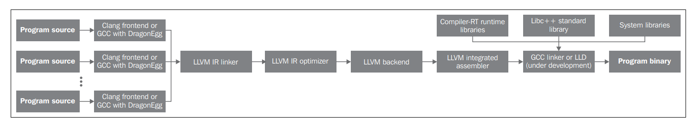


具体的编译过程以及输入输出文件

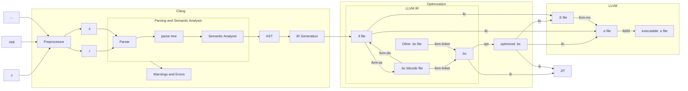


关于LLVM的bitcode .bc文件与.ll文件：

```
Clang如果要生成IR，需要增加一个`-emit-llvm`参数，但是这个参数如果命令中已经存在`-S`参数，那么会产生LLVM intermediate language assembly files(.ll)；否则产生的是LLVM bitcode format object files(.bc)。
```

不论是.bc还是.ll文件，存储的都是LLVM IR，只不过是IR不同的形式，LLVM IR总的来说有三种表现形式，三种形式是等价的：

- **in-memory compiler IR**
- **on-disk bitcode representation(也就是.bc文件)**
- **human readable assembly language representation(也就是.ll文件)**

但不论什么形式，LLVM IR采用的都是SSA(Static single assignment form)表示作为IR。上面三种不同的形式，有各自的优势

- in-memory compiler IR适合于通过调用compiler driver编译，中间结果保存在内存中作为下一个阶段的输入，不需要写入硬盘，效率更高
- on-disk bitcode representation优势在于能够被JIT快速加载，LLVM中的JIT叫做**lli**
- human readable assembly language representation


需要注意的是，在调用Clang时(这里的Clang作为一个compiler driver)，并不会将每个中间过程产生的文件保存在磁盘上(这一步从内存保存到磁盘称为**序列化serialize**，相应的有一个**反序列化deserialize**)，而是采用in-memory representation，只有到最后产生.o文件后才会将.o文件写入磁盘。


而对于有多个源文件作为输入，LLVM有两种编译的方式：

- 第一种先将每个源文件翻译成LLVM IR，然后通过llvm-linker链接一个LLVM IR

  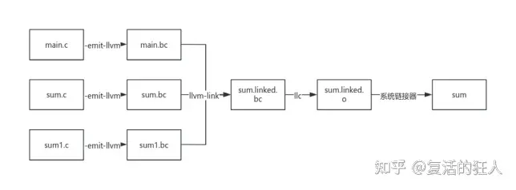

- 第二种先将每个源文件翻译成.o文件，再用链接器链接成一个可执行文件

  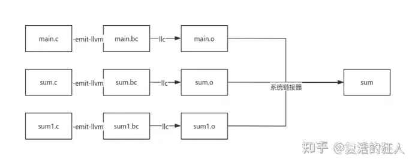

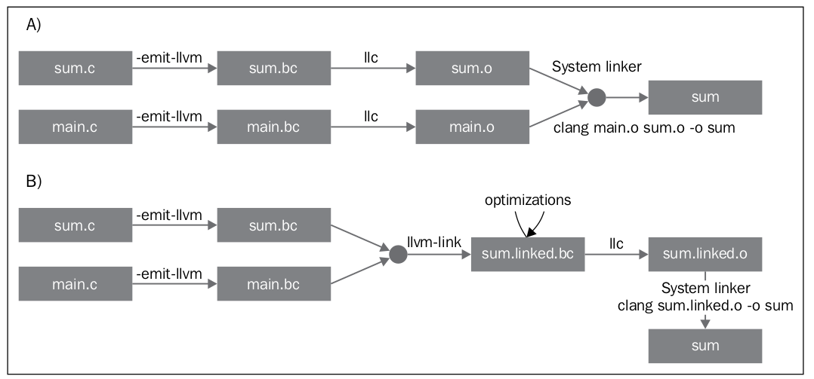


# 5. LLVM Tools and Design

**LLVM的设计哲学之一：everything is a library。**相当大一部分的LLVM代码是可以重用的。

LLVM IR采用了SSA的形式：

1. 代码以three-address instructions组织
2. 有无限数量的寄存器

但除了LLVM IR之外，对于一个被编译的程序，LLVM还有许多其它的中间表示，在不同的阶段被使用：

1. AST
2. DAG
3. MCModule


LLVM IR用以表示驻留内存的程序，并且可以存储到磁盘。IR能够存储到磁盘能带来许多优势：

- 终生程序优化
- 过程间优化
- 链接时优化


这些不同的编译阶段之间的交互可以以以下两种方式进行：

- **In memory**
- **Through files**


因此像Clang这样的compiler driver，就通过链接其它编译阶段用到的libraries，从而能够调用它们的功能完成整个编译阶段（**这也是LLVM的设计哲学之一尽可能的代码复用**）。

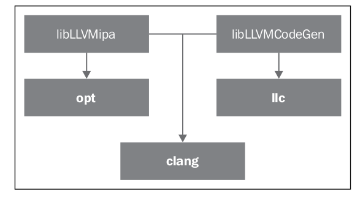

`llc`这个工具就是利用到了`libLLVMCodeGen`库实现其部分功能而opt这个工具利用`libLLVMipa`库实现其功能。那么对于Clang来说，只需要链接`libLLVMCodeGen`以及`libLLVMCodeGen`就可以实现**opt**与**llc**的功能。**而事实上，Clang能够完成整个编译过程中的每一步，为此Clang需要链接非常多的库，这也是为什么Clang的可执行文件非常大。**


详细的关于GCC和Clang两种compiler driver是如何将整个流程串联起来的，参考[这里](#GCC/Clang如何作为compiler driver如何串联起整个编译流程)


## 5.1 Interacting with the compiler driver

```
The driver is responsible for integrating all necessary libraries and tools in order to provide the user with a friendlier experience, freeing the user from the need to use individual compiler stages such as the frontend, backend, assembler, and linker.
```


通常都是通过`clang hello.c –o hello`以及一些指定的参数调用Clang compiler driver执行整个编译过程，但是实际上执行的命令要更加复杂，通过下面的命令可以输出实际执行的完整命令

```shell
clang -### hello.c –o hello
```

在Ubuntu22.04下，输出如下

```
Ubuntu clang version 14.0.0-1ubuntu1.1
Target: x86_64-pc-linux-gnu
Thread model: posix
InstalledDir: /usr/bin
 "/usr/lib/llvm-14/bin/clang" "-cc1" "-triple" "x86_64-pc-linux-gnu" "-emit-obj" "-mrelax-all" "--mrelax-relocations" "-disable-free" "-clear-ast-before-backend" "-disable-llvm-verifier" "-discard-value-names" "-main-file-name" "hello.c" "-mrelocation-model" "pic" "-pic-level" "2" "-pic-is-pie" "-mframe-pointer=all" "-fmath-errno" "-ffp-contract=on" "-fno-rounding-math" "-mconstructor-aliases" "-funwind-tables=2" "-target-cpu" "x86-64" "-tune-cpu" "generic" "-mllvm" "-treat-scalable-fixed-error-as-warning" "-debugger-tuning=gdb" "-fcoverage-compilation-dir=/home/kjzhang/Desktop/learning/llvm" "-resource-dir" "/usr/lib/llvm-14/lib/clang/14.0.0" "-internal-isystem" "/usr/lib/llvm-14/lib/clang/14.0.0/include" "-internal-isystem" "/usr/local/include" "-internal-isystem" "/usr/bin/../lib/gcc/x86_64-linux-gnu/12/../../../../x86_64-linux-gnu/include" "-internal-externc-isystem" "/usr/include/x86_64-linux-gnu" "-internal-externc-isystem" "/include" "-internal-externc-isystem" "/usr/include" "-fdebug-compilation-dir=/home/kjzhang/Desktop/learning/llvm" "-ferror-limit" "19" "-fgnuc-version=4.2.1" "-fcolor-diagnostics" "-faddrsig" "-D__GCC_HAVE_DWARF2_CFI_ASM=1" "-o" "/tmp/hello-438d8f.o" "-x" "c" "hello.c"
 "/usr/bin/ld" "-pie" "-z" "relro" "--hash-style=gnu" "--build-id" "--eh-frame-hdr" "-m" "elf_x86_64" "-dynamic-linker" "/lib64/ld-linux-x86-64.so.2" "-o" "hello" "/lib/x86_64-linux-gnu/Scrt1.o" "/lib/x86_64-linux-gnu/crti.o" "/usr/bin/../lib/gcc/x86_64-linux-gnu/12/crtbeginS.o" "-L/usr/bin/../lib/gcc/x86_64-linux-gnu/12" "-L/usr/bin/../lib/gcc/x86_64-linux-gnu/12/../../../../lib64" "-L/lib/x86_64-linux-gnu" "-L/lib/../lib64" "-L/usr/lib/x86_64-linux-gnu" "-L/usr/lib/../lib64" "-L/usr/lib/llvm-14/bin/../lib" "-L/lib" "-L/usr/lib" "/tmp/hello-438d8f.o" "-lgcc" "--as-needed" "-lgcc_s" "--no-as-needed" "-lc" "-lgcc" "--as-needed" "-lgcc_s" "--no-as-needed" "/usr/bin/../lib/gcc/x86_64-linux-gnu/12/crtendS.o" "/lib/x86_64-linux-gnu/crtn.o"
```


注意-`cc1`这个选项，这个选项表明Clang当前使用的是`compiler mode`而不是`compiler-driver mode`。

然后`clang -cc1`由于链接了IR generation, the code generator for the target machine和assembler libraries，因此`clang -cc1`会调用其它库。


## 5.2 Standalone tools

就是上面讨论的`llc`，`opt`等各种LLVM中的工具，不再赘述。


## 5.3 LLVM internal design

LLVM将整个编译的流程，解耦成一个个阶段，由不同工具负责。这种实现方式是通过将不同的LLVM组件拆分成多个libraries。

```
In order to decouple the compiler into several tools, the LLVM design typically enforces component interaction to happen at a high level of abstraction. It segregates different components into separate libraries; it is written in C++ using object-oriented paradigms and a pluggable pass interface is available, allowing easy integration of transformations and optimizations throughout the compilation pipeline.
```

关于**pluggable pass interface**，看[这里]()


## 5.4 LLVM's basic libraries

LLVM官方文档在这一章[Using The LLVM Libraries](http://llvm.org/releases/3.0/docs/UsingLibraries.html)对于这一部分有比较好的解释

```
Amongst other things, LLVM is a toolkit for building compilers, linkers, runtime executives, virtual machines, and other program execution related tools. In addition to the LLVM tool set, the functionality of LLVM is available through a set of libraries. To use LLVM as a toolkit for constructing tools, a developer needs to understand what is contained in the various libraries, what they depend on, and how to use them. Fortunately, there is a tool, llvm-config to aid with this. This document describes the contents of the libraries and how to use llvm-config to generate command line options.
```

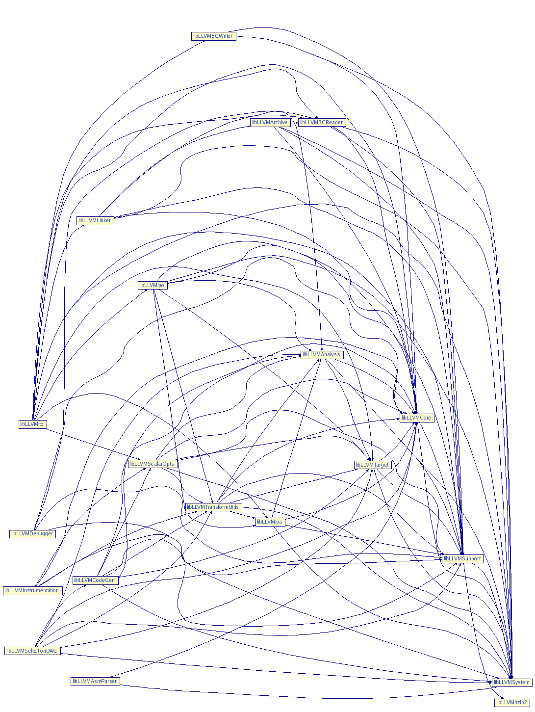

- **libLLVMCore**
- **libLLVMAnalysis**
- **libLLVMCodeGen**
- **libLLVMTarget**
- **libLLVMX86CodeGen** 对于不同的处理器架构有相应的库，比如对于ARM和MIPS分别有**LLVMARMCodeGen**和**LLVMMipsCodeGen**
- **libLLVMSupport**
- **libclang**
- **libclangDriver**
- **libclangAnalysis**


一个实际的依赖关系

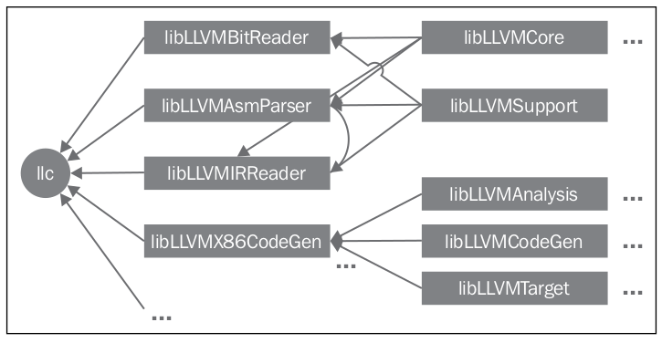

## 5.5 LLVM's C++ practices

### 5.5.1 Polymorphism in LLVM

LLVM采用C++编写，因此能够利用到C++面向对象的特性：**继承与多态，来尽可能实现代码复用**。

```c++
class MipsTargetMachine : public LLVMTargetMachine {
  bool isLittle;
  std::unique_ptr<TargetLoweringObjectFile> TLOF;
  // Selected ABI
  MipsABIInfo ABI;
  const MipsSubtarget *Subtarget;
  MipsSubtarget DefaultSubtarget;
  MipsSubtarget NoMips16Subtarget;
  MipsSubtarget Mips16Subtarget;
  ......
 }
```

再比如对于寄存器分配(register allocator)，与具体的目标架构有关。因此LLVM中通过generic method `MachineRegisterInfo::getReservedRegs()`，要求对于不同的目标架构，都需要重写这个方法。

### 5.5.2 C++ template in LLVM

滥用C++ template会导致编译时间变长。


## 5.6 Demonstrating the pluggable pass interface

LLVM doc [Writing an LLVM Pass (legacy PM version)](https://llvm.org/docs/WritingAnLLVMPass.html#introduction-what-is-a-pass)这一部分介绍了pass。

```
The LLVM pass framework is an important part of the LLVM system, because LLVM passes are where most of the interesting parts of the compiler exist. Passes perform the transformations and optimizations that make up the compiler, they build the analysis results that are used by these transformations, and they are, above all, a structuring technique for compiler code.

Optimizations are implemented as Passes that traverse some portion of a program to either collect information or transform the program. 
```


- 对于LLVM IR的优化实际上就是在做analysis，transform与optimization。而每一个analysis与transformation就叫做一个**pass**。
- 一些pass是machine independent的，这些pass由opt调用
- 另一些pass是machine dependent的，由llc调用
- 还有一些pass可能依赖于其它的pass(比如一个transformation pass依赖于一个analysis pass是一个常用的模式)。
- pass是pluggable的，因此可以register a pass。

- pass由**pass manager**管理，可以register，schedule与declare dependenciies between passes。


LLVM Pass在逻辑上分为三大类：

- **Analysis passes** compute information that other passes can use or for debugging or program visualization purposes
- **Transform passes** can use (or invalidate) the analysis passes, mutating the program in some way
- **Utility passes** provides some utility but don’t otherwise fit categorization(比如passes to extract functions to bitcode or write a module to bitcode are neither analysis nor transform passes，可以归为Utility passes)


LLVM的pass manager有两个版本：

- **legacy pass manager** 在legacy pass manager的情况下，所有的pass都是`Pass`类的子类，继承自`Pass`类，而根据pass的任务，又分为`ModulePass`，`CallGraphSCCPass`，`FunctionPass`，`LoopPass`与`RegionPass`类。

  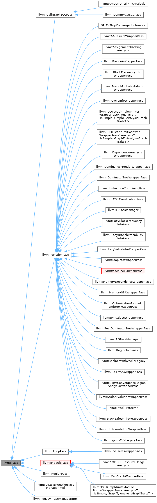

  但是新版本的`opt`不再支持运行legacy pass manager的pass

- **new pass manager** 新的pass manager依赖于现代C++ **concept-based polymorphism**的机制，在这种情况下，所有的LLVM passes都继承自CRTP mix-in `PassInfoMixin<PassT>`。

LLVM的pass framework允许编写自己的custom pass。

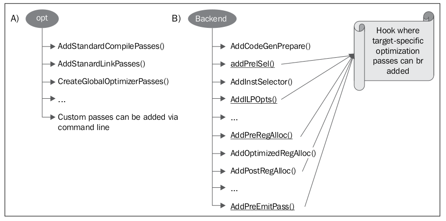


# 6. The Frontend

## 6.1 Clang

Clang有多种含义：

- Clang可以是前端frontend(通过Clang library实现)
- Clang可以是compiler driver
- Clang可以是一个单独的compiler(`clang -cc1`)


当调用`clang`命令时，带有`-cc1`和不带其实是完全不同的。

带上`-cc1`实际上是调用了一个单独的compiler(类似于GCC中的`cc1`)，并且可以以一些奇特的方式传递参数

```shell
clang -Xclang -ast-dump hello.c
clang -cc1 -ast-dump hello.c
```

## 6.2 Frontend actions

对于命令，`clang hello.c -o hello.o`一个大致的调用过程如下：

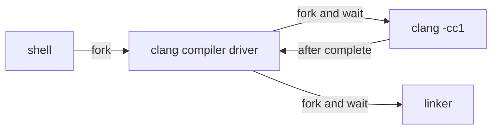

`-cc1`选项会执行`clang/tools/driver/cc1_main.cpp`下的`cc1_main`函数。

每一次调用`clang -cc1`都会由一个main frontend action控制，可以在源代码中的`include/clang/Frontend/FrontendOptions.h`路径下找到完整的actions。

```c++
enum ActionKind {
  /// Parse ASTs and list Decl nodes.
  ASTDeclList,

  /// Parse ASTs and dump them.
  ASTDump,

  /// Parse ASTs and print them.
  ASTPrint,

  /// Parse ASTs and view them in Graphviz.
  ASTView,

  /// Dump the compiler configuration.
  DumpCompilerOptions,

  /// Dump out raw tokens.
  DumpRawTokens,

  /// Dump out preprocessed tokens.
  DumpTokens,

  /// Emit a .s file.
  EmitAssembly,

  /// Emit a .bc file.
  EmitBC,

  /// Translate input source into HTML.
  EmitHTML,

  /// Emit a .ll file.
  EmitLLVM,

  /// Generate LLVM IR, but do not emit anything.
  EmitLLVMOnly,

  /// Generate machine code, but don't emit anything.
  EmitCodeGenOnly,

  /// Emit a .o file.
  EmitObj,

  // Extract API information
  ExtractAPI,

  /// Parse and apply any fixits to the source.
  FixIt,

  /// Generate pre-compiled module from a module map.
  GenerateModule,

  /// Generate pre-compiled module from a standard C++ module interface unit.
  GenerateModuleInterface,

  /// Generate reduced module interface for a standard C++ module interface
  /// unit.
  GenerateReducedModuleInterface,

  /// Generate a C++20 header unit module from a header file.
  GenerateHeaderUnit,

  /// Generate pre-compiled header.
  GeneratePCH,

  /// Generate Interface Stub Files.
  GenerateInterfaceStubs,

  /// Only execute frontend initialization.
  InitOnly,

  /// Dump information about a module file.
  ModuleFileInfo,

  /// Load and verify that a PCH file is usable.
  VerifyPCH,

  /// Parse and perform semantic analysis.
  ParseSyntaxOnly,

  /// Run a plugin action, \see ActionName.
  PluginAction,

  /// Print the "preamble" of the input file
  PrintPreamble,

  /// -E mode.
  PrintPreprocessedInput,

  /// Expand macros but not \#includes.
  RewriteMacros,

  /// ObjC->C Rewriter.
  RewriteObjC,

  /// Rewriter playground
  RewriteTest,

  /// Run one or more source code analyses.
  RunAnalysis,

  /// Dump template instantiations
  TemplightDump,

  /// Run migrator.
  MigrateSource,

  /// Just lex, no output.
  RunPreprocessorOnly,

  /// Print the output of the dependency directives source minimizer.
  PrintDependencyDirectivesSourceMinimizerOutput
};
```

不同action的实现，都是继承自`FrontendAction`类的一个子类。

## 6.3 Libraries

这一节将Clang看作是一个compiler frontend来讨论其模块化的设计以及组成其的libraries。

`libclang`是最主要的一个库，提供了C API，包括了其它几个Clang libraries，这些单独的libraries也可以单独被链接到自己的程序中。

- `libclangLex`
- `libclangAST`
- `libclangParse`
- `libclangSema`
- `libclangCodeGen`
- `libclangAnalysis`
- `libclangRewrite`
- `libclangBasic`


### 6.3.1 C API

`libclang`是一个C API，而不是C++ API，因此采用`libclang`无法访问到这些Clang C++类。官方文档对于`libclang`的介绍

```
The C Interface to Clang provides a relatively small API that exposes facilities for parsing source code into an abstract syntax tree (AST), loading already-parsed ASTs, traversing the AST, associating physical source locations with elements within the AST, and other facilities that support Clang-based development tools.

This C interface to Clang will never provide all of the information representation stored in Clang's C++ AST, nor should it: the intent is to maintain an API that is relatively stable from one release to the next, providing only the basic functionality needed to support development tools.

To avoid namespace pollution, data types are prefixed with "CX" and functions are prefixed with "clang_".
```

`libclang`的头文件位于源代码的`clang/include/clang-c`下，而其中的`Index.h`是主入口。


## 6.4 Clang diagnostics

Diagnostics

```
They are the messages that a compiler gives to the user to signal errors, warnings, or suggestions.
```

对于不同的frontend phase，Clang有着不同的类别的diagnostics set，比如对于parsing phase，其相应的diagnostics定义在文件`include/clang/Basic/DiagnosticParseKinds.td`中。

同样对于不同的严重程度的diagnostics(**NOTE, WARNING, EXTENSION, EXTWARN and ERROR**)，Clang也有不同的diagnostics set，通过一个`enum`类型来实现`Diagnostic::Level enum`


可以引入自己的diagnostics set，通过添加一个新的**TableGen definitions**的.td文件来实现。

### 6.4.1 TableGen

`TableGen`是一个LLVM工具，也是一种语言(TableGen language)

```
The purpose of TableGen is to generate complex output files based on information from source files that are significantly easier to code than the output files would be, and also easier to maintain and modify over time.
```

```
TableGen is an LLVM tool used in the LLVM build system to generate C++ code for parts of the compiler that can be synthesized in a mechanical fashion.
```

TableGen通过使用`records`来表达信息。

在`include/clang/Basic/DiagnosticParseKinds.td`中的一个简单的例子

```
def err_enumerator_list_missing_comma : Error<
  "missing ',' between enumerators">;
def err_enumerator_unnamed_no_def : Error<
  "unnamed enumeration must be a definition">;
```

一条记录由三部分组成：

- `def`关键字
- record identifier
- class(这里的Error就是一个TableGen class)。并且每一个TableGen class都是一个模板类，能够继承父类(Error，Warning等)。而模板中的信息就是一条message。


## 6.5 Frontend phases with Clang

首先是我们比较熟悉的一个frontend的pipeline

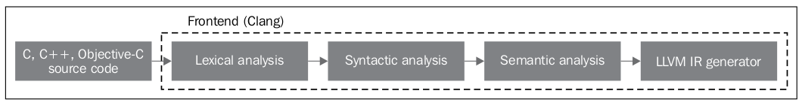

### 6.5.1 Lexical analysis

关于词法分析详细的解读，看[这里](./编译原理.md#Chapter3-词法分析Lexical Analysis)

这一步的主要任务是将输入的字符流转变成token流。


保留字定义在`include/clang/Basic/TokenKinds.def`中，在这个文件中定义了一个namespace `tok`。这个namespace中定义了这些保留字。

```
//===----------------------------------------------------------------------===//
// Language keywords.
//===----------------------------------------------------------------------===//

// These define members of the tok::* namespace.

TOK(unknown)             // Not a token.
TOK(eof)                 // End of file.
TOK(eod)                 // End of preprocessing directive (end of line inside a
                         // directive).
TOK(code_completion)     // Code completion marker
......
// C99 6.4.6: Punctuators.
PUNCTUATOR(l_square,            "[")
PUNCTUATOR(r_square,            "]")
PUNCTUATOR(l_paren,             "(")
PUNCTUATOR(r_paren,             ")")
PUNCTUATOR(l_brace,             "{")
PUNCTUATOR(r_brace,             "}")
PUNCTUATOR(period,              ".")
PUNCTUATOR(ellipsis,            "...")
PUNCTUATOR(amp,                 "&")
PUNCTUATOR(ampamp,              "&&")
PUNCTUATOR(ampequal,            "&=")
......
KEYWORD(auto                        , KEYALL)
KEYWORD(break                       , KEYALL)
KEYWORD(case                        , KEYALL)
KEYWORD(char                        , KEYALL)
KEYWORD(const                       , KEYALL)
KEYWORD(continue                    , KEYALL)
KEYWORD(default                     , KEYALL)
KEYWORD(do                          , KEYALL)
KEYWORD(double                      , KEYALL)
KEYWORD(else                        , KEYALL)
KEYWORD(enum                        , KEYALL)
KEYWORD(extern                      , KEYALL)
KEYWORD(float                       , KEYALL)
```

每一个token都包含一个`SourceLocation`类的实例，这个类用于定位token在源代码中的地址。

通过下面的命令可以输出所有tokens以及相应的`SourceLocation`

```shell
clang -cc1 -dump-tokens sum.c
```

```
int 'int'        [StartOfLine]  Loc=<sum.c:1:1>
identifier 'sum'         [LeadingSpace] Loc=<sum.c:1:5>
l_paren '('             Loc=<sum.c:1:8>
int 'int'               Loc=<sum.c:1:9>
identifier 'a'   [LeadingSpace] Loc=<sum.c:1:13>
comma ','               Loc=<sum.c:1:14>
int 'int'        [LeadingSpace] Loc=<sum.c:1:16>
identifier 'b'   [LeadingSpace] Loc=<sum.c:1:20>
r_paren ')'             Loc=<sum.c:1:21>
l_brace '{'      [LeadingSpace] Loc=<sum.c:1:23>
return 'return'  [StartOfLine] [LeadingSpace]   Loc=<sum.c:2:5>
identifier 'a'   [LeadingSpace] Loc=<sum.c:2:12>
plus '+'         [LeadingSpace] Loc=<sum.c:2:14>
identifier 'b'   [LeadingSpace] Loc=<sum.c:2:16>
semi ';'                Loc=<sum.c:2:17>
r_brace '}'      [StartOfLine]  Loc=<sum.c:3:1>
eof ''          Loc=<sum.c:3:2>
```

### 6.5.2 Syntactic analysis(Parsing)

这一步输入是Lexical analysis输出的tokens，输出是AST。语法分析将tokens组合成expressions，statements以及function bodies，并且检查是否符合语法要求(但是不会检查语义是否正确)。

#### 6.5.2.1 Clang AST nodes

一个AST node可以表示declarations, statements, and types。因此每一种AST node都有一个类：Decl，Stmt和Type。C/C++的每一个**语言结构**在Clang中都由一个C++ class表示(这个class必须继承Decl，Stmt和Type其中一个)。


# 7. The LLVM Intermediate Representation

target-independent optimization主要发生在IR上。

而对于IR的选择也是需要权衡的点：

- **high-level IR**
- **low-level IR**

low-level IR更加贴近target machine，因此能够进行一些target-specific optimization；high-level IR能够针对不同的target machine，共享一套target-independent optimization。

因此不同的编译器也会选择不同层级的IR，比如ICC，GCC，LLVM选择的IR的抽象程度就各不相同。


```
LLVM has other levels to represent a program, which technically makes them IRs as well, and we do not refer to them as LLVM IRs; however, we reserve this name for the official, common intermediate representation by the Instruction class, among others.
```

`MachineFunction`和`MachineInstr`类通过target-machine instructions来表示program，它们也可以算作IR，只不过与目标架构有关。

`Function` 和`Instruction`类表示的program是一种common IR，target-independent，因此LLVM将这一种IR作为official IR。

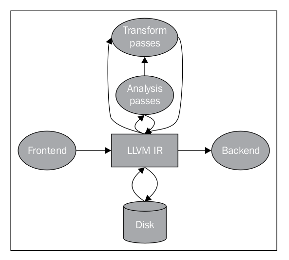

## 7.1 LLVM IR target dependency

有一些对compiler IR的target-independency的详细讨论：

- [Hacker News](https://news.ycombinator.com/item?id=4827915)
- [How Target-Independent is Your IR?](https://sbaziotis.com/compilers/how-target-independent-is-your-ir.html)
- [reddit](https://www.reddit.com/r/Compilers/comments/11nghla/how_targetindependent_is_your_ir/)


之前一直提到，LLVM IR是target-independet的，但是LLVM IR仍然有一部分是target-dependent的，很大一部分原因是因为LLVM采用C/C++编写，而C/C++是target-dependent的。

一个简单的例子是在Linux系统下使用C标准头文件，程序会隐式地包含`bits`文件夹下的头文件，这个文件夹下的头文件包含的是target-dependent header files。

```
This folder contains target-dependent header files, including macro definitions that constrain some entities to have a particular type that matches what the syscalls of this kernel-machine expect. Afterwards, when the frontend parses your source code, it needs to also use different sizes for int, for example, depending on the intended target machine where this code will run.
```

因此当frontend生成的IR自然也是target-dependent。

尽管LLVM IR并不是完全target-independent的，`But it can be abstracted enough for some purposes`。


## 7.2 LLVM IR language syntax

参考官方文档，[LLVM Language Reference Manual](https://llvm.org/docs/LangRef.html)


LLVM IR采用**Static Single Assignment(SSA)**作为IR：

- Static Single Assignment (SSA) form。每一个值只有一次赋值，不能够重新赋值。
- three-address instructions。数据操纵指令由2个source operands与1个destination operand组成。
- 无限数量的寄存器(这里的寄存器就是IR中的local variables)，只要是**%**开头的都是local values。

```
LLVM is a Static Single Assignment (SSA) based representation that provides type safety, low-level operations, flexibility, and the capability of representing ‘all’ high-level languages cleanly. It is the common code representation used throughout all phases of the LLVM compilation strategy.
```

以下面的`sum.c`为例子

```c
int sum(int a, int b) {
    return a + b;
}
```

生成的`sum.ll` IR表示如下

```
; ModuleID = 'sum.c'
source_filename = "sum.c"
target datalayout = "e-m:e-p270:32:32-p271:32:32-p272:64:64-i64:64-f80:128-n8:16:32:64-S128"
target triple = "x86_64-pc-linux-gnu"

; Function Attrs: noinline nounwind optnone uwtable
define dso_local i32 @sum(i32 noundef %0, i32 noundef %1) #0 {
  %3 = alloca i32, align 4
  %4 = alloca i32, align 4
  store i32 %0, i32* %3, align 4
  store i32 %1, i32* %4, align 4
  %5 = load i32, i32* %3, align 4
  %6 = load i32, i32* %4, align 4
  %7 = add nsw i32 %5, %6
  ret i32 %7
}

attributes #0 = { noinline nounwind optnone uwtable "frame-pointer"="all" "min-legal-vector-width"="0" "no-trapping-math"="true" "stack-protector-buffer-size"="8" "target-cpu"="x86-64" "target-features"="+cx8,+fxsr,+mmx,+sse,+sse2,+x87" "tune-cpu"="generic" }

!llvm.module.flags = !{!0, !1, !2, !3, !4}
!llvm.ident = !{!5}

!0 = !{i32 1, !"wchar_size", i32 4}
!1 = !{i32 7, !"PIC Level", i32 2}
!2 = !{i32 7, !"PIE Level", i32 2}
!3 = !{i32 7, !"uwtable", i32 1}
!4 = !{i32 7, !"frame-pointer", i32 2}
!5 = !{!"Ubuntu clang version 14.0.0-1ubuntu1.1"}
```

一个LLVM IR file就定义了一个LLVM module，LLVM module在LLVM的IR中，是一个最顶级的数据结构。

一个LLVM module可以包含：

- functions
- global variables
- local variables
- target data layout
- external function prototypes
- symbol table entries


LLVM中的局部变量与其它汇编语言中的寄存器类似，其在LLVM IR中，以`%`作为开头，表明这是一个局部变量，后续接上这个局部变量的名字(可以是任意的名字)。

而对于函数来说，LLVM IR中将函数体并部分拆分成basic blocks(BBs)，并且以一个label作为Basic Block的开头。对于一个Basic Block，其只有一个entry point与一个exit point，BB中的指令都是顺序执行的，不存在分支与跳转。

对于一个Basic Block，其exit point就是最后一条指令，而最后一条指令会改变控制流，跳转到另一个Basic Block中，对于一个Basic Blocks，有以下要求：

- ```
  Each BB needs to end with a terminator instruction, one that jumps to other BBs or returns from the function
  ```

- ```
  The first BB, called the entry BB, is special in an LLVM function and must not be the target of any branch instructions
  ```

# 8. The Backend


# 9. LLVM Class

## 9.1 LLVMContext

通过以下方式使用`#include "llvm/IR/LLVMContext.h"` LLVMContext类。

官方文档的介绍。

```
It (opaquely) owns and manages the core "global" data of LLVM's core infrastructure, including the type and constant uniquing tables. LLVMContext itself provides no locking guarantees, so you should be careful to have one context per thread.
```

**"opaquely"**表明，我们并不需要关心LLVMContext这个类中包含了什么以及做了什么，只需要将其认作为是一个core LLVM "engine"，对于一些需要使用到这个LLVMContext类型的对象的函数来说，只需要传入即可。

## 9.2 与生成LLVM IR有关的类

首先是LLVM-IR的层次结构，涉及到`Module`，`Function`，`BasicBlock`与`Instruction`

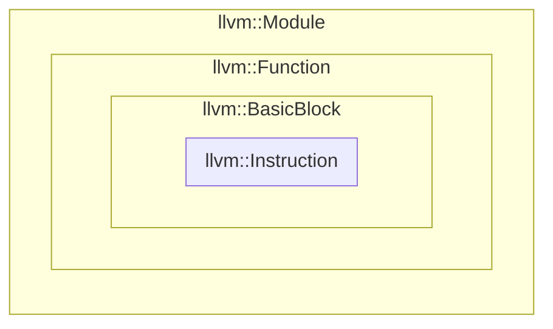

一个`Module`中可以有n个`Function`，`Function`内可以有n个`BasicBlock`，`BasicBlock`是单进单出的n条`Instruction`序列，`BasicBlock`本质上就是一个顺序执行指令的容器，不同的类也代表着一个不同的**作用域**。

[LLVM IR syntax](https://llvm.org/docs/LangRef.html#abstract)对这一部分的理解有更好的帮助。

### 9.2.1 Module

通过`#include "llvm/IR/Module.h`使用LLVM的Module类。

官方手册中对于Module类的简介

```
A Module instance is used to store all the information related to an LLVM module.

Modules are the top level container of all other LLVM Intermediate Representation (IR) objects. Each module directly contains a list of globals variables, a list of functions, a list of libraries (or other modules) this module depends on, a symbol table, and various data about the target's characteristics.

A module maintains a GlobalList object that is used to hold all constant references to global variables in the module. When a global variable is destroyed, it should have no entries in the GlobalList. The main container class for the LLVM Intermediate Representation.
```

LLVM `Module`类是最顶层的container。

参考[7.2 LLVM IR language syntax](#7.2-LLVM-IR-language-syntax)，在LLVM中，一个LLVM的IR文件就代表着一个Module。这一概念可以与C中的translation unit等同。

```
The Module class aggregates all of the data used in the entire translation unit, which is a synonym for "module" in LLVM terminology.
```


创建一个`Module`，需要传入一个Module的名字(`StringRef`类型)，以及相应的LLVMContext(`LLVMContext`类型)。主要对变ModuleID和SourceFileName完成初始化，把创建好的Module添加到Context中。

```c++
Module::Module(StringRef MID, LLVMContext &C)
    : Context(C), ValSymTab(std::make_unique<ValueSymbolTable>(-1)),
      ModuleID(std::string(MID)), SourceFileName(std::string(MID)), DL(""),
      IsNewDbgInfoFormat(false) {
  Context.addModule(this);
}
```


### 9.2.2 Function

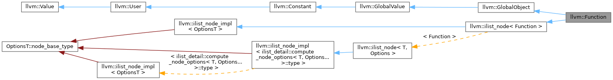

LLVM `Function`类包括函数的定义以及函数的声明。


创建一个`Function`可以通过`Function`的构造函数或者`Create`方法

```c++
Function::Function(FunctionType *Ty, LinkageTypes Linkage, unsigned AddrSpace,
                   const Twine &name, Module *ParentModule)
    : GlobalObject(Ty, Value::FunctionVal,
                   OperandTraits<Function>::op_begin(this), 0, Linkage, name,
                   computeAddrSpace(AddrSpace, ParentModule)),
      NumArgs(Ty->getNumParams()), IsNewDbgInfoFormat(false) {
  assert(FunctionType::isValidReturnType(getReturnType()) &&
         "invalid return type");
  setGlobalObjectSubClassData(0);
 
  // We only need a symbol table for a function if the context keeps value names
  if (!getContext().shouldDiscardValueNames())
    SymTab = std::make_unique<ValueSymbolTable>(NonGlobalValueMaxNameSize);
 
  // If the function has arguments, mark them as lazily built.
  if (Ty->getNumParams())
    setValueSubclassData(1);   // Set the "has lazy arguments" bit.
 
  if (ParentModule) {
    ParentModule->getFunctionList().push_back(this);
    IsNewDbgInfoFormat = ParentModule->IsNewDbgInfoFormat;
  }
 
  HasLLVMReservedName = getName().starts_with("llvm.");
  // Ensure intrinsics have the right parameter attributes.
  // Note, the IntID field will have been set in Value::setName if this function
  // name is a valid intrinsic ID.
  if (IntID)
    setAttributes(Intrinsic::getAttributes(getContext(), IntID));
}
```

```c++
Function *Function::Create(FunctionType *Ty, LinkageTypes Linkage,
                           const Twine &N, Module &M) {
  return Create(Ty, Linkage, M.getDataLayout().getProgramAddressSpace(), N, &M);
}
```

从创建`Function`可以发现，`Function`的创建需要接受一个`Module`类型的变量，用以表明这个`Function`所属的`Module`类。


### 9.2.3 BasicBlock

```
This represents a single basic block in LLVM. A basic block is simply a container of instructions that execute sequentially. Basic blocks are Values because they are referenced by instructions such as branches and switch tables. The type of a BasicBlock is "Type::LabelTy" because the basic block represents a label to which a branch can jump.

A well formed basic block is formed of a list of non-terminating instructions followed by a single terminator instruction. Terminator instructions may not occur in the middle of basic blocks, and must terminate the blocks. The BasicBlock class allows malformed basic blocks to occur because it may be useful in the intermediate stage of constructing or modifying a program. However, the verifier will ensure that basic blocks are "well formed".
```

`BasicBlock`类用于表示一个顺序执行的instruction块(**中间没有控制流逻辑**)，这与其它编译技术与编程语言中的basic block的概念是相同的。

`BasicBlock`类是`Value`类的派生类，这是因为`BasicBlock`需要作为一个`Value`才能够被一些分支跳转指令引用，从而进行跳转。而相应的，`BasicBlock`的`Type`是`Type::LabelTy`表明basic block表示的是一个label，分支指令可以跳转到这个label，从而执行相应的basic block中的instruction。


创建一个`BasicBlock`同样可以通过构造函数以及`Create`函数

```c++
BasicBlock::BasicBlock(LLVMContext &C, const Twine &Name, Function *NewParent,
                       BasicBlock *InsertBefore)
    : Value(Type::getLabelTy(C), Value::BasicBlockVal),
      IsNewDbgInfoFormat(false), Parent(nullptr) {
 
  if (NewParent)
    insertInto(NewParent, InsertBefore);
  else
    assert(!InsertBefore &&
           "Cannot insert block before another block with no function!");
 
  setName(Name);
  if (NewParent)
    setIsNewDbgInfoFormat(NewParent->IsNewDbgInfoFormat);
}
```

```c++
static BasicBlock *Create(LLVMContext &Context, const Twine &Name = "",
                        Function *Parent = nullptr,
                        BasicBlock *InsertBefore = nullptr) {
return new BasicBlock(Context, Name, Parent, InsertBefore);
}
```


### 9.2.4 Instruction

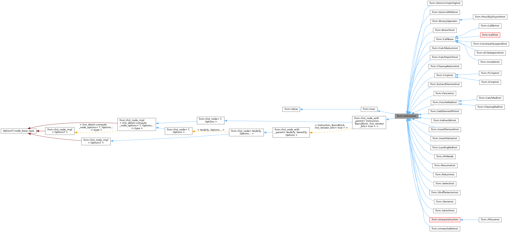

LLVM `Instruction`类用以描述一条具体的指令，LLVM中指令又可以具体分为几个大类：

- 


## 9.3 Type

LLVM中通过Type类来定义类型，其它的Type类，比如说ArrayType......都继承自Type：

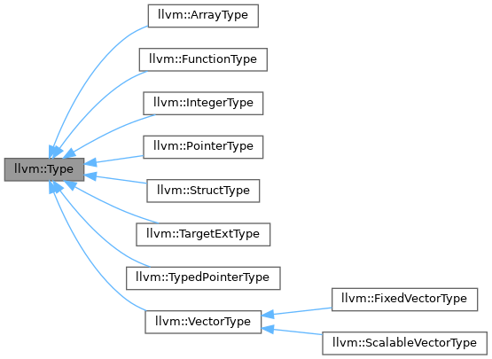

一般通过以下方式来定义一个Type类型

```
IntegerType type_i32 = Type::getInt32Ty(context);
```

或者通过一个Type类的派生类中的`get`方法得到一个Type类型的派生类

```
IntegerType type_i32 = IntegerType::get(context, 32);
```

还可以通过`IRBuilder`中封装的方法，但实际上这种方法就是对上面方法的一种封装

```
builder.getInt32Ty()
```


## 9.4 Constant

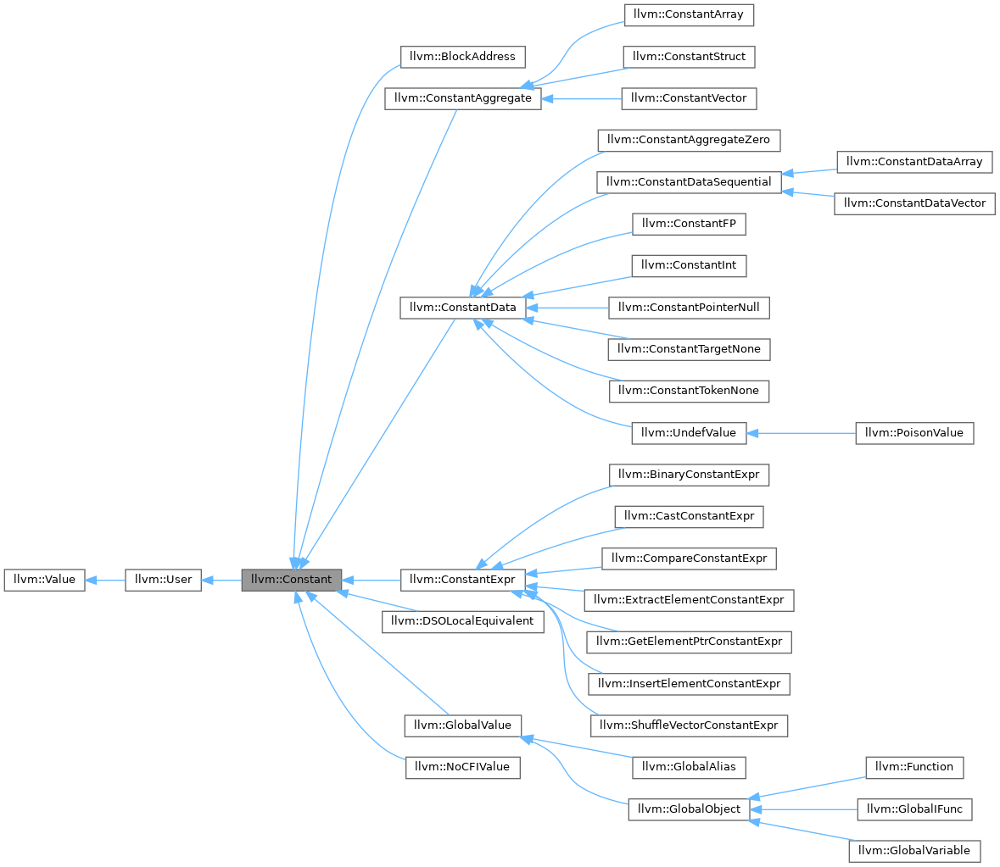

Constant类用于产生一个常量值。通过Constant类中的`get`方法实现。

```c++
Constant* con_10 = ConstantInt::get(Type::getInt32Ty(context), 10);	
```


## 9.5 Value

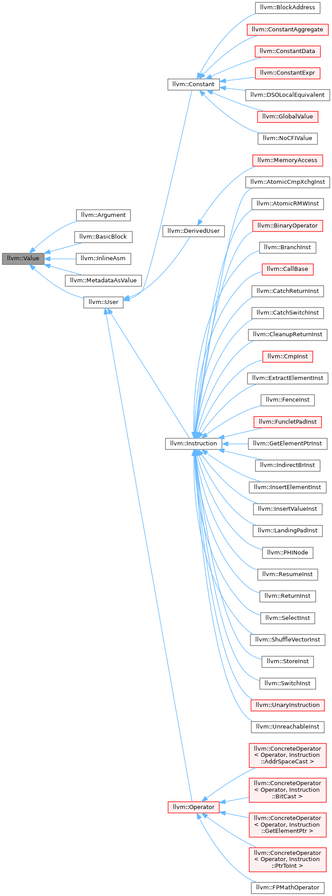

```
This is a very important LLVM class. It is the base class of all values computed by a program that may be used as operands to other values. Value is the super class of other important classes such as Instruction and Function. All Values have a Type. Type is not a subclass of Value. Some values can have a name and they belong to some Module. Setting the name on the Value automatically updates the module's symbol table.

Every value has a "use list" that keeps track of which other Values are using this Value. A Value can also have an arbitrary number of ValueHandle objects that watch it and listen to RAUW and Destroy events. See llvm/IR/ValueHandle.h for details.
```

对于每一个Value类型的变量，其都有一个对应的Type。

LLVM中一切都是`Value`，更具体地说，LLVM中基本上绝大多数函数返回值都是一个`Value*`，并且实践中，几乎所有用到`Value`类的场景，都是使用`Value*`。

从上面的继承关系图中，`Value`类派生出了许多子类，这些继承自`Value`的类表示其结果可以被其它地方使用；而继承自`User`的类表明其会使用一个或者多个`Value`对象。

`Value`与`User`之间的关系还可以引申出use-def链与def-use链：

- **use-def链**：The list of all `Value`s used by a `User`
- **def-use链**：The list of all `User`s of a particular `Value`


## 9.6 User

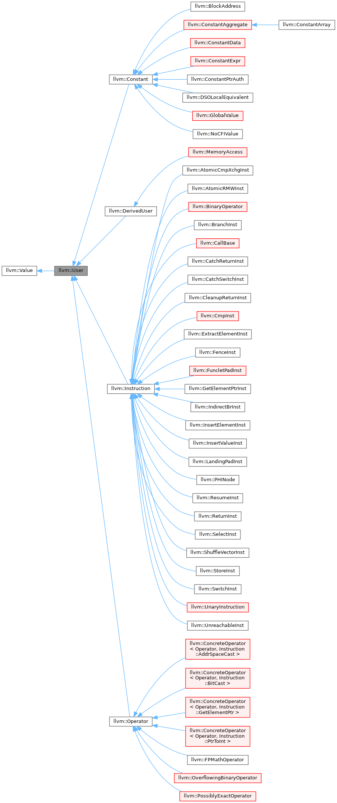

关于`User`类，在`Value`类中以及有一些介绍，这里继续。

`Value`与`User`之间的关系可以用**use-def chain**与**def-use chain**来表示，并且这两个链是可以遍历的：

1. 对于def-use链，

   ```c++
   Function *F = ...;
   
   for (User *U : F->users()) {
     if (Instruction *Inst = dyn_cast<Instruction>(U)) {
       errs() << "F is used in instruction:\n";
       errs() << *Inst << "\n";
     }
   ```

2. 对于use-def链，

   ```c++
   Instruction *pi = ...;
   
   for (Use &U : pi->operands()) {
     Value *v = U.get();
     // ...
   }
   ```


## 9.7 StringRef

```
StringRef - Represent a constant reference to a string, i.e.

a character array and a length, which need not be null terminated.

This class does not own the string data, it is expected to be used in situations where the character data resides in some other buffer, whose lifetime extends past that of the StringRef. For this reason, it is not in general safe to store a StringRef.
```

`StringRef`类用于对字符串的引用，StringRef包含两个重要的成员：`const char *Data`以及`size_t Length`。前者是一个`const char*`类型的指针，指向字符串的起始地址；后一个是一个`size_t`类型的变量，代表字符串的长度。

其构造函数有多种

```c++
StringRef (const char *Str);
StringRef (const char *data, size_t length);
StringRef (const std::string &Str);
```

由于`StringRef`类只是对于字符串的一个引用，因此`StringRef`的生命周期不能超过原来字符串的生命周期，否则指针会失效。


## 9.8 Twine


## 9.9 IRBuilder

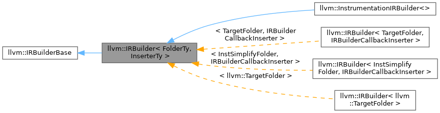


```
This provides a uniform API for creating instructions and inserting them into a basic block: either at the end of a BasicBlock, or at a specific iterator location in a block.
```

`IRBuilder`类用于LLVM生成IR，除了`IRBuilder`类`Instruction`类也可以完成相同的功能，只不过现在比较少用，而`IRBuilder`这一类提供了一个更加方便的生成IR的方式。


`IRBuilder`是一个模板类，有多种构造函数

```c++
IRBuilder(LLVMContext &C, FolderTy Folder, InserterTy Inserter = InserterTy(),
        MDNode *FPMathTag = nullptr,
        ArrayRef<OperandBundleDef> OpBundles = std::nullopt)
  : IRBuilderBase(C, this->Folder, this->Inserter, FPMathTag, OpBundles),
    Folder(Folder), Inserter(Inserter) {}

explicit IRBuilder(LLVMContext &C, MDNode *FPMathTag = nullptr,
                 ArrayRef<OperandBundleDef> OpBundles = std::nullopt)
  : IRBuilderBase(C, this->Folder, this->Inserter, FPMathTag, OpBundles) {}

explicit IRBuilder(BasicBlock *TheBB, FolderTy Folder,
                 MDNode *FPMathTag = nullptr,
                 ArrayRef<OperandBundleDef> OpBundles = std::nullopt)
  : IRBuilderBase(TheBB->getContext(), this->Folder, this->Inserter,
                  FPMathTag, OpBundles),
    Folder(Folder) {
SetInsertPoint(TheBB);
}

explicit IRBuilder(BasicBlock *TheBB, MDNode *FPMathTag = nullptr,
                 ArrayRef<OperandBundleDef> OpBundles = std::nullopt)
  : IRBuilderBase(TheBB->getContext(), this->Folder, this->Inserter,
                  FPMathTag, OpBundles) {
SetInsertPoint(TheBB);
}

explicit IRBuilder(Instruction *IP, MDNode *FPMathTag = nullptr,
                 ArrayRef<OperandBundleDef> OpBundles = std::nullopt)
  : IRBuilderBase(IP->getContext(), this->Folder, this->Inserter, FPMathTag,
                  OpBundles) {
SetInsertPoint(IP);
}

IRBuilder(BasicBlock *TheBB, BasicBlock::iterator IP, FolderTy Folder,
        MDNode *FPMathTag = nullptr,
        ArrayRef<OperandBundleDef> OpBundles = std::nullopt)
  : IRBuilderBase(TheBB->getContext(), this->Folder, this->Inserter,
                  FPMathTag, OpBundles),
    Folder(Folder) {
SetInsertPoint(TheBB, IP);
}

IRBuilder(BasicBlock *TheBB, BasicBlock::iterator IP,
        MDNode *FPMathTag = nullptr,
        ArrayRef<OperandBundleDef> OpBundles = std::nullopt)
  : IRBuilderBase(TheBB->getContext(), this->Folder, this->Inserter,
                  FPMathTag, OpBundles) {
SetInsertPoint(TheBB, IP);
}

/// Avoid copying the full IRBuilder. Prefer using InsertPointGuard
/// or FastMathFlagGuard instead.
IRBuilder(const IRBuilder &) = delete;
```

`IRBuilder`的构造函数可以接受一个`LLVMContext`类型的变量为输入，也可以接受一个`BasicBlock`类型的变量为输入。

当采用`LLVMContext`构造`IRBuilder`时，并没有指定一个IR指令的插入点，因此后续需要显式地指定一个插入点(采用`SetInsertPoint`方法显式指定插入点)。

当采用`BasicBlock`构造`IRBuilder`时，隐式设定了IR指令的插入点，默认插入到这个基本块的末尾。

当采用`Instruction`构造`IRBuilder`时，IR指令的插入点在这条指令之前。


`IRBuilder`的实例会追踪当前需要插入指令的位置，并且`IRBuilder`类中有创建新的Instruction的方法。具体的`IRBuilder`工作逻辑：

1. LLVM IR 在内存中是以若干条顺序执行（中间无分支）的指令序列构成的**基本块** [`BasicBlock`](https://github.com/llvm-mirror/llvm/blob/release_40/include/llvm/IR/BasicBlock.h#L51)（以下简称 BB）为单位来组织的。一个**函数** [`Function`](https://github.com/llvm-mirror/llvm/blob/release_40/include/llvm/IR/Function.h#L48) 包含有多个 BB。对于含有分支指令的情形，一般是在某一个 BB 结尾处放一条分支语句（`br`等）并跳转至其它 BB。在 LLVM 框架中，生成 BB 的接口是 [`BasicBlock::Create`](https://github.com/llvm-mirror/llvm/blob/release_40/include/llvm/IR/BasicBlock.h#L93)。
2. IRBuilder 的工作方式是，首先指定当前 BB，然后逐指令插入（如调用 [`builder.CreateAdd`](https://github.com/llvm-mirror/llvm/blob/release_40/include/llvm/IR/IRBuilder.h#L813) 插入一条加指令）。当完成了一个 BB 后，通过 [`builder.SetInsertPoint`](https://github.com/llvm-mirror/llvm/blob/release_40/include/llvm/IR/IRBui
3. IRBuilder 在每一次插入新指令时，如果这一指令会产生结果（这是一个新的**静态单赋值** [Static Single Assignment](http://en.wikipedia.org/wiki/Static_single_assignment_form) 变量），则用于创建和插入指令的方法调用会有一个返回值，类型为 [`llvm::Value`](https://github.com/llvm-mirror/llvm/blob/release_40/include/llvm/IR/Value.h#L71)，用以代表这一 SSA value。


# GCC/Clang如何作为compiler driver如何串联起整个编译流程


# LLVM IR中如何表示字符串类型

LLVM IR中并没有内置的字符串类型，需要利用已有的数据结构手动实现。


# 关于大型项目跳转的一些思考

对于一些大型的C/C++项目，如何实现查找以及跳转定义，一般有以下几种方式：

- Language Server Protocol(LSP)

## 1. Language Server Protocol(LSP)

LSP由微软提出，wiki官方对其的介绍

```
The Language Server Protocol (LSP) is an open, JSON-RPC-based protocol for use between source code editors or integrated development environments (IDEs) and servers that provide "language intelligence tools":[1] programming language-specific features like code completion, syntax highlighting and marking of warnings and errors, as well as refactoring routines. The goal of the protocol is to allow programming language support to be implemented and distributed independently of any given editor or IDE.[2]
```

当用户编辑源代码时，会使用到一个language server proptocol-enabled tool，这个工具充当着client的角色。与之相对应的，需要有一个language server充当server的角色，用以向这个client提供language services。

这个language server protocol-enabled tool可以是：

- **text editor**
- **IDE**
- **plugin**
- **......**

提供的language service可以是：

- **refactoring**
- **code completion**


LSP采用JSON-RPC协议在server与client之间进行通信。


# C/C++编译体系


## 编译与链接

### GCC/Clang搜索头文件的策略

