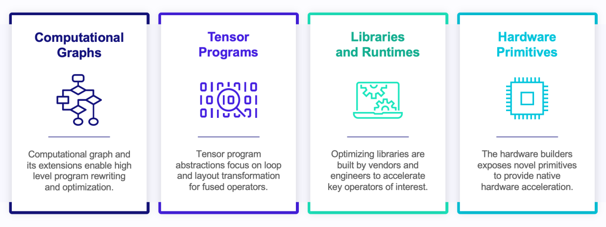

# Machine Learning Compilation

# 1. What is Machine Learning Compilation(MLC)

MLC其实就是模型部署的过程。

MLC不仅优化推理端，还需要优化训练端

MLC需要考虑的目标：

1. Integration and Dependency Minimization

   开发过程中使用的框架(PyTorch等)，会提供各种各样的模块，但是最终的模型可能只是用到了其中的一小部分模块，所以MLC的目的之一就是在部署过程中将所需要的模块打包进部署端。并且有的时候，部署时候所依赖的算子等可能来自于不同的厂商，MLC也需要将这些不同的依赖整合进部署端

2. Leverage Hardware Native Acceleration

   利用硬件特性，提高模型执行效率

MLC会做Tensor Function(算子Operator)之间的变换:

- 算子融合Fison来减少IO消耗
- 算子变换(算子内优化，并行)

**abstraction**与**implementation**是任何系统方向非常重要的思想。

MLC中的四大抽象，由低到高：

1. Computational Graphs
2. Tensor Programs
3. Libraries and Runtimes
4. Hardware Primitives

Primitive Tensor Function(也就是我们常说的算子)，对于一个算子，它是一个抽象，有不同的实现算子的方式(C，Python等等)。

Primitive Tensor Function transformation(算子变换):

1. 映射到函数库
2. Fine grained program transformation

不同的算子变换对于算子的抽象也有不同的要求，而我们希望找到一种抽象，其算子变换能够获得一些性能等方面的提升。

当我们涉及到对Primitive Tensor Function本身做算子内优化时，就涉及到另一种abstraction：Tensor Program Abstraction(可以表示一个算子，也可以表示多个算子)。

buffers

Loop nests

computation

TVM中的Tensor Program Abstraction就是TensorIR

采用TensorIR做Tensor Program能够更方便地做变换，找到最优的。

如何得到一个TensorIR表示的Tensor Program：

- 利用tvm.script手写TensorIR
- 利用tensor expression生成TensorIR
- 利用已有的TensorIR融合成新的TensorIR

因此，后续深入TVM，核心就在于：

1. TVM的IRModule模块(也就是TensorIR)，有哪些方式可以表示不同的tensor function
2. 对IRModule有哪些变换

**变换**是MLC的核心中的核心。

**spatial axis**和**reduce axis**

对于一些底层的算子库，其输出也是作为输入被传递给算子的。因为对于算子库来说，希望的是上层的框架来统一管理内存，而不是在算子中管理内存。这种方式叫做**destination passing**。

但是在计算图中，我们并不想要这种destination passing的算子实现，TVM中`call_tir`就是为了解决这个问题。

pure function纯函数，读边与写边

tensorflow导出计算图的问题。

alias-analysis，非计算图部分能否交换？？？？

dl_pack()？？？

TVM支持将各种环境下的对应的pack_function注册成为TVM环境函数

einops python包以及

TVM TensorIR算子与算子库算子结合构成计算图

算子与计算图的不同表示、变换以及执行过程

dataflow block用以标注计算图区域

随机搜索 + 专家知识

