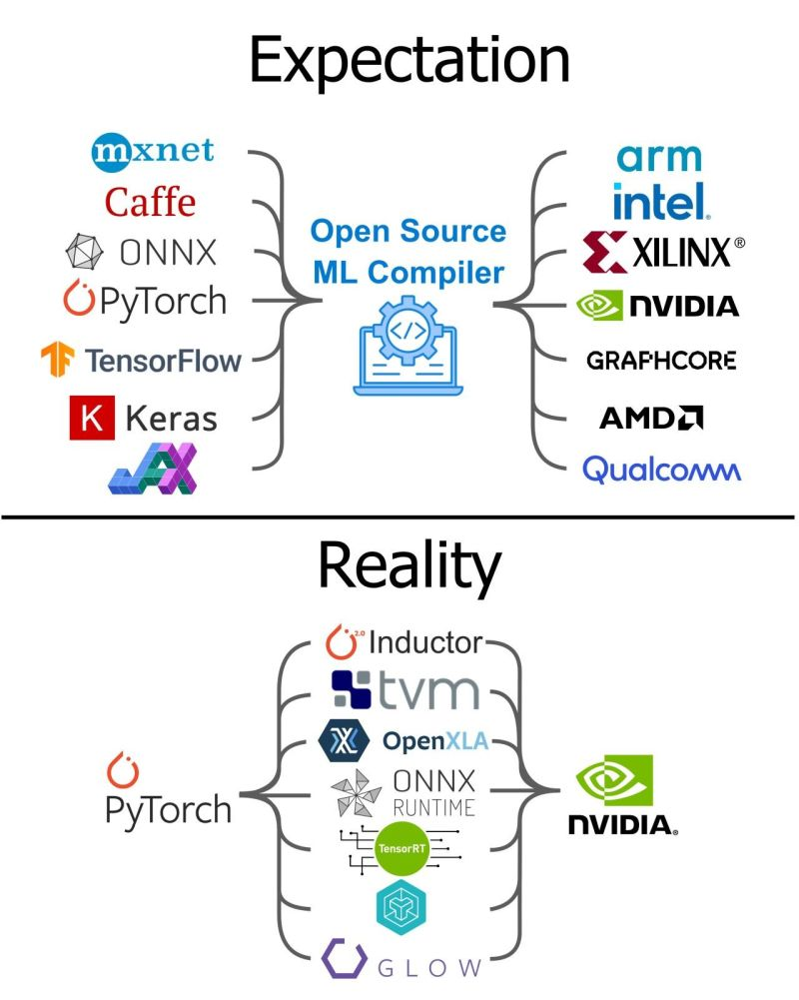

# Machine Learning Compilation

# 1. What is Machine Learning Compilation(MLC)

MLC其实就是模型部署的过程。

MLC不仅优化推理端，还需要优化训练端

MLC会做Tensor Function(算子Operator)之间的变换:

- 算子融合Fison来减少IO消耗
- 算子变换(算子内优化，并行)

**abstraction**与**implementation**是任何系统方向非常重要的思想。

Primitive Tensor Function(算子)

Primitive Tensor Function transformation:

1. 映射到函数库
2. Fine grained program transformation

当我们涉及到对Primitive Tensor Function本身做算子内优化时，就涉及到另一种abstraction：Tensor Program Abstraction。

