# 编译原理

# Chapter1 Introduction

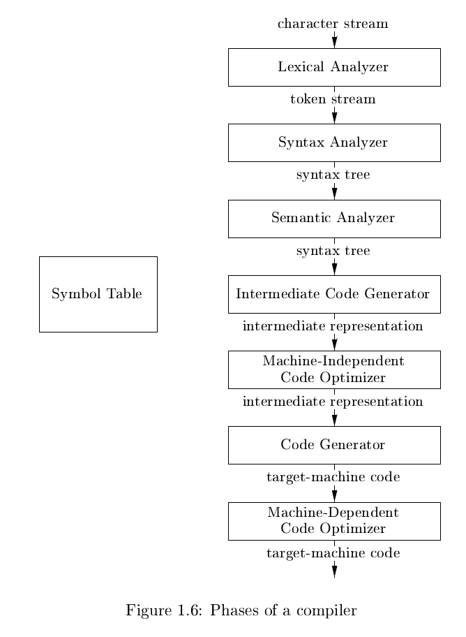

# Chapter2 A Simple Syntax-Directed Translator

## 2.1 Introduction


## 2.3 Syntax-Directed Translation

中文翻译为语法制导的语义分析，称之为语法制导的原因

```
在语法分析时，采用自底向上分析，例如LR分析，首先给出S-属性定义，然后，把S-属性定义变成可执行的代码段，从而构成翻译程序。随着语法分析的进行，归约前调用相应的语义子程序,完成相应的翻译任务。在这种分析模式中，语法分析是主动的，语义分析是从动的，语法分析制导着语义分析。
```

```
Syntax-directed translation is done by attaching rules or program fragments to productions in a grammar.
```

采用semantic rules叫做Syntax-Directed Definition，而采用program fragments(也叫semantic actions)的叫做Syntax-Directed Definition。

这里涉及到两个概念：

- **Attributes**

- **(Syntax-directed) translation schemes**

  ```
  A translation scheme is a notation for attaching program fragments to the productions of a grammar.The program fragments are executed when the production is used during syntax analysis. The combined result of all these fragment executions, in the order induced by the syntax analysis, produces the translation of the program to which this analysis/synthesis process is applied.
  ```

### 2.3.1 Postfix Notation

略

### 2.3.2 Synthesized Attributes

这一部分在第五章中会详细介绍。

Synthesized Attributes优势在于能够通过**自底向上的分析方法**，求出所有结点的属性值。


### 2.3.3 Simple Syntax-Directed Definitions


### 2.3.4 Tree Traversal

不论是对于Attribute Grammer还是Translation Scheme，都需要通过遍历parse tree来完成属性的求值或者执行代码片段。

遍历一棵树的两种策略：**深度优先与广度优先**。

深度优先中又可以分为：**Preorder Traversal与Postorder Traversal**。

其中，Preorder Traversal是在遍历到该结点时，就执行相应的语义动作；而Postorder Traversal则是在最后一次离开结点(即再也不会遍历到这个结点)时，执行相应的语义动作。

下图就是一个Postorder Traversal的例子

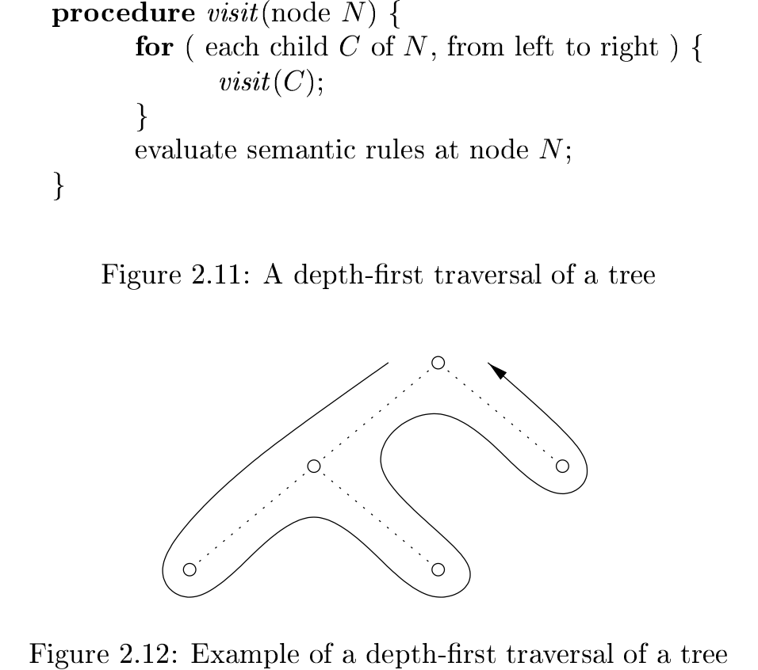


### 2.3.5 Translation Schemes

```
A syntax-directed translation scheme is a notation for specifying a translation by attaching program fragments to productions in a grammar. A translation scheme is like a syntax-directed definition, except that the order of evaluation of the semantic rules is explicitly specified.
```

因此，除了将semantic rules换为semantic actions之外，translation schemes相比于SDD，还指定了semantic actions何时被执行。


因此在构建translation scheme的parse tree时，会在树中添加额外的结点，用以指示语义动作以及语义动作发生的顺序。

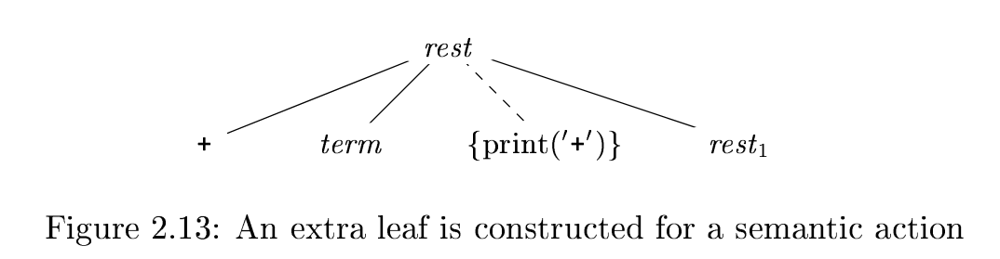

这个额外的结点通过虚线来表示，并且在一个translation scheme中，语法树的遍历采用**后序遍历**

```
The implementation of a translation scheme must ensure that semantic actions are performed in the order they would appear during a postorder traversal of a parse tree.
```


## 2.4 Parsing

```
Parsing is the process of determining how a string of terminals can be generated by a grammar.
```

**recursive descent**

## 2.7 Symbol Tables

Symbol Table是一个数据结构，用于记录标识符(变量名，函数名与常量名)以及标识符对应的信息。这个数据结构的选择需要能够


identifier的声明是有一个作用域(Scope)的。因此，为了在编程语言中实现作用域，对于每一个scope都需要一个单独的符号表。

```
Symbol Table的创建可以在词法分析，语法分析，语义分析三个阶段。但是由于语法分析器(parser)知晓程序的语法结构，因此将Symbol-Table的生成交给parser是一个不错的选择，因为parser能够非常好地区分是需要在Symbol-Table中创建表项，还是使用一个Symbol-Table中已存在的表项。
```

### 2.7.1 Symbol Table Per Scope

对于存在nested blocks的情况，符号表中可能会存在具有相同标识符的表项。


**most-closely nested rule**


**most-closely nested rule**的实现可以通过chaining symbol tables。


### 2.7.2 其它Symbol Table的实现方式

除了上面的采用chainning symbol tables的实现方式，还可以采用其它类型的数据结构实现符号表：

- **trees**
- **linear lists**
- **self-organizing lists**
- **hash table**


# Chapter3 词法分析Lexical Analysis

## 3.1

词法分析的主要目的是将输入的源程序的字符流转变为单词序列。

```
The lexical analyzer reads the stream of characters making up the source program and groups the characters into meaningful sequences called lexemes. For each lexeme, the lexical analyzer produces as output a token.
```

lexical analyzer的构建可以是手工构建，也可以制定**lexemes patterns**由**lexical-analyzer generator**自动构建。

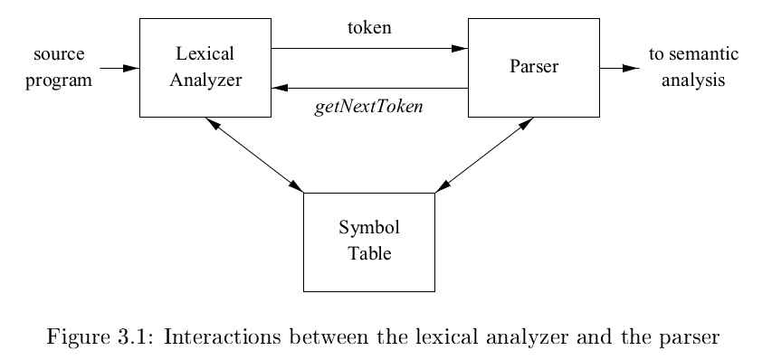


**词法分析也是语法分析的一部分**，但是将分析阶段分为词法和语法两个阶段有以下原因：

- 简化设计
- 提升效率
- 增强可移植性


### 3.1.1 token，pattern与lexeme

token，pattern与lexeme是需要区分的概念，参考[What is the difference between a token and a lexeme?](https://stackoverflow.com/questions/14954721/what-is-the-difference-between-a-token-and-a-lexeme)

#### 3.1.1.1 token

```
A token is a pair consisting of a token name and an optional attribute value. The token name is an abstract symbol representing a kind of lexical unit, e.g., a particular keyword, or sequence of input characters denoting an identifier. The token names are the input symbols that the parser processes.
```

token的形式`<token-name; attribute-value>`

在C语言中，keywords，identifier，operator，delimiters/punctuators以及strings都是token，分为三类：

- TRM
- LIT
- IDN

下面的表涵盖了一个编程语言中的绝大多数token

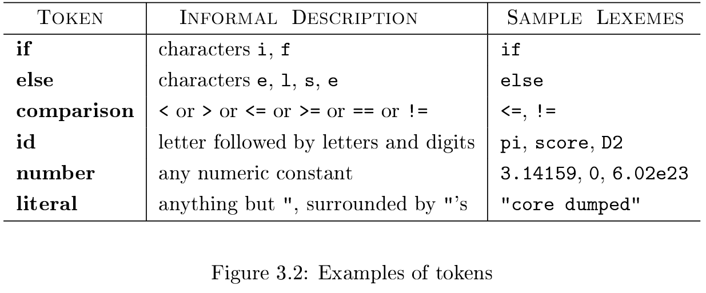

- 对于每一个keyword，有一个token
- 对于identifierts，统一用一个token **id**表示


一般来说，一种token就是一个结构体，这个结构体一般会包含以下几个部分：

- name of the token
- characters/symbols that make up the token(lexeme)
- start and end position of the string of characters that make up the token(这一部分用于error reporting)
- ......

**token**可以理解为一个类，那么就应该有相应的一些属性。

上面的信息都会被保存在symbol table中，因此相应的就会在token中有一个指针指向其在symbol table中的entry。

但是有一些token不会有属性，比如说一些操作符，符号和关键字。


#### 3.1.1.2 lexeme

```
A lexeme is a sequence of characters in the source program that matches the pattern for a token and is identified by the lexical analyzer as an instance of that token.
```

#### 3.1.1.3 pattern

```
A pattern is a description of the form that the lexemes of a token may take. In the case of a keyword as a token, the pattern is just the sequence of characters that form the keyword. For identi ers and some other tokens, the pattern is a more complex structure that is matched by many strings.
```

总而言之，token相当于类，而lexeme相当于类的一个实例，而pattern就是用来标识符合一类token的lexeme的集合。


### 3.1.2 Lexical Errors


## 3.2 Input Buffering

在现实情况下，识别lexeme会非常复杂，为了加速识别lexeme，引入一个two-buffer scheme。

### 3.2.1 Buffer Pairs

**two-buffer scheme**

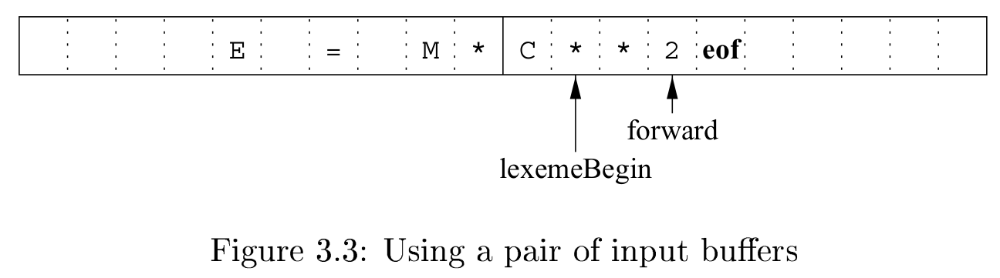

每一个buffer大小位N，N一般为一个disk block的大小(4096 bytes)。

```
Using one system read command we can read N characters into a bu er, rather than using one system call per character.
```

维护两个指针：

- `lexemeBegin`
- `forward`

### 3.2.2 Sentinels


## 3.2 单词的形式化描述工具

词法分析中通过形式化和半形式化工具来实现识别单词，比如**状态转换图，EBNF，有限状态自动机，正规表达式和正规文法等**。

通过有限状态自动机，正则表达式以及正规文法能够形式化描述单词，这三者的描述是**等价的**，并且**可以相互转换**。

**现实的编程语言中，几乎任何一种有意义的单词种别对应的单词集合的都是正规语言。**

### 3.2.1 正规文法

### 3.2.2 Regular Expression正规式(正则表达式)

正则表达式能够表述一个正规集(相当于所有满足正则表达式的符号串的集合)。


正则表达式中的**语法糖**：

- **[C1-Cn] C1|C2...|Cn**
- **e+ 1个或多个**

- **e? 0个或一个**
- **e{i,j} 重复i到j次**

### 3.2.3 有限自动机

有限自动机作为一种识别装置，能够准确地识别正规集，即识别正规文法所定义的语言和正规式所表示的集合，使得词法分析程序自动构造。

有限自动机分为两类：

- **DFA**

  通过一个五元组表示
  $$
  M=(K,\Sigma,f,S,Z)
  $$
  
- **NFA**

  同样是五元组
  $$
  =(K,\Sigma,f,S,Z)
  $$

- 

|          | DFA  | NFA    |
| -------- | ---- | ------ |
| 初态     | 唯一 | 不唯一 |
| 弧上标记 | 字符 | 字符串 |
| 转换关系 | 确定 | 不确定 |


NFA转化为DFA：子集法


### 3.2.4 三种形式化方法之间的相互转换

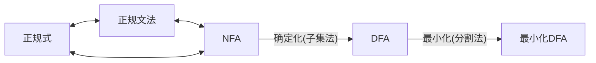
```mermaid
flowchart LR
id1[正规式]
id2[正规文法]
id3[NFA]
id4[DFA]
id5[最小化DFA]

id1 <--> id2 <--> id3
id1 <--> id3

id3 --确定化(子集法)--> id4
id4 --最小化(分割法)--> id5
```

三种形式化描述工具有各自的应用场景。


## 3.3 词法分析程序的自动构造工具


# Chapter4 语法分析Syntax Analysis(也叫做Parsing)

**语法分析使用的是上下文无关文法，与词法分析中的正规文法不同，用以描述编程语言中的算术表达式以及语句等，而词法分析中的正规文法是用来描述一个个的单词。**

语法分析由确定分析与不确定分析。

文法G(Grammer)定义为一个四元组
$$
(V_N, V_T, P, S)
$$

## 文法与语言

编程语言作为符号系统，完整定义包含语法(Syntax)与语义(Semantic)两个方面。

文法(Grammer)实际上是描述语法的工具，二者基本等价。这一部分涉及到[形式语言理论]()

语法还可以用BNF(Backus-Naur Form)，EBNF描述

## Chomsky hierarchy

Chomsky hierarchy用于将形式文法(formal grammer)分为四类，不同类别的形式文法能够产生不同复杂度的语言。

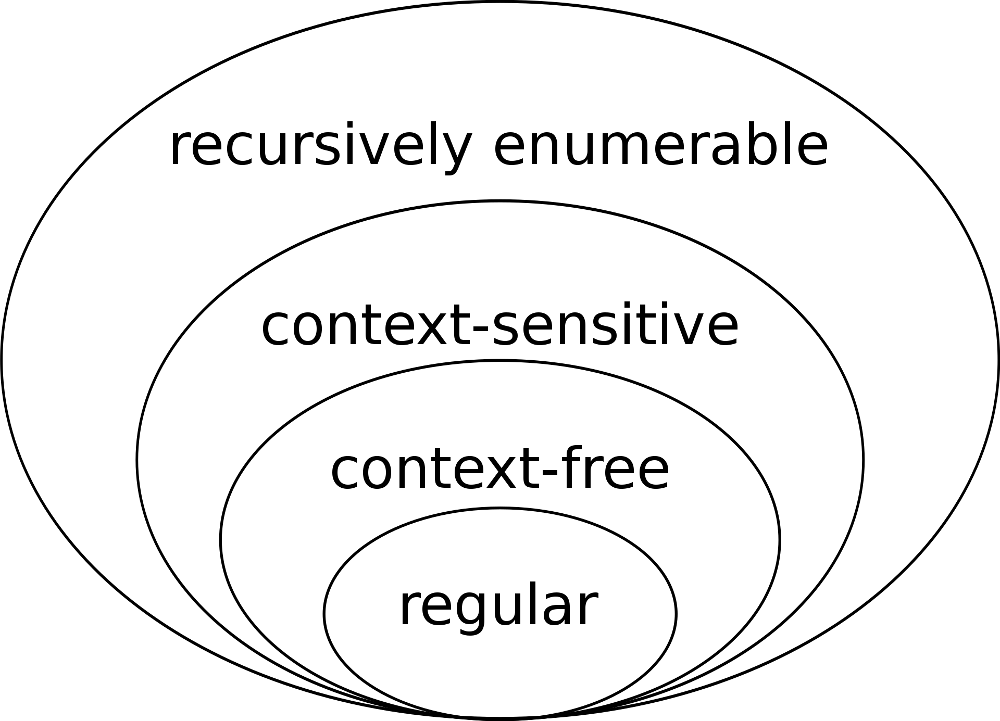

|                           Grammar                            |                          Languages                           |                    Recognizing Automaton                     |               Production rules (constraints)*                | Examples[[5\]](https://en.wikipedia.org/wiki/Chomsky_hierarchy#cite_note-5)[[6\]](https://en.wikipedia.org/wiki/Chomsky_hierarchy#cite_note-6) |
| :----------------------------------------------------------: | :----------------------------------------------------------: | :----------------------------------------------------------: | :----------------------------------------------------------: | :----------------------------------------------------------: |
|   [Type-3](https://en.wikipedia.org/wiki/Regular_grammar)    |  [Regular](https://en.wikipedia.org/wiki/Regular_language)   | [Finite-state automaton](https://en.wikipedia.org/wiki/Finite-state_automaton) |   (right regular) or  (left regular) |  |
| [Type-2](https://en.wikipedia.org/wiki/Context-free_grammar) | [Context-free](https://en.wikipedia.org/wiki/Context-free_language) | Non-deterministic [pushdown automaton](https://en.wikipedia.org/wiki/Pushdown_automaton) |  |  |
| [Type-1](https://en.wikipedia.org/wiki/Context-sensitive_grammar) | [Context-sensitive](https://en.wikipedia.org/wiki/Context-sensitive_language) | [Linear-bounded non-deterministic Turing machine](https://en.wikipedia.org/wiki/Linear_bounded_automaton) |  |  |
| [Type-0](https://en.wikipedia.org/wiki/Unrestricted_grammar) | [Recursively enumerable](https://en.wikipedia.org/wiki/Recursively_enumerable_language) | [Turing machine](https://en.wikipedia.org/wiki/Turing_machine) |  ( non-empty) |  describes a terminating Turing machine |


形式语言将文法分为四种类型：

- 0型文法，也叫短语文法
- 1型文法，上下文有关文法
- 2型文法，上下文无关文法
- 3型文法，正规文法


**而上下文无关文法能够非常好地描述编程语言的语法。**研究文法的意义：龙书P191


## 语法树

**最左推导与最右推导**：最右推导是规范(regular)推导，规范推导得到的句型称为右句型或者规范句型。

```
最右推导为什么是规范(regular)推导?
因为最左规约是最早被形式化(regular)研究的，因此最左规约是规范规约。相应的最右推导就是规范推导。
```

一棵语法树能够表示一个句型的不同推导过程(但并不是所有，包括最左或者最右推导)。

当一棵语法树不能够包括一个句型的所有推导，那么就会存在另一棵语法树。一个句型对应两棵语法树(相当于有两个不同的最左或者最右推导)，这个文法就是二异的。

而**语法分析的主要任务就是构造出输入符号串的语法树，从而判断符号串是否符合给定文法(这里的符号串是由词法分析给出的)。**

## 4.1 自顶向下分析

自顶向下的分析采用的是**最左推导**

### 4.1.1 LL(k)分析

FIRST，FOLLOW，SELECT集。


### 4.1.2 非LL(1)到LL(1)文法的等价变换


## 4.2 自底向上分析

首先是**短语，直接短语与句柄**的概念，自底向上的分析需要用到这几个概念。


句柄是一个右句型的直接短语，因此句柄的概念只适用于右句型。**最左直接短语**。

### 4.2.1 LR(k)分析


## 4.3

## 4.4

### 4.4.1 Recursive-Descent Parsing

# Chapter5 Syntax-Directed Translation

本章大纲

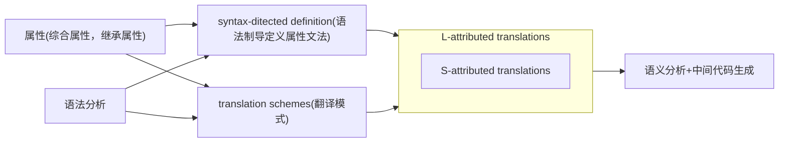
```mermaid
flowchart LR
id1["syntax-ditected definition(语法制导定义属性文法)"]
id2["translation schemes(翻译模式)"]
id3["属性(综合属性，继承属性)"]
id4[语法分析]
subgraph id5["L-attributed translations"]
	id6["S-attributed translations"]
end

id3-->id1
id4-->id1
id3-->id2
id4-->id2

id1 --> id5
id2 --> id5

id7[语义分析+中间代码生成]

id5 --> id7
```

syntax-directed translation的分析过程是建立在一棵语法树的基础上，先构建出一棵语法树，然后计算出语法树上结点的属性值。

这里涉及到两个概念：**SSD**与**translation schemes**，是Syntax-DIrected Translation的两种不同的实现方式


SSD可读性更强，但是当实际实现语义分析时，不是特别高效。

而translation schemes虽然可读性较差，但是更有理由高效实现语义分析(yacc中就是采用这种方式)。

## 5.1 Syntax-Directed Definitions

Syntax-Directed Definition(SDD)，中文称为语法制导定义(也叫做语法制导定义属性文法)，是一种上下文无关文法，具有属性attributes与规则rules(semantic rules)。Translation schemes impose left-
to-right evaluation and allow semantic actions to contain any program fragment

```
Attributes are associated with grammar symbols and rules are associated with productions.
```

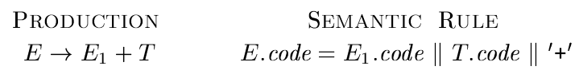


SSD分为两部分，Production产生式以及Semantic rule语义规则。属性的值通过产生式相对应的语义规则求出。

### 5.1.1 Inherited and Synthesized Attributes

非终结符有两类属性：

- synthesized attribute(综合属性) 通过子结点与自身结点定义的属性
- inherited attribute(继承属性) 通过父结点，兄弟结点以及自身结点定义的属性

终结符只有综合属性，终结符的综合属性来自于词法分析的lexical value。


**S-attributed SDD**是只包含synthesized attributes的SDD，下面就是一个S-attribuded SDD的例子，其基础文法包含一个左递归：

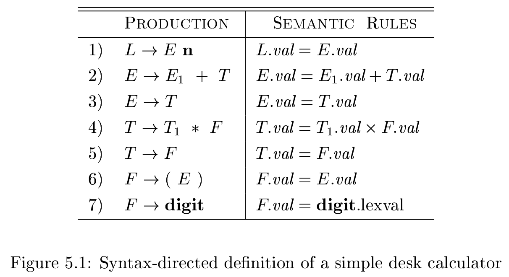

**这一类的SDD可以与LR语法分析器结合，在实现LR语法分析器的同时实现这个SDD。**

**semantic rules有时候会带来一些side effects**，当SDD没有side effects时，这个SDD被叫做**attribute grammer(属性文法)**

这里的side effects可以是输出结果(即semantic rule中有print指令)等等，被叫做side effects(可以理解为除了操纵属性值的其它动作)。

而属性文法中，只包含定义和计算属性值的rules。

### 5.1.2 Evaluating an SDD at the Nodes of a Parse Tree

采用SDD计算语义，可以借助parse tree(即使translator实际上并不会真正构建一棵完整的语法树)。

构建语法树-->求出语法分析树(parse tree)上每一个结点的属性值(需要遍历树)-->**annotated parse tree**

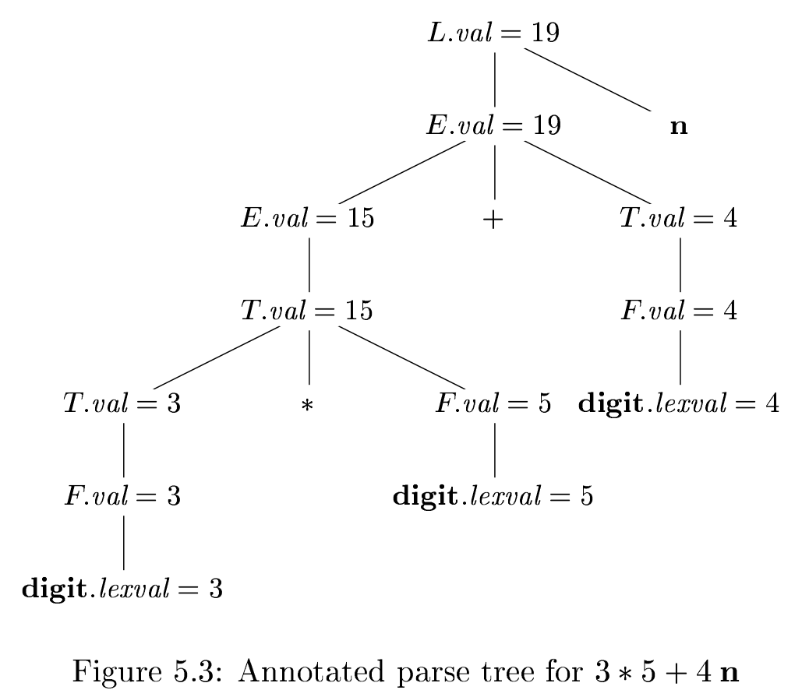

由于不同属性之间存在依赖关系，因此计算语法树中每个属性的值的顺序就显得至关重要，而将属性分为**综合属性**与**继承属性**两类，就比较清晰地给出了计算属性值的顺序。

对于只有单一种类属性的SDD，比如只有综合属性的SDD(也叫做S-attributed SDD)或者只有继承属性的SDD(**可能并不存在这种SDD？**)，确定顺序是比较容易的，按照一定顺序遍历语法树即可。

但是对于既有综合属性又有继承属性的SDD，确认顺序就比较困难，可能会存在循环依赖等问题。


**sdadgfawergfaewtgrewqa**


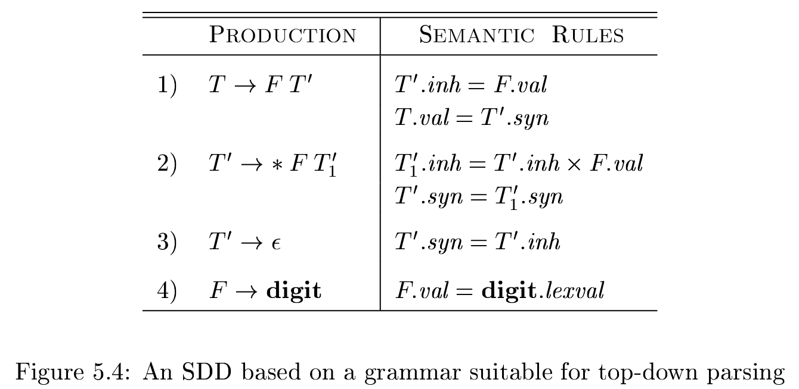

## 5.2 Evaluation Orders for SDD's

通过**依赖图**来决定属性值的计算顺序。

**S-attributed SDD**

**L-attributed SDD**

这两类SDD能够与现有的语法分析方法(LL或者LR)非常好地兼容，并且现实中绝大多数情况都能够将问题转化为其中一类SDD进行处理。


### 5.2.1 Dependency Graphs

### 5.2.2 Ordering the Evaluation of Attributes

对于SDD，其语义计算的步骤如下：

1. 构造parse tree
2. 构造dependency graph
3. 如果dependency graph有环，则无法进行语义计算；如果dependency无环，则进行拓扑排序
4. 按照拓扑排序遍历树计算属性值

如果依赖图中出现了环路，则无法进行拓扑排序，这样也无法求出语法树上各个结点的属性值。

但是和i上面的语义计算的步骤不是单遍的，需要在构建出parse tree后再遍历一遍树进行属性计算。

但我们更加希望能够再构建parse tree的同时完成属性计算，但是并不是所有的属性文法都能够适合单遍处理，所以通过对属性文法作出一些限制，使得其能够满足单遍处理的要求，就有了两种受限的属性文法，是所有属性文法的一个子集：

- **S-Attributed**
- **L-Attributed**


### 5.2.3 S-Attributed Definitions

只有synthesiszed attribute的SDD。

S-Attributed Definition能够与bottom-top parsing(LR文法)结合起来，在bottom-up parsing的同时完成属性计算，高效实现Syntax-Directed Translation。

通过如下的后序遍历，计算属性值

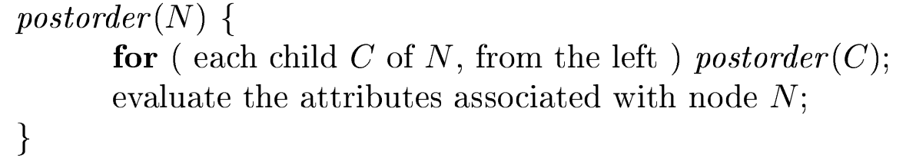

在bottom-up parsing的过程中，就可以实现S-attributed definition(因为**bottom-up parsing就相当于做了一次后序遍历**，后序遍历与LR paser归约时的顺序是相同的)。


但是对于S-Attributed属性文法，但是其基础文法不一定是一个LR文法，如果其基础文法是一个LR文法，那么就可以采用LR文法的bottom-up的语法分析方式，并且同时完成语义计算。


### 5.2.4 L-Attributed Definitions

L-Attributed SSD可以允许继承属性的存在，但是对于继承属性作出了一些限制。

S-Attributed Definition能够与top-bottom parsing(LL文法)结合起来，在top-bottom parsing的同时完成属性计算，高效实现Syntax-Directed Translation。


一个L-attributed SDD

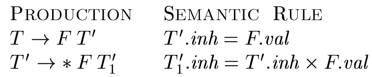

而下面的SDD不是L-attributed SDD，问题出在**B.i**这个属性上。

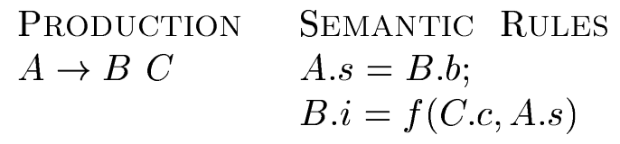

### 5.2.5 Semantic Rules with Controlled Side Effects

在真实的编译过程中，在编译的时候会同时进行一些附加的动作(side effects，比如会将identifier放入符号表中......)。

SDD需要达到一个attribute grammer与tanslation schemes的平衡：

- Attribute grammars have no side effects and allow any evaluation
  order consistent with the dependency graph.
- Translation schemes impose left-to-right evaluation and allow semantic actions to contain any program fragment.


## 5.3 Applications of Syntax-Directed Translation

```
The main application in this section is the construction of syntax trees. Since some compilers use syntax trees as an intermediate representation, a common form of SDD turns its input string into a tree. To complete the translation to intermediate code, the compiler may then walk the syntax tree, using another set of rules that are in e ect an SDD on the syntax tree rather than the parse tree.
```

Syntax tree与Parse tree是不一样的两个概念：

- Syntax Tree
- Parse Tree


S-attributed definition和L-attributed definition是两类用于构建syntax tree的SDD。


### 5.3.1 Construction of Syntax Trees

对于syntax tree，其上面的每一个结点node，都代表着语言的一个组成结构(比如说表达式，语句，标识符等等)，而这个结点的子结点代表着这一个结构的组成

比如对于表达式**E1 + E2**，其子结点就有着**E1**、**E2**以及**+**这三个子结点，代表着这一个表达式的三个成分。

每一个node在实际的实现过程中都是通过一个类的对象来实现的，这个类包含相应数量的成员(变量)：

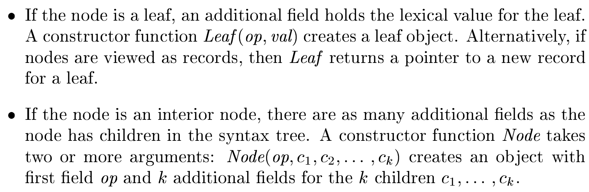


对于如下文法

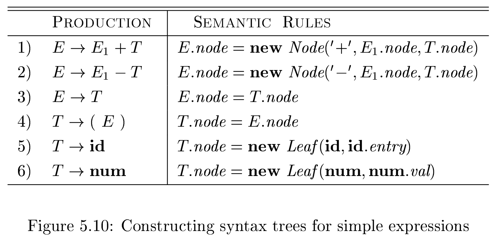

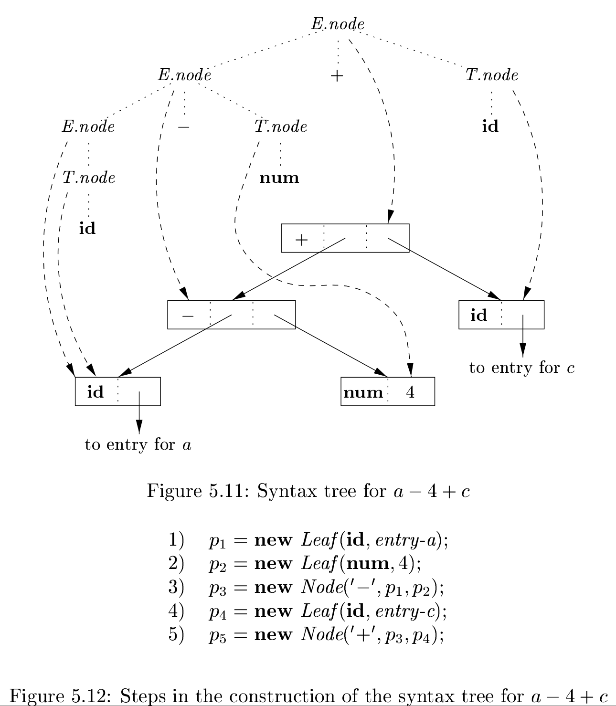


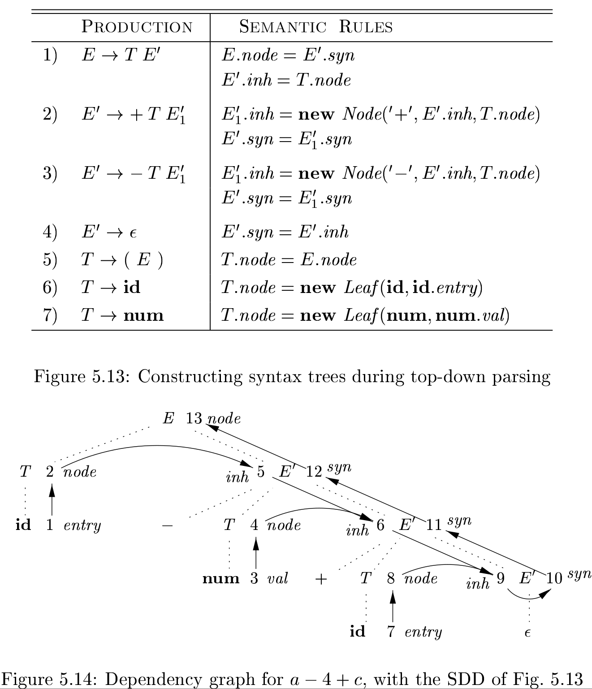


### 5.3.2 The Structure of a Type

```
Inherited attributes are useful when the structure of the parse tree differs from the abstract syntax of the input
```


## 5.4 Syntax-Directed Translation Schemes(SDT)

```
Syntax-directed translation schemes are a complementary notation to syntax-directed definitions. All of the applications of syntax-directed definitions can be implemented using syntax-directed translation schemes
```

在SDD中，semantic rules的执行顺序是没有做要求的：

```
A syntax-directed definition does not impose any specific order for the evaluation of attributes on a parse tree; any evaluation order that computes an attribute a after all the other attributes that a depends on is acceptable.
```

**其无序的特性体现在，对于每一个产生式后的semantic rule**，只要其依赖的属性值已经存在，属性值的计算可以发生在任何时候。


而在SDT中，semantic actions的执行顺序是显示指定的。

任何一个SDT都可以通过以下的步骤实现：

1. 构建parse tree
2. 以left-to-right depth-first order执行semantic action(preorder traversal前序遍历)

但是与SDD一样，这样的做法需要遍历多次parse tree，但事实上我们希望只需要遍历一次parse tree，即一边进行parsing一边实现SDT(SDT during parsing)，所以这就涉及到之前提到的能够实现一边做parsing一边进行语义计算的两种SDD：S-Attributed与L-Attributed。

之前提到过，SDD可分为两类：S-Attributed SDD与L-Attributed SDD，SDT的实现也有两类：

- **The underlying grammar is LR-parsable, and the SDD is S-attributed**
- **The underlying grammar is LL-parsable, and the SDD is L-attributed**


在实现的过程中，需要将SDD的semantic rules转变为SDT的semantic actions，并且需要注意这些action的执行顺序。

```
During parsing, an action in a production body is executed as soon as all the grammar symbols to the left of the action have been matched.
```

通过SDT实现SDD会**引入marker nonterminals替代每一个embedded action**，即通过引入一个新的产生式

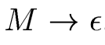

来替代每一个semantic action，如果替换后的文法能够通过某种方式(top-down或者bottom-up)进行语法分析，那么这个SDT就可以在parsing的过程中同时实现。

**marker nonterminals**对应于[2.3.5](#2.3.5-Translation-Schemes)中，对于SDT构建parse tree需要把semantic action也作用为一个结点处理。

### 5.4.1 Postfix Translation Schemes

当SDD是S-Attributed的时候，并且采用bottom-up grammer时，可以构建一个SDT，这个SDT的所有semantic action都是处于产生式的最右端的末尾，这个时候，当产生式被规约时，这个semantic action就会被执行。这种所有semantic actions处于产生式最右端的SDT叫做**postfix SDT**。

### 5.4.2 Parser-Stack Implementation of Postfix SDT's

```
Postfix SDT's can be implemented during LR parsing by executing the actions when reductions occur.
```

通过在LR分析原有的符号栈与状态栈的基础上，增加一个语义栈。

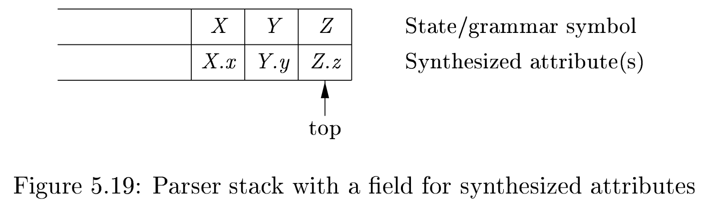


### 5.4.3 SDT's With Actions Inside Productions

当semantic action所处位置在产生式的任意一个地方时，这个semantic action执行的顺序就有不同情况，大体的执行顺序是，对于形如的产生式

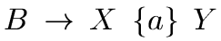

```
the action a is done after we have recognized X (if X is a terminal) or all the terminals derived from X (if X is a nonterminal)
```

更加精确的顺序是：

- ```
  If the parse is bottom-up, then we perform action a as soon as this occurrence of X appears on the top of the parsing stack.
  ```

- ```
  If the parse is top-down, we perform a just before we attempt to expand this occurrence of Y (if Y a nonterminal) or check for Y on the input (if Y is a terminal).
  ```


**只有一部分SDT都能够在parsing的同时实现，postfix SDT是一种，还有一种是实现L-attributed definition的SDT。**

下面是一个无法在parsing的同时实现SDT的一个例子

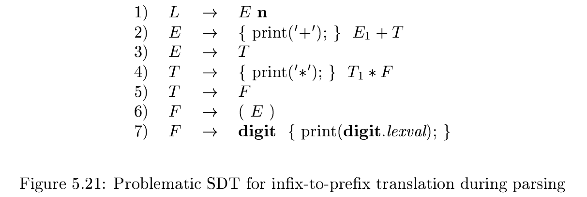

这是因为

```
Unfortunately, it is impossible to implement this SDT during either top-down or bottom-up parsing, because the parser would have to perform critical actions, like printing instances of  or +, long before it knows whether these symbols will appear in its input.
```

相当于对于产生式**2)**和**4)**，把语义动作当作产生式的一个符号(也就是前面提到的**marker nonterminals**)，这两个产生式之间存在**规约-规约**冲突。


但是任何的SDT都可以通过以下多遍的方式实现：

1. 忽略语义动作，构建输入串的parse tree
2. 对于内部结点，给其添加一个额外的子结点，这个子结点代表着相应的semantic  action
3. **前序遍历**，每当访问到一个action结点时，执行相应的动作


**为什么SDD是对parse tree后序遍历计算语义而SDT是前序遍历计算语义：**SDT规定了语义动作的执行顺序(上面的两条规则)，如果要满足上面的两条规则，则需要进行前序遍历才可以。


### 5.4.4 Eliminating Left Recursion From SDT's

当采取top-bottom parsing(LL分析)时，文法中不能够存在左递归，所以需要**消除SDT中的左递归**。

```
When transforming the grammar, treat the actions as if they were terminal symbols.
```


对于存在左递归的文法，只包含综合属性(是一个postfix SDT)

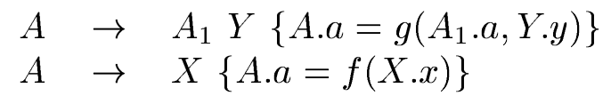

消除左递归之后的基础文法如下，但是在消除左递归的同时，其语义动作也要相应地作出改变

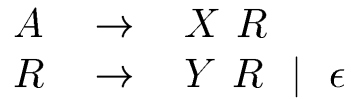

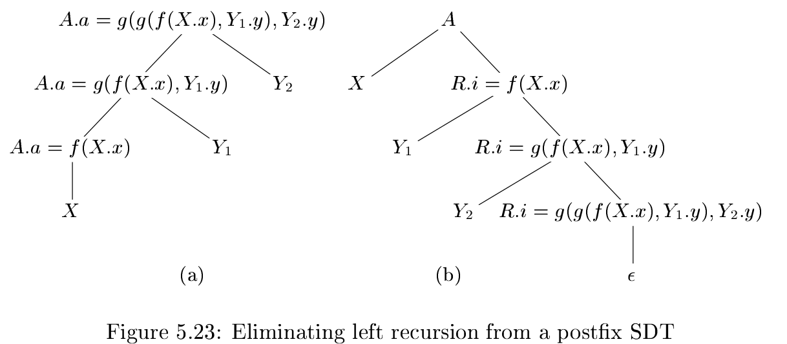

最终消除左递归后的SDT为

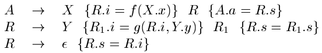

对于这个L-attributed SDT，其继承属性R.i的计算是在对其后的R应用产生式前执行的；而综合属性的计算是在产生式的最后，这意味着这个动作将会在其左边所有结点遍历完之后才会被执行(这样就能够保证，综合属性所依赖的属性值以及被计算完毕，可以使用)。

从这个例子中，可以更直观地理解当一个语义动作处于产生式的其它位置时的作用。

### 5.4.5 SDT's for L-Attributed Definitions

对于S-Attributed SDD，可以转换成postfix SDT，只要基础文法是LR的，就可以通过bottom-up的方式进行语法分析与语义计算。

对于L-Attributed SDD，则是更为一般的情况，**假设基础语法可以是top-down parsed(if not it is frequently impossible to perform the translation in connection with either an LL or an LR parser)**，  转变为SDT的方式如下：

1. ```
   Embed the action that computes the inherited attributes for a nonterminal A immediately before that occurrence of A in the body of the production. If several inherited attributes for A depend on one another in an acyclic fashion, order the evaluation of attributes so that those needed rst are computed rst.
   ```

2. ```
   Place the actions that compute a synthesized attribute for the head of a production at the end of the body of that production.
   ```


一个比较好的例子是数学排版语言**Eqn**(TEX的前身)。

其基本文法定义如下：

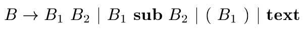

其相应的SDD：

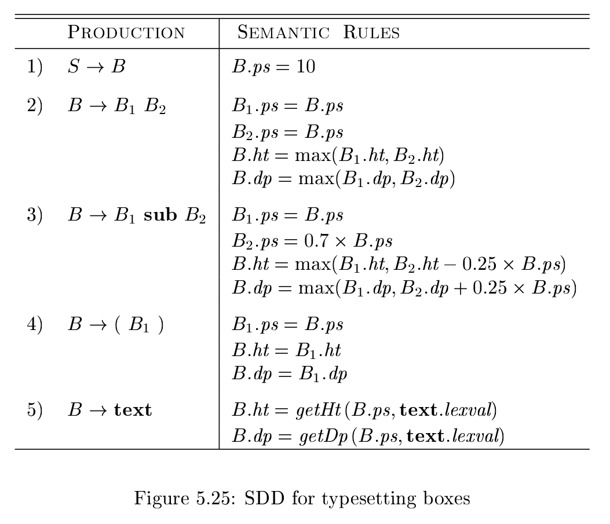

而实现上面SDD的SDT如下：


## 5.5 Implementing L-Attributed SDD's

SDT与translation


在前面已经介绍了如何将一个L-attributed definition转变为一个SDT，而下面的几种方式能够在parsing的过程中同时实现translation：

- ```
  Use a recursive-descent parser with one function for each nonterminal. The function for nonterminal A receives the inherited attributes of A as arguments and returns the synthesized attributes of A.
  ```

- ```
  Generate code on the y, using a recursive-descent parser.
  ```

- ```
  Implement an SDT in conjunction with an LL-parser. The attributes are kept on the parsing stack, and the rules fetch the needed attributes from known locations on the stack.
  ```

- ```
  Implement an SDT in conjunction with an LR-parser. This method may be surprising, since the SDT for an L-attributed SDD typically has actions in the middle of productions, and we cannot be sure during an LR parse that we are even in that production until its entire body has been constructed. We shall see, however, that if the underlying grammar is LL, we can always handle both the parsing and translation bottom-up.
  ```

### 5.5.1 Translation During Recursive-Descent Parsing

recursive-descent parser(递归下降语法分析)，这一部分在语法分析[4.4.1](#4.4.1-Recursive-Descent-Parsing)中有介绍过


|      | Syntax-Directed Definitions | Syntax-Directed Translation Schemes |
| ---- | --------------------------- | ----------------------------------- |
|      | Semantic Rules语义规则      | Senabtuc Actions语义动作            |
|      | 语义规则无序                | 语义动作有序，采用后序遍历          |
|      |                             |                                     |


# 6. Intermediate-Code Generation

- **front end** source language的实现细节只由front end负责。
- **intermediate representation**
- **back end** target machine的实现细节只由back end负责。

通过上面的设计，对于m个souce language与n个target machine，只需要编写m个前端+n个后端即可，LLVM就是这种思想(尽管GCC也是采取上面的设计模式，)。


# 形式语言


